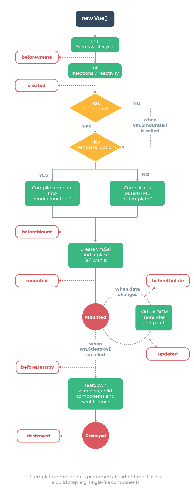

# 生命周期

> 在创建Vue实例过程中，可以在不同阶段添加一段代码，这些函数也成为生命周期钩子

-   生命周期钩子的this会绑定到实例中，因此可以访问data、computed 和 methods等
-   也因此不能使用箭头函数来定义一个生命周期方法，因为this会指向父级的上下文而不是这个实例

| 生命周期钩子        | 详细                                                                                                            |
| ------------- | ------------------------------------------------------------------------------------------------------------- |
| beforeCreate  | 在实例初始化之后,进行数据侦听和事件/侦听器的配置之前同步调用                                                                               |
| created       | 在实例创建完成后被立即同步调用&#xA;- 数据侦听、计算属性、方法、事件/侦听器的回调函数配置完毕&#xA;- 但是还没开始挂载，因此`$el` 获取不了                                |
| beforeMount   | 在挂载开始之前被调用                                                                                                    |
| mounted       | 实例被挂载后调用&#xA;- 不能保证所有的子组件也都被挂载完成，需要的话，可以在mounted内部使用`vm.$nextTick` ，这个是在整个视图都被渲染之后从运行的代码                      |
| beforeUpdate  | 在数据发生改变后，DOM 被更新之前被调用                                                                                         |
| updated       | 在数据更改导致的虚拟 DOM 重新渲染和更新完毕之后被调用&#xA;- 不能保证所有的子组件也都被挂载完成，需要的话，可以在updated内部使用`vm.$nextTick` ，这个是在整个视图都被渲染之后从运行的代码 |
| activated     | 被 keep-alive 缓存的组件激活时调用                                                                                       |
| deactivated   | 被 keep-alive 缓存的组件失活时调用                                                                                       |
| beforeDestroy | 实例销毁之前调用&#xA;- 在这一步，实例仍然完全可用                                                                                  |
| destroyed     | 实例销毁后调用                                                                                                       |
| errorCaptured | 在捕获一个来自后代组件的错误时被调用                                                                                            |

## 生命周期图示

