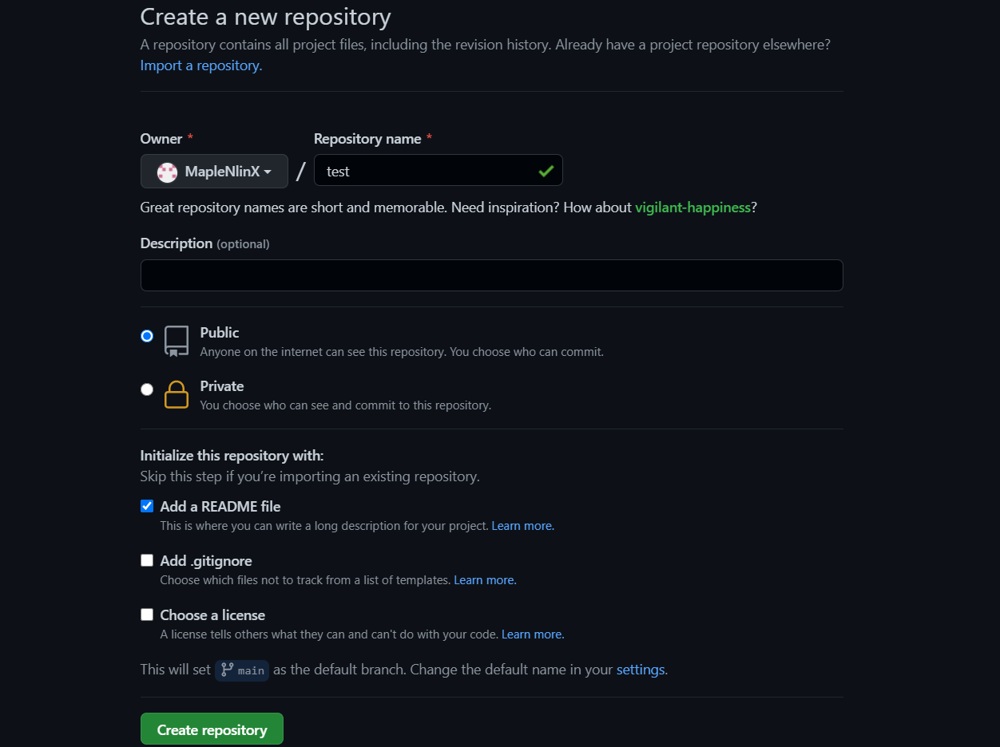
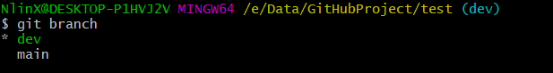
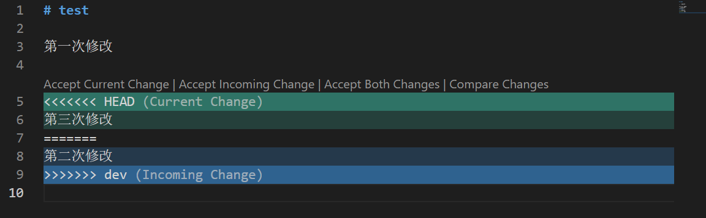

# GitHub

## 创建SSH Key

-   进入主目录

```git
cd ~
```

-   创建SSH key
    ```git
    ssh-keygen -t rsa -C "1178835467@qq.com"
    ```
    -   在 `C:\Users\NlinX\.ssh` 目录下找到`id_rsa`和`id_rsa.pub` 两个文件就是创建成功
    -   `id_rsa`是私钥，不能泄露出去，`id_rsa.pub`是公钥，可以放心地告诉任何人

## GitHub添加SSH key

-   GitHub在用户设置设置SSH key

    
    -   填入公钥
        
    -   添加成功
        

## 添加远程库

-   添加仓库

    
    -   输入仓库名，新建仓库
        

## 本地推送

-   本地使用SSH方式关联仓库
    > origin就是应该标记远程库的名字，也可以使用HTTPS关联
    > 
    ```git
    git remote add origin git@github.com:MapleNlinX/learn.git
    ```
    
-   把本地库所有内容推送到远程仓库上
    > 用`git push`命令，把当前分支`master`推送到远程，由于远程库是空的，加上了`-u`参数会把本地的`master`分支和远程的`master`分支关联起来，在以后的推送或者拉取时就可以简化命令
    ```git
    git push -u origin master
    ```
    
    -   推送成功
        
    -   现在可以用`git push origin master`命令将本地的master分支的最新修改推送至`GitHub`的`master`或者其它分支
    ```git
    git push origin master
    git push origin dev

    ```

## 本地拉取

-   用`git pull` 获取最新提交

```git
git pull
```

## 删除远程库

-   用`git remote -v`查看远程库信息

```git
git remote -v
```


-   用`git remote rm <name>` 命令删除远程库

```git
git remote rm origin
```

> 这里删除只是删除于远程库的关联，文件不会改变

## 克隆远程库

> 从远程库上克隆仓库到本地上

-   在GitHub上再创建一个远程库，勾选上README 选项
    -   这个文件是用来给别人查看你的项目时，用于了解的
        
-   用命令`git clone`克隆一个本地库，HTTPS速度较慢，还要输口令

    SSH：
    ```git
    git clone git@github.com:MapleNlinX/test.git
    ```
    HTTPS：
    ```git
    git clone https://github.com/MapleNlinX/test.git
    ```

## 分支管理

### 原理图

-   GIT中主分支为`master`分支或者`main`分支，而`HEAD`就是指向主分支


-   当创建新的分支时，用新的分支指向主分支，HEAD指向新分支


-   在`dev`分支工作时，提交给`dev`，`master`不动


-   合并就是把`master`指向`dev`，`HEAD`重新指向`master`


-   分支工作完成后也可以删除掉


### 创建分支

-   创建新的分支

```git
git branch dev
```

-   切换到某个分支

```git
git checkout dev
#新版提供新的命令switch
git switch dev

```

-   创建并且切换分支

```git
git checkout -b dev
#新版提供新的命令switch ，注意是-c，不是-b
git switch -c dev

```


-   用`git branch`命令查看当前分支

```git
git branch
```



### 合并分支

> 当在`dev`分支修改并提交完成后，重新切换到主分支`master`会发现已经修改的内容不见了，因为那些内容在`dev`分支上

-   切换回主分支

```git
git checkout main
```

-   把`dev`分支的工作成果合并到`master`分支
    ```git
    git merge dev
    ```
    
    > 合并后就能看到`dev`的工作成功，相当于就是把`dev`的文件复制到了`main`上
    -   `Fast-forward` ，指的是这次合并是“快进模式”，也就是直接把`master`指向`dev`的当前提交，所以合并速度非常快，不过也不是每种情况都能`Fast-forward`
-   使用 `--no-ff` 禁用快速合并
    ```git
    git merge --no-ff -m 'change' dev
    ```
    -   git merge –no-ff 可以保存分支历史,

### 删除分支

-   既然工作完成，就可以把分支删除

```git
git branch -d dev
```


-   分支还没有被合并，想要删除就需要强行删除

```git
git branch -D dev
```


## 解决冲突

-   从分支提交修改
-   切换到主分支

    
    > git还会提示当前分支比远程分支还要领先一个`commit`
-   这个时候在main分支再提交一次修改
    -   现在是发生这种情况
        
-   Git无法执行“快速合并”，只能试图把各自的修改合并起来，但这种合并就可能会有冲突

    
    > 提示表示，尝试自动合并README.md文件，但是内容冲突，所以合并失败，需要修改冲突重新提交
    -   也可以通过`git status`查看是否有冲突文件
        
    -   打开文件可以查看到冲突内容
        
-   把冲突的文件内容重新修改一次，然后再重新提交

    
    -   就可以成功提交了，这种情况是这样的，当有冲突的时候就人工合并
        
    -   `git merge –no-ff `保存所有分支记录，`git merge` 只保留单条分支记录
    -   可以通过`git log --graph`查看分支的合并情况
    ```git
    git log --graph --pretty=oneline --abbrev-commit
    ```
    
    ```git
    #原分支
              A---B---C feature
              /
    D---E---F master

    #git merge
              A---B---C feature
              /        master
    D---E---F 

    #git merge –no-ff 
              A---B---C feature
              /        \
    D---E---F-----------G master

    ```

## Bug分支

> 主分支为`main`，分支为`dev`，现在发现了一个`bug`要临时处理，但是dev的工作还没完成

-   使用`stash`命令，可以把当前工作现场保存起来，并且返回到修改前的记录

```git
git stash
```


-   创建一个新的分支`issue-101`&#x20;


-   在`issue-101` 修改`bug`并且提交


-   然后切换回主分支`master`，与`issue-101` 完成合并，然后删除`issue-101` 分支


-   回到`dev`分支用`git stash list`命令查看之前存储的工程


-   恢复
    -   用`git stash apply`恢复，然后用`git stash drop`来删除`stash`存档
    -   用`git stash pop`，恢复的同时把`stash`存档也删
    -   如果有多个`stash`用`stash@{i}`来选择恢复哪个`stash`
    ```git
    git stash pop stash@{0}
    ```
    > 恢复之后 `stash@{0}` 已经删除了
    > 
-   现在`dev`和`master`是有区别的，`master`修改了一次`bug` ，而`dev`的`bug`还在
    -   可以把之前修`bug`时的`commit`，复制到`dev`上来
    -   可以ongoing`cherry-pick`命令，复制一个特定的提交到当前分支
    ```git
    git cherry-pick c248949
    ```
    

## 多人协助

-   他人从远程仓库上拉取克隆时，默认只有master/main分支


-   另一台设备想要在`dev`上开发就要创建远程`origin`的`dev`分支到本地

```git
git checkout -b dev origin/dev
```

-   这时，如果两个设备都对远程`dev`推送，就会出现冲突


-   因为远程的`dev`与本地的`dev`已经不在同一个版本，因此可以用`git pull`拉取一下最新的提交，这时候还是会出错，因为没有指定本地`dev`分支与远程`origin/dev`分支的链接


-   设置`dev`和`origin/dev`的链接

```git
git branch --set-upstream-to=origin/dev dev
```


-   再重新`pull` ，成功获取，并提示冲突文件


-   手动解决冲突


-   再提交`push`就可以了


## rebase

-   当出现两端同时`push`的情况


-   如果想把分叉历史为一条直线可以使用`git rebase`

```git
git rebase
```


## 标签管理

> 因为tag是和commit挂钩，因此如果两个分支都出现了同一个commit，则两个分支上都可以看到这个标签

-   用命令`git tag<name>` 给当前分支添加一个标签
-   用命令`git tag` 查看所有标签

```git
git tag v1.0
```


-   `tag`是针对`commit`的，因此可以针对某个`commit`添加


```git
git tag 0.8 ea6d2e9
```


-   用`git show <tagname>`查看标签信息

```git
git show 0.8

```


-   创建带有说明的标签，用 `-a`指定标签名，`-m`指定说明文字

```git
git tag -a v0.7 -m "v0.7" c248949
```


-   使用命令`git push origin <tagname>` 推送某个标签到远程

```git
git push origin v1.0
```

-   推送全部本地`tag`标签

```git
git push origin --tags
```

-   用`git tag -d`删除标签

```javascript
git tag -d v0.1
```

-   删除远程`tag`，前提是先删除本地`tag`

```git
git push origin :refs/tags/v0.1
```
