# 常用命令

## 创建

-   设置本机用户名

```git
git config --global user.name "NlinX"
git config --global user.email "nlinx@foxmail.com"

```

-   创建仓库

```git
git init

```

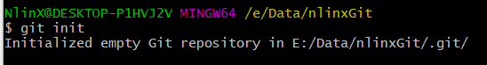


-   显示所有文件，包括隐藏文件

```git
ls -ah

```

## 添加

> 不要把文件放到 `.git`文件夹下

-   用命令`git add`告诉Git，把文件添加到仓库

```git
git add test/1.txt
```

-   用命令`git commit`告诉Git，把文件提交到仓库

```git
it commit -m "wrote a 1.txt file"
```

> `-m` 后面是提交说明，`1 file changed`：1个文件被改动，`2 insertions`：插入了两行内容

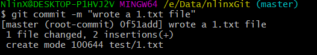

-   可以多次`add`再一次性`commit`

```git
git add file1.txt
git add file2.txt file3.txt
git commit -m "add 3 files."
```

## 查看

-   用`git log`命令查看历史记录

```git
git log
```

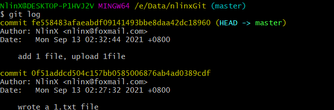

-   只显示`commit id` （版本号）和修改说明

```git
git log --pretty=oneline

```

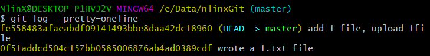

-   Git提供了一个命令`git reflog`用来记录你的每一次命令

```git
git reflog

```

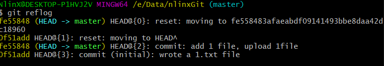

-   用`git status`查看工作区状态

```git
git status
```

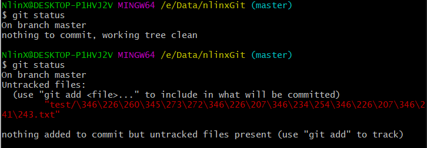

> 如果没有任何操作就显示`clean`，如果有修改文件但是还没`add`，就显示`Untracked`，`add`之后但是还没`commit`就显示`Changes to be committed`

-   用`git diff HEAD -- <file>`命令可以查看工作区和版本库里面最新版本的区别

```git
git diff HEAD -- 1.txt

```

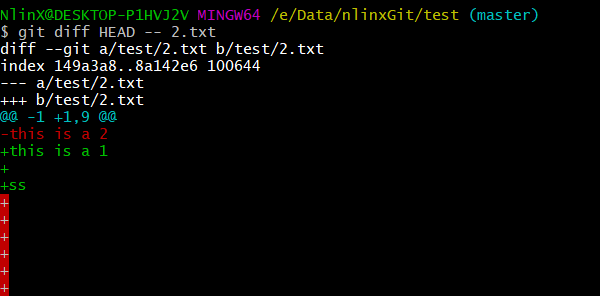

## 回退版本

-   回退上个版本，回到过去时间线

```git
git reset --hard HEAD^
```

> 上一个版本就是`HEAD^`，上上一个版本就是`HEAD^^`，`HEAD~100` 上100个版本

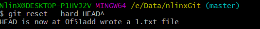

-   返回到指定版本，要知道`commit id`

```git
git reset --hard fe558483afaeabdf09141493bbe8daa42dc18960
```

> 这里`commit id`不一定要写全，因为Git会自动查找，如果不记得`commit id`可以通过`git reflog`去查找历史命令

### 回退原理

> 当回退版本时，Git仅仅是把HEAD的指向，指到其它时间线，然后更新工作区，因此可以随时回退到指定版本，只是修改HEAD指向而已

## 撤销修改

-   丢弃暂存区的修改，撤销`add`操作

```git
git restore --staged 2.txt
```

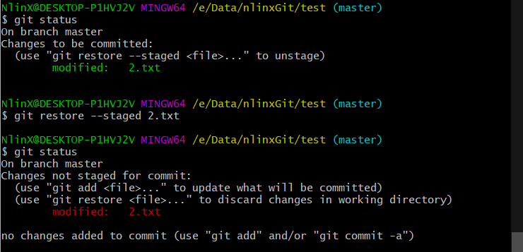

-   丢弃工作区的修改，撤销当前修改文件的操作

```git
git resotre --worktree 2.txt
```

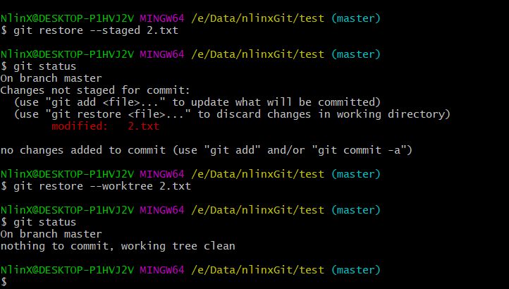

## 删除文件

> 当我们用`add`和`commit` 提交了文件后，即使在文件夹删除了文件，在git里面还是有这个文件的，因为只是在工作区删除了文件

-   可以用`git rm` 在文件夹中删除文件，其实只是在工作区删除
    ```git
    git rm 3.txt
    ```
    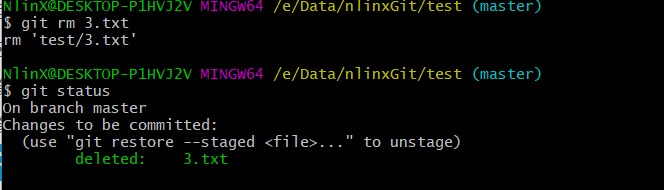
    -   如果再继续用`git commit` 那这个文件从版本库中也删除掉，这样就只能通过回退版本才能找回文件
    -   如果是误删，想找回文件，只需要`git restore` 就能从版本库中把文件拉回来，前提是这个文件有被添加到版本库
