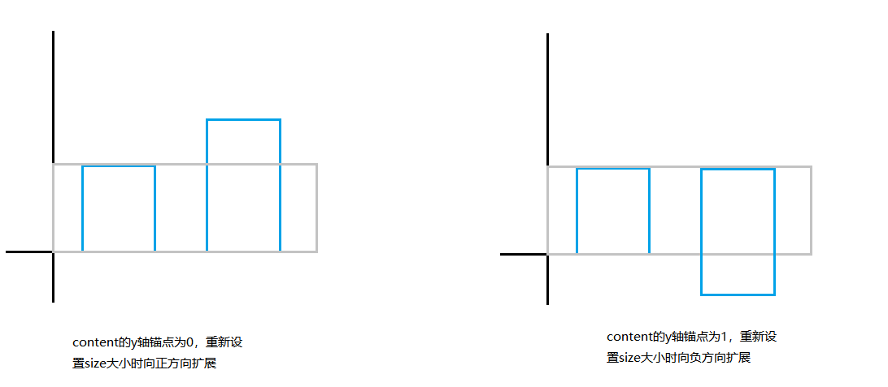

#Lua 

## 可解决的问题
- 子项尺寸不定时，子项数量大，一开始就全部初始化导致时间过长
	- 
- 需要不同子项的间隔不同
	- 

## 原理
>只显示在可视窗口内的子项，从第一个子项开始显示，动态扩展content的尺寸
- 计算简略图示
	- 子项显示的位置
	- 子项间隙计算

## 步骤
- 初始化content
- 设置子项数据
- 刷新显示子项
	- 计算要显示的范围
	- 回收不需要显示的子项
	- 开始显示子项
	- 显示到view底部停止新增子项
	- 扩展容器
- 滚动列表
- 刷新显示子项

## 优化

### 1.扩展优化
在垂直滚动时，在需要扩展的时候让他高度向y轴的负方向扩展（默认y轴锚点是0，既向正方向），目的是如果是正方向扩展，则需要调整content的位置来回到初始位置，会影响滚动。
影响的原因是如果开启惯性滑动时，在惯性滑动过程中如果还没停止就扩展content，会变到原来的PercentVertical位置，就导致会一直处于触底状态就会一直刷新子项，而为了防止这个想象就需要在扩展后手动调用scrollToPercentVertical跳到正确的显示位置，而这就会造成停顿

### 2.提前扩展
当在两次刷新新增子项之间的时间，如果content拉到底部，会引起回弹，这时再刷新新增子项会回弹而不是继续下滑，会导致滑动不流畅，因此使用提前扩展的方法可以有效防止这个问题

### 3.回收和刷新优化
子项在新增时会分组成n个部分，先遍历每个组的第一个子项是否是在显示范围内既可得知应该从哪个位置开始刷新，在这个位置以上的子项可快速回收。
这样既可减少回收的判断计算时间，也可以减少刷新子项的遍历时间

### 4.子项之间的距离
因为子项的高度不定，不能用pos来设置位置，为了实现每个子项都能自定义位置，参考了web的边距设计，子项之间的距离由上下限边距+通用间隔来计算

## 缺点
- 需要从头开始加载，如果一开始跳到中间开始，也需要加载前面的
- 无法自定义位置，所以实现不了列数不同的情况，例如第一行是标题，第二行开始左右两边是不数量不等的垂直排列，类似战斗统计面板

## 附件
![[RecycleScroller.lua]]