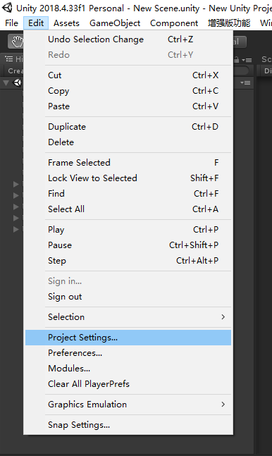
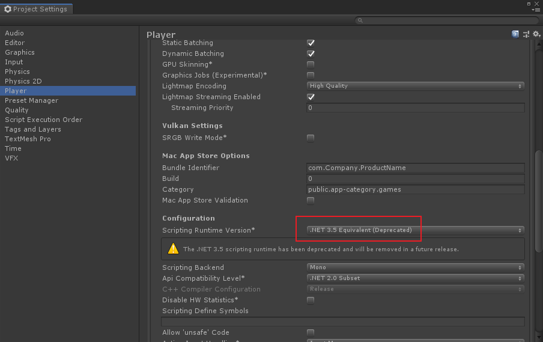
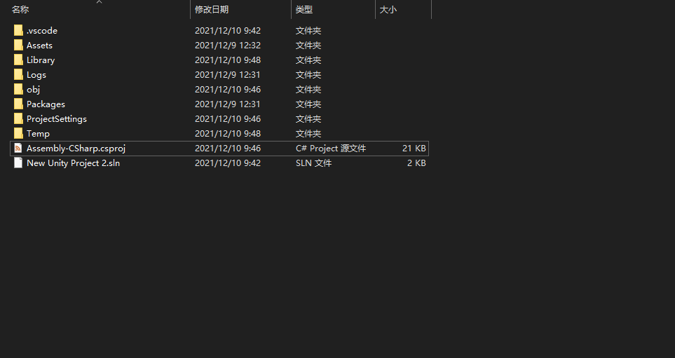
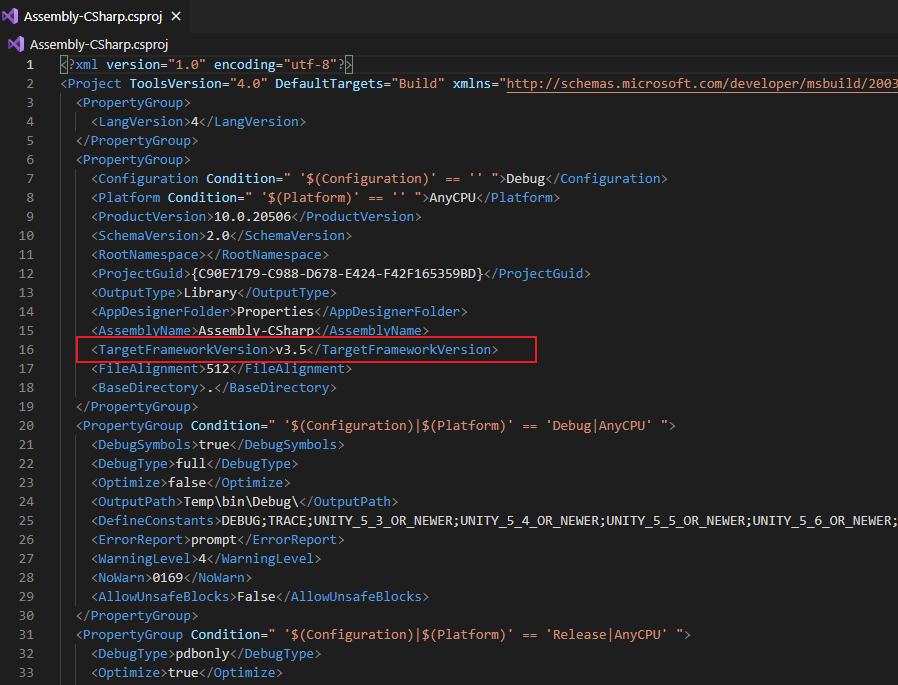
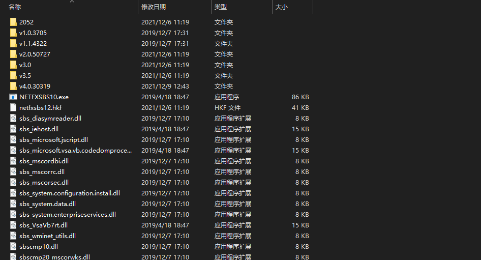

# 代码提示

> 通常是因为net版本问题

-   Unity中 `Edit` → `Proje Settings`

    
-   设置框中`Player` → `Configuration` →`Scripting Runtime Version`

    
-   打开工程目录下的`csproj`文件

    
-   查看是否一致

    
-   电脑打开`C:\Windows\Microsoft.NET\Framework`这个目录，可以查看拥有的net版本，一般`3.5`都行

    
