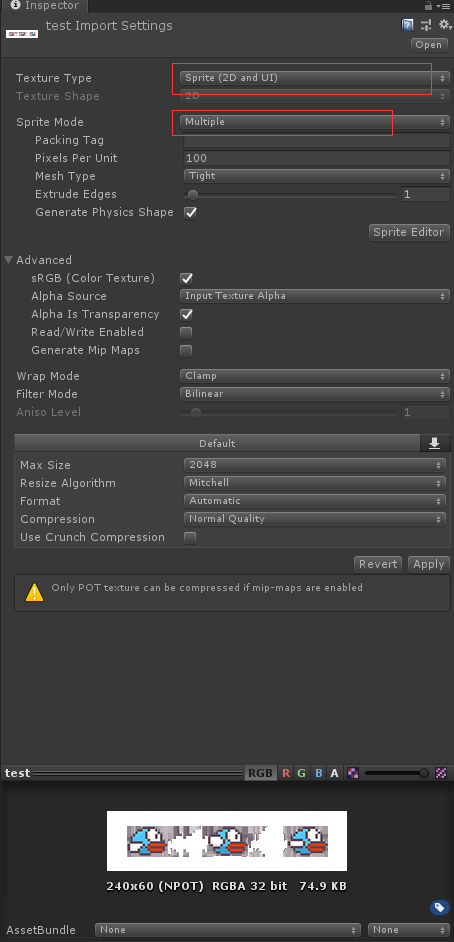
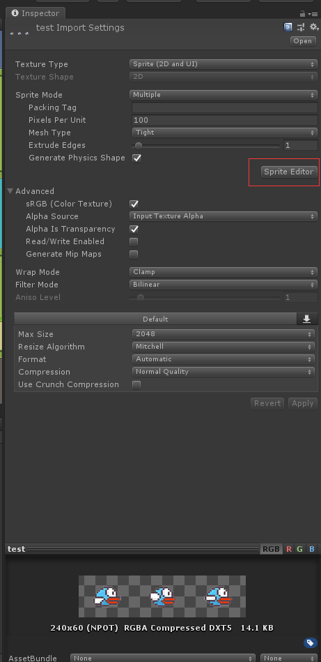
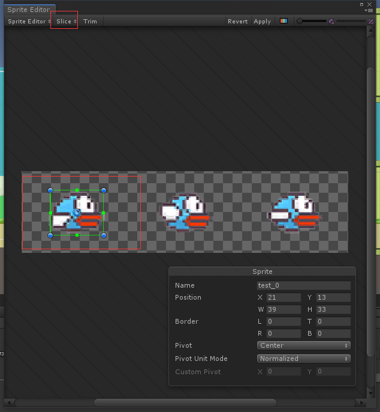
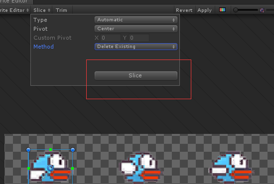
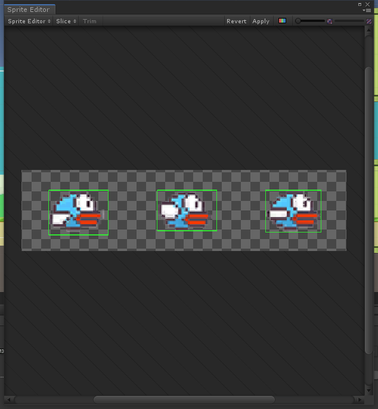
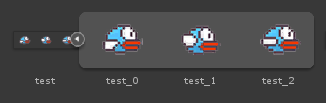
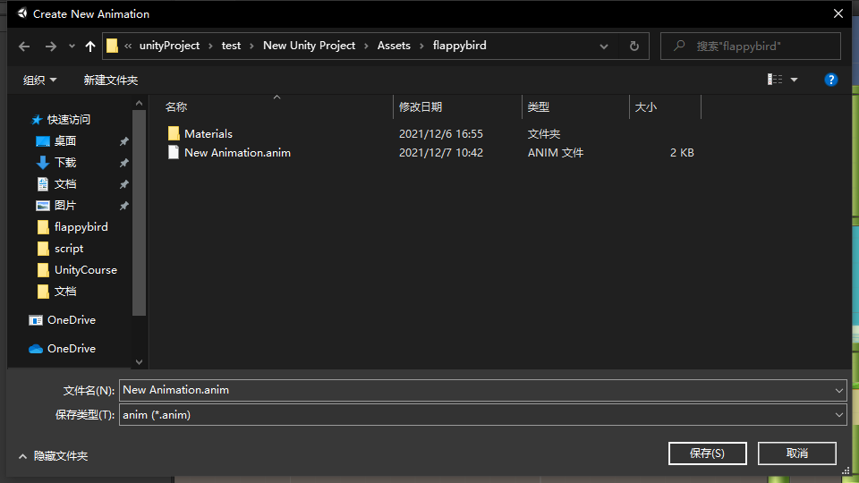
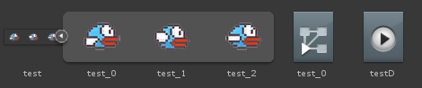
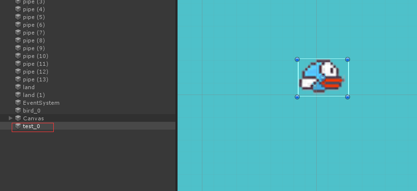

# 图片剪切成动画

-   将图片设置成`Sprite`，并且设置`SpriteMode`为`Multip`

-   点击`Sprite Editor`开始裁剪

-   选择好第一张图片的位置，然后点击`Slice`

-   再点击`Slice`

-   完成自动裁剪

-   关闭窗口返回`Assets`查看，已经剪切成3张图片

-   多选3张图片拉到`Hierarchy`区，自动生成`Animation`

-   成功生产两个文件

-   成功添加，播放可动

