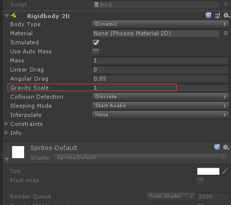

# 物体受力下落/起飞

-   给对象添加RigidBody组件（刚体），设置重力



```c#
private Rigidbody2D rb2D = GetComponent<Rigidbody2D>();
//停止下落
 rb2D.velocity = Vector2.zero;
// 添加一个向上的力
Vector2 upForce = Vector2.up * 300;
rb2D.AddForce(upForce);

```
