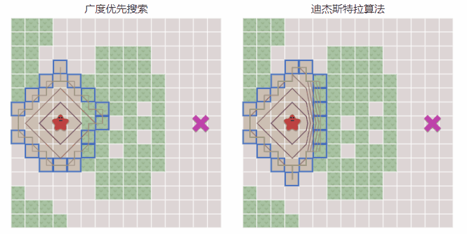
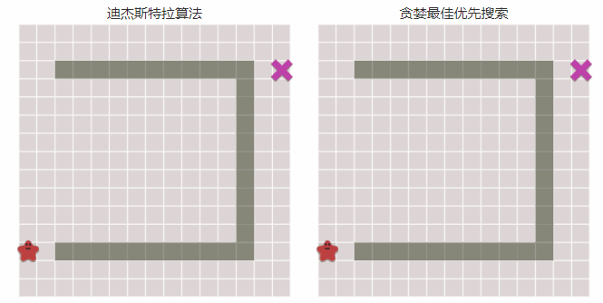

# 广度优先算法
简单来说这个算法就是，维护一个**先进先出**队列，从一个结点出发，将邻居结点入队，然后从队列出队再将邻居结点入队（忽略已走过的结点）如此循环，达到从一点出发发散遍历全图的效果。
因此可以得到从这一点出发到达任何一点的路径，且为**最短路径**
后面的Dijkstra算法、贪婪最佳优先算法和A\*算法都是基于广度优先算法的拓展

```python
frontier = Queue()
frontier.put(start)
came_from = dict() # path A->B is stored as came_from[B] == A
came_from[start] = None

while not frontier.empty():
   current = frontier.get()
   for next in graph.neighbors(current):
      if next not in came_from:
         frontier.put(next)
         came_from[next] = current
```

## 路径选择
**该算法路径发散的过程（顺序）完全取决于获取邻居结点的队列顺序**
### 邻居顺序：上下左右

### 邻居顺序：上右下左

### 邻居顺序：单数格（上下右左）/双数格（左右下上）

# Dijkstra算法
当移动需要消耗体力时，寻路算法重点应该终于找到一条消耗体力最少的路径
而Dijkstra算法就是维护一个**优先级队列**，从一个结点出发，将邻居结点入队，选择权重点最低（消耗体力最低）的出队，再将邻居结点入队，然后记录到达这个点的权重总和（消耗总和），如果这个点是已经走过队伍的则对比两条路线的权重总和，选择权重较小的路线，如此循环，多次访问同一结点并选择最优路线，最终得到权重值最小的路径
```python
frontier = PriorityQueue()
frontier.put(start, 0)
came_from = dict()
cost_so_far = dict()
came_from[start] = None
cost_so_far[start] = 0

while not frontier.empty():
   current = frontier.get()

   for next in graph.neighbors(current):
      new_cost = cost_so_far[current] + graph.cost(current, next)
      if next not in cost_so_far or new_cost < cost_so_far[next]:
         cost_so_far[next] = new_cost
         priority = new_cost
         frontier.put(next, priority)
         came_from[next] = current
```
## 与广度优先算法的区别
- 使用优先级队列，先出队优先级最高的
- 入队逻辑改为：未走过的点或权重值更低（消耗更低）
- 选出来的是消耗最少路径而不是最短路径
- **当权重值都一致时，Dijkstra算法就是广度优先算法**


# 启发式搜索
广度优先搜索和Dijkstra算法都是属于盲目式搜索，基于一点一圈一圈的往外搜索，这样有一个缺点就是搜索了过多无用结点。
而启发式搜索则是确定目标让算法更倾向于向目标方向搜索
启发式搜索的重点在于更好的性能，可以更快的搜索到目标
```python
def heuristic(a, b):
   # Manhattan distance on a square grid
   return abs(a.x - b.x) + abs(a.y - b.y)
```
# 贪婪最佳优先算法
贪婪最佳优先搜索就是最简单的启发式搜索，依然基于广度优先搜索的基础，改为维护优先级队列，定义一个启发式函数，用于计算优先级（最简单的是采用曼哈顿距离），优先级高的先出队
```python
frontier = PriorityQueue()
frontier.put(start, 0)
came_from = dict()
came_from[start] = None

while not frontier.empty():
   current = frontier.get()

   for next in graph.neighbors(current):
      if next not in came_from:
         priority = heuristic(goal, next)
         frontier.put(next, priority)
         came_from[next] = current
```
**因为是带有目标性的搜索所以这个算法的速度很快**


但当障碍物过多时会产生一个问题，**启发式优先级越高不一定代表是最短路径的路线**，更何况没考虑消耗，如果加上路径消耗则可能更偏离正确的路线

# A\*算法
Dijkstra 算法可以很好地找到最短路径，但它会浪费时间探索没有希望的方向。贪婪最佳优先算法朝有目标方向探索，但它可能找不到最短路径。A* 算法**同时**使用距起点的实际距离和距目标的估计距离
A\*算法基于Dijkstra算法，仅修改：优先级加上启发式的返回结果，这样可使得在搜索消耗最少路径的时优先向着目标方向搜索。
它的好处就在于比起Dijkstra算法带有目的性的搜索，能更快的搜索到目标，当启发式返回为0时，它就是Dijkstra算法
他与贪婪最佳优先的区别就在于会替换最小消耗，所以最终可以找到最优路径
```python
frontier = PriorityQueue()
frontier.put(start, 0)
came_from = dict()
cost_so_far = dict()
came_from[start] = None
cost_so_far[start] = 0

while not frontier.empty():
   current = frontier.get()

   for next in graph.neighbors(current):
      new_cost = cost_so_far[current] + graph.cost(current, next)
      if next not in cost_so_far or new_cost < cost_so_far[next]:
         cost_so_far[next] = new_cost
         priority = new_cost + heuristic(goal, next)
         frontier.put(next, priority)
         came_from[next] = current
```
# 提前退出
通查在查找路径时不需要所有的路径，仅只需要两个的位置的路径就好，因此当我们走到这个目的点时既可退出查找算法
好处是降低搜索量，特别对于启发式搜索，因为他们往往能更快的搜索到目标且一般加入启发式也是为了降低多余的搜索量
坏处就在于可能会导致结果不是最短路径，Dijkstra算法是需要不断的替换最小消耗而找出消耗最小路径的，提前退出就会导致结果不是最优

# 完整代码

