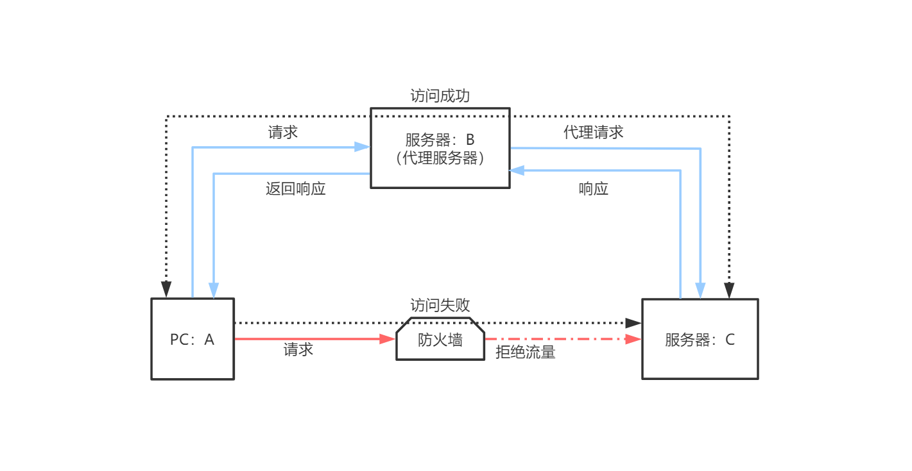
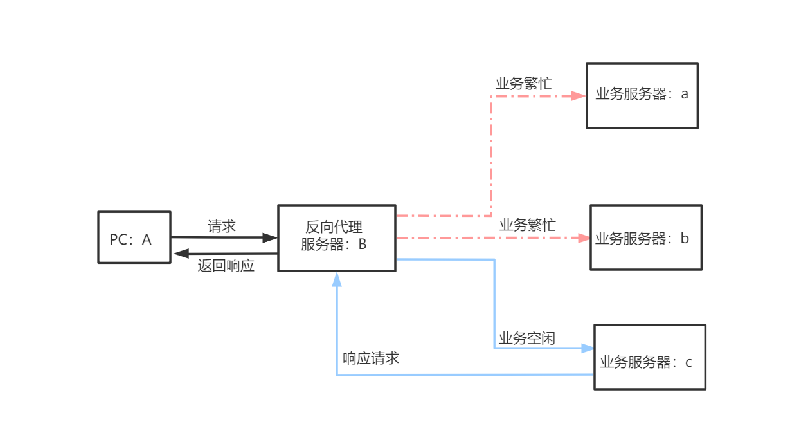

# 代理

> 💡正向代理代理的对象是客户端，反向代理代理的对象是服务端

## 正向代理

#### 通俗解释

-   A找C借钱，C不借（有墙）
-   A拜托B（代理）找C借钱
-   C借钱给B，B把钱给A（成功翻墙）

> 💡C只知道把钱且给了B，不知道B把钱给了A（代理可隐藏客户端）

#### 正经解释

-   客户端A访问服务器C
-   A与C之间有防火墙，禁止A访问C
-   防火墙没有禁止服务器B访问C，也没有禁止A访问B
-   B代替A去请求C
-   C响应B请求
-   B把响应返回给A

> 💡C只响应了B的请求，不知道B把响应返回给A

#### 图示

#### 作用

-   突破限制，翻墙访问
-   隐藏客户端IP

## 反向代理

#### 通俗解释

-   A打电话给10086（反向代理）找客服
-   10086发现a和b客服都在忙，c客服处于空闲状态
-   10086让c客服来接电话

> 💡A只知道10086的电话，不知道c的电话

#### 正经解释

-   客户端A发送请求到反向代理服务器B
-   B查看真正的业务服务器a、b、c
-   发现a、b业务繁忙，c处于空闲
-   B把请求转发给c
-   c响应B
-   B把响应返回给A

> 💡A只访问了服务器B，不知道a、b、c哪个服务器处理了业务

#### 图示

#### 作用

-   负载均衡
-   隐藏服务器端IP
