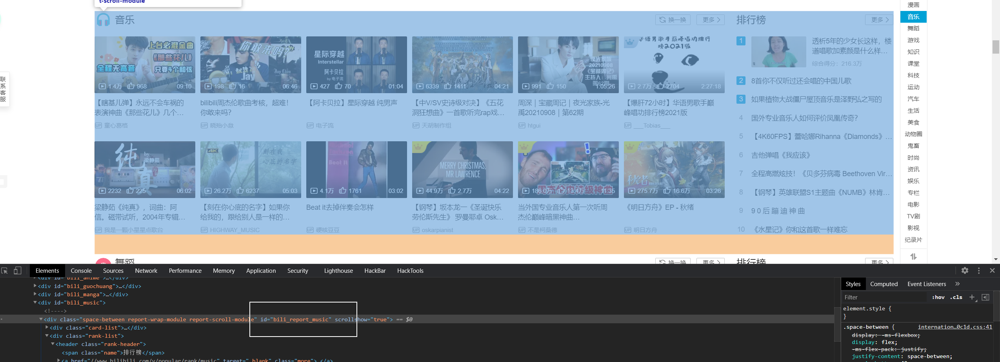
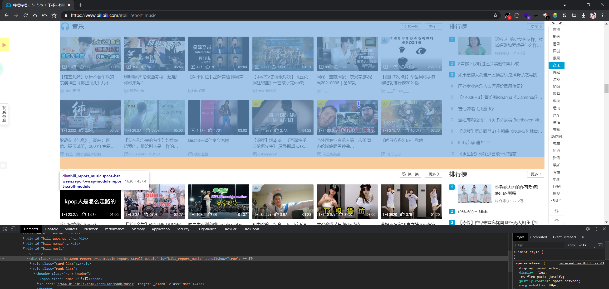

# 锚点

> 利用锚点可以跳转到网页的特定位置

## 使用

-   首先要使用锚点，得先找到要定位到的元素的`id`或者`name` ，通常为了兼容性用`id`会更好



-   然后直接在链接后面添加 `#id` 就可以跳转到某个元素位置



-   或者在一个链接里面设置属性`href`为`#id` ，就可以实现目录点击跳转功能

```javascript
<a href="#bili_report_music">跳转</a>
```

-   填上完整域名就能跳转到其它网页的锚点

```javascript
<a href="https://www.bilibili.com/#bili_report_music">跳转</a>

```
