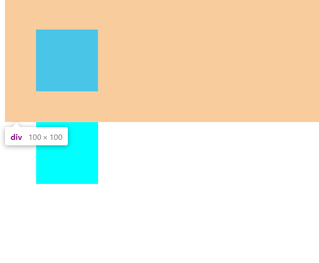
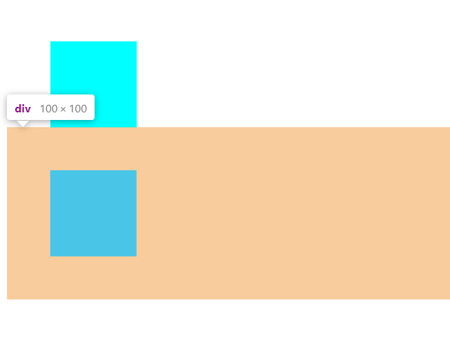
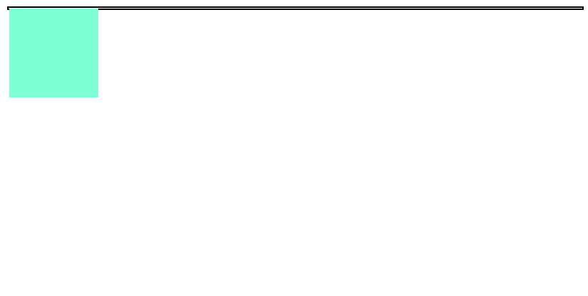
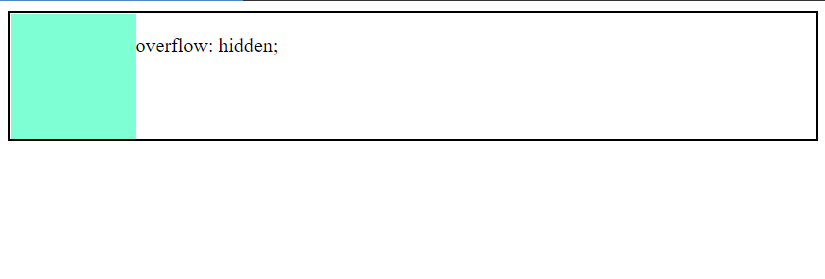
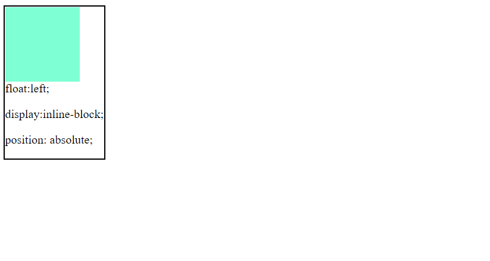
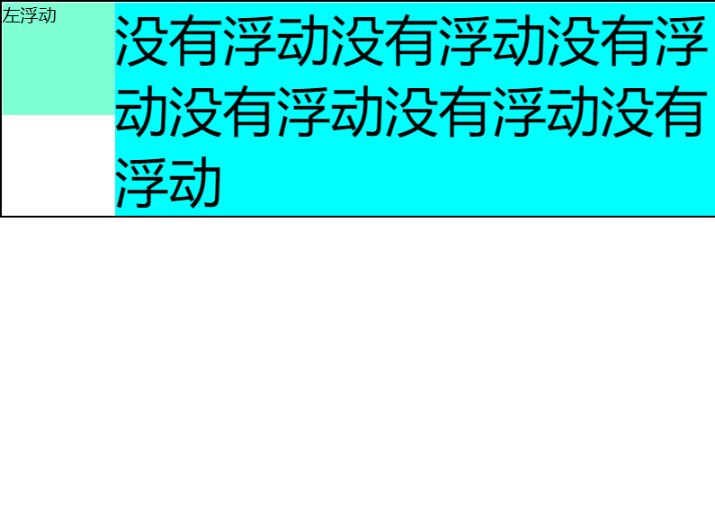

# BFC

> Block Formatting Contexts (块级格式化上下文)

## 概念

> 具有 BFC 特性的元素可以看作是隔离了的独立容器，容器里面的元素不会在布局上影响到外面的元素，并且 BFC 具有普通容器所没有的一些特性。

-   总的来说BFC元素自成一体内部不影响外部布局

## 触发BFC

-   body 根元素
-   浮动元素：float 除 none 以外的值
-   绝对定位元素：position (absolute、fixed)
-   display 为 inline-block、table-cells、flex
-   overflow 除了 visible 以外的值 (hidden、auto、scroll)

## 特性

### 同一BFC下，上下外边距会发生折叠

> 这里的BFC元素，就是`body`，因此两个`div`垂直方向的`margin`重合了

```html
<!DOCTYPE html>
<html lang="en">
<head>
    <meta charset="UTF-8">
    <title>perspective</title>
    <style>
        div{
            width: 100px;
            height: 100px;
            background-color: aqua;
            margin: 50px;
        }
    </style>
</head>
<body>
<div></div>
<div></div>
</body>
</html>
```





### **BFC 可以包含浮动的元素（清除浮动）**

-   因为`float`不计算高度，所以当子元素浮动，父元素高度`auto`时，就会出现包不住的现象

```html
<style>
    .name1{
        border: 2px solid black;
    }
    .name2{
        width: 100px;
        height: 100px;
        background-color: aquamarine;
        float: left;
    }
</style>

<body>
<div class="name1">
    <div class="name2"></div>
</div>
</body>
```



-   而符合BFC的元素，是可以包含浮动的元素，就是说会计算浮动元素的高度，因此想要清除浮动只要让父元素符合BFC就行

```html
<style>
    .name1{
        border: 2px solid black;
        overflow: hidden; /*触发BFC */
        /* 还有这三种方法也行，区别是这三种都会形成包裹
          float:left;
          display:inline-block;
          position: absolute;
        */
    }
    .name2{
        width: 100px;
        height: 100px;
        background-color: aquamarine;
        float: left;
    }
</style>

<body>
<div class="name1">
    <div class="name2"></div>
</div>
</body>
```





### **BFC 可以阻止元素被浮动元素覆盖**

> 当一个元素浮动时候，另一个元素没有浮动就会被浮动元素覆盖，但是文字不会被覆盖， 就形成了文字环绕

```html
<style>
    * {
        margin: 0;
    }
    .name1{
        border: 2px solid black;
    }
    .name2{
        width: 100px;
        height: 100px;
        background-color: aquamarine;
        float: left;
    }
    p {
        font-size: 3em;
        background-color: aqua;
    }
</style>

<body>
<div class="name1">
    <div class="name2">左浮动</div>
    <p>没有浮动没有浮动没有浮动没有浮动没有浮动没有浮动</p>
</div>
</body>
```


-   因为想不被浮动元素覆盖，可以将被覆盖元素变成BFC

```html
<style>
    * {
        margin: 0;
    }
    .name1{
        border: 2px solid black;
    }
    .name2{
        width: 100px;
        height: 100px;
        background-color: aquamarine;
        float: left;
    }
    p {
        font-size: 3em;
        background-color: aqua;
        overflow: hidden;  /*把p变成BFC */
    }
</style>

<body>
<div class="name1">
    <div class="name2">左浮动</div>
    <p>没有浮动没有浮动没有浮动没有浮动没有浮动没有浮动</p>
</div>
</body>
```



-   而且这种两列布局就是左边宽度固定，右边自适应
