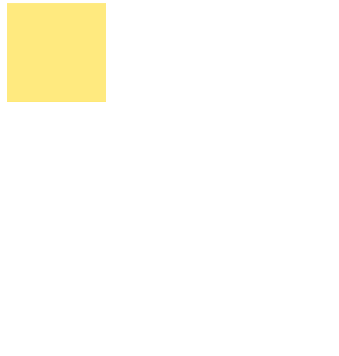

# CSS动画

## transition

> 过度效果，只有具有中间值的属性才能有过渡效果

### 属性

| [*transition-property*](https://www.runoob.com/cssref/css3-pr-transition-property.html "transition-property")                      | 指定CSS属性的name，transition效果  |
| ---------------------------------------------------------------------------------------------------------------------------------- | -------------------------- |
| [*transition-duration*](https://www.runoob.com/cssref/css3-pr-transition-duration.html "transition-duration")                      | transition效果需要指定多少秒或毫秒才能完成 |
| [*transition-timing-function*](https://www.runoob.com/cssref/css3-pr-transition-timing-function.html "transition-timing-function") | 指定transition效果的转速曲线        |
| [*transition-delay*](https://www.runoob.com/cssref/css3-pr-transition-delay.html "transition-delay")                               | 定义transition效果开始的时候，延时     |

```css
transition: property duration timing-function delay;
```

### 触发

-   hover   鼠标悬停触发
-   active  单击元素并按住鼠标时触发
-   focus  获得焦点时触发
-   @media符合媒体查询条件时触发
-   属性值发生改变时候触发

### 案例

```css
div {
    width: 100px;
    height: 100px;
    background-color: #ffea7f;
    transition-delay: 0s;
    transition-property: all;
    transition-timing-function: ease;
    transition-duration: 2s;
}
div:hover {
    width: 200px;
    height: 200px;
    background-color: #7fecff;
}
```



## animation

> 设定一个动画，应用到元素

### 属性

| [*animation-name*](https://www.runoob.com/cssref/css3-pr-animation-name.html "animation-name")                                  | 指定要绑定到选择器的关键帧的名称                                                                                                  |
| ------------------------------------------------------------------------------------------------------------------------------- | ----------------------------------------------------------------------------------------------------------------- |
| [*animation-duration*](https://www.runoob.com/cssref/css3-pr-animation-duration.html "animation-duration")                      | 动画指定需要多少秒或毫秒完成                                                                                                    |
| [*animation-timing-function*](https://www.runoob.com/cssref/css3-pr-animation-timing-function.html "animation-timing-function") | 设置动画将如何完成一个周期                                                                                                     |
| [*animation-delay*](https://www.runoob.com/cssref/css3-pr-animation-delay.html "animation-delay")                               | 设置动画在启动前的延迟间隔。                                                                                                    |
| [*animation-iteration-count*](https://www.runoob.com/cssref/css3-pr-animation-iteration-count.html "animation-iteration-count") | 定义动画的播放次数。                                                                                                        |
| [*animation-direction*](https://www.runoob.com/cssref/css3-pr-animation-direction.html "animation-direction")                   | 指定是否应该轮流反向播放动画。                                                                                                   |
| [animation-fill-mode](https://www.runoob.com/cssref/css3-pr-animation-fill-mode.html "animation-fill-mode")                     | 规定当动画不播放时（当动画完成时，或当动画有一个延迟未开始播放时），要应用到元素的样式。                                                                      |
| [*animation-play-state*](https://www.runoob.com/cssref/css3-pr-animation-play-state.html "animation-play-state")                | 指定动画是否正在运行或已暂停。                                                                                                   |
| initial                                                                                                                         | 设置属性为其默认值。 [阅读关于 \_initial\_的介绍。](https://www.runoob.com/cssref/css-initial.html "阅读关于 _initial_的介绍。")            |
| inherit                                                                                                                         | 从父元素继承属性。 [阅读关于 \_initinherital\_的介绍。](https://www.runoob.com/cssref/css-inherit.html "阅读关于 _initinherital_的介绍。") |

### 步骤

-   @keyframes&#x20;

> @keyframes，设定一个动画，相当于设定两个样式，并且从一个变换另一个，用`from{}` 和`to{}`

```css
@keyframes example{
    from{
        width: 100px;
        height: 100px;
    }
    to {
        width: 200px;
        height: 200px;
    }
}
```

-   使用百分比设置不同阶段

```css
@keyframes example{
    0%{
        width: 100px;
        height: 100px;
        background-color: #7ffffb;
    }
    25% {
        width: 200px;
        height: 200px;
        background-color: #84ffed;
    }
    50% {
        width: 250px;
        height: 250px;
        background-color: #7fd9ff;
    }
    100% {
        width: 300px;
        height: 300px;
        background-color: #8c7fff;
    }
}
```

-   animation-name

> 将动画应用到元素上

```css
div {
    background-color: #ffea7f;
    animation-name: example;
}
```

-   animation-duratio

> 设定动画时间，因为默认是0s，所以不设置`animation-duratio` ，动画不播放

```css
div {
    background-color: #ffea7f;
    animation-name: example;
    animation-duration: 4s;
}
```

-   animation-delay

> 设定延迟时间，如果设置为负数（-2），则从它已经播放2秒的状态开始

```css
div {
    background-color: #ffea7f;
    animation-name: example;
    animation-duration: 4s;
    animation-delay: 2s;
}
```

-   animation-iteration-count

> 设置动画播放次数，`infinite`为无限

```css
div {
    background-color: #ffea7f;
    animation-name: example;
    animation-duration: 4s;
    animation-delay: -1s;
    animation-iteration-count: infinite;
}
```

-   animation-direction

> 设置播放模式

| normal            | 动画正常播放（向前）。默认值 |
| ----------------- | -------------- |
| reverse           | 动画以反方向播放（向后）   |
| alternate         | 动画先向前播放，然后向后交替 |
| alternate-reverse | 动画先向后播放，然后向前交替 |

```css
div {
    background-color: #ffea7f;
    animation-name: example;
    animation-duration: 4s;
    animation-delay: -1s;
    animation-iteration-count: infinite;
    animation-direction:alternate;
}
```

-   animation-timing-function

> 设置动画的速度曲线

```css
div {
    background-color: #ffea7f;
    animation-name: example;
    animation-duration: 4s;
    animation-delay: -1s;
    animation-iteration-count: infinite;
    animation-direction:alternate;
    animation-timing-function:ease;
}
```

-   animation-fill-mode

> 动画的播放对这个元素的样式影响

| none      | 默认值，动画在执行之前或之后不会对元素应用任何样式                                   |
| --------- | ----------------------------------------------------------- |
| forwards  | 元素将保留由最后一个关键帧设置的样式值                                         |
| backwards | 元素将获取由第一个关键帧设置的样式值                                          |
| both      | 动画会同时遵循向前和向后的规则，从而在两个方向上扩展动画属性&#xA;如果有延时，则播放器前第一个帧，播放后取最后一帧 |

## 区别

-   `transition`需要触发，而`animation`页面渲染完成就会开始播放
