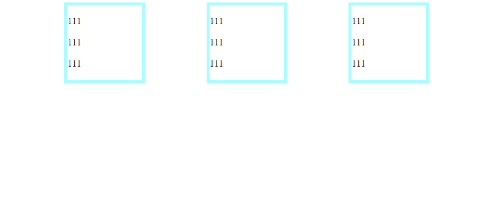
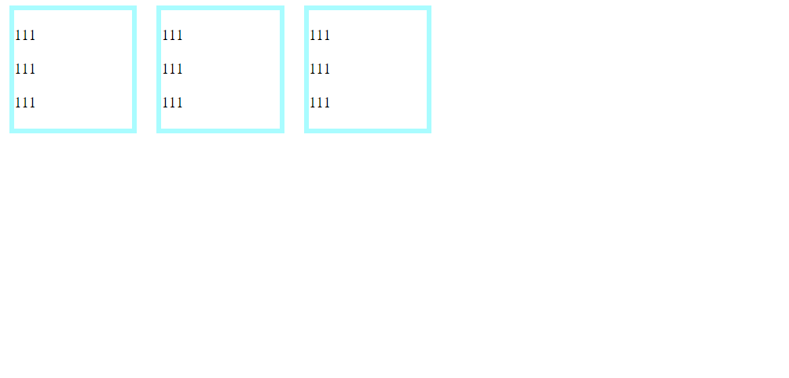
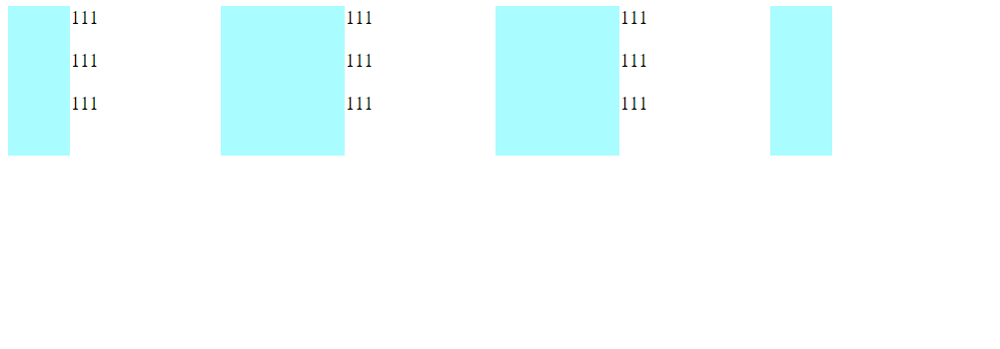
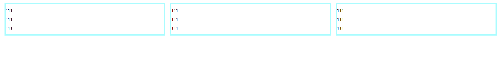
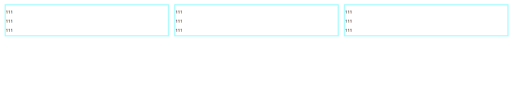

# CSS实现三栏布局

## float

> float布局，用margin控制间隔

```css
div{
    width: 120px;
    height: 120px;
    border:5px solid #a9fcff;
    float: left;
}
.d1{
    margin-left: 100px;
}
.d2{
    margin-left: 100px;
}
.d3{
    margin-left: 100px;
}
```

```html
<div class="d1"><p>111</p><p>111</p><p>111</p></div>
<div class="d2"><p>111</p><p>111</p><p>111</p></div>
<div class="d3"><p>111</p><p>111</p><p>111</p></div>
```



## position

> 通过绝对定位，固定位置

```css
div{
    width: 120px;
    height: 120px;
    border:5px solid #a9fcff;
    position: absolute;
}
.d1{
    left: 10px;
}
.d2{
    left: 160px;
}
.d3{
    left: 310px;
}
```

```html
<div class="d1"><p>111</p><p>111</p><p>111</p></div>
<div class="d2"><p>111</p><p>111</p><p>111</p></div>
<div class="d3"><p>111</p><p>111</p><p>111</p></div>
```



## table

> 父元素设置`display: table`，子元素设置`display: table-cell` ，用`border` 来做间隔

```css
.t div{
    width: 120px;
    height: 120px;
    border-left:50px solid #a9fcff;
    border-right:50px solid #a9fcff;
    display: table-cell;
}
.t{
    display: table;
}
```

```html
<div class="t">
    <div class="d1"><p>111</p><p>111</p><p>111</p></div>
    <div class="d2"><p>111</p><p>111</p><p>111</p></div>
    <div class="d3"><p>111</p><p>111</p><p>111</p></div>
</div>
```



## flex

> 最舒服的方法，父元素设置`display: flex;` ，子元素用`width`、`margin`、`flex-grow`设置间隔

```css
.t{
    display: flex;
}
.t div{
    width: 100px;
    border:5px solid #a9fcff;
    margin: 10px;
    flex-grow:1;
}
```

```html
<div class="t">
    <div class="d1"><p>111</p><p>111</p><p>111</p></div>
    <div class="d2"><p>111</p><p>111</p><p>111</p></div>
    <div class="d3"><p>111</p><p>111</p><p>111</p></div>
</div>
```



## gird

> 父节点设置`display：grid` ，通过`grid-template-columns` 设置多少列和宽度，`grid-template-rows` 设置列的长度

```css
.t{
    display: grid;
    grid-template-rows: 150px;
    grid-template-columns: auto auto auto;
}
.t div{
    border:5px solid #a9fcff;
    margin: 10px;

}
```

```html
<div class="t">
    <div class="d1"><p>111</p><p>111</p><p>111</p></div>
    <div class="d2"><p>111</p><p>111</p><p>111</p></div>
    <div class="d3"><p>111</p><p>111</p><p>111</p></div>
</div>
```


