# Flex布局

> Flexible Box 的缩写，意为"弹性布局"

-   设为 Flex 布局以后，子元素的`float`、`clear`和`vertical-align`属性将失效

## 概念

> 采用 Flex 布局的元素，称为 Flex **容器**`flex container`，它的所有子元素自动成为容器成员，称为 Flex **项目**`flex item`


-   水平主轴`main axis`
-   垂直于主轴的交叉轴`cross axis`
-   主轴的开始位置（与边框的交叉点）`main start`
-   主轴的束位置`main end`
-   交叉轴的开始位置`cross start`
-   交叉轴的结束位置`cross end`
-   单个项目占据的主轴空间`main size`
-   单个项目占据的交叉轴空间`cross size`

## 容器属性

-   演示默认项目基本样式（个别可能改动）

```css
.box-item {
    width: 50px;
    height: 50px;
    background-color: #ff85af;
    text-align: center;
    line-height: 50px;
    font-size: 25px;
    color: #ffffff;
    margin: 5px;
}
```

### flex-direction

> 决定主轴的方向，也就是项目的排列方向，默认为`row`

| row            | →  （默认） |
| -------------- | ------- |
| row-reverse    | ←       |
| column         | ↓       |
| column-reverse | ↑       |

```css
.box {
  flex-direction: row | row-reverse | column | column-reverse;
}
```

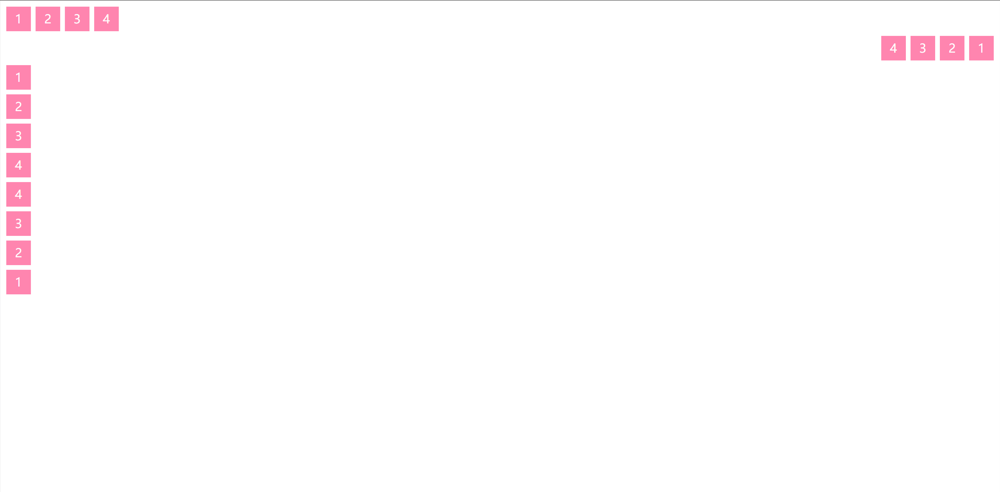

### flex-wrap

> 默认情况下，项目都在一条线上，`flex-wrap`属性定义，如果一条轴线排不下，如何换行，默认为`nowrap`

| nowrap       | （默认）不换行，宽度会压缩 |
| ------------ | ------------- |
| wrap         | 换行，第一行在上方     |
| wrap-reverse | 换行，第一行在下方     |

```css
.box{
  flex-wrap: nowrap | wrap | wrap-reverse;
}
```

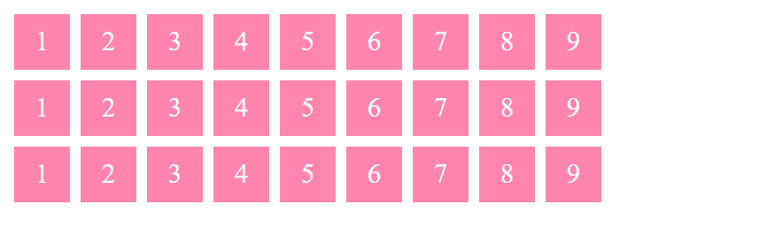

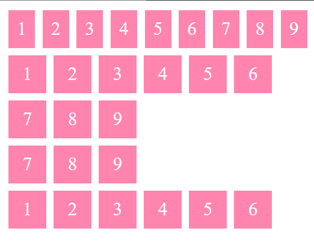

### flex-flow

> `flex-flow`属性是`flex-direction`属性和`flex-wrap`属性的简写形式

```css
.box {
  flex-flow: <flex-direction> || <flex-wrap>;
}
```

```css
/*默认值*/
flex-flow:row nowrap；
```

### justify-content

> `justify-content`属性定义了项目在**主轴**上的对齐方式，默认`flex-start`

| flex-start    | （默认）左对齐                            |
| ------------- | ---------------------------------- |
| flex-end      | 右对齐                                |
| center        | 居中                                 |
| space-between | 两端对齐，项目之间的间隔都相等。                   |
| space-around  | 每个项目两侧的间隔相等。所以，项目之间的间隔比项目与边框的间隔大一倍 |

```css
.box {
  justify-content: flex-start | flex-end | center | space-between | space-around;
}
```

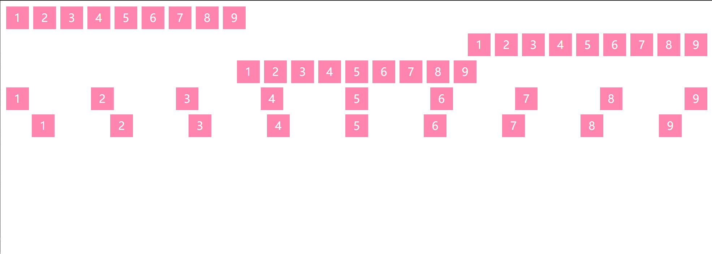

### align-items

> `align-items`属性定义项目在**交叉轴**上如何对齐，默认为`stretch`

```css
.box {
  align-items: flex-start | flex-end | center | baseline | stretch;
}
```

| flex-start | 交叉轴的起点对齐                           |
| ---------- | ---------------------------------- |
| flex-end   | 交叉轴的终点对齐                           |
| center     | 交叉轴的中点对齐                           |
| baseline   | 项目的第一行文字的基线对齐                      |
| stretch    | （默认）如果项目未设置高度或设为`auto`，将占满整个容器的高度。 |

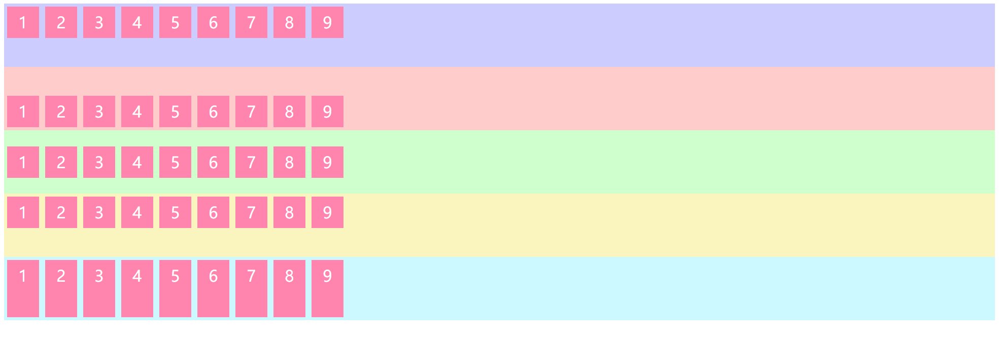

### align-content

> `align-content`属性定义了多根轴线的对齐方式。如果项目只有一根轴线，该属性不起作用

```css
.box {
  align-content: flex-start | flex-end | center | space-between | space-around | stretch;
}
```

| flex-start    | 与交叉轴的起点对齐                            |
| ------------- | ------------------------------------ |
| flex-end      | 与交叉轴的终点对齐                            |
| center        | 与交叉轴的中点对齐                            |
| space-between | 与交叉轴两端对齐，轴线之间的间隔平均分布                 |
| space-around  | 每根轴线两侧的间隔都相等。所以，轴线之间的间隔比轴线与边框的间隔大一倍。 |
| stretch       | （默认）轴线占满整个交叉轴                        |

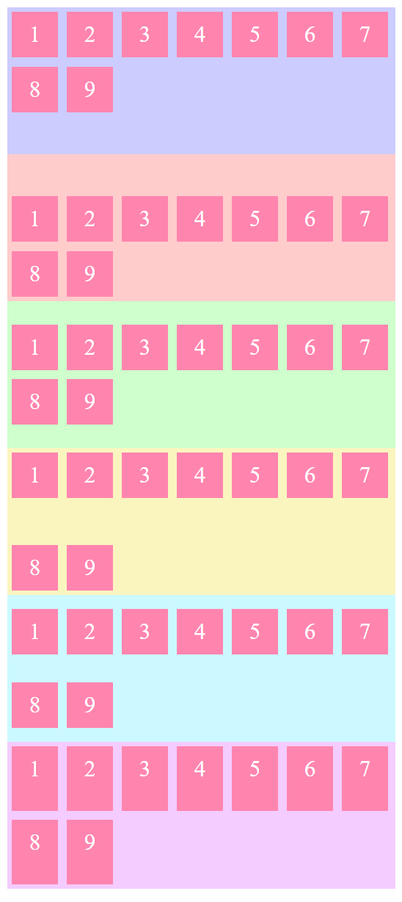

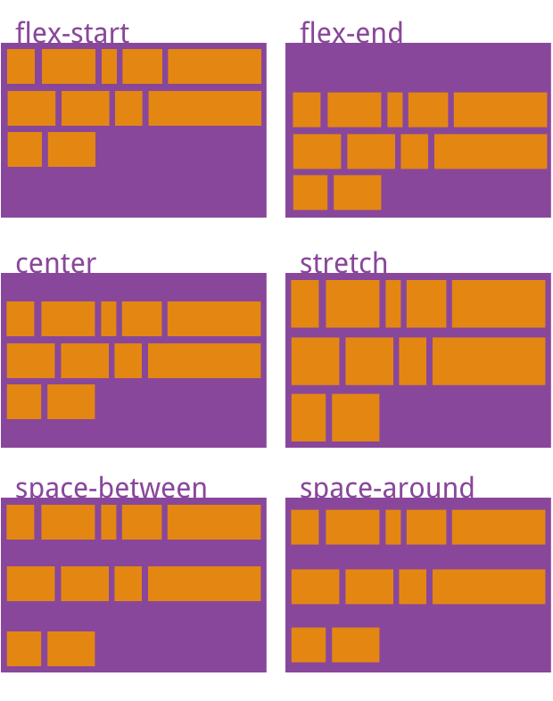

## 项目属性

| order       | 项目的排列顺序                                       |
| ----------- | --------------------------------------------- |
| flex-grow   | 项目的放大比例                                       |
| flex-shrink | 项目的缩小比例                                       |
| flex-basis  | 项目占据的主轴空间                                     |
| flex        | 是`flex-grow`, `flex-shrink` 和 `flex-basis`的简写 |
| align-self  |                                               |

### order

> 定义项目的排列顺序。数值越小，排列越靠前，默认为0。

```css
.item {
  order: <integer>;
}
```

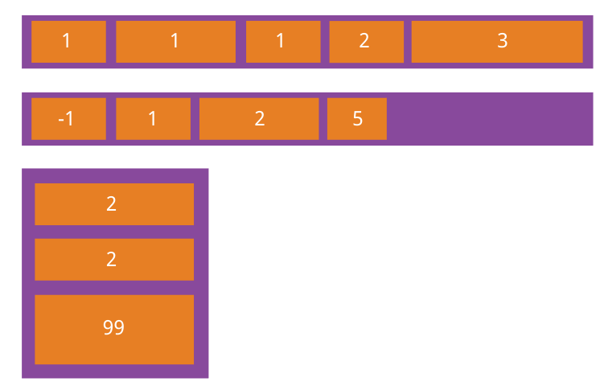

### flex-grow

> 定义项目的放大比例，默认为`0`，即如果存在剩余空间，也不放大

```css
.item {
  flex-grow: <number>; /* default 0 */
}
```

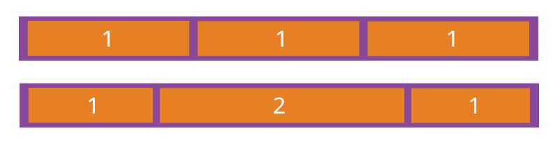

-   如果所有项目的`flex-grow`属性都为`0`或都一样，则它们将等分剩余空间（如果有的话）
-   如果一个项目的`flex-grow`属性为2，其他项目都为1，则前者占据的剩余空间将比其他项多一倍。

### flex-shrink

> 定义了项目的缩小比例，默认为`1`，即如果空间不足，该项目将缩小。

```css
.item {
  flex-shrink: <number>; /* default 1 */
}
```

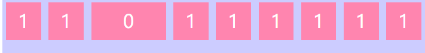

-   如果所有项目的`flex-shrink`属性都为`1`或都一样，当空间不足时，都将等比例缩小
-   如果一个项目的`flex-shrink`属性为0，其他项目都为1，则空间不足时，前者不缩小

### flex-basis

> 定义了在分配多余空间之前，项目占据的主轴空间`main size`。浏览器根据这个属性，计算主轴是否有多余空间。它的默认值为`auto`，即项目的本来大小

```css
.item {
  flex-basis: <length> | auto; /* default auto */
}
```

### flex

> `flex`属性是`flex-grow`, `flex-shrink` 和 `flex-basis`的简写，默认值为`0 1 auto`

```css
.item {
  flex: none | [ <'flex-grow'> <'flex-shrink'>? || <'flex-basis'> ]
}
```

-   该属性有两个快捷值：`auto (1 1 auto)` 和 `none (0 0 auto)`

### align-self

> 允许单个项目有与其他项目不一样的对齐方式，覆盖`align-items`属性

-   默认值为`auto`，表示继承父元素的`align-items`属性
-   如果没有父元素，则等同于`stretch`

```css
.item {
  align-self: auto | flex-start | flex-end | center | baseline | stretch;
}
```

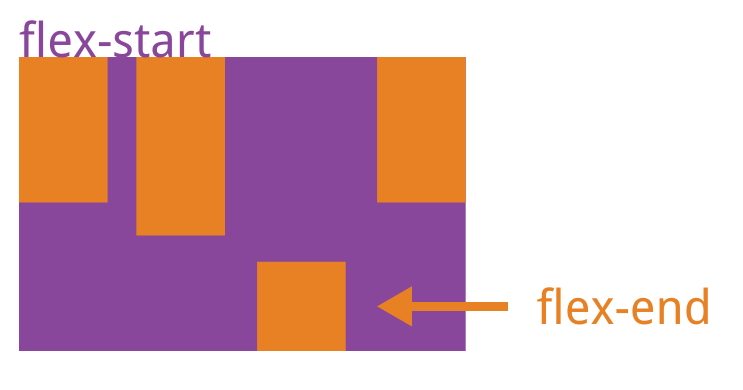

## 布局案例

### 圣杯布局

> Holy Grail Layout指的是一种最常见的网站布局。页面从上到下，分成三个部分：头部（header），躯干（body），尾部（footer）。其中躯干又水平分成三栏，从左到右为：导航、主栏、副栏

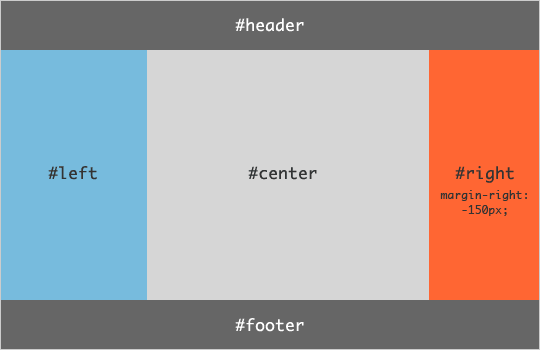

```html
<!doctype>
<html>
<head>
    <meta charset='utf-8'></meta>
    <style>
        .HolyGrail {
            margin: 0px;
            display: flex;
            min-height: 100vh;
            flex-direction: column;
            background-color: aquamarine;
        }
        header,
        footer{
            flex:0.1;
            background-color: #777777;
        }
        .HolyGrail-body{
            display: flex;
            flex: 1;
        }
        .HolyGrail-content{
            flex: 1;
        }
        .HolyGrail-nav,
        .HolyGrail-ads{
            felx:0 0 12em;
            background-color: #a6ffff;
        }
        .HolyGrail-nav{
            order: -1;
            background-color: #ffd5f5;
        }

        @media (max-width: 700px) {
            .HolyGrail-body{
                flex-direction: column;
            }
            .HolyGrail-nav,
            .HolyGrail-ads,
            .HolyGrail-content {
                flex: auto;
            }
        }
    </style>
</head>

<body class="HolyGrail">
    <header>
        #header
    </header>
    <div class="HolyGrail-body">
        <main class="HolyGrail-content">#main</main>
        <nav class="HolyGrail-nav">#nav</nav>
        <aside class="HolyGrail-ads">#aside</aside>
    </div>
    <footer>
        #footer
    </footer>
</body>
</html>

```

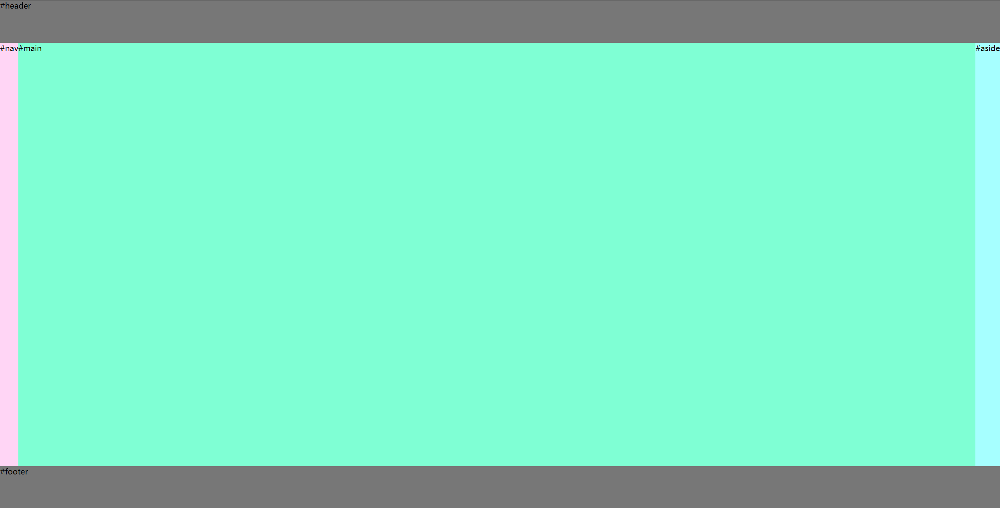

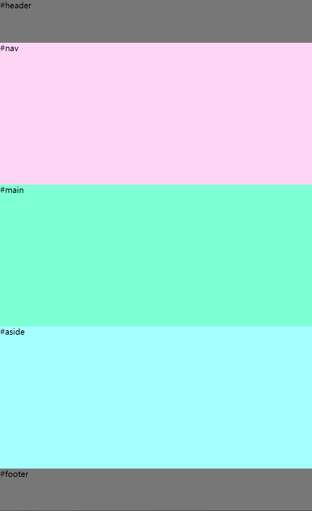
