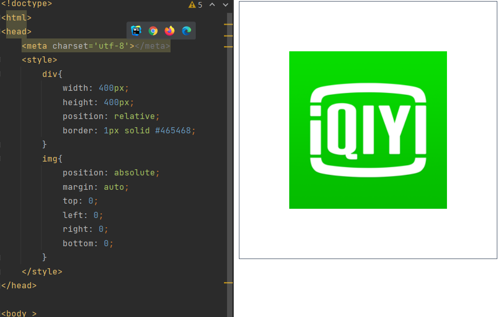
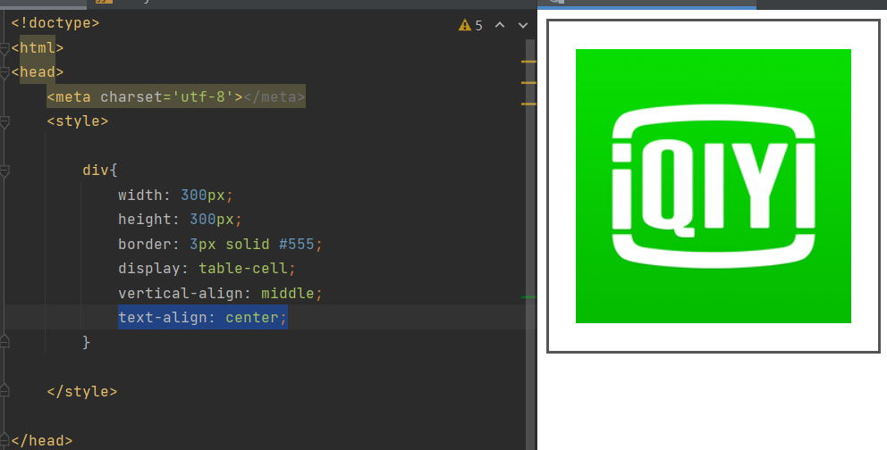
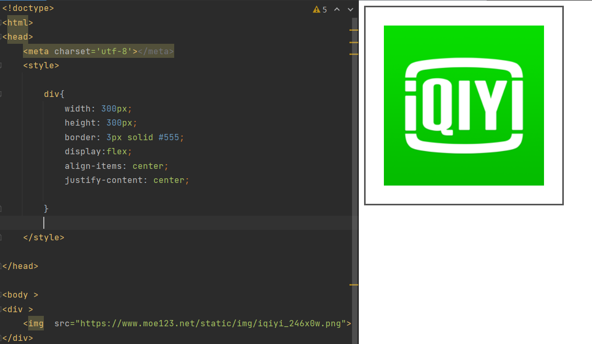

# 垂直居中的方法

## margin:auto

> 绝对定位，定位上下左右都为`0`，`margin`为`auto`，`margin`会自动计算成居中

```css
.css{
    position: absolute;
    margin: auto;
    top: 0;
    left: 0;
    right: 0;
    bottom: 0;
}
```



## margin负值法

> 绝对定位，`top`和`left`为`50%`，元素左上角就是在中心点，然后`margin-top`和`margin-left`为自身的一半的负值，元素的中心点和父元素的中心点就重合

```css
.css{
  width: 400px;
  height: 300px;
  position: absolute;
  top: 50%;
  left: 50%;
  margin-top: -200px; /*height的一半*/
  margin-left: -150px; /*width的一半*/
  /*这种方法减也行 transform: translate(-50%,-50%);*/
}
```

## table-cell

方法一：

> 父元素设置`display: table-cell`、`vertical-align`、`middle;text-align: center`

```css
div{
    width: 300px;
    height: 300px;
    border: 3px solid #555;
    display: table-cell;
    vertical-align: middle;
    text-align: center;
}
        
```



方法二：

> 父元素设置成`display: table`, 子元素设置为单元格 `display: table-cell`

## flex

> 主轴和交叉轴中点对齐`align-items:center`、`justify-content:center`

```css
div{
    width: 300px;
    height: 300px;
    border: 3px solid #555;
    display:flex;
    align-items: center;
    justify-content: center;

}
```


