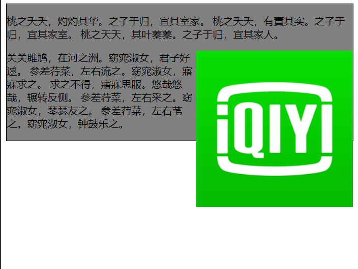
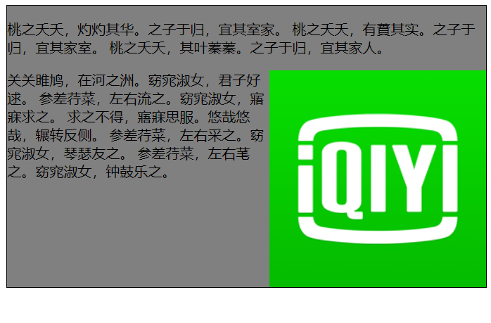

# 清除浮动

> 当容器的高度为`auto`，容器内有浮动元素的情况下，容器的高低不能自适应成内容的高度，这是因为浮动的元素不占据空间

-   比如在要文字围绕图片时

```html
<!doctype>
<html>
<head>
    <meta charset='utf-8'></meta>
    <style>
        .news {
            width: auto;
            background-color: gray;
            border: solid 1px black;
            word-break: break-word; /*自动换行*/
        }

        img{
            float: right;
        }
    </style>
</head>
<body >
<div class="news">
    <p>桃之夭夭，灼灼其华。之子于归，宜其室家。
        桃之夭夭，有蕡其实。之子于归，宜其家室。
        桃之夭夭，其叶蓁蓁。之子于归，宜其家人。</p>
    
    <p>关关雎鸠，在河之洲。窈窕淑女，君子好逑。
        参差荇菜，左右流之。窈窕淑女，寤寐求之。
        求之不得，寤寐思服。悠哉悠哉，辗转反侧。
        参差荇菜，左右采之。窈窕淑女，琴瑟友之。
        参差荇菜，左右芼之。窈窕淑女，钟鼓乐之。</p>
</div>
</body>
</html>

```



## 清除浮动

### clear

> `clear`属性就是专门用来清除浮动的

-   在浮动元素最后添加一个空元素并设置`clear:both`

```html
CSS：
.clear{clear: both}

HTML:
<div class="clear"></div>

```



### **:after**

> 给容器添加一个空的伪元素，让这个伪元素`clear`

```css
.news:after{
    display: block;
    content: "";
    clear: both;
}
```

### overflow: hidden

> 父元素添加`overflow: hidden`，可以清除浮动

```css
.news {
    overflow: hidden;
}
```

### **容器添加浮动**

> 给容器添加浮动，可以清除内部浮动问题，但是这样会影响整体布局

```css
.news {
    float:left;
}
```
