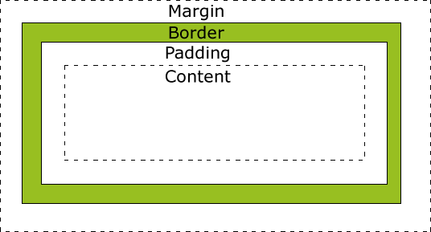

# 盒模型

> 不同浏览器，不同版本都可能出现使用不一样的盒模型

-   **Margin(外边距)** - 清除边框外的区域，外边距是透明的。
-   **Border(边框)** - 围绕在内边距和内容外的边框。
-   **Padding(内边距/填充)** - 清除内容周围的区域，内边距是透明的。
-   **Content(内容)** - 盒子的内容，显示文本和图像。

**标准盒模型：总宽度=width+margin(左右)+padding(左右)+border(左右)**

**怪异盒模型：总宽度=width+margin（左右）（既width已经包含了padding和border值）**

-   通过box-sizing属性这种盒模型

| ontent-box | 在宽度和高度之外绘制元素的内边距和边框                |
| ---------- | ---------------------------------- |
| border-box | 通过从已设定的宽度和高度分别减去边框和内边距才能得到内容的宽度和高度 |
| inherit    | 父元素继承 box-sizing 属性的值              |
