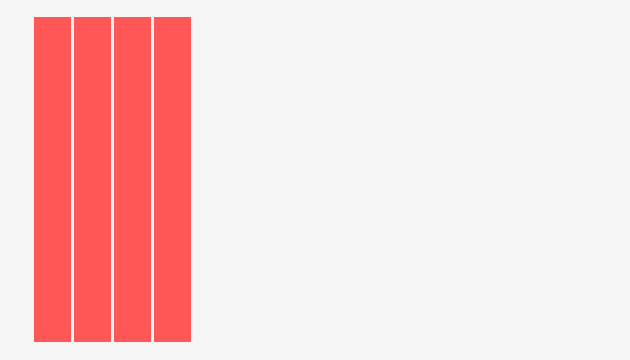

# 手风琴效果

## 利用flex实现手风琴

> item宽度一开始都是自适应缩放，修改悬停的item的缩放比例起到手风琴效果，一般用于图片展示

```html
<!DOCTYPE html>
<html lang="Zh">
<head>
    <meta charset="UTF-8">
    <title>Document</title>
    <style>
        .f{
            height: 500px;
            width: 1000px;
            position: absolute;
            top: 0;
            left: 0;
            right: 0;
            bottom: 0;
            margin: auto;
            background-color: silver;
             display: flex; 
        }
        .item{
             flex: 1; 
            transition: flex 0.5s ease ;
        }
        .item:hover{
             flex: 7; 
        }
    </style>
</head>
<body>
    <div class="f">
        <div class="item" style="background-color: skyblue;"></div>
        <div class="item" style="background-color: slateblue;"></div>
        <div class="item" style="background-color: teal;"></div>
        <div class="item" style="background-color: violet;"></div>
        <div class="item" style="background-color: darkkhaki;"></div>
    </div>
</body>
</html>
```


## 利用width实现手风琴

> 一般用于信息展示

```html
<!DOCTYPE html>
<html lang="Zh">
<head>
    <meta charset="UTF-8">
    <title>Document</title>
    <style>
        body{
            background: whitesmoke;
        }
        li{
            list-style: none;
            width: 0;
            float: left;
            height: 260px;
            margin-left: 2px;
            background: rgb(255, 86, 86);
            padding-left: 30px;
            overflow: hidden;
            transition: width 0.3s;
        }
        div{
            height: 260px;
            width: 100px;
            background: white;
        }
        li:hover{
            width: 100px;
        }
    </style>
</head>
<body>
    <ul>
        <li><div>1</div></li>
        <li><div>2</div></li>
        <li><div>3</div></li>
        <li><div>4</div></li>
    </ul>
</body>
</html>

```


