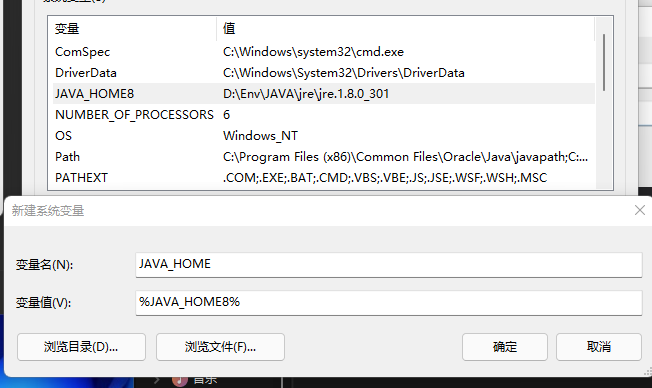
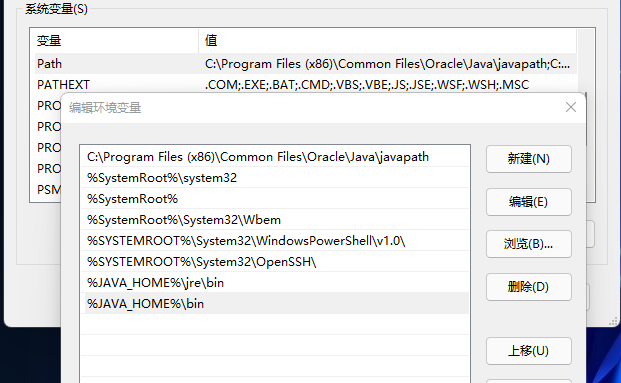
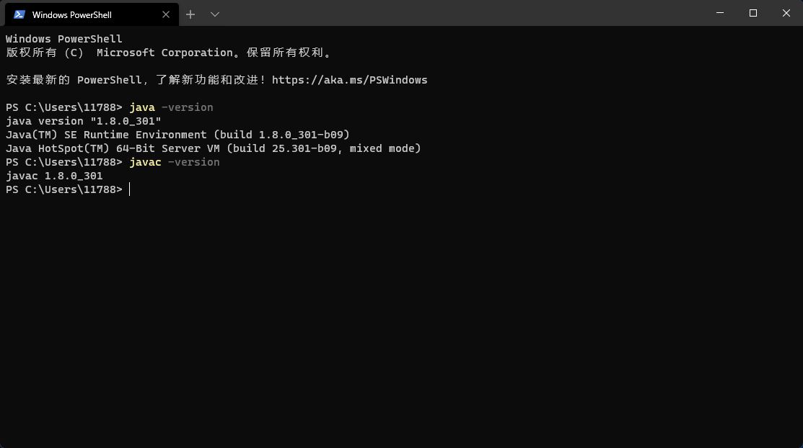
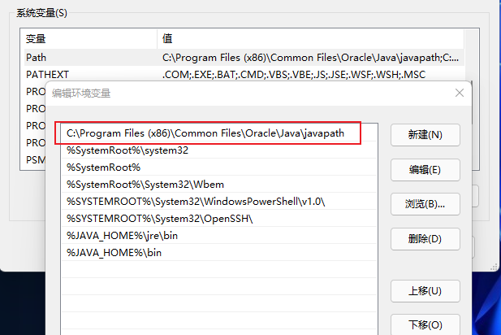
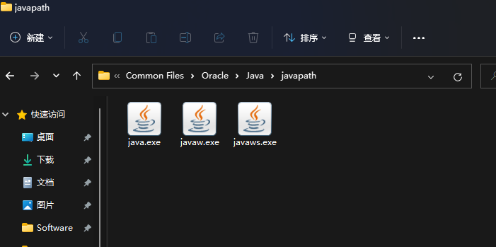

# JDK环境配置

## 配置过程

-   安装无脑下一步
-   安装好jdk和jre
-   配置环境变量
    > 考虑需要多个jdk的情况，采用套娃形式
    > 1.配置多个jdk变量（填写jdk的路径）
    

    2.使用哪个jdk就套哪个变量

    

    3.在path环境变量中新增`%JAVA_HOME%\bin`和`%JAVA_HOME%\jre\bin`

    
-   配置完成，cmd命令测试

    

## Tip

-   CLASSPATH在`1.5`版本之后都不需要配置
-   在配置完成后path会多出一行路径`C:\Program Files (x86)\Common Files\Oracle\Java\javapath`

    
-   在切换版本的时候如果出些不能正常切换的情况下，进入上述的路径下，删除三个java文件即可

    
