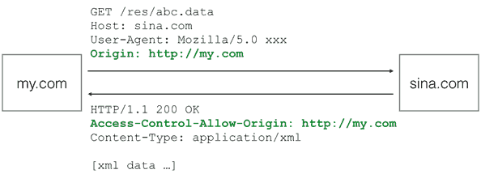

# AJAX

> Asynchronous JavaScript and XML，意思就是用JavaScript执行异步网络请求，AJAX不是JavaScript的规范，

-   AJAX请求是异步执行的，也就是说，要通过回调函数获得响应。
-   现代浏览器上AJAX主要依靠`XMLHttpRequest`对象，对于低版本的IE，需要使用`ActiveXObject`对象

```javascript
function success(text) {
    var textarea = document.getElementById('test-response-text');
    textarea.value = text;
}

function fail(code) {
    var textarea = document.getElementById('test-response-text');
    textarea.value = 'Error code: ' + code;
}

//var request = new XMLHttpRequest(); // 新建XMLHttpRequest对象
var request;
if (window.XMLHttpRequest) {
    request = new XMLHttpRequest();
} else {
    request = new ActiveXObject('Microsoft.XMLHTTP');
}

//回调函数
request.onreadystatechange = function () { // 状态发生变化时，函数被回调
    if (request.readyState === 4) { // 成功完成
        // 判断响应结果:
        if (request.status === 200) {
            // 成功，通过responseText拿到响应的文本:
            return success(request.responseText);
        } else {
            // 失败，根据响应码判断失败原因:
            return fail(request.status);
        }
    } else {
        // HTTP请求还在继续...
    }
}

// 发送请求:
request.open('GET', '/api/categories');
request.send();

alert('请求已发送，请等待响应...');
```

-   `XMLHttpRequest`对象的`open()`方法有3个参数，第一个参数指定是`GET`还是`POST`，第二个参数指定URL地址，第三个参数指定是否使用异步，默认是`true`，所以不用写。
-   如果把`open()` 第三个参数指定为`false`，则浏览器将停止响应，直到AJAX请求完成。如果这个请求耗时10秒，那么10秒内你会发现浏览器处于 假死 状态。
-   `GET`请求不需要参数，`POST`请求需要把body部分以字符串或者`FormData`对象传进去。

## 创建对象

```javascript
var xmlhttp;
if (window.XMLHttpRequest)
{
    //  IE7+, Firefox, Chrome, Opera, Safari 浏览器执行代码
    xmlhttp=new XMLHttpRequest();
}
else
{
    // IE6, IE5 浏览器执行代码
    xmlhttp=new ActiveXObject("Microsoft.XMLHTTP");
}
```

## 发送请求

```javascript
xmlhttp.open("GET","ajax_info.txt",true);
xmlhttp.send();
```

| 方法                     | 描述                                                                                                                             |
| ---------------------- | ------------------------------------------------------------------------------------------------------------------------------ |
| open(method,url,async) | 规定请求的类型、URL 以及是否异步处理请求。&#xA;&#xA;\*   *method*：请求的类型；GET 或 POST&#xA;\*   *url*：文件在服务器上的位置&#xA;\*   *async*：true（异步）或 false（同步） |
| send(string)           | 将请求发送到服务器。&#xA;&#xA;\*   *string*：仅用于 POST 请求                                                                                  |

### GET请求

```javascript
xmlhttp.open("GET","/try/ajax/demo_get2.php?fname=Henry&lname=Ford",true);
xmlhttp.send();
```

### POST请求

> `POST`请求需要添加`HTTP`头文件，并且在`send()`中填入要传递的数据

```javascript
xmlhttp.open("POST","/try/ajax/demo_post2.php",true);
xmlhttp.setRequestHeader("Content-type","application/x-www-form-urlencoded");
xmlhttp.send("fname=Henry&lname=Ford");
```

### Async = false

> 当不采用异步请求时候，就不需要回调函数，代码直接写在后面即可，但是强烈不建议

```javascript
xmlhttp.open("GET","/try/ajax/ajax_info.txt",false);
xmlhttp.send();
document.getElementById("myDiv").innerHTML=xmlhttp.responseText;
```

## 响应

| 属性           | 描述                           |
| ------------ | ---------------------------- |
| responseText | 获得字符串形式的响应数据。                |
| responseXML  | 获得 XML 形式的响应数据。当`document`使用 |

### readyState

> `readyState` 表示当前发送状态，有5种值，每当 `readyState `改变时，就会触发 `onreadystatechange `事件

-   `onreadystatechange `事件被触发 `4` 次, 分别是： `0-1`、`1-2`、`2-3`、`3-4`，对应着 `readyState `的每个变化

| readyState | 含义                  | 描述                                               |
| ---------- | ------------------- | ------------------------------------------------ |
| 0          | Uninitialized（未初始化） | `XMLHttpRequest`对象已经创建，但还没有调用`open`方法            |
| 1          | Loading（载入）         | 已经调用`open()` 方法，但尚未调用`send()` ，或者`send()` 尚未执行完毕 |
| 2          | Loaded（载入完成）        | `send()` 执行完毕                                    |
| 3          | Interactive（交互）     | 正在解析响应内容，可以接收到部分响应数据                             |
| 4          | Complete（完成）        | 已经接收到了全部数据，并且连接已经关闭，可以完全调用了                      |

## 解决缓存

> 因此AJAX如果发送同一个URL请求，会从缓存中获取信息

解决方法：

-   在ajax发送请求前加上 `anyAjaxObj.setRequestHeader("If-Modified-Since","0")`

    `If-Modified-Since:0` 故意让缓存过期
-   在ajax发送请求前加上`anyAjaxObj.setRequestHeader("Cache-Control","no-cache")`

    禁用缓存机制
-   在URL后面加上一个随机数： `"fresh=" + Math.random()`

    让每次的请求地址不同
-   在URL后面加上时间搓：`"nowtime=" + new Date().getTime()`

    让每次的请求地址不同
-   如果是使用jQuery，直接这样就可以了`$.ajaxSetup({cache:false})`

    不设置ajax缓存

## 安全限制

> 由于浏览器的同源策略，默认情况下，JavaScript在发送AJAX请求时，URL的域名必须和当前页面完全一致

-   域名要相同（`www.example.com`和`example.com`不同）
-   协议要相同（`http`和`https`不同）
-   端口号要相同（默认是`:80`端口，它和`:8080`就不同），有的浏览器允许端口不同

## JSONP

> 为了解决AJAX的安全策略问题，可以使用JSONP

-   JSONP实际上是利用了浏览器允许跨域引用JavaScript资源，动态添加 `<script>`

```javascript
<script src="..."></script>
```

-   JSONP只能通过`GET`请求，返回`JavaScript`
-   通过回调函数来处理数据

```html
<!doctype>
<html>
<head>
    <meta charset='utf-8'></meta>
    <script>
        //data即getPrice中price.src传入的返回结果, 是一个JSON字符串
        function showPrice(data){
            var p=document.getElementById("test-jsonp");
            p.innerHTML="当前价格："+
                data['0000001'].name +': ' +
                data['0000001'].price + '；' +
                data['1399001'].name + ': ' +
                data['1399001'].price;
        }

        //点击"刷新"按钮时, 从'http://api.money.126.net/data/feed/0000001,1399001'请求JSON字符串,并把请求结果传给自定义函数showPrice()
        function getPrice(){
            var price
            // 避免head中<scrip>递增,每次先把久的节点删除
            if (price = document.getElementById('script-01')){
                price.parentElement.removeChild(price);
            }
            price=document.createElement('script');
            var head=document.getElementsByTagName("head")[0];
            //src的?参数是回调函数
            price.setAttribute('id', 'script-01')
            price.src= 'http://api.money.126.net/data/feed/0000001,1399001?callback=showPrice';
            head.appendChild(price);
        }
    </script>
</head>

<body>
<p id="test-jsonp">placehoder</p>
<button type='button' onclick="getPrice()">刷新</button>
</body>
</html>

```

## CORS

> Cross-Origin Resource Sharing，是HTML5规范定义的如何跨域访问资源，如果浏览器支持HTML5，那么就可以一劳永逸地使用新的跨域策略：CORS了

-   CORS规定外域的`Access-Control-Allow-Origin` 包含本域，那么就是可以跨域请求的

图示：


