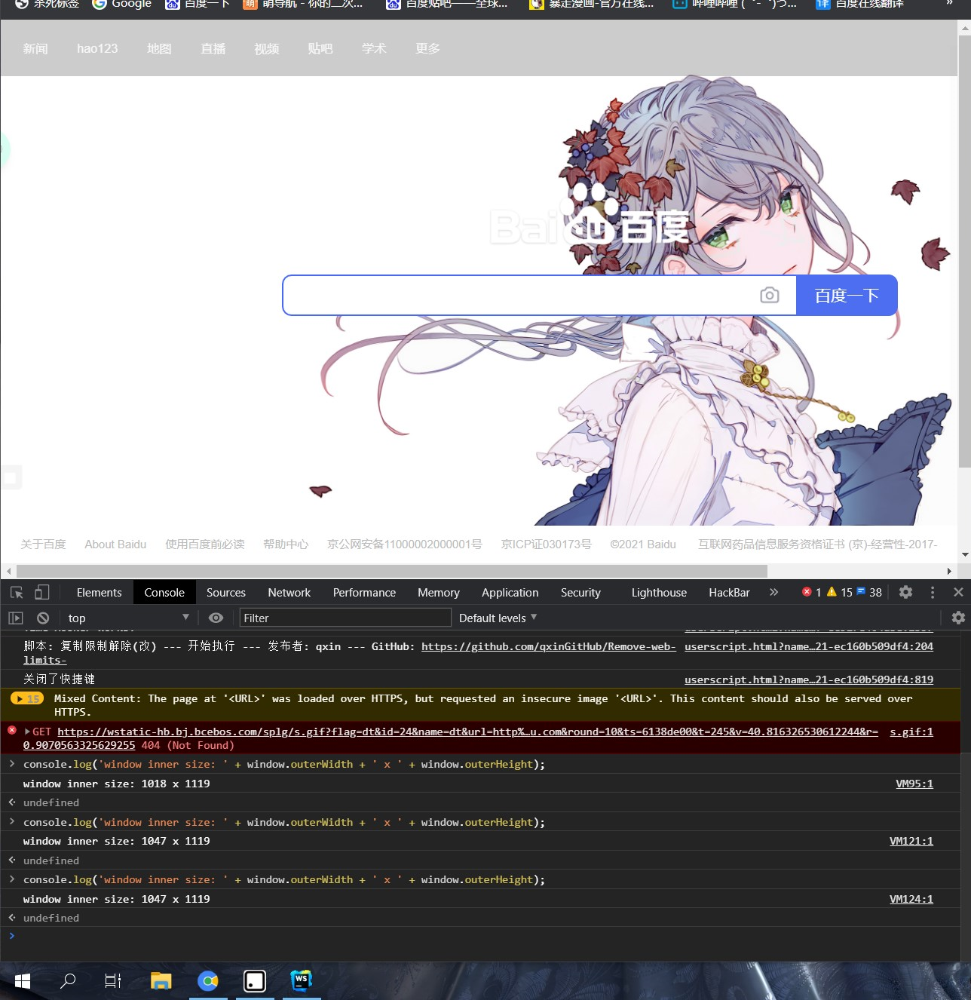

# BOM

## 浏览器对象

> BOM浏览器提供的对象，不同的浏览器对API的接口也不一样

#### window

> `window`表示浏览器窗口，同时也是全局作用域

-   自带 `innerWidth`和`innerHeight`属性，用于获取当前窗口的内部宽度和高度，内部窗口的定义为 除去菜单栏、工具栏、边框等占位元素后，用于显示网页的净宽高&#x20;

```javascript
console.log('window inner size: ' + window.innerWidth + ' x ' + window.innerHeight);

```


-   与之对应的，还有一个`outerWidth`和`outerHeight`属性，可以获取整个浏览器窗口的整个宽高，

```javascript
console.log('window inner size: ' + window.outerWidth + ' x ' + window.outerHeight);
```



#### navigator

> `navigator`对象表示浏览器信息，但是`navigator`的信息很容易被用户修改，因此不一定可信

常用属性：

| 属性            | 说明                          |
| ------------- | --------------------------- |
| appCodeName   | 返回浏览器的代码名                   |
| appName       | 返回浏览器的名称                    |
| appVersion    | 返回浏览器的平台和版本信息               |
| cookieEnabled | 返回指明浏览器中是否启用 cookie 的布尔值    |
| platform      | 返回运行浏览器的操作系统平台              |
| userAgent     | 返回由客户机发送服务器的user-agent 头部的值 |
| language      | 浏览器设置的语言                    |

更多属性：

<https://developer.mozilla.org/zh-CN/docs/Web/API/Navigator>

```javascript
console.log('appName = ' + navigator.appName);
console.log('appVersion = ' + navigator.appVersion);
console.log('language = ' + navigator.language);
console.log('platform = ' + navigator.platform);
console.log('userAgent= ' + navigator.userAgent);

```


#### screen

> `screen`对象表示屏幕的信息

| 属性     | 说明          |
| ------ | ----------- |
| width  | 屏幕宽度，以像素为单位 |
| height | 屏幕高度，以像素为单位 |

更多属性：

<https://developer.mozilla.org/zh-CN/docs/Web/API/Screen>

```javascript
console.log('Screen size = ' + screen.width+ ' x ' + screen.height);
```


#### location

> `location`对象表示当前页面的URL信息


-   另一个用法是利用`location` 执行重新加载或者跳转

```javascript
 location.reload();   //重新加载页面
```

```javascript
location.assign('/'); // 设置一个新的URL地址并且跳转
```

#### document

> `document`对象表示当前页面

-   `document`对象继承了`EventTarget`接口、`Node`接口、`ParentNode`接口
-   针对不同地方有不同的获取方法

| 正常的网页           | 直接使用`document`或`window.document`     |
| --------------- | ------------------------------------ |
| `iframe`框架里面的网页 | 使用`iframe`节点的`contentDocument`属性     |
| `Ajax `操作返回的文档  | 使用`XMLHttpRequest`对象的`responseXML`属性 |
| 内部节点            | `ownerDocument`属性。                   |

更多`document`对象的属性和方法：[DOM](../DOM/DOM.md "DOM")

## 操作DOM

> ✨总的来说DOM操作也就增删改查

-   更新：更新该DOM节点的内容，相当于更新了该DOM节点表示的HTML的内容
-   遍历：遍历该DOM节点下的子节点，以便进行进一步操作
-   添加：在该DOM节点下新增一个子节点，相当于动态增加了一个HTML节点
-   删除：将该节点从HTML中删除，相当于删掉了该DOM节点的内容以及它包含的所有子节点

### 获取DOM节点

> 用的方法是`document.getElementById()`和`document.getElementsByTagName()`，以及CSS选择器`document.getElementsByClassName()`

```javascript
// 返回ID为'test'的节点：
var test = document.getElementById('test');

// 先定位ID为'test-table'的节点，再返回其内部所有tr节点：
var trs = document.getElementById('test-table').getElementsByTagName('tr');

// 先定位ID为'test-div'的节点，再返回其内部所有class包含red的节点：
var reds = document.getElementById('test-div').getElementsByClassName('red');

// 获取节点test下的所有直属子节点:
var cs = test.children;

// 获取节点test下第一个、最后一个子节点：
var first = test.firstElementChild;
var last = test.lastElementChild;
```

> 还有一种方法是通过`querySelector()`和`querySelectorAll()` 获取，需要了解`selector`语法

```javascript
// 通过querySelector获取ID为q1的节点：
var q1 = document.querySelector('#q1');

// 通过querySelectorAll获取q1节点内的符合条件的所有节点：
var ps = q1.querySelectorAll('div.highlighted > p');
```

### 更新DOM

#### **innerHTML**

> 不但可以修改一个DOM节点的文本内容，还可以直接通过HTML片段修改DOM节点内部的子树

```javascript
// 获取<p id="p-id">...</p>
var p = document.getElementById('p-id');
// 设置文本为abc:
p.innerHTML = 'ABC'; // <p id="p-id">ABC</p>
// 设置HTML:
p.innerHTML = 'ABC <span style="color:red">RED</span> XYZ';
// <p id="p-id">ABC <span style="color:red">RED</span> XYZ</p>
//相当于给<p>添加多了一个<span>元素
```

> 这种方法因为不会对特殊符号进行编码，所以要注意避免XSS攻击

#### innerText

> 区别于\*\*`innerHTML`\*\*，是`innerText` 会对特殊字符进行HTML编码，内容会完整输出可以避免XSS攻击

```javascript
// 获取<p id="p-id">...</p>
var p = document.getElementById('p-id');
// 设置文本:
p.innerText = '<script>alert("Hi")</script>';
// HTML被自动编码，无法设置一个<script>节点:
// <p id="p-id">&lt;script&gt;alert("Hi")&lt;/script&gt;</p>
```

#### textContent

> 用法和`innerText`一致

**区别：**

-   `innerText`不返回隐藏元素的文本，而`textContent`返回所有文本
-   `innerText` 返回是以一个元素的文本为一行来返回，而`textContent` 返回不会换行按文本格式返回

```html
<!DOCTYPE html>
<html lang="en">
<head>
    <meta charset="UTF-8">
    <title>Title</title>
</head>
<body>
    <div class="test" id = "test">
        test
        <div style="display: none">
            <span>
                test
            </span>
        </div>
        <style>
            hi
        </style>
    </div>
    <script type="text/javascript">
        var testDiv = document.getElementById('test');
        console.log(testDiv.textContent);
        console.log(testDiv.innerText);
    </script>
</body>
</html>
```


-   `textContent` 也可以简单为直接返回在文档中整个选中元素部分，但是把标签部分去掉只留文本部分

**比如：**

-   输出这个`div`元素的`textContent`&#x20;

```html
<div class="test" id = "test">
    test
    <div style="display: none">
        <span>
            test
        </span>
    </div>
    <style>
        hi
    </style>
</div>
```

-   先去掉标签部分

```html
<div class="test" id = "test"> 
    test
     <div style="display: none"> 
         <span> 
            test
         </span> 
     </div> 
     <style> 
        hi
     </style> 
 </div>
```

-   剩下的全部保留，包括行间距，返回剩下部分

```html

    test
    
        
            test
        
    
   
        hi
   

```

#### **style**

> 元素的`style`属性包含所有的CSS属性，因此可以用来修改CSS

-   CSS允许`font-size`这样的名称，但它并非JavaScript有效的属性名，所以需要在JavaScript中改写为驼峰式命名`fontSize`

```javascript
// 获取<p id="p-id">...</p>
var p = document.getElementById('p-id');
// 设置CSS:
p.style.color = '#ff0000';
p.style.fontSize = '20px';
p.style.paddingTop = '2em';
```

### 插入DOM

> 利用`innerHTML` 可以添加新节点，但是不够方便也不容读

#### appendChild

> 把一个子节点添加到父节点的最后一个子节点

```html
<!-- HTML结构 -->
<p id="js">JavaScript</p>
<div id="list">
    <p id="java">Java</p>
    <p id="python">Python</p>
    <p id="scheme">Scheme</p>
</div>
```

```javascript
//js
var
    js = document.getElementById('js'),
    list = document.getElementById('list');
list.appendChild(js);
```

```html
<!-- 脚本执行后的HTML结构 -->
<div id="list">
    <p id="java">Java</p>
    <p id="python">Python</p>
    <p id="scheme">Scheme</p>
    <p id="js">JavaScript</p>
</div>
```

-   这种情况下是将已有的节点插入到其它节点去，通常不这样做，一般都是新建一个节点再插入到需要位置

```javascript
var
    list = document.getElementById('list'),
    js = document.createElement('p');
js.id = 'JavaScript';
js.innerText = 'JavaScript';
list.appendChild(js);
```

-   也可以用于添加新的CSS

```javascript
var d = document.createElement('style');
d.setAttribute('type', 'text/css');
d.innerHTML = 'p { color: red }';
document.getElementsByTagName('head')[0].appendChild(d);
```

#### insertBefore

> 把子节点插入到指定的位置

-   将`newElement` 节点插入到`referenceElement` 节点之前

```javascript
parentElement.insertBefore(newElement, referenceElement)
```

```html
<!-- HTML结构 -->
<div id="list">
    <p id="java">Java</p>
    <p id="python">Python</p>
    <p id="scheme">Scheme</p>
</div>
```

```javascript
//js
var
    list = document.getElementById('list'),
    ref = document.getElementById('python'),
    haskell = document.createElement('p');
haskell.id = 'haskell';
haskell.innerText = 'Haskell';
list.insertBefore(haskell, ref);
```

```html
<!-- 执行脚本后的HTML结构 -->
<div id="list">
    <p id="java">Java</p>
    <p id="haskell">Haskell</p>  
    <!-- 插入到了这个位置 -->
    <p id="python">Python</p>
    <p id="scheme">Scheme</p>
</div>
```

#### children

> 如果要将节点插入到某个位置上，但是那个位置附近的节点没有`id`或者`class`值，可以通过父节点去获取节点

```javascript
element.children[i]   //返回element的第i个子元素

```

```javascript
var
    i, c,
    list = document.getElementById('list');
for (i = 0; i < list.children.length; i++) {
    c = list.children[i]; // 拿到第i个子节点
}
```

### 删除DOM

#### removeChild

> 调用父元素的`removeChild`把子元素删除

```javascript
// 拿到待删除节点:
var self = document.getElementById('to-be-removed');
// 拿到父节点:
var parent = self.parentElement;
// 删除:
var removed = parent.removeChild(self);
removed === self; // true
```

-   `removeChild`之后虽然节点不在DOM树中，但是还在内存中，可以从新将这个节点插入到其它地方
-   在删除结点的时候要注意，`children` 是一个实时更新的属性，因此在遍历时候很可能会出错

```html
<!-- HTML结构 -->
<div id="parent">
    <p>First</p>
    <p>Second</p>
</div>
```

```javascript
var parent = document.getElementById('parent');
parent.removeChild(parent.children[0]);
parent.removeChild(parent.children[1]); // <-- 浏览器报错 
```

-   当 `children[0]` 被删掉之后，`children[1]` 已经不存在，因为此时`children` 长度为`1`

## 操作表单

### 常用的HTML表单输入控件

-   文本框，对应的`<input type="text">`，用于输入文本；
-   口令框，对应的`<input type="password">`，用于输入口令；
-   单选框，对应的`<input type="radio">`，用于选择一项；
-   复选框，对应的`<input type="checkbox">`，用于选择多项；
-   下拉框，对应的`<select>`，用于选择一项；
-   隐藏文本，对应的`<input type="hidden">`，用户不可见，但表单提交时会把隐藏文本发送到服务器。

### 获取值

#### **value**

> 通过 `<input>` 的`value` 属性获取当前输入值

-   针对`text`、`password`、`hidden`以及`select` 有文本的值

```javascript
// <input type="text" id="email">
var input = document.getElementById('email');
input.value; // '用户输入的值'
```

#### checked

> 当 `<input>` 为单选框或者复选框时，用`value` 获取的其实是预设的值，想要知道勾选了哪个选项需要用到`checked` 属性

-   `checked` 是用来表示当前选框是否被选上，选上则为`true`，否则为`false`

```javascript
// <label><input type="radio" name="weekday" id="monday" value="1"> Monday</label>
// <label><input type="radio" name="weekday" id="tuesday" value="2"> Tuesday</label>
var mon = document.getElementById('monday');
var tue = document.getElementById('tuesday');
mon.value; // '1'
tue.value; // '2'
mon.checked; // true或者false
tue.checked; // true或者false
```

### 设置值

-   对于`text`、`password`、`hidden`以及`select`，直接设置`value`
-   对于单选框和复选框，设置`checked`为`true`或`false`

### HTML5控件

> HTML5新增了大量标准控件，常用的包括`date`、`datetime`、`datetime-local`、`color`等，它们都使用`<input>`标签：

```html
<input type="date" value="2021-09-10">
```


```html
<input type="datetime-local" value="2021-09-10T02:03:04">
```


```html
<input type="color" value="#ff0000">
```


### 提交表单

#### form.submit()

-   通过`<form>`元素的`submit()`方法提交一个表单

```html
<!-- HTML -->
<form id="test-form">
    <input type="text" name="test">
    <button type="button" onclick="doSubmitForm()">Submit</button>
</form>

<script>
function doSubmitForm() {
    var form = document.getElementById('test-form');
    // 可以在此修改form的input...比如清空value
    // 提交form:
    form.submit();
}
</script>
```

#### type="submit"

-   `form.submit()` 方法的缺点是扰乱了浏览器对`form`的正常提交，其实表单有默认的提交方法
-   浏览器默认点击`<button type="submit">`时提交表单
-   如果想在提交表单时运行响应方法，`<form>` 有内置的`onsubmit` 事件，`onsubmit` 值为`true`则提交表单，如果为`false`则不提交，默认为`true`

```html
<!-- HTML -->
<form id="test-form" onsubmit="return checkForm()">
    <input type="text" name="test">
    <button type="submit">Submit</button>   
</form>

<script>
function checkForm() {
    var form = document.getElementById('test-form');
    // 可以在此修改form的input...比如清空value
    // 继续下一步:
    return true;
}
</script>
```

#### &#x20;以MD5传输口令

> 有些登录的时候会发现，口令突然从用户输入的数量的 `*` 变成`32`个 `*` ，是因为口令才传输的时候是明文，为了安全起见，将口令的`value`值转换为MD5值（32位），再传输，因此会发现口令突然变长了

```html
<!-- HTML -->
<form id="login-form" method="post" onsubmit="return checkForm()">
    <input type="text" id="username" name="username">
    <input type="password" id="password" name="password">
    <button type="submit">Submit</button>
</form>

<script>
function checkForm() {
    var pwd = document.getElementById('password');
    // 把用户输入的明文变为MD5:
    pwd.value = toMD5(pwd.value);
    // 继续下一步:
    return true;
}
</script>
```

-   如果想不改变用户的输入来提交表单可以将MD5口令先传输到一个`hidden`的表单中
-   需要注意的是，用户用来输入的那个表单就不需要`name`属性，因为那个表单不需要提交，只要提交存放了MD5口令的隐藏表单就行

```html
<!-- HTML -->
<form id="login-form" method="post" onsubmit="return checkForm()">
    <input type="text" id="username" name="username">
    <input type="password" id="input-password">
    <input type="hidden" id="md5-password" name="password">
    <button type="submit">Submit</button>
</form>

<script>
function checkForm() {
    var input_pwd = document.getElementById('input-password');
    var md5_pwd = document.getElementById('md5-password');
    // 把用户输入的明文变为MD5:
    md5_pwd.value = toMD5(input_pwd.value);
    // 继续下一步:
    return true;
}
</script>
```

## 操作文件

> 在HTML表单中，可以上传文件的唯一控件就是 `<input type="file">`

-   当一个表单包含 `<input type="file">` 时，表单的`enctype`必须指定为`multipart/form-data`，`method`必须指定为`post`，浏览器才能正确编码并以`multipart/form-data`格式发送表单的数据
-   `<input type="file">` 的`value`为用户上传的文件路径，并且对`value`赋值无效

### File API

> JavaScript对用户上传的文件操作非常有限，尤其是无法读取文件内容，但是HTML5新增的`File API`允许JavaScript读取文件内容

```javascript
var
    fileInput = document.getElementById('test-image-file'),
    info = document.getElementById('test-file-info'),
    preview = document.getElementById('test-image-preview');
// 监听change事件:
fileInput.addEventListener('change', function () {
    // 清除背景图片:
    preview.style.backgroundImage = '';
    // 检查文件是否选择:
    if (!fileInput.value) {
        info.innerHTML = '没有选择文件';
        return;
    }
    // 获取File引用:
    var file = fileInput.files[0];
    // 获取File信息:
    info.innerHTML = '文件: ' + file.name + '<br>' +
                     '大小: ' + file.size + '<br>' +
                     '修改: ' + file.lastModifiedDate;
    if (file.type !== 'image/jpeg' && file.type !== 'image/png' && file.type !== 'image/gif') {
        alert('不是有效的图片文件!');
        return;
    }
    // 读取文件:
    var reader = new FileReader();
    reader.onload = function(e) {
        var
            data = e.target.result; // 'data:image/jpeg;base64,/9j/4AAQSk...(base64编码)...'            
        preview.style.backgroundImage = 'url(' + data + ')';
    };
    // 以DataURL的形式读取文件:
    reader.readAsDataURL(file);
});
```

### 回调

> JavaScript的一个重要的特性就是单线程执行模式，所以为了处理多任务，采用的是异步调用

```javascript
reader.onload = function(e) {
    var
        data = e.target.result; // 'data:image/jpeg;base64,/9j/4AAQSk...(base64编码)...'            
    preview.style.backgroundImage = 'url(' + data + ')';
};
// 以DataURL的形式读取文件:
reader.readAsDataURL(file);
```

> 在上面代码中，`reader.readAsDataURL(file)` 发起一个异步操作来读取文件内容，因此要设立一个回调函数`reader.onload`，只有当 `reader.readAsDataURL(file)` 读取完文件后才执行`reader.onloa`
