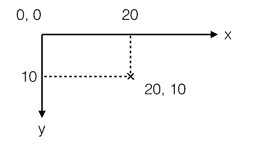
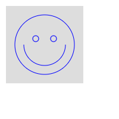

# Canvas

> ✨HTML5新增的组件，它就像一块幕布，可以用JavaScript在上面绘制各种图表、动画等

-   一个`Canvas`元素定义了一个指定尺寸的矩形框，用于绘制

```html
<canvas id="test-canvas" width="300" height="200"></canvas>
```

### canvas.getContext

> `canvas.getContext`方法返回一个画布，同时也可以当作用来测试浏览器是否支持`Canvas`

```javascript
var canvas = document.getElementById('test-canvas');
if (canvas.getContext) {
    console.log('你的浏览器支持Canvas!');
} else {
    console.log('你的浏览器不支持Canvas!');
}

```

-   `canvas.getContext` 传入参数是`2d` ，就是返回一个二维画布,一个`CanvasRenderingContext2D`对象

```javascript
var ctx = canvas.getContext('2d');
```

-   传入`webgl` 就可以绘制3D图形

## 减少重绘和回流的优化方案

-   通过创建一个不可见的Canvas来绘图，然后将最终绘制结果复制到页面的可见Canvas中
-   尽量使用整数坐标而不是浮点数
-   可以创建多个重叠的Canvas绘制不同的层，而不是在一个Canvas中绘制非常复杂的图
-   背景图片如果不变可以直接用 `` 标签并放到最底层

## 颜色、样式和阴影

| 属性                                                                                         | 描述                   |
| ------------------------------------------------------------------------------------------ | -------------------- |
| [fillStyle](https://www.w3school.com.cn/tags/canvas_fillstyle.asp "fillStyle")             | 设置或返回用于填充绘画的颜色、渐变或模式 |
| [strokeStyle](https://www.w3school.com.cn/tags/canvas_strokestyle.asp "strokeStyle")       | 设置或返回用于笔触的颜色、渐变或模式   |
| [shadowColor](https://www.w3school.com.cn/tags/canvas_shadowcolor.asp "shadowColor")       | 设置或返回用于阴影的颜色         |
| [shadowBlur](https://www.w3school.com.cn/tags/canvas_shadowblur.asp "shadowBlur")          | 设置或返回用于阴影的模糊级别       |
| [shadowOffsetX](https://www.w3school.com.cn/tags/canvas_shadowoffsetx.asp "shadowOffsetX") | 设置或返回阴影距形状的水平距离      |
| [shadowOffsetY](https://www.w3school.com.cn/tags/canvas_shadowoffsety.asp "shadowOffsetY") | 设置或返回阴影距形状的垂直距离      |

| 方法                                                                                                                  | 描述                   |
| ------------------------------------------------------------------------------------------------------------------- | -------------------- |
| [createLinearGradient()](https://www.w3school.com.cn/tags/canvas_createlineargradient.asp "createLinearGradient()") | 创建线性渐变（用在画布内容上）      |
| [createPattern()](https://www.w3school.com.cn/tags/canvas_createpattern.asp "createPattern()")                      | 在指定的方向上重复指定的元素       |
| [createRadialGradient()](https://www.w3school.com.cn/tags/canvas_createradialgradient.asp "createRadialGradient()") | 创建放射状/环形的渐变（用在画布内容上） |
| [addColorStop()](https://www.w3school.com.cn/tags/canvas_addcolorstop.asp "addColorStop()")                         | 规定渐变对象中的颜色和停止位置      |

## 线条样式

| 属性                                                                                | 描述                   |
| --------------------------------------------------------------------------------- | -------------------- |
| [lineCap](https://www.w3school.com.cn/tags/canvas_linecap.asp "lineCap")          | 设置或返回线条的结束端点样式       |
| [lineJoin](https://www.w3school.com.cn/tags/canvas_linejoin.asp "lineJoin")       | 设置或返回两条线相交时，所创建的拐角类型 |
| [lineWidth](https://www.w3school.com.cn/tags/canvas_linewidth.asp "lineWidth")    | 设置或返回当前的线条宽度         |
| [miterLimit](https://www.w3school.com.cn/tags/canvas_miterlimit.asp "miterLimit") | 设置或返回最大斜接长度          |

## 矩形

| 方法                                                                                    | 描述             |
| ------------------------------------------------------------------------------------- | -------------- |
| [rect()](https://www.w3school.com.cn/tags/canvas_rect.asp "rect()")                   | 创建矩形           |
| [fillRect()](https://www.w3school.com.cn/tags/canvas_fillrect.asp "fillRect()")       | 绘制“被填充”的矩形     |
| [strokeRect()](https://www.w3school.com.cn/tags/canvas_strokerect.asp "strokeRect()") | 绘制矩形（无填充）      |
| [clearRect()](https://www.w3school.com.cn/tags/canvas_clearrect.asp "clearRect()")    | 在给定的矩形内清除指定的像素 |

## 路径

| 方法                                                                                                      | 描述                                |
| ------------------------------------------------------------------------------------------------------- | --------------------------------- |
| [fill()](https://www.w3school.com.cn/tags/canvas_fill.asp "fill()")                                     | 填充当前绘图（路径）                        |
| [stroke()](https://www.w3school.com.cn/tags/canvas_stroke.asp "stroke()")                               | 绘制已定义的路径                          |
| [beginPath()](https://www.w3school.com.cn/tags/canvas_beginpath.asp "beginPath()")                      | 起始一条路径，或重置当前路径                    |
| [moveTo()](https://www.w3school.com.cn/tags/canvas_moveto.asp "moveTo()")                               | 把路径移动到画布中的指定点，不创建线条               |
| [closePath()](https://www.w3school.com.cn/tags/canvas_closepath.asp "closePath()")                      | 创建从当前点回到起始点的路径                    |
| [lineTo()](https://www.w3school.com.cn/tags/canvas_lineto.asp "lineTo()")                               | 添加一个新点，然后在画布中创建从该点到最后指定点的线条       |
| [clip()](https://www.w3school.com.cn/tags/canvas_clip.asp "clip()")                                     | 从原始画布剪切任意形状和尺寸的区域                 |
| [quadraticCurveTo()](https://www.w3school.com.cn/tags/canvas_quadraticcurveto.asp "quadraticCurveTo()") | 创建二次贝塞尔曲线                         |
| [bezierCurveTo()](https://www.w3school.com.cn/tags/canvas_beziercurveto.asp "bezierCurveTo()")          | 创建三次方贝塞尔曲线                        |
| [arc()](https://www.w3school.com.cn/tags/canvas_arc.asp "arc()")                                        | 创建弧/曲线（用于创建圆形或部分圆）                |
| [arcTo()](https://www.w3school.com.cn/tags/canvas_arcto.asp "arcTo()")                                  | 创建两切线之间的弧/曲线                      |
| [isPointInPath()](https://www.w3school.com.cn/tags/canvas_ispointinpath.asp "isPointInPath()")          | 如果指定的点位于当前路径中，则返回 true，否则返回 false |

## 转换

| 方法                                                                                          | 描述                            |
| ------------------------------------------------------------------------------------------- | ----------------------------- |
| [scale()](https://www.w3school.com.cn/tags/canvas_scale.asp "scale()")                      | 缩放当前绘图至更大或更小                  |
| [rotate()](https://www.w3school.com.cn/tags/canvas_rotate.asp "rotate()")                   | 旋转当前绘图                        |
| [translate()](https://www.w3school.com.cn/tags/canvas_translate.asp "translate()")          | 重新映射画布上的 (0,0) 位置             |
| [transform()](https://www.w3school.com.cn/tags/canvas_transform.asp "transform()")          | 替换绘图的当前转换矩阵                   |
| [setTransform()](https://www.w3school.com.cn/tags/canvas_settransform.asp "setTransform()") | 将当前转换重置为单位矩阵。然后运行 transform() |

## 文本

| 属性                                                                                      | 描述                   |
| --------------------------------------------------------------------------------------- | -------------------- |
| [font](https://www.w3school.com.cn/tags/canvas_font.asp "font")                         | 设置或返回文本内容的当前字体属性     |
| [textAlign](https://www.w3school.com.cn/tags/canvas_textalign.asp "textAlign")          | 设置或返回文本内容的当前对齐方式     |
| [textBaseline](https://www.w3school.com.cn/tags/canvas_textbaseline.asp "textBaseline") | 设置或返回在绘制文本时使用的当前文本基线 |

| 方法                                                                                       | 描述             |
| ---------------------------------------------------------------------------------------- | -------------- |
| [fillText()](https://www.w3school.com.cn/tags/canvas_filltext.asp "fillText()")          | 在画布上绘制“被填充的”文本 |
| [strokeText()](https://www.w3school.com.cn/tags/canvas_stroketext.asp "strokeText()")    | 在画布上绘制文本（无填充）  |
| [measureText()](https://www.w3school.com.cn/tags/canvas_measuretext.asp "measureText()") | 返回包含指定文本宽度的对象  |

## 图像绘制

| 方法                                                                                 | 描述             |
| ---------------------------------------------------------------------------------- | -------------- |
| [drawImage()](https://www.w3school.com.cn/tags/canvas_drawimage.asp "drawImage()") | 向画布上绘制图像、画布或视频 |

## 像素操作

| 属性                                                                              | 描述                              |
| ------------------------------------------------------------------------------- | ------------------------------- |
| [width](https://www.w3school.com.cn/tags/canvas_imagedata_width.asp "width")    | 返回 ImageData 对象的宽度              |
| [height](https://www.w3school.com.cn/tags/canvas_imagedata_height.asp "height") | 返回 ImageData 对象的高度              |
| [data](https://www.w3school.com.cn/tags/canvas_imagedata_data.asp "data")       | 返回一个对象，其包含指定的 ImageData 对象的图像数据 |

| 方法                                                                                                   | 描述                                 |
| ---------------------------------------------------------------------------------------------------- | ---------------------------------- |
| [createImageData()](https://www.w3school.com.cn/tags/canvas_createimagedata.asp "createImageData()") | 创建新的、空白的 ImageData 对象              |
| [getImageData()](https://www.w3school.com.cn/tags/canvas_getimagedata.asp "getImageData()")          | 返回 ImageData 对象，该对象为画布上指定的矩形复制像素数据 |
| [putImageData()](https://www.w3school.com.cn/tags/canvas_putimagedata.asp "putImageData()")          | 把图像数据（从指定的 ImageData 对象）放回画布上      |

## 合成

| 属性                                                                                                                          | 描述                    |
| --------------------------------------------------------------------------------------------------------------------------- | --------------------- |
| [globalAlpha](https://www.w3school.com.cn/tags/canvas_globalalpha.asp "globalAlpha")                                        | 设置或返回绘图的当前 alpha 或透明值 |
| [globalCompositeOperation](https://www.w3school.com.cn/tags/canvas_globalcompositeoperation.asp "globalCompositeOperation") | 设置或返回新图像如何绘制到已有的图像上   |

## 其他

| 方法            | 描述              |
| ------------- | --------------- |
| save()        | 保存当前环境的状态       |
| restore()     | 返回之前保存过的路径状态和属性 |
| createEvent() |                 |
| getContext()  | 创建 context 对象   |
| toDataURL()   |                 |

## 绘制形状

> Canvas的坐标系统以左上角为原点，水平向右为X轴，垂直向下为Y轴，以像素为单位



```javascript
ctx.clearRect(0, 0, 200, 200); // 擦除(0,0)位置大小为200x200的矩形，擦除的意思是把该区域变为透明
ctx.fillStyle = '#dddddd'; // 设置颜色
ctx.fillRect(10, 10, 130, 130); // 把(10,10)位置大小为130x130的矩形涂色
// 利用Path绘制复杂路径:
var path=new Path2D();
path.arc(75, 75, 50, 0, Math.PI*2, true);
path.moveTo(110,75);
path.arc(75, 75, 35, 0, Math.PI, false);
path.moveTo(65, 65);
path.arc(60, 65, 5, 0, Math.PI*2, true);
path.moveTo(95, 65);
path.arc(90, 65, 5, 0, Math.PI*2, true);
ctx.strokeStyle = '#0000ff';
ctx.stroke(path);
```



## 绘制文本

> 绘制文本就是在指定的位置输出文本，可以设置文本的字体、样式、阴影等，与CSS完全一致

```javascript
ctx.clearRect(0, 0, canvas.width, canvas.height);
ctx.shadowOffsetX = 2;
ctx.shadowOffsetY = 2;
ctx.shadowBlur = 2;
ctx.shadowColor = '#666666';
ctx.font = '24px Arial';
ctx.fillStyle = '#333333';
ctx.fillText('带阴影的文字', 20, 40);
```


