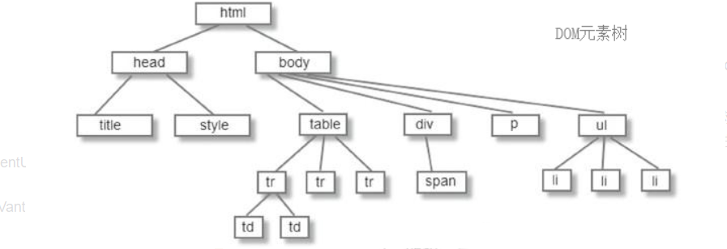
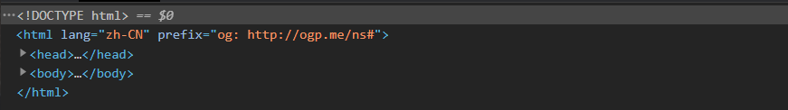

# DOM

> ✨Document Object Model文档对象模型，DOM 是 JavaScript 操作网页的接口，作用是将网页转为一个 JavaScript 对象，从而可以用脚本进行各种操作

> DOM会结构化文档（比如 HTML 和 XML）解析成一系列的节点，再由这些节点组成一个树状结构（DOM Tree）

## 节点

> DOM的最小单位是节点

节点有七种类型

-   `Document`：整个文档树的顶层节点
-   `DocumentType`：`doctype`标签（比如`<!DOCTYPE html>`）
-   `Element`：网页的各种HTML标签（比如`<body>`、`<a>`等）
-   `Attr`：网页元素的属性（比如`class="right"`）
-   `Text`：标签之间或标签包含的文本
-   `Comment`：注释
-   `DocumentFragment`：文档的片段

> 浏览器提供一个原生的节点对象`Node`，上面这七种节点都继承了`Node`，因此具有一些共同的属性和方法。

## DOM节点树

> `Document`的第一层有两个节点，第一个是文档类型节点`<!doctype html>`，第二个是 HTML 网页的顶层容器标签 `<html>`，后者构成了树结构的根节点`root node`，其他 HTML 标签节点都是它的下级节点。

## Document 节点

[Document](../Document/Document.md "Document")

## HTMLCollection和NodeList区别

### 共同点

-   `HTMLCollection`就是`NodeList` 的一个子类
-   因此`HTMLCollection`有`NodeList` 的属性和方法

### 不同点

-   `NodeList` 可以包含任何节点类型，`HTMLCollection`只包含元素（element）节点，也就是HTML标签
-   `HTMLCollection`比`NodeList`多一项方法：`namedItem`，可根据`name`或者`id`索引元素
