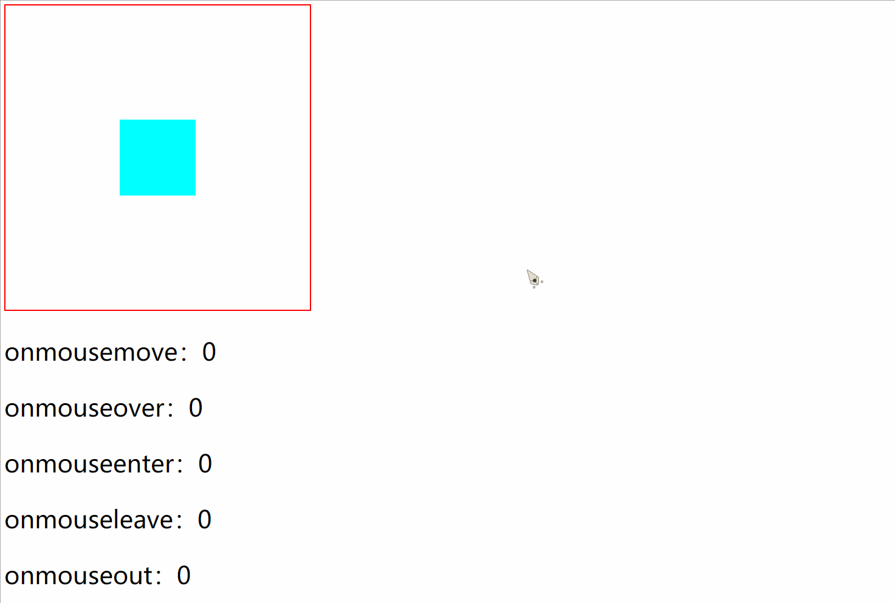

# DOM事件

## 目录

| **鼠标事件**                                                                                              |                                                                                   |
| ----------------------------------------------------------------------------------------------------- | --------------------------------------------------------------------------------- |
| [onclick](https://www.runoob.com/jsref/event-onclick.html "onclick")                                  | 当用户点击某个对象时调用的事件句柄。                                                                |
| [oncontextmenu](https://www.runoob.com/jsref/event-oncontextmenu.html "oncontextmenu")                | 在用户点击鼠标右键打开上下文菜单时触发                                                               |
| [ondblclick](https://www.runoob.com/jsref/event-ondblclick.html "ondblclick")                         | 当用户双击某个对象时调用的事件句柄。                                                                |
| [onmousedown](https://www.runoob.com/jsref/event-onmousedown.html "onmousedown")                      | 鼠标按钮被按下。                                                                          |
| [onmouseenter](https://www.runoob.com/jsref/event-onmouseenter.html "onmouseenter")                   | 当鼠标指针移动到元素上时触发。                                                                   |
| [onmouseleave](https://www.runoob.com/jsref/event-onmouseleave.html "onmouseleave")                   | 当鼠标指针移出元素时触发                                                                      |
| [onmousemove](https://www.runoob.com/jsref/event-onmousemove.html "onmousemove")                      | 鼠标被移动。                                                                            |
| [onmouseover](https://www.runoob.com/jsref/event-onmouseover.html "onmouseover")                      | 鼠标移到某元素之上。                                                                        |
| [onmouseout](https://www.runoob.com/jsref/event-onmouseout.html "onmouseout")                         | 鼠标从某元素移开。                                                                         |
| [onmouseup](https://www.runoob.com/jsref/event-onmouseup.html "onmouseup")                            | 鼠标按键被松开。                                                                          |
| **键盘事件**                                                                                              |                                                                                   |
| [onkeydown](https://www.runoob.com/jsref/event-onkeydown.html "onkeydown")                            | 某个键盘按键被按下。                                                                        |
| [onkeypress](https://www.runoob.com/jsref/event-onkeypress.html "onkeypress")                         | 某个键盘按键被按下并松开。                                                                     |
| [onkeyup](https://www.runoob.com/jsref/event-onkeyup.html "onkeyup")                                  | 某个键盘按键被松开。                                                                        |
| **（Frame/Object）事件**                                                                                  |                                                                                   |
| [onabort](https://www.runoob.com/jsref/event-onabort.html "onabort")                                  | 图像的加载被中断。 ( \<object>)                                                            |
| [onbeforeunload](https://www.runoob.com/jsref/event-onbeforeunload.html "onbeforeunload")             | 该事件在即将离开页面（刷新或关闭）时触发                                                              |
| [onerror](https://www.runoob.com/jsref/event-onerror.html "onerror")                                  | 在加载文档或图像时发生错误。 ( \<object>, \<body>和 \<frameset>)                                 |
| [onhashchange](https://www.runoob.com/jsref/event-onhashchange.html "onhashchange")                   | 该事件在当前 URL 的锚部分发生修改时触发。                                                           |
| [onload](https://www.runoob.com/jsref/event-onload.html "onload")                                     | 一张页面或一幅图像完成加载。                                                                    |
| [onpageshow](https://www.runoob.com/jsref/event-onpageshow.html "onpageshow")                         | 该事件在用户访问页面时触发                                                                     |
| [onpagehide](https://www.runoob.com/jsref/event-onpagehide.html "onpagehide")                         | 该事件在用户离开当前网页跳转到另外一个页面时触发                                                          |
| [onresize](https://www.runoob.com/jsref/event-onresize.html "onresize")                               | 窗口或框架被重新调整大小。                                                                     |
| [onscroll](https://www.runoob.com/jsref/event-onscroll.html "onscroll")                               | 当文档被滚动时发生的事件。                                                                     |
| [onunload](https://www.runoob.com/jsref/event-onunload.html "onunload")                               | 用户退出页面。 ( \<body> 和 \<frameset>)                                                  |
| **表单事件**                                                                                              |                                                                                   |
| [onblur](https://www.runoob.com/jsref/event-onblur.html "onblur")                                     | 元素失去焦点时触发                                                                         |
| [onchange](https://www.runoob.com/jsref/event-onchange.html "onchange")                               | 该事件在表单元素的内容改变时触发( \<input>, \<keygen>, \<select>, 和 \<textarea>)                  |
| [onfocus](https://www.runoob.com/jsref/event-onfocus.html "onfocus")                                  | 元素获取焦点时触发                                                                         |
| [onfocusin](https://www.runoob.com/jsref/event-onfocusin.html "onfocusin")                            | 元素即将获取焦点时触发                                                                       |
| [onfocusout](https://www.runoob.com/jsref/event-onfocusout.html "onfocusout")                         | 元素即将失去焦点时触发                                                                       |
| [oninput](https://www.runoob.com/jsref/event-oninput.html "oninput")                                  | 元素获取用户输入时触发                                                                       |
| [onreset](https://www.runoob.com/jsref/event-onreset.html "onreset")                                  | 表单重置时触发                                                                           |
| [onsearch](https://www.runoob.com/jsref/event-onsearch.html "onsearch")                               | 用户向搜索域输入文本时触发 ( \<input="search">)                                                |
| [onselect](https://www.runoob.com/jsref/event-onselect.html "onselect")                               | 用户选取文本时触发 ( \<input> 和 \<textarea>)                                               |
| [onsubmit](https://www.runoob.com/jsref/event-onsubmit.html "onsubmit")                               | 表单提交时触发                                                                           |
| **剪贴板事件**                                                                                             |                                                                                   |
| [oncopy](https://www.runoob.com/jsref/event-oncopy.html "oncopy")                                     | 该事件在用户拷贝元素内容时触发                                                                   |
| [oncut](https://www.runoob.com/jsref/event-oncut.html "oncut")                                        | 该事件在用户剪切元素内容时触发                                                                   |
| [onpaste](https://www.runoob.com/jsref/event-onpaste.html "onpaste")                                  | 该事件在用户粘贴元素内容时触发                                                                   |
| **打印事件**                                                                                              |                                                                                   |
| [onafterprint](https://www.runoob.com/jsref/event-onafterprint.html "onafterprint")                   | 该事件在页面已经开始打印，或者打印窗口已经关闭时触发                                                        |
| [onbeforeprint](https://www.runoob.com/jsref/event-onbeforeprint.html "onbeforeprint")                | 该事件在页面即将开始打印时触发                                                                   |
| **拖动事件**                                                                                              |                                                                                   |
| [ondrag](https://www.runoob.com/jsref/event-ondrag.html "ondrag")                                     | 该事件在元素正在拖动时触发                                                                     |
| [ondragend](https://www.runoob.com/jsref/event-ondragend.html "ondragend")                            | 该事件在用户完成元素的拖动时触发                                                                  |
| [ondragenter](https://www.runoob.com/jsref/event-ondragenter.html "ondragenter")                      | 该事件在拖动的元素进入放置目标时触发                                                                |
| [ondragleave](https://www.runoob.com/jsref/event-ondragleave.html "ondragleave")                      | 该事件在拖动元素离开放置目标时触发                                                                 |
| [ondragover](https://www.runoob.com/jsref/event-ondragover.html "ondragover")                         | 该事件在拖动元素在放置目标上时触发                                                                 |
| [ondragstart](https://www.runoob.com/jsref/event-ondragstart.html "ondragstart")                      | 该事件在用户开始拖动元素时触发                                                                   |
| [ondrop](https://www.runoob.com/jsref/event-ondrop.html "ondrop")                                     | 该事件在拖动元素放置在目标区域时触发                                                                |
| **多媒体（Media）事件**                                                                                      |                                                                                   |
| [onabort](https://www.runoob.com/jsref/event-onabort-media.html "onabort")                            | 事件在视频/音频（audio/video）终止加载时触发。                                                     |
| [oncanplay](https://www.runoob.com/jsref/event-oncanplay.html "oncanplay")                            | 事件在用户可以开始播放视频/音频（audio/video）时触发。                                                 |
| [oncanplaythrough](https://www.runoob.com/jsref/event-oncanplaythrough.html "oncanplaythrough")       | 事件在视频/音频（audio/video）可以正常播放且无需停顿和缓冲时触发。                                           |
| [ondurationchange](https://www.runoob.com/jsref/event-ondurationchange.html "ondurationchange")       | 事件在视频/音频（audio/video）的时长发生变化时触发。                                                  |
| onemptied                                                                                             | 当期播放列表为空时触发                                                                       |
| [onended](https://www.runoob.com/jsref/event-onended.html "onended")                                  | 事件在视频/音频（audio/video）播放结束时触发。                                                     |
| [onerror](https://www.runoob.com/jsref/event-onerror-media.html "onerror")                            | 事件在视频/音频（audio/video）数据加载期间发生错误时触发。                                               |
| [onloadeddata](https://www.runoob.com/jsref/event-onloadeddata.html "onloadeddata")                   | 事件在浏览器加载视频/音频（audio/video）当前帧时触发触发。                                               |
| [onloadedmetadata](https://www.runoob.com/jsref/event-onloadedmetadata.html "onloadedmetadata")       | 事件在指定视频/音频（audio/video）的元数据加载后触发。                                                 |
| [onloadstart](https://www.runoob.com/jsref/event-onloadstart.html "onloadstart")                      | 事件在浏览器开始寻找指定视频/音频（audio/video）触发。                                                 |
| [onpause](https://www.runoob.com/jsref/event-onpause.html "onpause")                                  | 事件在视频/音频（audio/video）暂停时触发。                                                       |
| [onplay](https://www.runoob.com/jsref/event-onplay.html "onplay")                                     | 事件在视频/音频（audio/video）开始播放时触发。                                                     |
| [onplaying](https://www.runoob.com/jsref/event-onplaying.html "onplaying")                            | 事件在视频/音频（audio/video）暂停或者在缓冲后准备重新开始播放时触发。                                         |
| [onprogress](https://www.runoob.com/jsref/event-onprogress.html "onprogress")                         | 事件在浏览器下载指定的视频/音频（audio/video）时触发。                                                 |
| [onratechange](https://www.runoob.com/jsref/event-onratechange.html "onratechange")                   | 事件在视频/音频（audio/video）的播放速度发送改变时触发。                                                |
| [onseeked](https://www.runoob.com/jsref/event-onseeked.html "onseeked")                               | 事件在用户重新定位视频/音频（audio/video）的播放位置后触发。                                              |
| [onseeking](https://www.runoob.com/jsref/event-onseeking.html "onseeking")                            | 事件在用户开始重新定位视频/音频（audio/video）时触发。                                                 |
| [onstalled](https://www.runoob.com/jsref/event-onstalled.html "onstalled")                            | 事件在浏览器获取媒体数据，但媒体数据不可用时触发。                                                         |
| [onsuspend](https://www.runoob.com/jsref/event-onsuspend.html "onsuspend")                            | 事件在浏览器读取媒体数据中止时触发。                                                                |
| [ontimeupdate](https://www.runoob.com/jsref/event-ontimeupdate.html "ontimeupdate")                   | 事件在当前的播放位置发送改变时触发。                                                                |
| [onvolumechange](https://www.runoob.com/jsref/event-onvolumechange.html "onvolumechange")             | 事件在音量发生改变时触发。                                                                     |
| [onwaiting](https://www.runoob.com/jsref/event-onwaiting.html "onwaiting")                            | 事件在视频由于要播放下一帧而需要缓冲时触发。                                                            |
| **动画事件**                                                                                              |                                                                                   |
| [animationend](https://www.runoob.com/jsref/event-animationend.html "animationend")                   | 该事件在 CSS 动画结束播放时触发                                                                |
| [animationiteration](https://www.runoob.com/jsref/event-animationiteration.html "animationiteration") | 该事件在 CSS 动画重复播放时触发                                                                |
| [animationstart](https://www.runoob.com/jsref/event-animationstart.html "animationstart")             | 该事件在 CSS 动画开始播放时触发                                                                |
| **过渡事件**                                                                                              |                                                                                   |
| [transitionend](https://www.runoob.com/jsref/event-transitionend.html "transitionend")                | 该事件在 CSS 完成过渡后触发。                                                                 |
| **其他事件**                                                                                              |                                                                                   |
| onmessage                                                                                             | 该事件通过或者从对象(WebSocket, Web Worker, Event Source 或者子 frame 或父窗口)接收到消息时触发            |
| onmousewheel                                                                                          | 已废弃。 使用 [onwheel](https://www.runoob.com/jsref/event-onwheel.html "onwheel") 事件替代 |
| [ononline](https://www.runoob.com/jsref/event-ononline.html "ononline")                               | 该事件在浏览器开始在线工作时触发。                                                                 |
| [onoffline](https://www.runoob.com/jsref/event-onoffline.html "onoffline")                            | 该事件在浏览器开始离线工作时触发。                                                                 |
| onpopstate                                                                                            | 该事件在窗口的浏览历史（history 对象）发生改变时触发。                                                   |
| [onshow](https://www.runoob.com/jsref/event-onshow.html "onshow")                                     | 该事件当 \<menu> 元素在上下文菜单显示时触发                                                        |
| onstorage                                                                                             | 该事件在 Web Storage(HTML 5 Web 存储)更新时触发                                              |
| [ontoggle](https://www.runoob.com/jsref/event-ontoggle.html "ontoggle")                               | 该事件在用户打开或关闭 \<details> 元素时触发                                                      |
| [onwheel](https://www.runoob.com/jsref/event-onwheel.html "onwheel")                                  | 该事件在鼠标滚轮在元素上下滚动时触发                                                                |
| 动画事件                                                                                                  |                                                                                   |
| CAPTURING-PHASE                                                                                       | 当前事件阶段为捕获阶段(1)                                                                    |
| AT-TARGET                                                                                             | 当前事件是目标阶段,在评估目标事件(1)                                                              |
| BUBBLING-PHASE                                                                                        | 当前的事件为冒泡阶段 (3)                                                                    |
| **事件对象 （常量）**                                                                                         |                                                                                   |
| CAPTURING-PHASE                                                                                       | 当前事件阶段为捕获阶段(1)                                                                    |
| AT-TARGET                                                                                             | 当前事件是目标阶段,在评估目标事件(1)                                                              |
| BUBBLING-PHASE                                                                                        | 当前的事件为冒泡阶段 (3)                                                                    |
| **事件对象 （属性）**                                                                                         |                                                                                   |
| [bubbles](https://www.runoob.com/jsref/event-bubbles.html "bubbles")                                  | 返回布尔值，指示事件是否是起泡事件类型。                                                              |
| [cancelable](https://www.runoob.com/jsref/event-cancelable.html "cancelable")                         | 返回布尔值，指示事件是否可拥可取消的默认动作。                                                           |
| [currentTarget](https://www.runoob.com/jsref/event-currenttarget.html "currentTarget")                | 返回其事件监听器触发该事件的元素。                                                                 |
| eventPhase                                                                                            | 返回事件传播的当前阶段。                                                                      |
| [target](https://www.runoob.com/jsref/event-target.html "target")                                     | 返回触发此事件的元素（事件的目标节点）。                                                              |
| [timeStamp](https://www.runoob.com/jsref/event-timestamp.html "timeStamp")                            | 返回事件生成的日期和时间。                                                                     |
| [type](https://www.runoob.com/jsref/event-type.html "type")                                           | 返回当前 Event 对象表示的事件的名称。                                                            |
| **事件对象 （方法）**                                                                                         |                                                                                   |
| initEvent()                                                                                           | 初始化新创建的 Event 对象的属性。                                                              |
| preventDefault()                                                                                      | 通知浏览器不要执行与事件关联的默认动作。                                                              |
| stopPropagation()                                                                                     | 不再派发事件。                                                                           |
| **目标事件对象 （方法）**                                                                                       |                                                                                   |
| addEventListener()                                                                                    | 允许在目标事件中注册监听事件(IE8 = attachEvent())                                               |
| dispatchEvent()                                                                                       | 允许发送事件到监听器上 (IE8 = fireEvent())                                                   |
| removeEventListener()                                                                                 | 运行一次注册在事件目标上的监听事件(IE8 = detachEvent())                                            |
| **事件监听对象（方法）**                                                                                        |                                                                                   |
| handleEvent()                                                                                         | 把任意对象注册为事件处理程序                                                                    |
| **文档事件对象（方法）**                                                                                        |                                                                                   |
| createEvent()                                                                                         |                                                                                   |
| **鼠标/键盘事件对象（属性）**                                                                                     |                                                                                   |
| [altKey](https://www.runoob.com/jsref/event-altkey.html "altKey")                                     | 返回当事件被触发时，"ALT" 是否被按下。                                                            |
| [button](https://www.runoob.com/jsref/event-button.html "button")                                     | 返回当事件被触发时，哪个鼠标按钮被点击。                                                              |
| [clientX](https://www.runoob.com/jsref/event-clientx.html "clientX")                                  | 返回当事件被触发时，鼠标指针的水平坐标。                                                              |
| [clientY](https://www.runoob.com/jsref/event-clienty.html "clientY")                                  | 返回当事件被触发时，鼠标指针的垂直坐标。                                                              |
| [ctrlKey](https://www.runoob.com/jsref/event-ctrlkey.html "ctrlKey")                                  | 返回当事件被触发时，"CTRL" 键是否被按下。                                                          |
| [Location](https://www.runoob.com/jsref/event-key-location.html "Location")                           | 返回按键在设备上的位置                                                                       |
| [charCode](https://www.runoob.com/jsref/event-key-charcode.html "charCode")                           | 返回onkeypress事件触发键值的字母代码。                                                          |
| [key](https://www.runoob.com/jsref/event-key-key.html "key")                                          | 在按下按键时返回按键的标识符。                                                                   |
| [keyCode](https://www.runoob.com/jsref/event-key-keycode.html "keyCode")                              | 返回onkeypress事件触发的键的值的字符代码，或者 onkeydown 或 onkeyup 事件的键的代码。                         |
| [which](https://www.runoob.com/jsref/event-key-which.html "which")                                    | 返回onkeypress事件触发的键的值的字符代码，或者 onkeydown 或 onkeyup 事件的键的代码。                         |
| [metaKey](https://www.runoob.com/jsref/event-metakey.html "metaKey")                                  | 返回当事件被触发时，"meta" 键是否被按下。                                                          |
| [relatedTarget](https://www.runoob.com/jsref/event-relatedtarget.html "relatedTarget")                | 返回与事件的目标节点相关的节点。                                                                  |
| [screenX](https://www.runoob.com/jsref/event-screenx.html "screenX")                                  | 返回当某个事件被触发时，鼠标指针的水平坐标。                                                            |
| [screenY](https://www.runoob.com/jsref/event-screeny.html "screenY")                                  | 返回当某个事件被触发时，鼠标指针的垂直坐标。                                                            |
| [shiftKey](https://www.runoob.com/jsref/event-shiftkey.html "shiftKey")                               | 返回当事件被触发时，"SHIFT" 键是否被按下。                                                         |
| **鼠标/键盘事件对象（方法）**                                                                                     |                                                                                   |
| initMouseEvent()                                                                                      | 初始化鼠标事件对象的值                                                                       |
| initKeyboardEvent()                                                                                   | 初始化键盘事件对象的值                                                                       |

## 鼠标事件区别

-   `onmouseenter` 从 外部 进入 父 元素
-   `onmouseleave` 离开 父 元素进入 外部&#x20;
-   `onmouseover` 从 外部 进入 父 元素，从 父 元素进入 子 元素，从 子 元素进入 父 元素
-   `onmouseout` 离开 父 元素进入 外部 ，离开 父 元素进入 子 元素，离开 子 元素进入 父 元素
-   `onmousemove` 在元素区域内移动鼠标（包括子元素区域）

> 总的来说，当鼠标从外部进入元素再出去到外部，`onmouseenter` 和`onmouseleave` 事件执行的次数是一样的，`onmouseover` 和`onmouseout` 事件执行次数是一样的

### 案例

```html
<!DOCTYPE html>
<html lang="en">
<head>
    <meta charset="UTF-8">
    <title>test</title>
    <style>
        .name1 {
            width: 200px;
            height: 200px;
            border:1px solid red;
        }
    </style>
    <script>
        function moveNum(){
            let node = document.getElementById('p1');
            node.setAttribute('number',node.getAttribute('number')-'0'+1)
            node.innerText = 'onmousemove：'+node.getAttribute('number');
        }
        function overNum(){
            let node = document.getElementById('p2');
            node.setAttribute('number',node.getAttribute('number')-'0'+1)
            node.innerText = 'onmouseover：'+node.getAttribute('number');
        }
        function enterNum(){
            let node = document.getElementById('p3');
            node.setAttribute('number',node.getAttribute('number')-'0'+1)
            node.innerText = 'onmouseenter：'+node.getAttribute('number');
        }
        function leaveNum(){
            let node = document.getElementById('p4');
            node.setAttribute('number',node.getAttribute('number')-'0'+1)
            node.innerText = 'onmouseleave：'+node.getAttribute('number');
        }
        function outNum(){
            let node = document.getElementById('p5');
            node.setAttribute('number',node.getAttribute('number')-'0'+1)
            node.innerText = 'onmouseout：'+node.getAttribute('number');
        }
    </script>
</head>
<body>
<div id="num" class="name1" onmouseover="overNum()" onmousemove="moveNum()" onmouseenter="enterNum()" onmouseleave="leaveNum()" onmouseout="outNum()">
    <div style="width: 50px;height: 50px;margin-left: 75px;margin-top:75px;background-color: aqua; "></div>
</div>
<p id="p1" >onmousemove：0</p>
<p id="p2" >onmouseover：0</p>
<p id="p3" >onmouseenter：0</p>
<p id="p4" >onmouseleave：0</p>
<p id="p5" >onmouseout：0</p>
</body>
</html>
```


