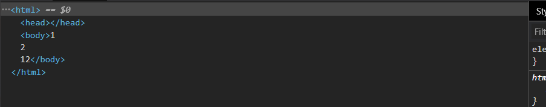
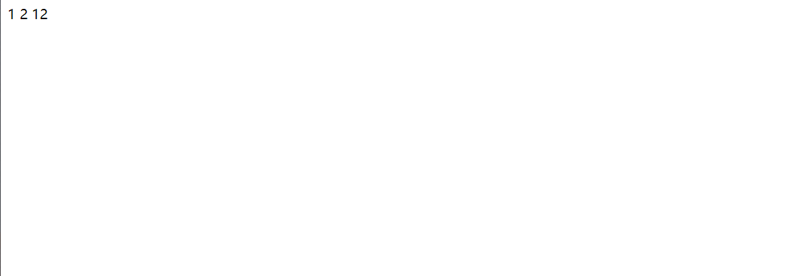

# Document

> ✨`document`节点对象代表整个文档，每个网页都有自己的`document`对象

## 导航

| 属性/方法                                                                                          | 描述                                                                                                                             |
| ---------------------------------------------------------------------------------------------- | ------------------------------------------------------------------------------------------------------------------------------ |
| [**快捷方式属性**](https://www.wolai.com/bLwzkazzjw9i8E94VvSgx5#49FYMU22XCJy9VyYQLpwE1 "快捷方式属性")     |                                                                                                                                |
| **document.defaultView**                                                                       | 返回`document`对象所属的`window`对象                                                                                                    |
| **document.doctype**                                                                           | 指向 `<DOCTYPE>` 节点，一般为 `<!DOCTYPE html>`                                                                                        |
| **document.documentElement**                                                                   | 指向根结点，一般为 `<html>`                                                                                                             |
| **document.body**                                                                              | 指向 `<body>` 节点                                                                                                                 |
| **document.head**                                                                              | 指向 `<head>` 节点                                                                                                                 |
| **document.scrollingElement**                                                                  | 返回文档的滚动元素                                                                                                                      |
| **document.activeElement**                                                                     | 返回当前焦点`focus`的元素                                                                                                               |
| **document.fullscreenElement**                                                                 | 返回当前以全屏状态展示的 DOM 元素                                                                                                            |
| [**节点集合属性**](https://www.wolai.com/bLwzkazzjw9i8E94VvSgx5#hmE5xLFWQfLa2WebEWqcv1 "节点集合属性")     |                                                                                                                                |
| **document.links**                                                                             | 返回当前\*\*`document`\*\* 所有设定了`href`属性的 `<a>` 及 `<area>` 节点                                                                      |
| **document.forms**                                                                             | 返回所有`<form>`表单节点                                                                                                               |
| **document.images**                                                                            | 返回页面所有 `` 图片节点                                                                                                            |
| **document.embeds**                                                                            | 返回所有`<embed>`节点，通过返回一个`nodeList`                                                                                               |
| **document.plugins**                                                                           | 返回所有`<embed>`节点，通过返回一个`HTMLCollection` 对象                                                                                      |
| **document.scripts**                                                                           | 返回所有`<script>`节点                                                                                                               |
| **document.styleSheets**                                                                       | 返回网页内嵌或引入的 `CSS`样式表集合                                                                                                          |
| [**文档静态信息属性**](https://www.wolai.com/bLwzkazzjw9i8E94VvSgx5#xaLSVpHbvYKhnbL8TMXxBL "文档静态信息属性") |                                                                                                                                |
| **document.documentURI**                                                                       | 以字符串形式返回当前`document`的网址，可用于所有文档                                                                                                |
| **document.URL**                                                                               | 以字符串形式返回当前`document`的网址，只能用于`HTML`文档                                                                                           |
| **document.domain**                                                                            | 返回当前`document`的域名，不包含协议和端口                                                                                                     |
| **document.location**                                                                          | 提供URL的信息和操作方法，与[**window.location**](https://www.wolai.com/jyVDQnwn4zN2m8A1Y2fd7D#vmEUXpSNZTcv4uh7iKxrcx "window.location") 一致 |
| **document.lastModified**                                                                      | 返回当前文档最后修改时间                                                                                                                   |
| **document.title**                                                                             | 返回当前\*\*`document`\*\*的标题                                                                                                      |
| **document.characterSet**                                                                      | 返回当前\*\*`document`\*\*的编码                                                                                                      |
| **document.referrer**                                                                          | 返回`Referer`字段信息                                                                                                                |
| **document.dir**                                                                               | 返回文字方向                                                                                                                         |
| **document.compatMode**                                                                        | 返回浏览器处理文档的模式                                                                                                                   |
| [**文档状态属性**](https://www.wolai.com/bLwzkazzjw9i8E94VvSgx5#9VrQe8YimkT3zCveXAWaMu "文档状态属性")     |                                                                                                                                |
| **document.hidden**                                                                            | 返回一个布尔值，表示当前页面是否隐藏不可见                                                                                                          |
| **document.visibilityState**                                                                   | 返回\*\*`document`\*\*的可见状态                                                                                                      |
| **document.readyState**                                                                        | 返回当前\*\*`document`\*\*的加载状态                                                                                                    |
| **document.cookie**                                                                            | 获取浏览器 `Cookie`                                                                                                                 |
| **document.designMode**                                                                        | 返回控制当前`document`是否可编辑                                                                                                          |
| **document.currentScript**                                                                     | 返回当前脚本所在的哪个 DOM 节点                                                                                                             |
| **document.implementation**                                                                    | 返回一个`DOMImplementation`对象，用于创建新的 `Document` 对象                                                                                 |
| [**方法**](https://www.wolai.com/bLwzkazzjw9i8E94VvSgx5#psXZpUqv3ByMNuu9V4EXZx "方法")             |                                                                                                                                |
| **document.open()**                                                                            | 打开一个`document`输出流                                                                                                              |
| **document.write()**                                                                           | 向当前`document`输出流写入内容                                                                                                           |
| **document.writeln()**                                                                         | 向当前`document`输出流写入内容，并在末尾添加换行                                                                                                  |
| document.close()                                                                               | 关闭`close`打开的输出流                                                                                                                |
| **document.querySelector()**                                                                   | 以 CSS 选择器作为参数，返回第一个匹配的元素节点                                                                                                     |
| **document.querySelectorAll()**                                                                | 以 CSS 选择器作为参数，返回全部匹配的元素节点                                                                                                      |
| **document.getElementsByTagName()**                                                            | 以 HTML 标签名为参数，返回符合条件的元素的数组对象                                                                                                   |
| **document.getElementsByClassName()**                                                          | 以`class`名为参数，返回符合条件的元素的数组对象                                                                                                    |
| **document.getElementsByName()**                                                               | 以`name`属性为参数，返回符合条件的元素的数组对象                                                                                                    |
| **document.getElementById()**                                                                  | 以`id`属性为参数，返回符合条件的元素节点                                                                                                         |
| **document.elementFromPoint()**                                                                | 返回位于页面指定位置最上层的元素节点                                                                                                             |
| **document.elementsFromPoint()**                                                               | 返回位于页面指定位置的所有元素节点                                                                                                              |
| **document.createElement()**                                                                   | 创建一个元素节点                                                                                                                       |
| **document.createTextNode()**                                                                  | 创建一个文本节点                                                                                                                       |
| **document.createAttribute()**                                                                 | 创建一个属性节点                                                                                                                       |
| **document.createComment()**                                                                   | 创建一个注释节点                                                                                                                       |
| **document.createDocumentFragment()**                                                          | 创建一个存在于内存的空 `document`对象                                                                                                       |
| **document.createEvent()**                                                                     | 创建一个事件对象                                                                                                                       |
| **document.addEventListener()**                                                                | 添加事件监听函数                                                                                                                       |
| **document.removeEventListener()**                                                             | 移除事件监听函数                                                                                                                       |
| **document.dispatchEvent()**                                                                   | 触发事件                                                                                                                           |
| **document.hasFocus()**                                                                        | 返回一个布尔值，表示当前文档之中是否有元素被激活或获得焦点                                                                                                  |
| **document.adoptNode()**                                                                       | 将某个节点及其子节点，从原来所在的`document`或`DocumentFragment`里面 移除                                                                            |
| **document.importNode()**                                                                      | 从原来所在的`document`或`DocumentFragment`里面， 拷贝 某个节点及其子节点                                                                            |
| **document.createNodeIterator()**                                                              | 返回一个子节点遍历器                                                                                                                     |
| **document.createTreeWalker()**                                                                | 返回一个 DOM 的子树遍历器                                                                                                                |
| **document.execCommand()**                                                                     | 运行命令来操纵可编辑内容区域的元素                                                                                                              |
| **document.queryCommandSupported()**                                                           | 返回一个布尔值，表示浏览器是否支持`document.execCommand()`的某个命令                                                                                 |
| **document.queryCommandEnabled()**                                                             | 返回一个布尔值，表示当前是否可执行`document.execCommand()`的某个命令                                                                                 |
| **document.getSelection()**                                                                    | 返回一个`Selection`对象，表示用户选择的文本范围或光标的当前位置                                                                                          |

## 获取document

| 正常的网页           | 直接使用`document`或`window.document`     |
| --------------- | ------------------------------------ |
| `iframe`框架里面的网页 | 使用`iframe`节点的`contentDocument`属性     |
| `Ajax `操作返回的文档  | 使用`XMLHttpRequest`对象的`responseXML`属性 |
| 内部节点            | `ownerDocument`属性。                   |

## 属性

### 快捷方式属性

> 指向\*\*`document`\*\*内部的某个节点的快捷方式

***

#### **document.defaultView**

> 返回`document`对象所属的`window`对象，如果当前文档不属于`window`对象，该属性返回`null`，（只读）

```javascript
document.defaultView === window // true
```

#### **document.doctype**

> 指向 `<DOCTYPE>` 节点，一般为 `<!DOCTYPE html>` ，通常也是`document`的第一个子节点，（只读）

```javascript
var doctype = document.doctype;
doctype // "<!DOCTYPE html>"
doctype.name // "html"
```

#### **document.documentElement**

> 指向根结点，一般为 `<html>`，通常是`document`的第二个子节点，（只读)


#### **document.body**

> 指向 `<body>` 节点，如果把这个值置空，等于清除页面元素

```javascript
var nullBody= document.createElement("body");
document.body = nullBody;
```


#### **document.head**&#x20;

> 指向 `<head>` 节点，如果把内容置空，则清除页面样式

```javascript
document.head.innerText = '';
```


#### **document.scrollingElement**&#x20;

> 返回文档的滚动元素，也就是说哪个元素在滚动

-   标准模式下，这个属性返回的文档的根元素`document.documentElement`，即`<html>`
-   兼容（quirk）模式下，返回的是`<body>`元素
-   如果该元素不存在，返回`null`
-   对滚动元素使用`scrollTop`，可设置滚到位置

```javascript
document.scrollingElement.scrollTop = 0; //0为滚动到头部
```


#### **document.activeElement**

> 返回当前焦点`focus`的元素，如果当前没有焦点则返回 `<body>` 元素或 `null`


#### **document.fullscreenElement**

> 返回当前以全屏状态展示的 DOM 元素。如果不是全屏状态，该属性返回`null`


### 节点集合属性

> `HTMLCollection` 是一个接口，表示文档内部特定元素的集合，这些集合都是动态的，原节点有任何变化，立刻会反映在集合中

#### **document.links**

> 返回当前\*\*`document`\*\* 所有设定了`href`属性的 `<a>` 及 `<area>` 节点，简单来说，获取所有链接元素

```javascript
var links = document.links;
console.log(links);

```


#### **document.forms**

> 返回所有`<form>`表单节点

```javascript
console.log(document.forms);

```


#### **document.images**

> 返回页面所有 `` 图片节点


#### **document.embeds**

> 返回所有`<embed>`节点，通过返回一个`nodeList`

#### **document.plugins**

> 返回所有`<embed>`节点，通过返回一个`HTMLCollection` 对象

#### **document.scripts**

> 返回所有`<script>`节点


#### **document.styleSheets**

> 返回网页内嵌或引入的 `CSS`样式表集合，返回`StyleSheetList`实例

### 文档静态信息属性

> 返回`document` 的信息

#### **document.documentURI**

> 以字符串形式返回当前`document`的网址，继承自`Document`接口，可用于所有文档


#### **document.URL**

> 以字符串形式返回当前`document`的网址，继承自`HTMLDocument`接口，只能用于`HTML`文档

#### **document.domain**

> 返回当前`document`的域名，不包含协议和端口

-   假如网址为`http://www.example.com:80/hello.html` ，那么`document.domain` 为`www.example.com`

#### **document.location**

> 提供URL的信息和操作方法，与[**window.location**](https://www.wolai.com/jyVDQnwn4zN2m8A1Y2fd7D#vmEUXpSNZTcv4uh7iKxrcx "window.location") 一致，就是浏览器的原生对象

#### **document.lastModified**

> 返回当前文档最后修改时间，不同浏览器的返回值，日期格式是不一样的

-   返回的值是字符串类型所以不能直接进行比较，所以可以通过`Date.parse`转换成时间戳再比较

```javascript
var lastVisitedDate = Date.parse('09/09/2021');
if (Date.parse(document.lastModified) > lastVisitedDate) {
  console.log('网页已经变更');
}
```

-   如果页面上有 JavaScript 生成的内容，属性返回的总是当前时间

#### **document.title**

> 属性返回当前\*\*`document`\*\*的标题，默认情况下，返回`<title>`节点的值


#### **document.characterSet**

> 返回当前\*\*`document`\*\*的编码


#### **document.referrer**

> 返回`Referer`字段信息，表示当前文档的访问者来自哪个网站

-   如果用户之间输入网站进入则返回空字符串
-   **`document.referrer`** 的值总是与HTTP头中的`Referer` 一致，但是两个单词相差一个`r`


#### **document.dir**

> 返回文字方向，`rtl`表示文字从右到左，阿拉伯文是这种方式；`ltr`表示文字从左到右，包括英语和汉语在内的大多数文字采用这种方式。

#### **document.compatMode**

> 返回浏览器处理文档的模式，可能的值为`BackCompat`（向后兼容模式）和`CSS1Compat`（严格模式）

### 文档状态属性

#### **document.hidden**

> 返回一个布尔值，表示当前页面是否隐藏（最小化、切换tab）不可见

-   当页面为隐藏时，可将播放或者轮播元素暂停

#### **document.visibilityState**

> 返回\*\*`document`\*\*的可见状态

| visible   | 页面可见，即使不是焦点窗口或者被其它窗口挡住            |
| --------- | --------------------------------- |
| hidden    | 页面不可见，类似\*\*`document.hidden`\*\* |
| prerender | 页面处于正在渲染状态，对于用户来说，该页面不可见          |
| unloaded  | 页面从内存里面卸载                         |

-   可用于在页面加载时，防止加载某些资源，或者在页面不可见时，停止一些功能

#### **document.readyState**

> 返回当前\*\*`document`\*\*的加载状态

| loading     | 加载 HTML 代码阶段 |
| ----------- | ------------ |
| interactive | 加载外部资源阶段     |
| complete    | 加载完成         |

-   可以避免js脚本在页面还没解析完成时候就已经开始运行导致出现的错误
-   属性变化过程

1.  浏览器开始解析 HTML 文档，`document.readyState`属性等于`loading`。
2.  浏览器遇到 HTML 文档中的`<script>`元素，并且没有`async`或`defer`属性，就暂停解析，开始执行脚本，这时`document.readyState`属性还是等于`loading`。
3.  HTML 文档解析完成，`document.readyState`属性变成`interactive`。
4.  浏览器等待图片、样式表、字体文件等外部资源加载完成，一旦全部加载完成，`document.readyState`属性变成`complete`。

#### **document.cookie**

> 获取浏览器 `Cookie`，可对`Cookie`进行读写


#### **document.designMode**

> 返回当前`document`是否可编辑，该属性只有两值`on`和`off` ，一旦设为`on`，用户就可以编辑整个文档的内容

#### **document.currentScript**

> 返回当前脚本所在的哪个 DOM 节点

```javascript
<script id="foo">
  console.log(
    document.currentScript === document.getElementById('foo')
  ); // true
</script>
```

#### **document.implementation**

> 返回一个`DOMImplementation`对象，主要用于创建独立于当前文档的新的 `Document` 对象

-   `DOMImplementation.createDocument()`：创建一个 XML 文档。
-   `DOMImplementation.createHTMLDocument()`：创建一个 HTML 文档。
-   `DOMImplementation.createDocumentType()`：创建一个 DocumentType 对象。

```javascript
var doc = document.implementation.createHTMLDocument('Title');  //参数为title
var p = doc.createElement('p');
p.innerHTML = 'hello world';
doc.body.appendChild(p);

document.replaceChild(
  doc.documentElement,
  document.documentElement
);
```

> 生成一个新的`document`，并且将它的子节点替换到当前`document`的子节点，效果就是把原来页面的内容全部清空，并且显示一个`hello world`

## 方法

#### **document.open()**

> 打开一个输出流来收集 `document.write()` 或 `document.writeln()` 方法输出的内容

-   会清除当前`document`的所有内容，所以可以利用这个特效清空页面所有内容

#### **document.write()**

> 向当前`document`写入内容

-   `document.write`会当作 HTML 代码解析，不会转义。&#x20;

```javascript
document.write('<p>hello world</p>');

```


-   如果页面已经解析完成（ `DOMContentLoaded`事件发生之后 ），再调用`write`方法，它会先调用`open`方法，擦除当前文档所有内容，然后再写入

#### **document.writeln()**

> **document.writeln()** 向当前`document`写入内容，并在末尾添加换行符

-   效果和用法是与`document.write()` 一致的，区别在于换行符
-   但是这个换行符不会在网页显示出来，只是在HTML里面的换行

```javascript
document.writeln(1);
document.writeln(2);
document.write(1);
document.write(2);
```





#### document.close()

> 关闭`close`打开的输出流

#### **document.querySelector()**

> 以 CSS 选择器作为参数，返回第一个匹配的元素节点

-   参数可以是 `,` 分隔的多个 CSS 选择器，返回匹配其中一个选择器的元素节点
-   支持复杂的CSS选择器
-   但是不支持CSS伪元素或者伪类的选择器，比如 `:first-line`，`:link`
-   **这个方法不仅仅定义在document对象上，还定义在元素结点上**

```javascript
document.querySelector('.myclass');
```

#### **document.querySelectorAll()**

> 与`document.querySelector` 用法类似，区别是返回一个`NodeList`对象，包含所有匹配给定选择器的节点

-   如果参数为 `*`，则会返回`document`中的所有元素节点
-   返回的是映射 改变其值不会改变`document`

```javascript
// 选中 data-foo-bar 属性等于 someval 的元素
document.querySelectorAll('[data-foo-bar="someval"]');

// 选中 myForm 表单中所有不通过验证的元素
document.querySelectorAll('#myForm :invalid');

// 选中div元素，那些 class 含 ignore 的除外
document.querySelectorAll('DIV:not(.ignore)');

// 同时选中 div，a，script 三类元素
document.querySelectorAll('DIV, A, SCRIPT');

// 选中所有元素
document.querySelectorAll('*');

```

#### **document.getElementsByTagName()**

> 以 HTML 标签名为参数，返回符合条件的元素的数组对象

-   **这个方法不仅仅定义在document对象上，还定义在元素结点上**

```javascript
document.getElementsByTagName('p');// 返回当前document所有p元素节点
document.getElementsByTagName('*');// 返回全部元素节点

```

#### **document.getElementsByClassName()**

> 以`class`名为参数，返回符合条件的元素的数组对象

-   支持以空格分隔，匹配多个 `class`
-   **这个方法不仅仅定义在document对象上，还定义在元素结点上**

```javascript
document.getElementsByClassName('foo bar');
```

#### **document.getElementsByName()**

> 以`name`属性为参数，返回符合条件的元素的数组对象

#### **document.getElementById()**

> 以`id`属性为参数，返回符合条件的元素节点

-   **只能在**\*\*`document`\*\***对象上使用，不能在其他元素节点上使用**

```javascript
document.getElementById('main');
```

#### **document.elementFromPoint()**

> 返回位于页面指定位置最上层的元素节点

```javascript
document.elementFromPoint(50, 50);  //分别为（横坐标，纵坐标）单位为像素
```

#### **document.elementsFromPoint()**

> 返回位于页面指定位置的所有元素节点

```javascript
document.elementsFromPoint(50, 50); //用法与document.elementFromPoint()一致
```


#### **document.createElement()**

> 创建一个元素节点并返回，参数为标签名，不需要 `<>`

-   也可以自定义标签名

```javascript
document.createElement('div'); //创建一个div元素
```

#### **document.createTextNode()**

> 创建一个文本节点（ `Text`实例 ）并返回

```javascript
var newDiv = document.createElement('div');
var newContent = document.createTextNode('Hello');
newDiv.appendChild(newContent);
```

-   上面代码是把一个文本节点插入到`div`节点中，这种方法可以将用户的输入当做文本渲染，而不是当做HTML代码渲染，可以避免XSS攻击
-   但是其实这个方法不会对引号转义，当用来赋值时就会被注入

```javascript
function escapeHtml(str) {
  var div = document.createElement('div');
  div.appendChild(document.createTextNode(str));
  return div.innerHTML;
};

var userWebsite = '" onmouseover="alert(\'derp\')" "';
var profileLink = '<a href="' + escapeHtml(userWebsite) + '">Bob</a>';
var div = document.getElementById('target');
div.innerHTML = profileLink;
// <a href="" onmouseover="alert('derp')" "">Bob</a>
```

#### **document.createAttribute()**

> 创建一个新的属性节点（`Attr`实例），并返回

```javascript
var node = document.getElementById('div1'); 

var a = document.createAttribute('my_attrib');//创建一个属性
a.value = 'newVal';  //给这个属性赋值

node.setAttributeNode(a); //给node节点应用这个属性
// 或者
node.setAttribute('my_attrib', 'newVal');
```

#### **document.createComment()**

> 创建一个新的注释节点，并返回

```javascript
var node = document.getElementsByTagName('html');
var a = document.createComment('这是一条注释');
node[0].appendChild(a);
```


#### **document.createDocumentFragment()**

> 创建一个空的`document`片段对象（`DocumentFragment`实例）

-   `DocumentFragment`是一个存在于内存的 DOM 片段，不属于当前文档，常常用来生成一段较复杂的 DOM 结构，然后再插入当前文档
-   好处在于，`DocumentFragment`不属于当前文档，对它的任何改动，都不会引发网页的重新渲染，比直接修改当前文档的 DOM 有更好的性能表现。

```javascript
var docfrag = document.createDocumentFragment(); //创建一个空document
//在这个document种添加多个li节点
[1, 2, 3, 4].forEach(function (e) {
  var li = document.createElement('li');
  li.textContent = e;
  docfrag.appendChild(li);
});

var element  = document.getElementById('ul');
element.appendChild(docfrag);   //一次性把多个li节点添加到ul节点中
```

#### **document.createEvent()**

> 创建一个事件对象（`Event`实例）

```javascript
document.createEvent(type)
```

-   `type`是一个字符串，表示要创建的事件类型
    -   以下是可能的值
        \| 事件模块                                                                                                                      | 传递给 `createEvent` 的Event type                                                                      | 事件初始化方法                                                                                                                                                                                                                                                                          |
        \| ------------------------------------------------------------------------------------------------------------------------- | -------------------------------------------------------------------------------------------------- | -------------------------------------------------------------------------------------------------------------------------------------------------------------------------------------------------------------------------------------------------------------------------------- |
        \| [**DOM Level 2 Events**](https://www.w3.org/TR/DOM-Level-2-Events/events.html#Events-eventgroupings "DOM Level 2 Events") |                                                                                                    |                                                                                                                                                                                                                                                                                  |
        \| User Interface event module                                                                                               | `"UIEvents"`                                                                                       | [event.initUIEvent](https://developer.mozilla.org/en-US/docs/Web/API/UIEvent/initUIEvent "event.initUIEvent")                                                                                                                                                                    |
        \| Mouse event module                                                                                                        | `"MouseEvents"`                                                                                    | [event.initMouseEvent](https://developer.mozilla.org/en-US/docs/Web/API/MouseEvent/initMouseEvent "event.initMouseEvent")                                                                                                                                                        |
        \| Mutation event module                                                                                                     | `"MutationEvents"`                                                                                 | [event.initMutationEvent](https://developer.mozilla.org/en-US/docs/DOM/event.initMutationEvent "event.initMutationEvent")                                                                                                                                                        |
        \| HTML event module                                                                                                         | `"HTMLEvents"`                                                                                     | [event.initEvent](https://developer.mozilla.org/en-US/docs/Web/API/Event/initEvent "event.initEvent")                                                                                                                                                                            |
        \| [**DOM Level 3 Events**](https://www.w3.org/TR/DOM-Level-3-Events/ "DOM Level 3 Events")                                  |                                                                                                    |                                                                                                                                                                                                                                                                                  |
        \| User Interface event module                                                                                               | `"UIEvent"`, `"UIEvents"`                                                                          | [event.initUIEvent](https://developer.mozilla.org/en-US/docs/Web/API/UIEvent/initUIEvent "event.initUIEvent")                                                                                                                                                                    |
        \| Mouse event module                                                                                                        | `"MouseEvent"`, `"MouseEvents"`                                                                    | [event.initMouseEvent](https://developer.mozilla.org/en-US/docs/Web/API/MouseEvent/initMouseEvent "event.initMouseEvent")                                                                                                                                                        |
        \| Mutation event module                                                                                                     | `"MutationEvent"`, `"MutationEvents"`                                                              | [event.initMutationEvent](https://developer.mozilla.org/en-US/docs/DOM/event.initMutationEvent "event.initMutationEvent")                                                                                                                                                        |
        \| Mutation name event module (not implemented in Gecko as of June 2006)                                                     | `"MutationNameEvent"`                                                                              | [event.initMutationNameEvent](https://developer.mozilla.org/en-US/docs/DOM/event.initMutationNameEvent "event.initMutationNameEvent")                                                                                                                                            |
        \| Text event module                                                                                                         | `"TextEvent"` (Gecko also supports `"TextEvents"`)                                                 | [event.initTextEvent](https://developer.mozilla.org/en-US/docs/DOM/event.initTextEvent "event.initTextEvent") (not implemented)                                                                                                                                                  |
        \| Keyboard event module                                                                                                     | `"KeyboardEvent"` (Gecko also supports `"KeyEvents"`)                                              | [event.initKeyEvent](https://developer.mozilla.org/en-US/docs/DOM/event.initKeyEvent "event.initKeyEvent") (Gecko-specific; the DOM 3 Events working draft uses `initKeyboardEvent` instead)                                                                                     |
        \| Custom event module                                                                                                       | `"CustomEvent"`                                                                                    | [event.initCustomEvent](https://developer.mozilla.org/en-US/docs/Web/API/CustomEvent "event.initCustomEvent")                                                                                                                                                                    |
        \| Basic events module                                                                                                       | `"Event"` (Gecko also supports `"Events"`)                                                         | [event.initEvent](https://developer.mozilla.org/en-US/docs/Web/API/Event/initEvent "event.initEvent")                                                                                                                                                                            |
        \| [**SVG 1.1 Scripting**](https://www.w3.org/TR/SVG/script.html#DOMInterfaces "SVG 1.1 Scripting")                          |                                                                                                    |                                                                                                                                                                                                                                                                                  |
        \| SVG                                                                                                                       | `"SVGEvents"` (Gecko also supports `"SVGEvent"`)                                                   | [event.initEvent](https://developer.mozilla.org/en-US/docs/Web/API/Event/initEvent "event.initEvent")                                                                                                                                                                            |
        \|                                                                                                                           | `"SVGZoomEvents"` (Gecko also supports `"SVGZoomEvent"`)                                           | [event.initUIEvent](https://developer.mozilla.org/en-US/docs/Web/API/UIEvent/initUIEvent "event.initUIEvent")                                                                                                                                                                    |
        \| **Other event types supported by Gecko**                                                                                  |                                                                                                    |                                                                                                                                                                                                                                                                                  |
        \| -                                                                                                                         | `"MessageEvent"`                                                                                   | [event.initMessageEvent](https://developer.mozilla.org/en-US/docs/DOM/event.initMessageEvent "event.initMessageEvent")                                                                                                                                                           |
        \| -                                                                                                                         | `MouseScrollEvents"`, `"PopupEvents"`                                                              | [event.initMouseEvent](https://developer.mozilla.org/en-US/docs/Web/API/MouseEvent/initMouseEvent "event.initMouseEvent")                                                                                                                                                        |
        \| -                                                                                                                         | `"PopupBlockedEvents"`                                                                             | [event.initPopupBlockedEvent](https://developer.mozilla.org/en-US/docs/DOM/event.initPopupBlockedEvent "event.initPopupBlockedEvent")                                                                                                                                            |
        \| -                                                                                                                         | `"XULCommandEvent"`, `"XULCommandEvents"`                                                          | [event.initCommandEvent](https://developer.mozilla.org/en-US/docs/DOM/event.initCommandEvent "event.initCommandEvent")                                                                                                                                                           |
        \| Progress Events                                                                                                           | ~~`"ProgressEvent"`~~                                                                              | [ProgressEvent.initProgressEvent()](https://developer.mozilla.org/en-US/docs/Web/API/ProgressEvent/initProgressEvent "ProgressEvent.initProgressEvent()")[ ](https://developer.mozilla.org/en-US/docs/Web/API/ProgressEvent/initProgressEvent " ")已废弃 Gecko 22.0                 |
        \| Animation Events                                                                                                          | ~~`"AnimationEvent"``"WebKitAnimationEvent"`\~\~\~\~ for WebKit/Blink-based browsers)~~   | [AnimationEvent.initAnimationEvent()](https://developer.mozilla.org/en-US/docs/Web/API/AnimationEvent/AnimationEvent "AnimationEvent.initAnimationEvent()")[ ](https://developer.mozilla.org/en-US/docs/Web/API/AnimationEvent/AnimationEvent " ")已废弃 Gecko 23.0                 |
        \| Transition Events                                                                                                         | ~~`"TransitionEvent"``"WebKitTransitionEvent"`\~\~\~\~ for WebKit/Blink-based browsers)~~ | [TransitionEvent.initTransitionEvent()](https://developer.mozilla.org/en-US/docs/Web/API/TransitionEvent/initTransitionEvent "TransitionEvent.initTransitionEvent()")[ ](https://developer.mozilla.org/en-US/docs/Web/API/TransitionEvent/initTransitionEvent " ")已废弃 Gecko 23.0 |
-   `type` 除了用内置事件也可以是自定义事件，但是要手动触发

```javascript
var event = document.createEvent('Event'); //创建一个空事件
event.initEvent('build', true, true);    //初始化
document.addEventListener('build', function (e) {   //添加监听事件
  console.log(e.type); // "build"
}, false);
document.dispatchEvent(event);   //触发事件
```

#### **document.addEventListener()**

> 添加事件监听函数，继承自`EventTarget`接口

```javascript
document.addEventListener('click', listener, false);

```

#### **document.removeEventListener()**

> 移除事件监听函数，继承自`EventTarget`接口

```javascript
document.removeEventListener('click', listener, false);
```

#### **document.dispatchEvent()**

> &#x20;触发事件，继承自`EventTarget`接口

```javascript
var event = new Event('click');
document.dispatchEvent(event);
```

#### **document.hasFocus()**

> 返回一个布尔值，表示当前文档之中是否有元素被激活或获得焦点

```javascript
var focused = document.hasFocus();
```

-   有焦点的文档必定被激活（active），反之不成立，激活的文档未必有焦点。比如，用户点击按钮，从当前窗口跳出一个新窗口，该新窗口就是激活的，但是不拥有焦点。

#### **document.adoptNode()**

> 将某个节点及其子节点，从原来所在的`document`或`DocumentFragment`里面 移除 ，归属当前`document`对象，返回插入后的新节点

-   插入的节点对象的`ownerDocument`属性，会变成当前的`document`对象，而`parentNode`属性是`null`
-   `document.adoptNode`方法只是改变了节点的归属，并没有将这个节点插入新的文档树，所以，还要再用`appendChild`方法或`insertBefore`方法，将新节点插入当前文档树

```javascript
var node = document.adoptNode(externalNode);
document.appendChild(node);
```

#### **document.importNode()**

> 从原来所在的文档或`DocumentFragment`里面， 拷贝 某个节点及其子节点，让它们归属当前`document`对象

-   与`document.adoptNode()` 的区别相当于一个是 剪切 一个是 复制&#x20;

```javascript
var node = document.importNode(externalNode, deep);
document.appendChild(node);

```

-   第二个参数是一个布尔值，表示对外部节点是深拷贝还是浅拷贝，默认是浅拷贝（false）。虽然第二个参数是可选的，但是建议总是保留这个参数，并设为`true`

```javascript
var iframe = document.getElementsByTagName('iframe')[0];
var oldNode = iframe.contentWindow.document.getElementById('myNode');
var newNode = document.importNode(oldNode, true);
document.getElementById("container").appendChild(newNode);
```

#### **document.createNodeIterator()**

> 返回一个子节点遍历器对象，`NodeFilter`实例

```javascript
var nodeIterator = document.createNodeIterator(
  document.body,
  NodeFilter.SHOW_ELEMENT
); //返回<body>元素子节点的遍历器。
```

-   第一个参数为所要遍历的根节点
-   第二个参数为所要遍历的节点类型
    -   所有节点：NodeFilter.SHOW\_ALL
    -   元素节点：NodeFilter.SHOW\_ELEMENT
    -   文本节点：NodeFilter.SHOW\_TEXT
    -   评论（注释）节点：NodeFilter.SHOW\_COMMENT
-   实例的 `nextNode()` （下一个节点）方法和`previousNode()` （上一个节点）方法，可以用来遍历所有子节点

```javascript
var nodeIterator = document.createNodeIterator(document.body);
var pars = [];
var currentNode;

while (currentNode = nodeIterator.nextNode()) {
  pars.push(currentNode);
}


```

-   遍历器返回的第一个节点，总是根节点

```javascript
pars[0] === document.body // true
```

#### **document.createTreeWalker()**

> 返回一个 DOM 的子树遍历器，返回的是`TreeWalker`实例，

-   使用方法与`document.createNodeIterator()` 类似
-   与`document.createNodeIterator()` 不同，它的第一个节点不是根节点
-   与`document.createNodeIterator()`

```javascript
var treeWalker = document.createTreeWalker(
  document.body,
  NodeFilter.SHOW_ELEMENT
);

var nodeList = [];

while(treeWalker.nextNode()) {
  nodeList.push(treeWalker.currentNode);
}
```

#### **document.execCommand()**

> 运行命令来操纵可编辑内容区域的元素

-   如果`document.designMode`属性设为`on`，那么整个文档用户可编辑
-   如果元素的`contenteditable`属性设为`true`，那么该元素可编辑

```javascript
document.execCommand(command, showDefaultUI, input)
```

| command       | 字符串，表示所要实施的命令 [**详情**](https://developer.mozilla.org/zh-CN/docs/Web/API/Document/execCommand "详情") |
| ------------- | -------------------------------------------------------------------------------------------------- |
| showDefaultUI | 布尔值，表示是否要使用默认的用户界面，建议总是设为false                                                                     |
| input         | 字符串，一些辅助内容，比如生成超级链接时，这个参数就是所要链接的网址。                                                                |

-   如果第二个参数设为`true`，那么浏览器会弹出提示框，要求用户在提示框输入该参数。但是，不是所有浏览器都支持这样做，为了兼容性，还是需要自己部署获取这个参数的方式

```javascript
var url = window.prompt('请输入网址');

if (url) {
  document.execCommand('createlink', false, url);
}
```

-   大部分情况下，只对选中的内容生效。如果有多个内容可编辑区域，那么只对当前焦点所在的元素生效。

#### **document.queryCommandSupported()**

> 返回一个布尔值，表示浏览器是否支持`document.execCommand()`的某个命令

```javascript
if (document.queryCommandSupported('SelectAll')) {
  console.log('浏览器支持选中可编辑区域的所有内容');
}
```

-   参数为`document.execCommand()` 的`command` 参数，`SelectAll`为检测所有

#### **document.queryCommandEnabled()**

> 返回一个布尔值，表示当前是否可执行`document.execCommand()`的某个命令

-   比如，`bold`加粗命令只有存在文本选中时才可用，如果没有选中文本，就不可用

```javascript
// HTML 代码为
// <input type="button" value="Copy" onclick="doCopy()">

function doCopy(){
  // 浏览器是否支持 copy 命令（选中内容复制到剪贴板）
  if (document.queryCommandSupported('copy')) {
    copyText('你好');
  }else{
    console.log('浏览器不支持');
  }
}

function copyText(text) {
  var input = document.createElement('textarea');
  document.body.appendChild(input);
  input.value = text;
  input.focus();
  input.select();

  // 当前是否有选中文字
  if (document.queryCommandEnabled('copy')) {
    var success = document.execCommand('copy');
    input.remove();
    console.log('Copy Ok');
  } else {
    console.log('queryCommandEnabled is false');
  }
}
```

#### **document.getSelection()**

> 直接指向`window.getSelection()` ，返回一个`Selection`对象，表示用户选择的文本范围或光标的当前位置

-   锚点（anchor）
    锚指的是一个选区的起始点。当我们使用鼠标选择一个区域的时候，锚点就是我们鼠标按下瞬间的那个点。在用户拖动鼠标时，锚点是不会变的。
-   焦点（focus）
    选区的焦点是该选区的终点，当您用鼠标框选一个选区的时候，焦点是你的鼠标松开瞬间所记录的那个点。随着用户拖动鼠标，焦点的位置会随着改变。
-   范围（range）
    范围指的是文档中连续的一部分。一个范围包括整个节点，也可以包含节点的一部分，例如文本节点的一部分。用户通常下只能选择一个范围。“范围”会被作为range对象返回。Range对象也能通过DOM创建、增加、删减。

<https://wangdoc.com/javascript/dom/document.html#节点集合属性>
