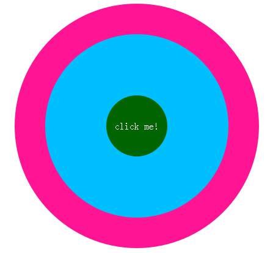
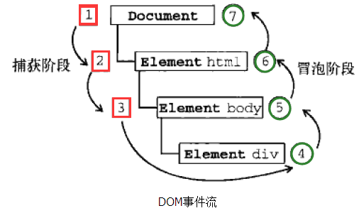

# 事件流

> **事件流描述的是从页面中接收事件的顺序**

## 事件模型

-   假如这个模型有3个实心圈，每个圈都有一个点击事件



### **冒泡型事件流**

> 事件的传播是从**最特定**的**事件目标**到最不特定的**事件目标**。即从DOM树的叶子到根

-   当点击绿色圈时，事件的执行顺序是 绿→蓝→粉
-   先执行子元素事件再执行父元素事件

### **捕获型事件流**

> 事件的传播是从**最不特定**的**事件目标**到最特定的**事件目标**。即从DOM树的根到叶子

-   当点击绿色圈时，事件的执行顺序是 粉→蓝→绿
-   先执行父元素事件再执行子元素事件

## DOM事件流

> **DOM2级事件**规定的事件流包括三个阶段

-   事件捕获阶段 → 处于目标阶段 → 事件冒泡阶段
-   DOM标准采用捕获+冒泡，既两种事件流都会触发DOM的所有对象



## 设置

-   默认`addEventListener`设置的事件放在捕获阶段
-   `addEventListener`第三个参数为`true`表示事件在捕获阶段调用，如果为`false`表示事件在冒泡阶段调用

## 事件委托

> 将子元素的事件委托给父元素

-   比如对ul的每个li都添加事件
-   传统做法就是给每个li添加事件，这种方法会注册大量的监听，消耗内存，而且有新的li也不好处理

```html
<ul id="myLinks">
  <li id="goSomewhere">Go somewhere</li>
  <li id="doSomething">Do something</li>
  <li id="sayHi">Say hi</li>
</ul>
```

```javascript
  var item1 = document.getElementById("goSomewhere");
  var item2 = document.getElementById("doSomething");
  var item3 = document.getElementById("sayHi");
  item1.onclick = function() {
    location.href = "http://www.baidu.com";
  };
  item2.onclick = function() {
    document.title = "事件委托";
  };
  item3.onclick = function() {
    alert("hi");
  };
```

-   通过事件委托，把每个li的事件都让ul来处理，事件利用 `event.target`获取点击的目标元素

> 这种做法好处是只需要设置一个监听，而且动态添加li也自动委托

```javascript
  var item1 = document.getElementById("goSomewhere");
  var item2 = document.getElementById("doSomething");
  var item3 = document.getElementById("sayHi");
  document.addEventListener("click", function (event) {
    var target = event.target;
    switch (target.id) {
      case "doSomething":
        document.title = "事件委托";
        break;
      case "goSomewhere":
        location.href = "http://www.baidu.com";
        break;
      case "sayHi": alert("hi");
        break;
    }
  })
```
