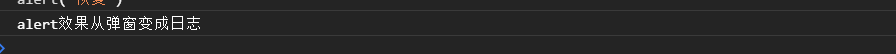

# 作用域

> 变量的搜寻机制为 `first local then global` ，所以在local没找到时，会从全局变量中找

## 全局作用域

> 不在任何函数内定义的变量就是全局作用域，实际上是将变量绑定到`window`的一个属性，同理，定义的方法其实也是绑定到`window`上

```javascript
function a(){
  console.log(1);
}
var b = 'overall value'
window.a();
console.log(window.b);
```

输出结果：

```javascript
1
overall value
```

> 继续引申其实很多内置的方法也绑定到`window`，比如`alert`

```javascript
window.alert('改变前');
var old_alert = window.alert;  //备份
window.alert = function(){ console.log('alert效果从弹窗变成日志'); }
alert()
window.alert = old_alert;
alert('恢复')
```





## 命名空间

> 因为定义的全局变量都会绑定到`window`上，所以当引入多个`JavaScript`文件时，很容易造成变量名重复造成冲突。因此，为了解决这个问题可以使用命名空间的办法。相当于把变量和函数都定义在`winow`下的一个子空间

```javascript
//定义一个唯一的全局变量
var jsNameSpace = {};
//其它变量和函数
jsNameSpace.name = 'NlinX';
jsNameSpace.foo = function(){ ... };
```

## 块级作用域

> 在`for`循环等语句 条件 中无法定义一个局部变量，因此ES6标准推出一个新的声明方式`let`，用于声明一个块级作用域的变量 （ `let`不能在相同作用域重负声明一个变量 ）

```javascript
for (var i=0; i<10; i++) {}
console.log(i);
for (let j=0; j<10; j++) {}
console.log(j);
```

输出结果：

```javascript
10
Uncaught ReferenceError: j is not defined

```

> 在函数里面也能使用`let`，并且与条件中的变量区分

```javascript
for( let i = 0 ; i < 3 ; i++ ){
    let i = 'abc'　　　//这里的i不影响条件中的i，所以循环不会被影响　
    console.log(i) 　　
 }
```

输出：

```javascript
abc
abc
abc
```

## 常量

> var与let都是定义变量的，于是ES6标准推出声明一个常量的方法`const`，声明成常量后再重新赋值会报错（有些浏览器不报错，但是会无效）

```javascript
const PI = 3.14；
PI = 3;
console.log(PI);
```

输出结果：

```javascript
Identifier 'PI' has already been declared     //报错 或者输出 3.14

```
