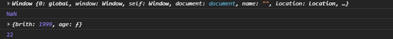

# 函数

## 定义函数

> 调用方法适，如果没有传参，则参数值为`undefined`

-   方法一
    ```javascript
    function fun(x,y){
        ...
    }
    ```
-   方法二
    ```javascript
    var fun = function(x,y){
        ...
    };
    ```

## arguments

> 在每个函数中，都自带一个属性 `arguments` ，它包含传入的所以参数，只有 索引 和`length` 值

```javascript
var fun = function(x,y){
    console.log(arguments.length);
    for(var i in arguments){
        console.log(arguments[i]);
    }
}
fun(1,2);
```

输出结果：

```javascript
2
1
2
```

## rest

> ES6标准，因为JavaScript允许传入参数多余设定值，所以多余的参数可以存入到`rest`中，创建时需要以 `...rest` 作为参数，如果没有多余的参数则`rest`为 空 数组

```javascript
var fun = function(x,y,...rest){
    console.log(rest);
    console.log(rest[1]);
}
fun(1,2,3,4,5);
```

输出结果：

```javascript
[ 3, 4, 5 ]
4
```

## 方法

> 在一个对象中绑定函数，成为这个对象的方法，内置一个`this`关键字，它指向当前对象  （ 其实方法和函数没什么大的区别 ）

```javascript
var nlinx = {
    brith: 1999,
    age: function () {
        var y = new Date().getFullYear();
        return y-this.brith;
    },
    th: function(){
        console.log(this);
    }
}
console.log(nlinx.age);       //[Function: age]
console.log(nlinx.age());     //22
nlinx.th();//{ brith: 1999, age: [Function: age], th: [Function: th] }

```

-   也可以这样分开写

```javascript
function getAge(){
    var y = new Date().getFullYear();
    return y-this.brith;

}

var nlinx = {
    brith: 1999,
    age: getAge
}
console.log(nlinx.age);       //[Function: getAge]
console.log(nlinx.age());     //22

```

## apply

> 使用`apply` 可以控制函数中`this`的指向，它接受两个参数，第一个参数为指向的变量，第二为要传入函数的参数`array` ，数组中一个元素对应一个参数

```javascript
function getAge(){
    var y = new Date().getFullYear();
    console.log(this);
    return y-this.brith;
    
}

var nlinx = {
    brith: 1999,
    age: getAge
};
console.log(getAge);     //[Function: getAge]
console.log(getAge());   //NnN
console.log(getAge.apply(nlinx,[])); //22   这里将getAge的this指向nlinx

```



-   `apply`还可以方便在重构函数时传参

```javascript
var par = parseInt;
parseInt = function(){
    return par(arguments[0]);  //这里如果原函数要传多少个参数这里就要填多少参数
}
console.log(parseInt('10'));
```

```javascript
var par = parseInt;
parseInt = function(){
    return par.apply(null,arguments);  //apply方法只需填一个参数数组
}
console.log(parseInt('10'));
```

## call

> 效果与`apply` 一致，只是传入参数时，`apply`使用数组`array`，而`call`是按一个个参数按顺序传入

```javascript
getAge.apply(nlinx,[1,2,3]);
getAge.call(nlinx,1,2,3);

```

## 高阶函数

> 就是给函数传的参数也是一个函数

```javascript
function add(x, y, f) {
    return f(x) + f(y);      //x和y是变量   f是函数
}
```

-   可用于对变量处理之前先进行预处理   例如：（计算两个值相加，如果参数为字符串先转换成数字形式）

```javascript
function add(x,y,f){
    return f(x)+f(y);
}
console.log(add(10,'20',parseInt));    //30
```

## Array的高阶函数

### map

> `map`是数组`array`的一个高阶函数，其作用是把数组每一个元素都传入到一个函数中返回一个新的结果数组，这种写法主要是为了更直观的看到 把每一个元素作用一个方法后的结果生成一个新的数组&#x20;

```javascript
var new_array = arr.map(function callback(currentValue[, index[, array]]) {
 // Return element for new_array 
}[, thisArg])
```

| 参数           | 描述       |
| ------------ | -------- |
| currentValue | 必选，元素的值  |
| index        | 可选，元素的索引 |
| arr          | 可选，数组对象  |

```javascript
function pow(x){
    return x*x; 
}
var arr = [1,2,3,4,5];
var result = arr.map(pow);
console.log(result);  //[ 1, 4, 9, 16, 25 ]
```

### reduce

> `reduce`也是数组`array`的一个高阶函数，要求函数必须接受两个参数，作用是把两个参数执行函数，把返回结果作为其中一个参数与下一个元素再执行函数，以此类推

```javascript
[x1,x2,x3,x4].reduce(f(x,y)) = f(f(f(x1,x2),x3),x4)
```

```javascript
var arr = [1, 3, 5, 7, 9];
arr.reduce(function (x, y) {
    return x + y;
}); // 25  1+3+5+7+9

```

> reduce还可以传入两个参数，第一个参数为函数，第二个参数为第一次函数中x的值，后面都是以上一次的返回值为x

```javascript
var arr = [1, 3, 5, 7, 9];
arr.reduce(function (x, y) {
    return x + y;
},5); // 30    5+1+3+5+7+9
```

### filter

> `filter`也是数组`array`的一个高阶函数，与`map`类似，但是作用是把每个元素作用函数之后根据返回值为`true`就保留，`false`则丢弃

```javascript
var newArray = arr.filter(callback(element[, index[, array]])[, thisArg])
```

```javascript
var arr = [1,2,4,5,6,7,9];
arr = arr.filter(function(x){
  return x % 2 != 0;
});
console.log(arr);   //[ 1, 5, 7, 9 ]
```

-   利用filter巧妙去除array的重复元素

```javascript
var arr = ['apple', 'strawberry', 'banana', 'pear', 'apple', 'orange', 'orange', 'strawberry'];
arr = arr.filter(function(element,index,array){
    return array.indexOf(element)===index;
});
console.log(arr); // [ 'apple', 'strawberry', 'banana', 'pear', 'orange' ]
```

-   获取数组中的素数

```javascript
var arr = [];
for (x = 1; x < 100; x++) {
    arr.push(x);
}
arr = arr.filter(function(x){
    if(x===1){
        return false;
    }
    for(let i=2;i<x;i++){
        if(x%i===0){
            return false;
        }
    }
   return true;
});
console.log(arr);
```

```javascript
[
   2,  3,  5,  7, 11, 13, 17, 19,
  23, 29, 31, 37, 41, 43, 47, 53,
  59, 61, 67, 71, 73, 79, 83, 89,
  97
]
```

### sort

> 默认是按ASCII码大小排序（所以数字型的数组排序不是从小到大排序），也可以自定义比较函数,匹配规则为：如果认为`x<y`，返回 `-1`，`x==y`，返回`0`，`x>y`，返回`1`，`sort`会 改变 原数组

```javascript
['Google', 'Apple', 'Microsoft'].sort(); 
// ['Apple', 'Google', 'Microsoft'];
```

```javascript
var arr =[1,2,4,1,6,1,6,8]
arr.sort(function(x,y){
    if( x > y ){
       return 1;
    }else if(x < y ){
       return -1;
    }
    return 0;
});
console.log(arr);//[ 1, 1, 1, 2, 4, 6, 6, 8]
```

### every

> 判断是否所以元素都满足测试条件，通过返回`true`或`false`判断

```javascript
var arr=[1,2,3,4];
console.log(arr.every(function(x){
    return x<5;
  }));   //true

 console.log(arr.every(function(x){
    return x<4;
  }));   //false
```

### find

> `find`方法用于查找符合条件的第一个元素，如果找到了，返回这个元素，否则，返回`undefined` ，通过返回`true`或`false`判断

```javascript
var arr=[1,2,3,4];
console.log(arr.find(function(x){
    return x===3;
  }));   //3

 console.log(arr.find(function(x){
    return x===5;
  }));   //undefined

```

### findIndex

> 效果与`find`类似，不同在于返回这个元素的索引，没找到则返回 `-1`

```javascript
var arr=[1,2,3,4];
console.log(arr.findIndex(function(x){
    return x===3;
  }));   //2

 console.log(arr.findIndex(function(x){
    return x===5;
  }));   //-1

```

### forEach

> 效果与`map`类似，但是不会返回数组，只是传入函数执行，常用于遍历数组，因此也不需要返回值

```javascript
var arr=[1,2,3,4];
arr.forEach(function(x){
    console.log(x);
});
```

```javascript
1
2
3
4
```

## 闭包

> 闭包是由 函数 以及声明该函数的 词法环境 组合而成的，该环境包含了这个闭包创建时作用域内的 任何局部变量 ，主要用法就是： 一个函数返回另一个函数&#x20;

-   每当创建一个函数，闭包就会在函数创建的同时被创建出来
-   闭包可以在一个内层函数中访问到其外层函数的作用域
-   闭包是由 函数 以及声明该函数的 词法环境 组合而成的

```javascript
function makeAdder(x) {
  return function(y) {
    return x + y;
  };
}

var add5 = makeAdder(5);
var add10 = makeAdder(10);

console.log(add5(2));  // 7
console.log(add10(2)); // 12

```

-   利用闭包模拟私有变量和方法

```javascript
var Counter = (function() {
  var privateCounter = 0;
  function changeBy(val) {
    privateCounter += val;
  }
  return {
    increment: function() {
      changeBy(1);
    },
    decrement: function() {
      changeBy(-1);
    },
    value: function() {
      return privateCounter;
    }
  }
})();

console.log(Counter.value()); /* logs 0 */
Counter.increment();
Counter.increment();
console.log(Counter.value()); /* logs 2 */
Counter.decrement();
console.log(Counter.value()); /* logs 1 */
```

> 这个环境中包含两个私有项：名为 `privateCounter` 的变量和名为 `changeBy` 的函数

-   闭包在循环中容易出错

```javascript
function showHelp(help) {
  document.getElementById('help').innerHTML = help;
}

function setupHelp() {
  var helpText = [
      {'id': 'email', 'help': 'Your e-mail address'},
      {'id': 'name', 'help': 'Your full name'},
      {'id': 'age', 'help': 'Your age (you must be over 16)'}
    ];

  for (var i = 0; i < helpText.length; i++) {
    var item = helpText[i];
    document.getElementById(item.id).onfocus = function() {
      showHelp(item.help);
    }
  }
}

setupHelp();
```

> 这里的结果是：无论焦点在哪个`input`上，显示的都是关于年龄的信息，因为`item`会变量提升，因此`document.getElementById(item.id).onfocus = function() { showHelp(item.help);`中的`item `其实都是绑定在[**同一个闭包**](https://www.wolai.com/pkUsoBnM8kXXYiMXXxX913#8KA4a5r2hq89Mp3tMgg1Xv "同一个闭包")的`item`中，所以无论焦点在哪个input，都是引用了同一个`item`

-   循环出错的解决办法

方法一：单独创建闭包环境

```javascript
function showHelp(help) {
  document.getElementById('help').innerHTML = help;
}

function setupHelp() {
  var helpText = [
      {'id': 'email', 'help': 'Your e-mail address'},
      {'id': 'name', 'help': 'Your full name'},
      {'id': 'age', 'help': 'Your age (you must be over 16)'}
    ];

  for (var i = 0; i < helpText.length; i++) {
    (function() {
       var item = helpText[i];
       document.getElementById(item.id).onfocus = function() {
         showHelp(item.help);
       }
    })(); // 马上把当前循环项的item与事件回调相关联起来
  }
}

setupHelp();

```

> 利用匿名函数里面执行的办法创建一个闭包，在这个方法中，每一次`for`循环都会创建一个闭包，因此每个闭包都有一个互不干扰的`item`，`document.getElementById(item.id).onfocus = function() { showHelp(item.help);` 也只会绑定到当前的闭包环境中

方法二：添加函数（实际上也是使用了更多的闭包）

```javascript
function showHelp(help) {
  document.getElementById('help').innerHTML = help;
}

function makeHelpCallback(help) {
  return function() {
    showHelp(help);
  };
}

function setupHelp() {
  var helpText = [
      {'id': 'email', 'help': 'Your e-mail address'},
      {'id': 'name', 'help': 'Your full name'},
      {'id': 'age', 'help': 'Your age (you must be over 16)'}
    ];

  for (var i = 0; i < helpText.length; i++) {
    var item = helpText[i];
    document.getElementById(item.id).onfocus = makeHelpCallback(item.help);
  }
}

setupHelp();
```

> 每一个`makeHelpCallback(item.help)` 都是一个实例，相当于创建互不干扰的闭包环境

方法三：利用`let`

```javascript
function showHelp(help) {
  document.getElementById('help').innerHTML = help;
}

function setupHelp() {
  var helpText = [
      {'id': 'email', 'help': 'Your e-mail address'},
      {'id': 'name', 'help': 'Your full name'},
      {'id': 'age', 'help': 'Your age (you must be over 16)'}
    ];

  for (var i = 0; i < helpText.length; i++) {
    let item = helpText[i];
    document.getElementById(item.id).onfocus = function() {
      showHelp(item.help);
    }
  }
}

setupHelp();
```

> `let`是块级作用域变量，因此虽然闭包环境是一样，但是由于`let`的作用域，实际上是创建了多个`item`，每次循环都绑定到了不一样的`item`上

方法四：利用`forEach`

```javascript
function showHelp(help) {
  document.getElementById('help').innerHTML = help;
}

function setupHelp() {
  var helpText = [
      {'id': 'email', 'help': 'Your e-mail address'},
      {'id': 'name', 'help': 'Your full name'},
      {'id': 'age', 'help': 'Your age (you must be over 16)'}
    ];

  helpText.forEach(function(text) {
    document.getElementById(text.id).onfocus = function() {
      showHelp(text.help);
    }
  });
}

setupHelp();
```

> 这种方法和之前的思路都不一样，之前的思路是给每个`text`引用`helpText`的数据，这个方法的思路是对`helpText`的每个元素都应用到`text`中，因此不会出现闭包环境变量的问题

## 回调函数

> 当一个函数 作为一个参数 传入另一个函数，并在需要的时候再去调用它，这个函数就被称为回调函数

## 箭头函数

> ES6标准写法，`Arrow Function` ，相当于匿名函数，并且简化函数定义

```javascript
x => x * x;
//相当于
function (x) {
    return x * x;
}

```

-   如果有多个语句就不能省略`{...}`和`return`

```javascript
x => {
  if(x>0){
    return x * x;
  }
  else{
    return -x*x;
  }
}
```

-   多个参数要用 `()` 括起来

```javascript
var a = (x,y) => x * y;
a(1,2);   //2

```

-   如果要返回对象，也要 `()` 括起来，因为会和函数体的语法冲突

```javascript
var a = x => ({ foo: x });
console.log(a(1));
console.log(a(1).foo);
```

```javascript
{ foo: 1 }
1

```

-   箭头函数的`this`总是指向语法作用域

```javascript
var obj = {
    birth: 1990,
    getAge: function () {
        var b = this.birth; // 1990
        var fn = () => 2021 - this.birth; // this指向obj对象
        return console.log(fn());
    }
};
obj.getAge(); // 31
```

-   因此在使用箭头函数的时候，无法对this进行绑定

```javascript
var obj = {
    birth: 1990,
    getAge: function (year) {
        var b = this.birth; // 1990
        var fn = (y) => y - this.birth; // this.birth仍是1990
        return fn.call({birth:2000}, year);  //这里的this.birth不能指向设定的2000
    }
};
obj.getAge(2015); // 25
```

## generator

> ES6标准引入的数据类型（生成器），看上去是一个函数，但是可以返回多次

-   generator由`function*`定义（注意多出的`*`号），并且，除了`return`语句，还可以用`yield`返回多次。\*\*`yield`\*\***会使生成器暂停执行并返回生成器的新值，直到生成器的 ****`next()`**** 方法被调用时才恢复**

```javascript
function* foo(x) {
    yield x + 1;
    yield x + 2;
    return x + 3;
}
```

-   产生斐波那契数列的函数

```javascript
function* fib(max) {
    var
        t,
        a = 0,
        b = 1,
        n = 0;
    while (n < max) {
        yield a;
        [a, b] = [b, a + b];
        n ++;
    }
    return;
}
```

-   调用方法与`function`不同，有两种方法
    -   方法一：调用内置的`next()` 方法
    > 每次`yield`返回一个对象，`value`就是返回的值，`done`表示是否已经执行结束，如果`done`为`true`就是结束，并且`value`的值就是`return`的值
    ```javascript
    var f = fib(5);
    f.next(); // {value: 0, done: false}
    f.next(); // {value: 1, done: false}
    f.next(); // {value: 1, done: false}
    f.next(); // {value: 2, done: false}
    f.next(); // {value: 3, done: false}
    f.next(); // {value: undefined, done: true}
    ```
    -   方法二：直接用`for ... of`循环迭代generator对象
    > 好处是不需要自己去判断`done`
    ```javascript
    var f = fib(5);
    console.log(f.next()); // {value: 0, done: false}
    console.log(f.next());  // {value: 1, done: false}
    console.log(f.next());  // {value: 1, done: false}
    for (var x of f) {
        console.log(x); // 依次输出 2, 3
    }

    ```
