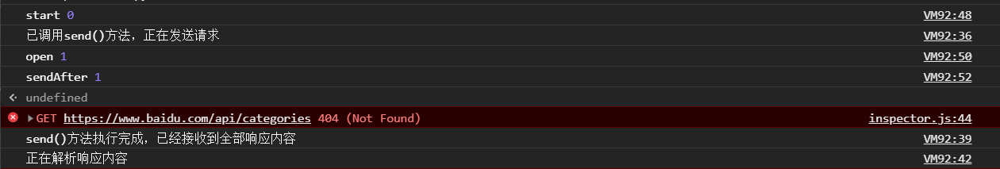

# 异步

> ✨JavaScript是单线程运行的，所以很多事件都是采用异步的机制

-   异步和多线程的区别

```javascript
setTimeout(function () { while (true) { } }, 1000);

setTimeout(function () { alert('end 2'); }, 2000);

setTimeout(function () { alert('end 1'); }, 100);

alert('end');
```

-   按照多线程的理解，上面的代码的输出结果是结果 弹出`end` 、`end 1` 然后弹出`end 2`，后台会一直在运行 `while (true) { }`
-   但是在异步中，上面的程序因为`while (true) { }` 比`alert('end 2')` 早执行，然后浏览器会陷入假死，一直在执行`while (true) { }`，`alert('end 2')` 就永远不会被执行

```javascript
--初始化一个简单的js的计时器，一段时间后，才触发并执行回调函数。 setTimeout 返回一个唯一id,可用这个id来取消这个计时器。

var id = setTimeout(fn,delay);

 
--类似于setTimeout,不一样的是，每隔一段时间，会持续调用回调fn，直到被取消

var id = setInterval(fn,delay);

--传入一个计时器的id,取消计时器。

clearInterval(id);

clearTimeout(id);
```

## 计时器

### setTimeout

> `setTimeout` 用法是过了`delay`时间后触发`fn`回调函数，并且返回一个唯一`id`

```javascript
var id = setTimeout(fn,delay);
```

### clearTimeout

> 用于在`delay`时间内取消`setTimeout`计时器，也就不会触发`fn`，需要提供计时器的`id`

```javascript
clearTimeout(id);
```

### setInterval

> `setInterval` 用法与`setTimeout` 一致，区别是`setInterval` 是每隔`delay`时间后都会触发`fn`回调函数

```javascript
var id = setInterval(fn,delay);
```

### clearInterval

> 用于随时取消`setInterval` 计时器，用法与clearTimeout一致

```javascript
clearInterval(id);
```

## Promise

> 当我们写一个方法只需要考虑两种结果成功就执行什么方法，失败就执行什么方法的这种逻辑，而不去考虑具体方法的话，可以使用`promise`对象,如果执行成功，则执行`resolve`方法，失败则执行`reject`&#x20;

-   简单使用：一

```javascript
let promise = new Promise(function (resolve, reject) {
    if (true) {
        resolve(1)   //将状态转换为成功 并且把1当做参数传入
    } else {
        reject(2)    //将状态转换为失败 并且把2当做参数传入
    }
})

//写法一
promise.then(function (x) {
    //x=1
    console.log('成功执行的方法')
}).catch(function (x) {
    //x=2
    console.log('失败执行的方法')
})

//写法二
promise.then(function (x) {
    //x=1
    console.log('成功执行的方法')
},function (x) {
    //x=2
    console.log('失败执行的方法')
})


```

-   简单使用：二

```javascript
var fn = function(num){
    return  new Promise(function(resolve, reject){
        if ( num <= 5){
            console.log(num);
            resolve(num+1);
        }else
        {
            reject(num+'大于5');
        }
    })
}

fn(2).then(function (num){
    return fn(num);
}).then(function (num){
    return fn(num);
}).then(function (num){
    return fn(num);
}).then(function (num){
    return fn(num);
}).catch(function (str){
    console.log(str);
})
```

```纯文本
2
3
4
5
6大于5

```

> 虽然看起来更麻烦了，但是实际上如果每个`then`都执行一个异步任务，当任务出错的时候就执行`catch`，用promise是很方便，而且可读性和维护性很强，是很健壮的用法

-   then有两个参数分别是`resolve`和`reject`，因此这两种写法都行作用一样

```javascript
then(null,function (){...})
catch(function (){...})

```

### all

> `Promise`可以并行异步执行多个任务

```javascript
var p1 = new Promise(function (resolve, reject) {
    setTimeout(resolve, 500, 'P1');
});
var p2 = new Promise(function (resolve, reject) {
    setTimeout(resolve, 600, 'P2');
});
// 同时执行p1和p2，并在它们都完成后执行then:
Promise.all([p1, p2]).then(function (results) {
    console.log(results); // 获得一个Array: ['P1', 'P2']
});
```

### race

> `Promise`可以执行多个异步任务，然后获得先返回的结果，无论是`resolve`还是`reject`

-   即使p1的结果已经返回，但是p2不会停止执行，只是执行的结果会被丢弃

```javascript
var p1 = new Promise(function (resolve, reject) {
    setTimeout(reject, 500, 'P1');
});
var p2 = new Promise(function (resolve, reject) {
    setTimeout(resolve, 600, 'P2');
});
Promise.race([p1, p2]).then(function (result) {
    console.log(result); 
}).catch(function(result){
  console.log(result+'错误');   //P1错误
});
```

### 原生的ajax封装成promise

```javascript
var  myNewAjax=function(url){
    return new Promise(function(resolve,reject){
        var xhr = new XMLHttpRequest();
        xhr.open('get',url);
        xhr.send(data);
        xhr.onreadystatechange=function(){
            if(xhr.status==200&&readyState==4){
                var json=JSON.parse(xhr.responseText);
                resolve(json)
            }else if(xhr.readyState==4&&xhr.status!=200){
                reject('error');
            }
        }
    })
}
```

## async

> async可以理解为和generator是一样的东西，只是会自动执行

## 特殊的异步

### AJAX

-   先看执行一段AJAX请求

```javascript
function success(text) {
    var textarea = document.getElementById('test-response-text');
    textarea.value = text;
}

function fail(code) {
    var textarea = document.getElementById('test-response-text');
    textarea.value = 'Error code: ' + code;
}

//var request = new XMLHttpRequest(); // 新建XMLHttpRequest对象
var request;
if (window.XMLHttpRequest) {
    request = new XMLHttpRequest();
} else {

    request = new ActiveXObject('Microsoft.XMLHTTP');
}

//回调函数
request.onreadystatechange = function () { // 状态发生变化时，函数被回调
    if (request.readyState === 4) { // 成功完成
        // 判断响应结果:
        if (request.status === 200) {
            // 成功，通过responseText拿到响应的文本:
            return success(request.responseText);
        } else {
            // 失败，根据响应码判断失败原因:

            return fail(request.status);
        }
    } else if (request.readyState === 0){
        console.log('还没有调用send()方法');
    }
    else if (request.readyState === 1){
        console.log('已调用send()方法，正在发送请求');
    }
    else if (request.readyState === 2){
        console.log('send()方法执行完成，已经接收到全部响应内容');
    }
    else if (request.readyState === 3){
        console.log('正在解析响应内容');
    }

}

// 发送请求:
console.log('start',request.readyState);
request.open('GET', '/api/categories');
console.log('open',request.readyState);
request.send();
console.log('sendAfter',request.readyState);
alert('执行send');
```



-   从结果可以看出，js刚执行`request.send()` 这一句时，`request.readyState` 还是为`1`的
-   当`send()` 执行完毕之后`request.readyState` 才为`2`
-   按照JavaScript单线程执行来说，`send()` 后面的`console.log('sendAfter',request.readyState)` ，应该是等`send()` 执行完毕之后才轮到它，但是从结果来看并不是这样的，它在`send()` 还没执行完毕，`request.readyState` 还是为`1`的时候就执行了
-   因此可以看出，在AJAX请求时，浏览器是多开了一个线程用于请求的，不过回调函数`request.onreadystatechange` 的执行还是在原来线程以单线程排队运行的，所以这样看AJAX也还是异步执行的
