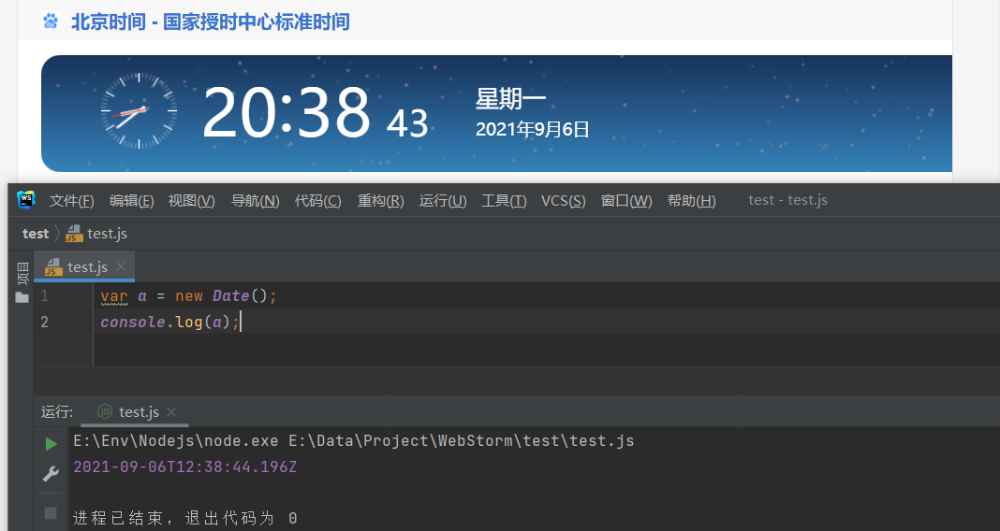

# 标准对象

## Date

> Date对象用来表示日期和时间，默认生成的时间与中国的时区比慢8个小时

#### 四种构造形式

```javascript
new Date();
new Date(value);
new Date(dateString);
new Date(year, monthIndex [, day [, hours [, minutes [, seconds [, milliseconds]]]]]);
```

-   **没有参数**

> 如果没有提供参数，那么新创建的Date对象表示实例化时刻的日期和时间。

```javascript
new Date();
```



-   **Unix时间戳**

> 以一个[时间戳](https://www.wolai.com/6KSnFX7xLdSs456qvAtbap#7mc1zBjJ2NWgfYis6aprVz "时间戳")为参数（整数值），设置时间对象

```javascript
var a = new Date(1630932528995);
console.log(a); //2021-09-06T12:48:48.995Z

```

-   \*\*时间戳字符串，字符串为符合 \*\*[**RFC 2822**](https://tools.ietf.org/html/rfc2822#page-14 "RFC 2822")**或者**[**ISO 8601**](https://www.ecma-international.org/ecma-262/5.1/#sec-15.9.1.15 "ISO 8601")**的时间格式，但是不建议使用这种方法设置，因为各个浏览器的标准不一样，因此可能结果不一样**

```javascript
var a = new Date("2021/09/06");
console.log(a); //2021-09-05T16:00:00.000Z
var a = new Date("2021-07-01 09:09:06");
console.log(a);

```

> 如果使用`Date.parse` 则返回的是时间戳，不需要`new`

```javascript
var a =  Date.parse("2021-07-01 09:09:06");
console.log(a);  //1625101746000

```

-   **分别设置日期和时间的每一个参数**

> 至少提供年和月，这种情况下没设置的参数则使用最小值（日期为1，其它为0），注意月份是从0开始，当数值大于实际范围，会对其它数值相应调整

| year         | 年份的整数值。 0到99会被映射至1900年至1999年，其它值代表实际年份 |
| ------------ | -------------------------------------- |
| monthIndex   | 月份的整数值，从 0（1月）到 11（12月）                |
| date         | 一个月中的第几天的整数值，从1开始，默认值为1                |
| hours        | 小时数的整数值 (24小时制)，默认值为0（午夜）              |
| minutes      | 分钟部分的整数值，默认值为0                         |
| seconds      | 秒部分的整数值，默认值为0                          |
| milliseconds | 毫秒部分的整数值，默认值为0                         |

```javascript
var a = new Date(2021,5,1,8,5,30,61);
console.log(a);   //2021-06-01T00:05:30.061Z
var a = new Date(2021,5,1,8,5,70,61);
console.log(a);   //2021-06-01T00:06:10.061Z  70秒变成1分10秒，因此分钟从5变6

```

-   **不构造直接使用**\*\*`Date()`则返回当前时间的字符串\*\*​

```javascript
var a = new Date();
console.log(a);
console.log(Date());

```

```javascript
2021-09-06T14:01:18.661Z
Mon Sep 06 2021 22:01:18 GMT+0800 (中国标准时间)

```

#### 方法

| getFullYear     | 获取年份                |
| --------------- | ------------------- |
| getMonth        | 获取月份，范围为0\~11       |
| getDate         | 获取日期                |
| getDay          | 获取星期几               |
| getHours        | 获取小时，24小时制，会转换成当前时区 |
| getMinutes      | 获取分钟                |
| getSeconds      | 获取秒                 |
| getMilliseconds | 获取毫秒                |
| getTime         | 获取时间戳               |

```javascript
var now = new Date();
console.log(now); // 2021-09-06T14:10:28.251Z
console.log(now.getFullYear()); // 2021 年费
console.log(now.getMonth()); // 8 表示9月
console.log(now.getDate()); // 6 表示6号
console.log(now.getDay()); // 1, 表示星期一
console.log(now.getHours()); // 22, 24小时制  会转换成当前时区
console.log(now.getMinutes()); // 10, 分钟
console.log(now.getSeconds()); // 28, 秒
console.log(now.getMilliseconds()); // 251, 毫秒数
console.log(now.getTime()); // 1630937428251, 以number形式表示的时间戳
```

#### 时区

> 由于时区不同有两种不同的表现形式`toUTCString`（显示格林威治时间）和`toLocaleString`（使用当前时区）

```javascript
var now = new Date();
console.log(now); // 2021-09-06T14:25:05.681Z
console.log(now.toUTCString()); // Mon, 06 Sep 2021 14:25:05 GMT
console.log(now.toLocaleString()); // 2021/9/6 下午10:25:05
```

## RegExp

> `RegExp`（[正则表达式](https://www.wolai.com/68jBG6Ms6bQbiCPWPkS7Hs.md "正则表达式")）用于将文本与一个模式匹配

-   两种创建方法

```javascript
var re1 = /ABC\-001/;
var re2 = new RegExp('ABC\\-001');
console.log(re1); // /ABC\-001/
console.log(re2); // /ABC\-001/

```

> 两种方法效果一样，但是通过RegExp创建时，这里因为字符串转义问题，`\\` 表示 `\`

-   在`split`中利用正则表达式

```javascript
'a,b;; c  d'.split(/[\s\,\;]+/); // 以空格、','和';'来分割字符串
```

```javascript
['a', 'b', 'c', 'd']
```

-   使用`test()` 方法进行正则表达式匹配

```javascript
var re1 = /ABC\-001/;
console.log(re1.test('ABC-001')); //true

```

-   使用`exec()` 方法对字符串执行搜索匹配，返回结果数组或`null` ，用 `()` 表示要提取的分组

返回值：

| 对象     | 属性/索引          | 描述                                                                                          | 例子                                          |
| ------ | -------------- | ------------------------------------------------------------------------------------------- | ------------------------------------------- |
| result | \[0]           | 匹配的全部字符串                                                                                    | Quick Brown Fox Jumps                       |
|        | \[1], ...\[n ] | 括号中的分组捕获                                                                                    | \[1] = Brown&#xA;\[2] = Jumps               |
|        | index          | 匹配到的字符位于原始字符串的基于0的索引值                                                                       | 4                                           |
|        | input          | 原始字符串                                                                                       | The Quick Brown Fox Jumps Over The Lazy Dog |
| re     | lastIndex      | 下一次匹配开始的位置                                                                                  | 25                                          |
|        | ignoreCase     | 是否使用了 "i" 标记使正则匹配忽略大小写                                                                      | TRUE                                        |
|        | global         | 是否使用了 "g" 标记来进行全局的匹配.                                                                       | TRUE                                        |
|        | multiline      | 是否使用了 "m" 标记使正则工作在多行模式（也就是，^ 和 \$ 可以匹配字符串中每一行的开始和结束（行是由 \n 或 \r 分割的），而不只是整个输入字符串的最开始和最末尾处。） | FALSE                                       |
|        | source         | 正则匹配的字符串                                                                                    | quick\s(brown).+?(jumps)                    |

```javascript
var re = /^(\d{3})-(\d{3,8})$/;
console.log(re.test('010-12345'))
console.log(re.exec('010-12345'));
console.log(re.exec('010 12345'));
```

```javascript
true
[
  '010-12345',
  '010',
  '12345',
  index: 0,
  input: '010-12345',
  groups: undefined
]
null

```

#### 贪婪匹配

> 正则匹配默认是贪婪匹配，就是尽可能匹配多的字符

```javascript
var re = /^(\d+)(0*)$/;
re.exec('102300'); // ['102300', '102300', '']
```

> 这个例子中匹配字符串后面的`0` ，但是 `\d+` 把后面的`0`也匹配了，所以`0*`只能匹配到空字符串

-   采用非贪婪匹配（尽可能少匹配），在匹配表达式后面加 `?`

```javascript
var re = /^(\d+?)(0*)$/;
re.exec('102300'); // ['102300', '1023', '00']
```

> 这个例子中 `\d+?` 没有匹配后面的`0`，因此`0*` 可以匹配到`0`

#### 全局匹配

> 全局匹配可以执行多次`exec()` 方法来匹配字符串，每次运行`exec()` 都会更新lastIndex属性，表示上次匹配到的最后索引&#x20;

-   **使用方法**

```javascript
var r1 = /test/g;
// 或者
var r2 = new RegExp('test', 'g');
```

```javascript
var s = 'JavaScript, VBScript, JScript and ECMAScript';
var re=/[a-zA-Z]+Script/g;

// 使用全局匹配:
re.exec(s); // ['JavaScript']
re.lastIndex; // 10

re.exec(s); // ['VBScript']
re.lastIndex; // 20

re.exec(s); // ['JScript']
re.lastIndex; // 29

re.exec(s); // ['ECMAScript']
re.lastIndex; // 44

re.exec(s); // null，直到结束仍没有匹配到
```

## JSON

> JavaScript Object Notation，是一种数据交换格式

#### 序列化

> 将JS 对象 转换成JSON格式的 字符串 就是序列化

```javascript
JSON.stringify(value[, replacer [, space]])
```

| value    | 将要序列化成一个JSON 字符串的值                                                                                          |
| -------- | ----------------------------------------------------------------------------------------------------------- |
| replacer | - 如果参数是一个函数，则序列化的每个属性 值 要经过函数的处理&#xA;- 如果参数是一个数组，则只有包含在数组中的属性名才会被序列化到JSON中&#xA;- 如果参数为null或未提供，则所有的属性都会被序列化 |
| space    | - 指定缩进用的空白字符串（可以是其它字符）字符长度最大为10，用于美化输出&#xA;- 如果参数是数组，代表有多少个空格范围为\[1，10]&#xA;- 如果参数为null或未提供，则不美化输出          |

```javascript
var xiaoming = {
    name: '小明',
    age: 14,
    gender: true,
    height: 1.65,
    grade: null,
    'middle-school': '\"W3C\" Middle School',
    skills: ['JavaScript', 'Java', 'Python', 'Lisp']
};
var s1 = JSON.stringify(xiaoming);
console.log(s1);
var s2 = JSON.stringify(xiaoming,[age,'middle-school',skills],' ');
console.log(s2);


```

```json
{"name":"小明","age":14,"gender":true,"height":1.65,"grade":null,"middle-school":"\"W3C\" Middle School","skills":["JavaScript","Java","Python","Lisp"]}
{
 "age": 14,
 "middle-school": "\"W3C\" Middle School",
 "skills": [
  "JavaScript",
  "Java",
  "Python",
  "Lisp"
 ]
}

```

-   `replacer`参数为函数时，有两个参数，`key`和值`value`，并且返回值`value`，当返回`undefined`时，则被`null`取代

```javascript
function replacer(key, value) {
    if (typeof value === "string") {
        return undefined;
    }
    return value;
}

var foo = {foundation: "Mozilla", model: "box", week: 45, transport: "car", month: 7};
var jsonString = JSON.stringify(foo, replacer);
console.log(jsonString); // {"week":45,"month":7}

```

-   如果给对象添加一个toJSON方法则可以修改序列化的数据

```javascript
var NlinX = {
    name:'NlinX',
    age:14,
    height:1.88,
    sex:'man',
    toJSON: function () {
        return {
            'Name':this.name,
            'Age':this.age
        }
    }
}
console.log(JSON.stringify(NlinX)); // {"Name":"NlinX","Age":14}

```

> 这种方法甚至还能修改键名

#### 反序列化

> 将一个JSON格式的 字符串 ，转换成 对象 ，就是反序列化

```javascript
JSON.parse(text[, reviver])
```

| text    | 要反序列化成对象的字符串         |
| ------- | -------------------- |
| reviver | 反序列化的每个属性 值 要经过函数的处理 |

```javascript
JSON.parse('[1,2,3,true]'); // [1, 2, 3, true]
JSON.parse('{"name":"小明","age":14}'); // Object {name: '小明', age: 14}
JSON.parse('true'); // true
JSON.parse('123.45'); // 123.45
```

```javascript
var obj = JSON.parse('{"name":"NlinX","age":14,"height":1.88,"sex":"man"}',function (key,value){
    if(key === 'name'){
        return value+'同学';
    }
    return  value;
});
console.log(obj);

```

```javascript
{ name: 'NlinX同学', age: 14, height: 1.88, sex: 'man' }

```
