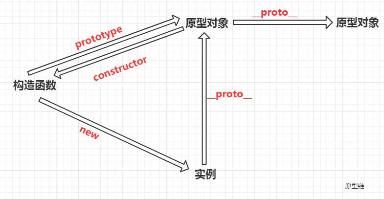
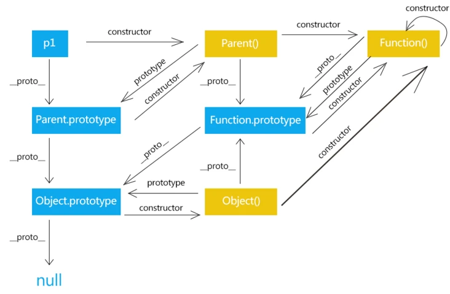

# 面向对象编程

> ✨JavaScript的面向对象编译与Java或C#等语言不太一样，JavaScript不区分类和实例的概念，而是通过原型`prototype`来实现面向对象编程。

> ✨可以用`obj.__protp__` 查看一个对象的原型，但不要用这个方法去改变，因为会很大的影响性能，如果要创建一个基于某个原型的对象可以用`Object.create()`

> ✨当我们用`obj.xxx`访问一个对象的属性时，JavaScript引擎先在当前对象上查找该属性，如果没有找到，就到其原型对象上找，如果还没有找到，就一直上溯到`Object.prototype`对象，最后，如果还没有找到，就只能返回`undefined`

## 创建对象

> JavaScript对每个创建的对象都会设置一个 原型 ，指向它的原型对象

#### Object.create

```javascript
var student = {
    name:'student',
    height:'180',
    info:function (){
        console.log(this.name + '同学');
    }
}

function creatStudent(name,height){
    var s = Object.create(student);
    s.name = name;
    s.height = height;
    return s;
}

var NlinX = creatStudent('NlinX',188);
NlinX.info(); // NlinX同学
consloe.log(NlinX.__proto__); //{ name: 'student', height: '180', info: [Function: info] }
```

#### 构建函数

> 除了用`{...}`创建对象外，还可以用构造函数的方法来创建对象，再用`new`来调用，用了`new`调用表名这是一个构造函数并生成一个 实例对象 ，然后`this`会指向这个新创建的 对象 ，并且默认返回`this`，所以不需要写`return`&#x20;

-   当系统加载函数`Student` （任何函数都会）后，会在内存中生成一个 原型对象 ，函数自带一个`prototype`方法指向这个原型对象
-   这个原型对象有一个`constructor` 属性，它指向函数`Student` 本身
-   `new`生成的实例对象的上一层原型链就是这个原型对象，或者说这个实例 继承 了这个原型对象（实际上不是继承，因为继承会拥有属性和方法，但实际上只是通过原型链查找），实例对象有 `__proto__` 属性，它指向这个原型对象

```javascript
function Student(name) {
    this.name = name;
    this.hello = function () {
        console.log('Hello, ' + this.name + '!');
    }
}

var NlinX = new Student('NlinX');
NlinX.hello();   //Hello, NlinX!
console.log(NlinX);  //Student { name: 'NlinX', hello: [Function (anonymous)] }
console.log(NlinX.constructor); //[Function: Student]
console.log(Maple.__proto__ === Student.prototype); // true
```

-   上面例子中如果创建多个实例，那么他们会各自拥有一个`hello`方法

```javascript
function Student(name) {
    this.name = name;
    this.hello = function () {
        console.log('Hello, ' + this.name + '!');
    }
}
var NlinX = new Student('NlinX');
var Maple = new Student('Maple');
console.log(Maple.hello===NlinX.hello); //false

```

-   如果想把这个`hello`方法变成共享，可以在原型对象上添加这个方法，好处是如果实例对象多的话这个方法省内存，但是调用方法时要向原型链上一层寻找方法，速度会慢

```javascript
function Student(name) {
    this.name = name;
}
Student.prototype.hello = function () {
    console.log('Hello, ' + this.name + '!');
}

var NlinX = new Student('NlinX');
var Maple = new Student('Maple');
console.log(Maple.hello===NlinX.hello);  //true
```

## 原型继承

#### instanceof&#x20;

> instanceof  运算符用来检测 `constructor.prototype` 是否存在于参数 `object` 的原型链上

#### 对象冒充

> 相当于在ClassB里面贴上了ClassA，当然也可以贴上多个方法

```javascript
function ClassA(sColor) {
    this.color = sColor;
    this.sayColor = function () {
        alert(this.color);
    };
}
function ClassB(sColor, sName) {
    this.newMethod = ClassA;
    this.newMethod(sColor);
    delete this.newMethod; //删除了对 ClassA 的引用，避免后面再调用它

    this.name = sName;
    this.sayName = function () {
        alert(this.name);
    };
}
```

#### call和apply方法

> 相当于用call或apply实现对象冒充

```javascript
function ClassB(sColor, sName) {
    ClassA.call(this, sColor);

    this.name = sName;
    this.sayName = function () {
        alert(this.name);
    };
}
```

```javascript
function ClassB(sColor, sName) {
    // ClassA.apply(this, new Array(sColor));
    ClassA.apply(this, arguments);

    this.name = sName;
    this.sayName = function () {
        alert(this.name);
    };
}
```

#### 原型链

> 利用原型链继承原型对象的所有属性和方法，`new ClassA()` 生成一个实例对象，`ClassB`把这个对象作为原型对象，从而获取`ClassA`的属性和方法

```javascript
function ClassA() {
}

ClassA.prototype.color = "blue";
ClassA.prototype.sayColor = function () {
    alert(this.color);
};

function ClassB() {
}

ClassB.prototype = new ClassA();
```

#### 标准的写法

> &#x20;这种方法非常快，非常符合标准，并且充分利用JIT优化，兼容性强

```javascript
function foo(){}
foo.prototype = {
  foo_prop: "foo val"
};
function bar(){}
var proto = new foo;     
proto.bar_prop = "bar val";  //这里是拓展
bar.prototype = proto; //这一步相当于继承
var inst = new bar;
console.log(inst.foo_prop);
console.log(inst.bar_prop);
```

## 原型链关系

> 原型链通过`__proto__`体现

简单：



复杂：



`Parent`是构造函数，`p1`是实例对象

<https://segmentfault.com/a/1190000021232132>

## class继承

> 通过原型编写继承，特点是简单，但是缺点是理解起来比传统的类与实例的模型要困难，并且还要大量的代码，因此在ES6标准正式引入`class`&#x20;

```javascript
class Student {
    constructor(name) {   //构造函数
        this.name = name;
    }

    hello() {      //定义方法不需要function
        console.log(('Hello, ' + this.name + '!'));
    }
}
var NlinX = new Student('NlinX'); 
NlinX.hello()//Hello, NlinX!
```

#### 继承

> `class`类继承用`extends` 继承，用`super`调用父类构造函数

```javascript
class Student {
    constructor(name) {   //构造函数
        this.name = name;
    }

    hello() {      //定义方法不需要function
        console.log(('Hello, ' + this.name + '!'));
    }
}

class Text extends  Student{
    constructor(name,height) { //构造函数
        super(name);    //调用父类构造函数
        this.hello = function () {      //相当于重写父类这个方法
            console.log(('Hello, ' + this.name + '!'+'height:'+height));
        }

    }
}
var NlinX = new Text('NlinX',188);
NlinX.hello()//Hello, NlinX!height:188

```

#### 劣势

> 现在不是所有的主流浏览器都支持ES6的class。如果一定要现在就用上，就需要一个工具把`class`代码转换为传统的`prototype`代码，可以试试[**Babel**](https://babeljs.io/ "Babel")这个工具。
