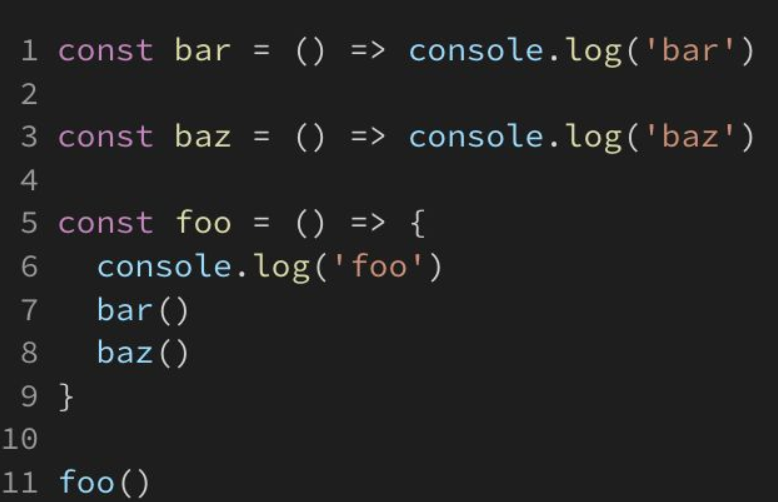
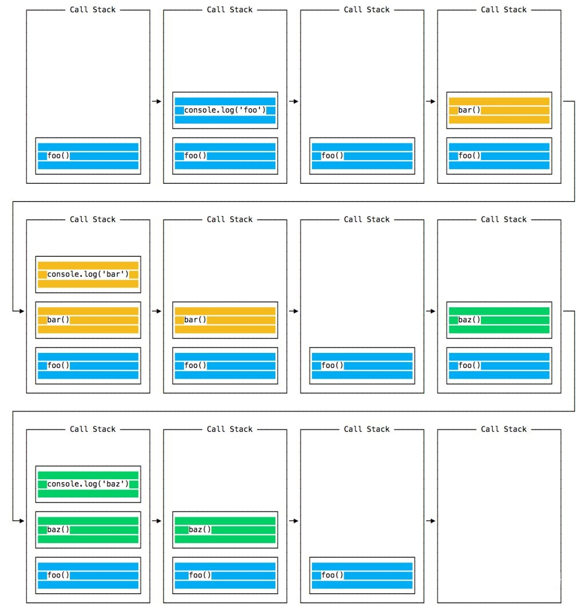
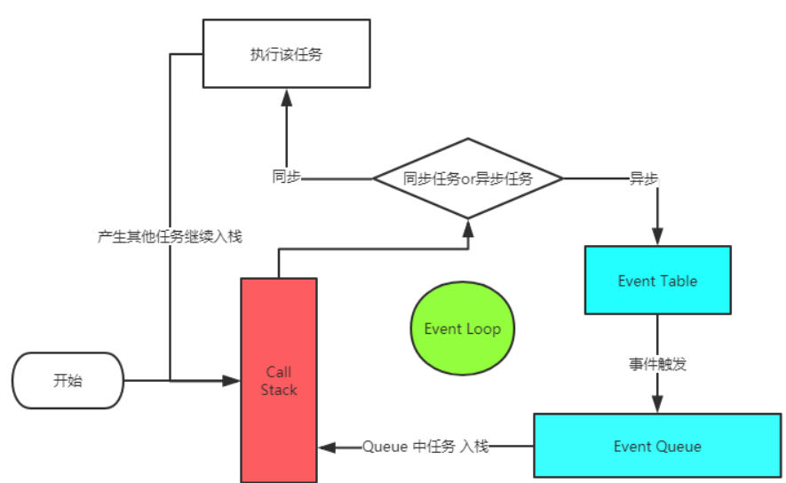
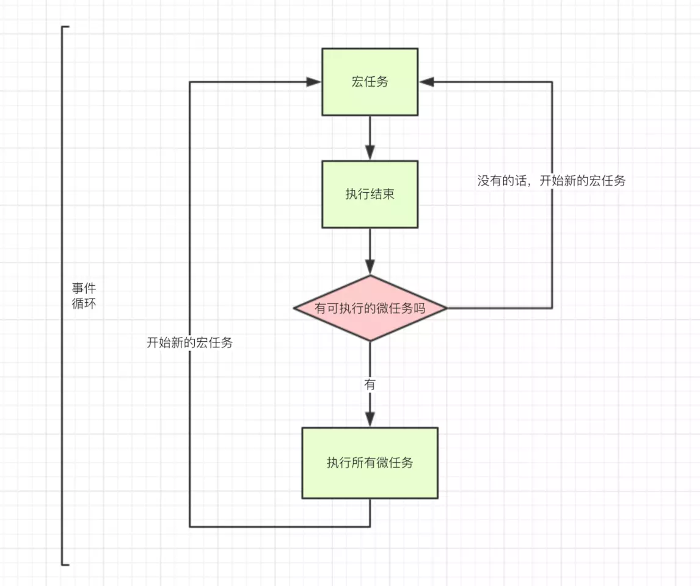

# JS执行机制

> **JavaScript是单线程的**，但是**浏览器内核是多线程**的，他至少有三个常驻线程，它们在内核制控下相互配合以保持同步

-   JavaScript引擎
    -   当任务队列中有任务就会处理，并且一直**只有一个JS线程**在运行JS程序
-   GUI渲染
    -   GUI负责渲染浏览器界面，当界面重绘或者回流，该线程就会执行，但是**GUI渲染与JS引擎是互斥的**，当JS引擎在执行时，GUI线程会被挂起，等JS引擎空闲时候就立即执行更新
-   事件响应
    -   当一个事件被触发时该线程会吧事件处理**添加到队列的队尾，等待JS引擎处理**，有可能来自JS引擎中的`setTimeout` （对！`setTimeout` 属于事件）、其它线程的点击或者AJAX等，都会排队等待JS引擎处理

> 因此，当JS脚本运行时间过长，GUI挂起，事件响应在排队，浏览器就会进入一种假死状态；并且，一旦JS调用结束会马上进行一次GUI渲染再执行下一个任务，因此如果JS中有大量的DOM操作，会导致事件响应缓慢甚至是卡死

## JS执行机制，Event Loop

> JS任务分为**同步**任务和**异步**任务

### **Call Stack**

> 调用栈，Event Loop 会一直检查 Call Stack 中是否有函数需要执行，如果有，就从栈顶依次执行。同时，如果执行的过程中发现其他函数，继续入栈然后执行。

-   图示





### **Event Table**

> **事件表格**，用来存储 JS中的异步事件 (request, setTimeout, IO等) 及其对应的回调函数的列表

### **Event Queue**

> &#x20;**事件队列**，当 Event Table 中的事件被触发，事件对应的 回调函数 就会被 push 进这个 Event Queue，然后等待被执行

### **Event Loop**流程图



-   如果是同步任务直接进入Call Stack执行任务，异步进入event table
-   异步任务在event table中注册函数，当满足触发条件后，被推入event queue
-   **直到Call Stack为空时**，才会去event queue中查看是否有可执行的异步任务，如果有就推入Call Stack

### 宏任务/微任务

> 上面将的都是宏任务，但是有些类似`Promise.then` 这种的是微任务，而微任务是在两轮宏任务之间执行的任务

-   macro-task(宏任务)
    -   script(整体代码)
    -   setTimeout
    -   setInterval
    -   I/O
    -   UI交互事件
    -   postMessage
    -   MessageChannel
    -   setImmediate(Node.js 环境)
-   micro-task(微任务)：
    -   **Promise.then**
    -   Object.observe
    -   MutationObserver
    -   process.nextTick(Node.js 环境)
-   图示



-   因此结合之前的结论，全面的流程Event loop流程应该是
    -   如果是宏任务，将同步任务直接进入Call Stack执行任务，异步进入event table
    -   如果是微任务，进入微任务队列
    -   异步任务在event table中注册函数，当满足触发条件后，被推入event queue
    -   **当Call Stack为空时**，如果微任务队列有任务，则执行所以微任务
    -   **当Call Stack和微任务队列都为空时**，才会去event queue中查看是否有可执行的异步任务，如果有就推入Call Stack，相当于开启第二轮Event Loop

### async/await

> async其实就是通过Promise包装的异步任务，可以理解为async开始到await都是promise部分下面就是then部分

```javascript
//async写法
async function async1() {
  await async2()
  //以上就是promise部分
  //以下都是then部分
  console.log('async1 end')
}
async function async2() {
  console.log('async2 end')
}
async1()
```

```javascript
//promise写法
new Promise((resolve, reject) => {
  // console.log('async2 end')
  async1() 
  ...
}).then(() => {
 // 执行async1()函数await之后的语句
  console.log('async1 end')
})
```

-   因此promise部分都是宏任务，then部分就是微任务
-   因此在这里async2就是宏任务直接执行，`console.log('async1 end')` 就是微任务

### 例子

```javascript
console.log('script start')

async function async1() {
  await async2()
  console.log('async1 end')
}
async function async2() {
  console.log('async2 end')
}
async1()

setTimeout(function() {
  console.log('setTimeout')
}, 0)

new Promise(resolve => {
  console.log('Promise')
  resolve()
})
  .then(function() {
    console.log('promise1')
  })
  .then(function() {
    console.log('promise2')
  })

console.log('script end')
```

```javascript
//第一轮宏任务打印：script start 、async2 end、 Promise 、script end
//第一轮微任务打印：async1 end 、promise1、promise2
//此时微任务队列清空，且存在其他宏任务，进入下一轮事件循环
//第二轮宏任务： setTimeout
```
