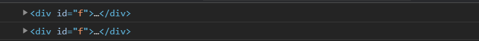
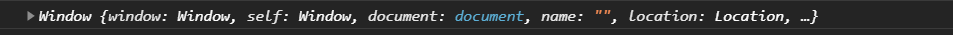
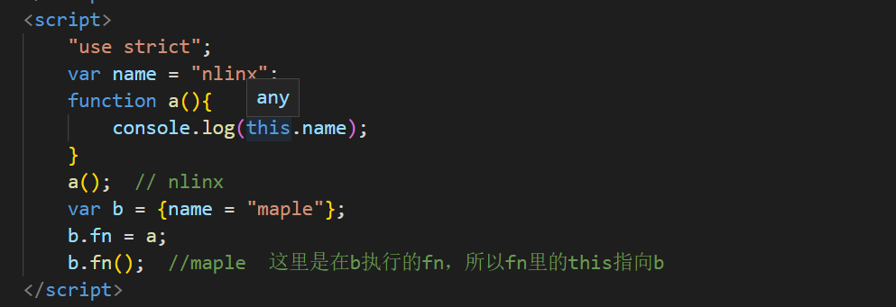
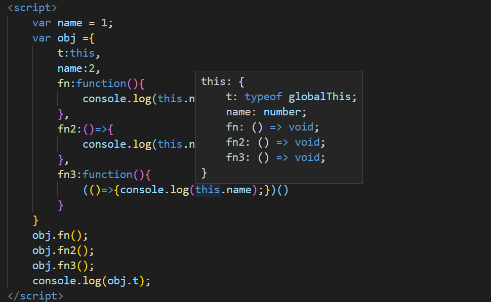
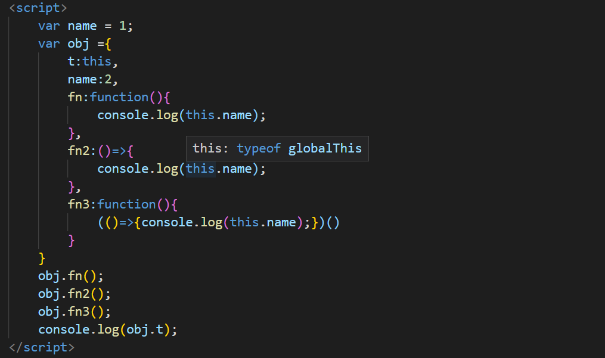

# this指向

## 动态绑定

> this是在执行的时候动态绑定的，而不是在函数声明的时候绑定

```javascript
var name = 1;
var obj ={
    name:2,
    fn:(function(){
        console.log(this.name);
        return function(){console.log(this.name);}
    })()
}
obj.fn(); //1  2
```

## 函数调用

> 在函数里面调用，this按运行环境指向，默认是window

```javascript
var name = "nlinx";
function a(){
    console.log(this.name); 
}
a();  // nlinx
var b = {name = "maple"};
b.fn = a;
b.fn();  //maple  这里是在b执行的fn，所以fn里的this指向b
```

> 在严格模式下，函数调用的this默认为undefined

```javascript
"use strict";
function a(){
    console.log(this);
}
a();   //undefined
```

## 对象调用

> 通过对象执行方法，方法中的this指向调用它的对象

```javascript
var a = {
    name:"nlinx",
    fn:function(){
        console.log(this.name);
    }
}
var b = {
    name:"maple"
}
a.fn();  // nlinx
b.fn = a.fn;
b.fn(); // maple
```

## 匿名函数调用

> 在匿名函数中调用，指向**window**，其实就是类似函数调用

```javascript
var name = "maple";
var a = {
    name:"nlinx",
    fn:function(){
        console.log(this.name);
        (function(){console.log(this.name);})()
    }
}
a.fn();  //  nlinx  maple
```

## 构造函数中的this

> 构造函数中的this，在通过new之后指向新建的**实例对象**，并且new**默认**返回这个this

```javascript
function a(){
    this.name = "nlinx";
    console.log(this.__proto__ === a.prototype);
    this.t = this;
}
var b = new a();   // true   执行了console.log(this.__proto__ === a.prototype);
console.log(b.name); // nlinx
console.log(b === b.t); // true  表明b指向实例对象，同时又与this相等，说明this指向实例对象
```

## 构造函数中方法调用this

> 构造函数中的方法的this也是指向新建的**实例对象**

```javascript
function a(){
    this.name = "nlinx";
    this.fn = function(){
        console.log(this.__proto__ === a.prototype);
        console.log(this.name);
    }
}
var b = new a();
b.fn();  // true  nlinx
```

> 特殊情况，其实类似于匿名函数调用

```javascript
function a(){
    this.name = "nlinx";
    this.fn2 = function(){
        return function(){
            console.log(this);
        }
    }
    this.fn3 = function(){
        (function(){console.log(this)})()
    }
}
var b = new a();
b.fn2()();   //window  返回了一个函数再执行这个函数 ，所以this指向window
b.fn3();     //window  相当于匿名函数调用，所以this指向window
```

## 箭头函数调用

> 箭头函数的this有一个很大的区别，**就是一开始就绑定好了this，而不是在运行的时候动态绑定**

> 箭头函数的this指向上一层作用域的this，（可以理解为箭头函数没有this，要向上一层找）

```javascript
var name = 1;
var obj ={
    t:this,
    name:2,
    fn:function(){
        console.log(this.name);
    },
    fn2:()=>{
        console.log(this.name);
    },
    fn3:function(){
        (()=>{console.log(this.name);})()
    }
}
obj.fn();  // 2
obj.fn2(); // 1 fn2就是箭头函数，fn2的上一层就是obj，obj的this指向window
obj.fn3(); // 2 箭头函数的上一层就是fn3，fn3的this就是obj
console.log(obj.t);  //window  obj的this指向window
```

## 事件中的this

> 动态绑定事件中的this指向**绑定**当前事件的元素

```html
<div id="f">
        <div id="s"></div>
</div>
<script>
    document.getElementById("f").onclick=function(e){
        console.log(this);
    }
    document.getElementById("f").click();  
    document.getElementById("s").click();
</script>

```



> 监听事件与动态绑定类似，事件中的this指向**绑定**当前事件的元素

```html
<div id="f">
        <div id="s"></div>
</div>
<script>
    document.getElementById("f").addEventListener('click',function(){
        console.log(this);
    })
    document.getElementById("f").click();  
    document.getElementById("s").click();
</script>

```


> 行内绑定的时候因为函数是写在全局下的，因此this指向**window**

```html
<div id="f" onclick="c()"></div>
<script>
    function c(){
        console.log(this);
    }
    document.getElementById("f").click();  
</script>

```



## call与apply

> 使用call或apple方法将this定向指向

```javascript
var a = {
    name:"nlinx",
    fn:function(){
        console.log(this.name);
    }
}
var b = {
    name:"maple"
}
a.fn();  // nlinx
a.fn.apply(b); //maple   此时this指向b
```

## 利用编译器快速查看this指向

> 比如像VScode，鼠标移到this上方，会显示this的指向

-   函数中的this按运行环境指向

    
-   fn3的箭头函数的this指向fn3的this，也就是指向obj

    
-   fn2是箭头函数，fn2的this指向上一层的this，也就是obj的this，也就是指向全局this

    
