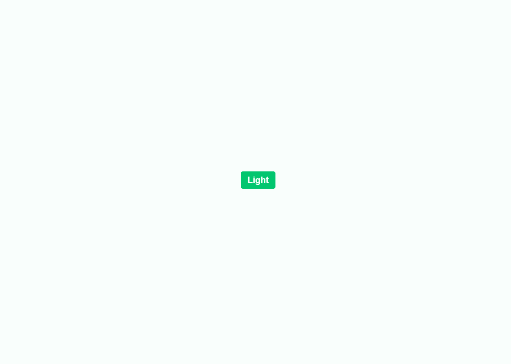

# 案例—按钮翻转

```html
<!doctype html>
<html>
<head>
<meta charset="utf-8">
<title>纯CSS按钮翻转效果</title>
<style>
html,
body {
    display: flex;
    min-height: 100%;
    justify-content: center;
    align-items: center;
    flex-direction: column;
    font-family: sans-serif;
    transition: all .4s ease;
}
body {
  background-color:#252121;
}

.tgl {
    display:none;
}

.tgl + .tgl-btn {
  display: block;
  width: 4em;
  height: 2em;
  position: relative;
  /*聚焦时鼠标光标*/
  cursor: pointer;
  /*增大视线距离，使子元素翻转时有一个距离的效果*/
  perspective: 100px;
}

/*初始化不同属性，背景颜色和内容*/
.tgl-btn:after { 
  background: #02C66F;
  content: attr(data-tg-on);
}
.tgl-btn:before {
  background: #FF3A19; 
  content: attr(data-tg-off);
}

/*初始化共同属性*/
 .tgl-btn:after, .tgl-btn:before {
  transition: all .4s ease;
  width: 100%;
  text-align: center;
  /*absolute相对父元素按坐标定位*/
  position: absolute;
  line-height: 2em;
  font-weight: bold;
  color: #fff;
  /*设置背面不可见*/
  backface-visibility: hidden;
  border-radius: 4px;
}

/*鼠标点击与释放之间发生的事件效果*/
.tgl + .tgl-btn:active:before {
  transform: rotateY(-20deg);
}
.tgl:checked + .tgl-btn:active:after {
  transform: rotateY(20deg);
}

/*4种状态*/
/*未选状态 after翻转到正面显示*/
.tgl + .tgl-btn:before {
  transform: rotateY(0);
}
/*未选状态 after翻转到背面隐藏*/
.tgl + .tgl-btn:after {
  transform: rotateY(-180deg);
}
/*选中状态 before翻转到背面隐藏*/
.tgl:checked + .tgl-btn:before {
  transform: rotateY(180deg);
}
/*选中状态 after翻转到正面显示*/
.tgl:checked + .tgl-btn:after {
  transform: rotateY(0);
}
 
</style>
</head>
<body>

  <input class="tgl " id="cb" type="checkbox">
  <label class="tgl-btn" id="lb" data-tg-off="Dark" data-tg-on="Light" for="cb"></label>

</body>
</html>

<script type="text/javascript">
  /*模拟开关灯效果*/
  var body = document.getElementsByTagName("body")
  var checkBox = document.getElementById("cb");
  var cbLabel = document.getElementById("lb"); 
  var sw =  function(){
    if(checkBox.checked){
        body[0].style.backgroundColor="#252121";
    }
    else{
        body[0].style.backgroundColor="white";
    }
  }  
  cbLabel.addEventListener("click",sw);
</script>
```

-   点击按钮翻转


