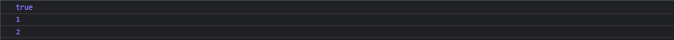

# jQuery

> 📌`jQuery()` 是jQuery最基础最核心的函数，并且有多种参数形式，

-   \$就是jQuery，只是一个别名

```javascript
jQuery(function(){
    console.log(1);
})
$(function(){
    console.log(2);
})
console.log(jQuery === $);
```



## jQuery( selector \[, context ] )

> 接受一个包含一个CSS选择器的字符串，用于匹配的一组元素。

| selector | 用来查找的**CSS选择器**字符串                               |
| -------- | ------------------------------------------------ |
| context  | 作为待查找的 DOM 元素集、文档或 jQuery 对象&#xA;不填写默认为 document |

## jQuery( html \[, ownerDocument ] )

> 根据提供的原始 HTML 标记字符串，动态创建由 jQuery 对象包装的 DOM 元素，同时设置一系列的属性、事件等。

```javascript
jQuery( html [, ownerDocument ] )
jQuery( html ,props )

```

| html          | 用于动态创建DOM元素的HTML标记字符串&#xA;**不是**XML。 |
| ------------- | ------------------------------------ |
| ownerDocument | 创建DOM元素所在的文档                         |
| props         | 用于附加到新创建元素上的属性、事件和方法                 |

-   例子
    > 动态创建一个 div 元素（以及其中的所有内容），并将它追加到 body 元素中
    ```javascript
    $("<div><p>Hello</p></div>").appendTo("body");
    ```
    > 创建一个 \<input> 元素必须同时设定 type 属性。因为微软规定 \<input> 元素的 type 只能写一次
    ```javascript
    // 在 IE 中无效:
    $("<input>").attr("type", "checkbox");
    // 在 IE 中有效:
    $("<input type='checkbox'>");
    ```
    > 创建一个 \<input> 元素，同时设定 type 属性、属性值，以及一些事件。
    ```javascript
    $("<input>", {
      type: "text",
      val: "Test",
      focusin: function() {
        $(this).addClass("active");
      },
      focusout: function() {
        $(this).removeClass("active");
      }
    }).appendTo("form");
    ```

## jQuery(callback)

> `$(document).ready()` 的简写，当DOM加载完成后要执行的函数

```javascript
$(function(){
  // 文档就绪
});

```

## jQuery.holdReady(hold)  3.2 -

> 暂停或恢复 `.ready()` 事件的执行&#x20;

| hold | true或者false，表示暂停和恢复 |
| ---- | ------------------- |

-   例子
    > 延迟就绪事件，直到已加载的插件。
    ```javascript
    $.holdReady(true);
    $.getScript("myplugin.js", function() {
         $.holdReady(false);
    });
    ```

## jQuery.readyException( error )  3.1+

> 处理包裹在`jQuery()` 或`jQuery( document ).ready()` 中函数同步抛出的错误

| error | 错误信息 |
| ----- | ---- |

-   例子
    > 传递接受到的错误给 console.error
    ```javascript
    jQuery.readyException = function( error ) {
      console.error( error );
    };
    ```
