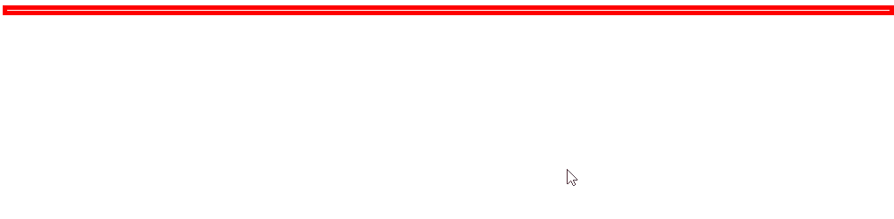

# 动画

## 基本

***

### ✨ show(\[speed,\[easing],\[fn]])

> 显示隐藏的匹配元素

| speed  | 三种预定速度之一的字符串("slow","normal", or "fast")或表示动画时长的毫秒数值(如：1000) |
| ------ | ------------------------------------------------------------ |
| easing | 用来指定切换效果，默认是"swing"，可用参数"linear"                             |
| fn     | 在动画完成时执行的函数，每个元素执行一次                                         |

-   例子
    > 显示p，没有用效果
    ```javascript
     $("p").show()
    ```
    > 显示p，用效果
    ```javascript
    $("p").show(slow) //600ms
    ```
    
    > 显示p之后，又隐藏
    ```javascript
    $("#box").show("slow",function () {
         $(this).hide();
    })
    ```

### ✨ hide(\[speed,\[easing],\[fn]])

> 隐藏显示的元素，用法与`show`一致

### ✨toggle(\[speed],\[easing],\[fn])

> 切换元素隐藏或显示，用法与`show`一致

## 滑动

***

### ✨ slideDown(\[speed],\[easing],\[fn])

> 通过高度变化（向下增大）来动态地显示所有匹配的元素，与show类似，不过效果是高度变化

| speed  | 三种预定速度之一的字符串("slow","normal", or "fast")或表示动画时长的毫秒数值(如：1000) |
| ------ | ------------------------------------------------------------ |
| easing | 用来指定切换效果，默认是"swing"，可用参数"linear"                             |
| fn     | 在动画完成时执行的函数，每个元素执行一次                                         |

-   例子
    > 显示
    ```javascript
    $("#box").slideDown("slow")
    ```
    

### ✨ slideUp(\[speed,\[easing],\[fn]])

> 通过高度变化（向上减小）来动态地隐藏所有匹配的元素，使用方法与`slideDown`一致

### ✨ slideToggle(\[speed],\[easing],\[fn])

> 通过高度变化来切换所有匹配元素的可见性，隐藏或显示，使用方法与`slideDown`一致

## 淡入淡出

***

### ✨ fadeIn(\[speed],\[easing],\[fn])

> 通过不透明度的变化来实现所有匹配元素的淡入效果，用法与滑动一致

### ✨ fadeOut(\[speed],\[easing],\[fn])

> 通过不透明度的变化来实现所有匹配元素的淡出效果，用法与滑动一致

### ✨ fadeTo(\[\[speed],opacity,\[easing],\[fn]])

> 把所有匹配元素的不透明度以渐进方式调整到指定的不透明度，用法与滑动一致，只是多了一个参数用来设置指定透明度

| opacity | 一个0至1之间表示透明度的数字 |
| ------- | --------------- |

-   例子
    > 透明度渐变到0.6
    ```javascript
    $("p").fadeTo("slow", 0.6);
    ```

### ✨ fadeToggle(\[speed,\[easing],\[fn]])

> 通过不透明度的变化来切换所有匹配元素的淡入或淡出效果，用法与`slideToggle` 一致

## 自定义

***

### ✨ animate(params,\[speed],\[easing],\[fn])

> 创建自定义动画

| params  | 一组包含作为动画属性和终值的样式属性和及其值的集合                                    |
| ------- | ------------------------------------------------------------ |
| speed   | 三种预定速度之一的字符串("slow","normal", or "fast")或表示动画时长的毫秒数值(如：1000) |
| easing  | 要使用的擦除效果的名称(需要插件支持).默认jQuery提供"linear" 和 "swing"             |
| fn      | 在动画完成时执行的函数，每个元素执行一次。                                        |
| options | 动画的额外选项                                                      |

-   例子
    > 一次性改变多个属性
    ```javascript
    $("#box").animate({
        width:"500px",
        height:"500px",
        borderWidth:"20px"
    },1000)
    ```
    

### ✨ stop(\[clearQueue],\[jumpToEnd])

> 停止所有在指定元素上正在运行的动画，如果队列中有等待执行的动画(并且clearQueue没有设为true)，他们将被马上执行

| \[clearQueue],\[gotoEnd]            | clearQueu：:如果设置成true，则清空队列。可以立即结束动画。&#xA;gotoEnd：让当前正在执行的动画立即完成，并且重设show和hide的原始样式，调用回调函数等         |
| ----------------------------------- | -------------------------------------------------------------------------------------------------- |
| \[queue],\[clearQueue],\[jumpToEnd] | queue：用来停止动画的队列名称&#xA;clearQueue：如果设置成true，则清空队列。可以立即结束动画。&#xA;jumpToEnd：如果设置成true，则完成队列。可以立即完成动画。 |

-   例子
    > 停止当前动画，如果动画队列当中还有动画立即执行
    ```javascript
    $("#box").stop();
    ```
    > 与`stop()`效果一致  说明这是默认设置
    ```javascript
    $("#box").stop(false,false);

    ```
    > 停止当前动画  清除动画队列
    ```javascript
    $('div').stop(true,false);
    ```
    > 停止当前动画并且到结束位置  清除了动画队列
    ```javascript
    $('div').stop(true,true);
    ```
    > 停止当前动画并且到结束位置  如果动画队列当中还有动画立即执行
    ```javascript
    $('div').stop(false,true);
    ```

### ✨ delay(duration,\[queueName])

> 设置一个延时来推迟执行队列中之后的项目

| duration  | 延时时间，单位：毫秒       |
| --------- | ---------------- |
| queueName | 队列名词，默认是Fx，动画队列。 |

-   例子
    > 在.slideUp() 和 .fadeIn()之间延时800毫秒。
    ```javascript
    $('p').slideUp(300).delay(800).fadeIn(400);
    ```

### ✨ finish( \[queue ] )

> 停止当前正在运行的动画，删除所有排队的动画，并完成匹配元素所有的动画。

| queue | 停止动画队列中的名称，用来指定停止某个动画 |
| ----- | --------------------- |

-   例子
    > 停止当前正在运行的动画并直接完成
    ```javascript
    $("div").finish();
    ```

## 设置

***

### ✨ jQuery.fx.off

> 关闭页面上所有的动画，把这个属性设置为true可以立即关闭所有动画(所有效果会立即执行完毕)

-   在配置比较低的电脑上可以关闭动画
-   例子
    > 关闭所有动画
    ```javascript
    jQuery.fx.off = true
    ```

添加模板
