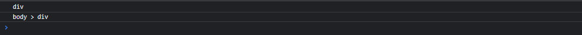
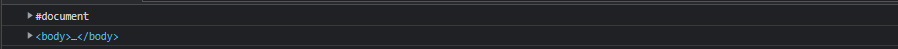
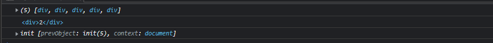
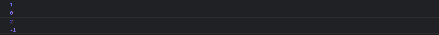

# 对象访问

## ✨ each(callback)

> 以每一个匹配的元素作为上下文来执行一个函数

-   函数中的this都指向一个不同的DOM元素，并且this是DOM对象，而不是jQuery对象
-   函数中的第一个参数是为该元素在集合中的位置（从0开始的整型）
-   函数中的第二个参数是就是this
-   &#x20;返回 'false' 将停止循环，类似break
-   返回 'true' 跳至下一个循环，类似continue

| callback | 对于每个匹配的元素所要执行的函数 |
| -------- | ---------------- |

-   例子
    > 迭代两个图像，并设置它们的 src 属性
    ```html
    
    ```
    ```javascript
    $("img").each(function(i){
       this.src = "test" + i + ".jpg";
    });
    ```
    ```html
    <!-- 结果 -->
     

    ```

## ✨ length

> jQuery 对象中元素的个数，与`size()`一致，但是`size()` 在1.8移除

-   例子
    ```javascript
    $("img").length; 
    ```

## ✨ selector

> 返回传给jQuery()的原始选择器，即jQuery()的第一个参数

-   例子
    ```javascript
    console.log($("div").selector);   
    console.log($("body > div").selector);
    ```
    

## ✨ context

> 返回传给jQuery()的原始的DOM节点内容，即jQuery()的第二个参数

-   例子
    ```javascript
    console.log($("div").selector);   
    console.log($("body > div",document.body).selector);
    ```
    

## ✨ get(\[index])

> 取得其中一个匹配的元素，返回DOM对象，`eq(index)` 返回的是jQuery对象

| index | 表示第几个元素，从0开始&#xA;不填写则获取所有DOM元素 |
| ----- | ------------------------------ |

-   例子
    ```javascript
    console.log($("div").get());   
    console.log($("div").get(1));   
    console.log($("div").eq());  
    ```
    

## ✨ index(\[selector|element])

> 搜索匹配的元素，并返回相应元素的索引值，从0开始计数，没有则返回-1

-   如果不给参数，则返回这个对象集中第一个元素相对于其同辈元素的位置
-   如果参数是一组DOM元素或者jQuery对象，元素在集合的位置
-   如果参数是一个选择器，该元素在选择器中所有元素的位置，所以其实两种方法效果基本一样，只是写的位置不一样
-   例子
    ```html
    <div  id='1'>1</div>
    <div  id='2'>2</div>
    <div  id='3'>3</div>
    <script>
      console.log($('div').index(document.getElementById('2')));
      console.log($('div').index($('div').eq(0)));
      console.log($('#3').index('div'));
      console.log($('#4').index('div'));
      
    </script>
    ```
    

添加模板
