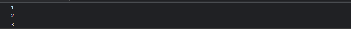
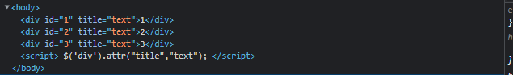
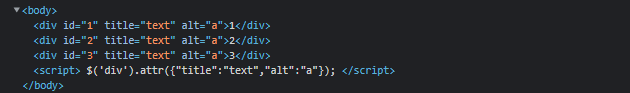
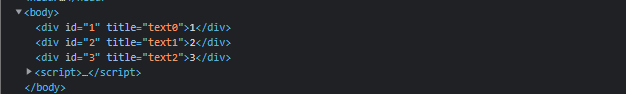
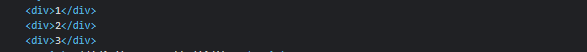
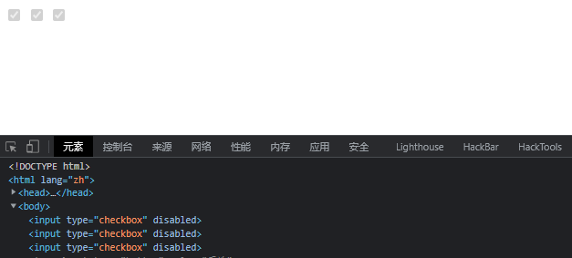
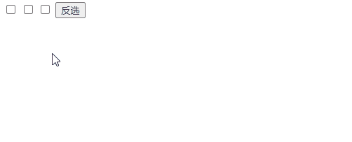
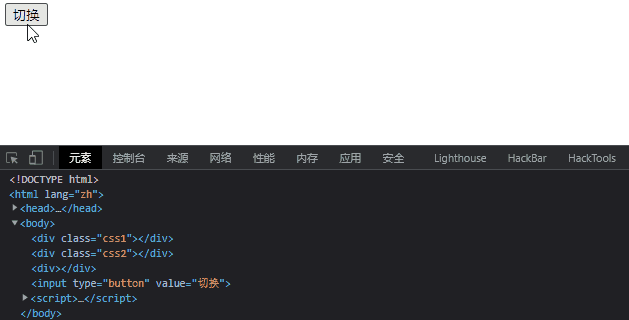
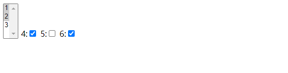

# 属性

## 属性

***

### ✨ attr(name|properties|key,value|fn)

> 设置或返回被选元素的属性值，与prop效果一样，但是attr一般用于自定义的属性

-   在jQuery1.6之后，对于checked、selected、disabled这类boolean类型的属性来说，不能用attr方法，只能用prop方法

| name                      | 属性名                                  |
| ------------------------- | ------------------------------------ |
| properties                | 作为属性的键值对对象                           |
| key,value                 | 属性名称，属性值                             |
| key,function(index, attr) | 返回属性值的函数,第一个参数为当前元素的索引值，第二个参数为原先的属性值 |

-   例子
    > 获取每个div的id值
    ```html
    <div id='1'>1</div>
    <div id='2'>2</div>
    <div id='3'>3</div>
    <script>
        $('div').each(function(){
            console.log($(this). attr("id"));
        })
    </script>

    ```
    
    > 为所有div设置title
    ```html
    <div id='1'>1</div>
    <div id='2'>2</div>
    <div id='3'>3</div>
    <script>
         $('div').attr("title","text");
    </script>

    ```
    
    > 通过键值对对象一次性设置多个属性
    ```html
    <div id='1'>1</div>
    <div id='2'>2</div>
    <div id='3'>3</div>
    <script>
         $('div').attr({"title":"text","alt":"a"});
    </script>

    ```
    
    > 通过回调函数设置属性值
    ```html
    <div id='1' title="text">1</div>
    <div id='2' title="text">2</div>
    <div id='3' title="text">3</div>
    <script>
        $('div').attr("title",function(index,attr){
            return attr+index;
        })
    </script>
    ```
    

### ✨ removeAttr(name)

> 从每一个匹配的元素中删除一个属性

| name | 属性名 |
| ---- | --- |

-   例子
    > 移除div的id属性
    ```html
    <div id='1' >1</div>
    <div id='2' >2</div>
    <div id='3' >3</div>
    <script>
       $('div').removeAttr('id');
    </script>

    ```
    

### ✨ prop(name|properties|key,value|fn)

> 与attr一样，但是prop一般只能应用于元素自带的属性，比如`onclick`就不行
> 官方建议属性值为true或者false的用prop，其余用attr，设置ture或者false时不需要用引号括起

-   在jQuery1.6之后，对于checked、selected、disabled这类boolean类型的属性来说，不能用attr方法，只能用prop方法

| name                      | 属性名                                  |
| ------------------------- | ------------------------------------ |
| properties                | 作为属性的键值对对象                           |
| key,value                 | 属性名称，属性值                             |
| key,function(index, attr) | 返回属性值的函数,第一个参数为当前元素的索引值，第二个参数为原先的属性值 |

-   例子
    > 获取复选框的选择状态
    ```javascript
    $("input[type='checkbox']").prop("checked") //true or false

    ```
    > 禁用页面的所有复选框
    ```javascript
    $("input[type='checkbox']").prop("disabled", true);
    ```
    
    > 反选复选框
    ```html
    <input type="checkbox">
    <input type="checkbox">
    <input type="checkbox">
    <input type="button" value="反选">

    <script>
        $("input[value='反选']").click(function(){
            $("input[type='checkbox']").prop("checked", function(i,check){
                return !check;
            });
        });
    </script>
    ```
    

### ✨ removeProp(name)

> 用来删除由.prop()方法设置的属性集

| name | 要删除的属性名 |
| ---- | ------- |

-   例子
    ```javascript
    $("div").prop('t','text');
    console.log( $("div").prop('t')); //text
    $("div").removeProp('t','text');
    console.log( $("div").prop('t')); //undefined
    ```

## CSS

***

### ✨ addClass(class|fn)

> 为每个匹配的元素添加指定的类名，不会覆盖

| class                  | 一个或多个要添加到元素中的CSS类名，用空格分开                                                           |
| ---------------------- | ---------------------------------------------------------------------------------- |
| function(index, class) | 此函数必须返回一个或多个空格分隔的class名。&#xA;- index参数为对象在这个集合中的索引值&#xA;- class参数为这个对象原先的class属性值。 |

-   例子
    > 为div添加css2 css3类
    ```html
    <div class="css1"></div>
    <script>
        $("div").addClass("css2 css3");
    </script>

    ```
    ```html
    <div class="css1 css2 css3"></div>
    ```

### ✨ removeClass(\[class|fn])

> 从所有匹配的元素中删除全部或者指定的类

| class                  | 一个或多个要删除的CSS类名，用空格分开                                                               |
| ---------------------- | ---------------------------------------------------------------------------------- |
| function(index, class) | 此函数必须返回一个或多个空格分隔的class名。&#xA;- index参数为对象在这个集合中的索引值&#xA;- class参数为这个对象原先的class属性值。 |

-   例子
    ```javascript
     $("div").removeClass("css2 css3");
    ```

### ✨ toggleClass(class|fn\[,sw])

> 如果存在（不存在）就删除（添加）一个类

| class                                    | 类名                                                                                           |
| ---------------------------------------- | -------------------------------------------------------------------------------------------- |
| switchString                             | 用于决定元素是否包含class的布尔值&#xA;- true 添加&#xA;- false 移除                                             |
| function(index, class,switch)\[, switch] | - 用来返回在匹配的元素集合中的每个元素上用来切换的样式类名的一个函数。接收元素的索引位置和元素旧的样式类作为参数。&#xA;- 一个用来判断样式类添加还是移除的 boolean 值。 |

-   例子
    > 删除和设置css1类
    ```html
    <div class="css1"></div>
    <div class="css2"></div>
    <div></div>
    <input type="button" value="切换">
    <script>
        $("input[value='切换']").click(function(){
            $('div').toggleClass("css1");
        });
    </script>

    ```
    
    > 第一、二次移除，第三次添加，以此循环
    ```javascript
    var count = 1 ;
    $("input[value='切换']").click(function(){
        $('div').toggleClass("css1",count++ % 3 == 0);
    });
    ```

## HTML/文本/值

***

### ✨ html(\[val|fn])

> 获取/设置元素的html内容

-   设置时会覆盖，不填入参数时是获取
-   只能获取第一个匹配的元素，但是可以设置匹配的所有元素

| val                   | 用于设定HTML内容的值                                        |
| --------------------- | --------------------------------------------------- |
| function(index, html) | 此函数返回一个HTML字符串&#xA;index为元素在集合中的索引位置，html为原先的HTML值。 |

-   例子
    > 获取html内容
    ```javascript
    $('body').html()
    ```
    > 设置html内容
    ```javascript
    $('body').html("<p>hello word!</p>");
    ```

### ✨ text(\[val|fn])

> 取得所有匹配元素的内容，可以简单理解为在`html()`基础上去掉了所有标签
> 结果是由所有匹配元素包含的文本内容组合起来的文本

| val                   | 用于设置元素内容的文本                                     |
| --------------------- | ----------------------------------------------- |
| function(index, text) | 此函数返回一个字符串&#xA;index为元素在集合中的索引位置，text为原先的text值。 |

-   例子
    > 获取所有div内容
    ```html
    <div>1</div>
    <div>2</div>
    <div>3</div>
    <script>
        console.log($('div').text()); // 123
    </script>

    ```
    > 设置所有div内容
    ```javascript
    $('div').text("text");
    ```

### ✨ val(\[val|fn|arr])

> 获得匹配元素的当前值

| val                    | 要设置的值                                            |
| ---------------------- | ------------------------------------------------ |
| function(index, value) | 此函数返回一个要设置的值&#xA;index为元素在集合中的索引位置，text为原先的text值 |
| array                  | 用于 check/select 的值                               |

-   例子
    > 获取文本框的值
    ```javascript
    $('input').val();
    ```
    > 设置文本框的值
    ```javascript
    $('input').val(function(i,val){
        return val+i;
    })
    ```
    > 设置check值和多选的select值
    ```html
    <select id="sel" multiple="multiple">
        <option >1</option>
        <option >2</option>
        <option >3</option>
        4:<input type="checkbox"  value="4">
        5:<input type="checkbox"  value="5">
        6:<input type="checkbox"  value="6">
    </select>

    <script>
        $("#sel").val(["1","2"]);
        $("input").val(["4","6"]);
    </script>


    ```
    

添加模板
