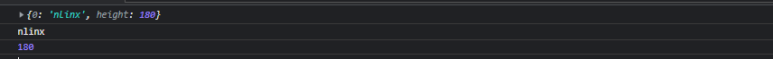

# 数据缓存

## ✨ data(\[key],\[value])

> 在元素上存放或读取数据,返回jQuery对象，可以传入一个键值对

| key   | 存储的数据名           |
| ----- | ---------------- |
| value | 存储的数据值，值也可以是一个对象 |

-   例子
    > 存取值，如果是集合，则这个集合所有元素都会设置了这个属性
    ```javascript
    $("div").data("test",1);
    console.log($("div").eq(1).data("test")); //1
    console.log($("div").eq(2).data("test")); //1

    ```
    > 存取键值对
    ```javascript
    $("div").data("test",{0:'nlinx','height':180});
    console.log($("div").data("test")); 
    console.log($("div").data("test")['0']); 
    console.log($("div").data("test").height); 
    ```
    
    > 如果本身设置了`data-*` 属性，也可以直接读取，但是存储是不会显示的
    ```html
    <div data-test="1"  id='2'>2</div>
    <script>
        console.log($("#2").data("test")); //1
        $("#2").data("test",2);
        console.log($("#2").data("test")); //2
    </script>

    ```
    ```html
    <!-- data-test不会变 -->
    <div data-test="1"  id='2'>2</div>; 

    ```

## ✨ removeData(\[name|list])

> 在元素上移除存放的数据，

| name | 存储的数据名         |
| ---- | -------------- |
| list | 移除数组或以空格分开的字符串 |

-   例子
    ```javascript
    $("#2").data("test",2);
    console.log($("#2").data("test"));  // 2
    $("#2").removeData("test");
    console.log($("#2").data("test"));  // undefined
    ```
    > 不会影响原有的`data-*` 属性
    ```html
    <div data-test="1"  id='2'>2</div>
    <script>
        console.log($("#2").data("test"));  // 1
        $("#2").data("test",2);
        console.log($("#2").data("test"));  // 2
        $("#2").removeData("test");
        console.log($("#2").data("test"));  // 1
    </script>

    ```

添加模板
