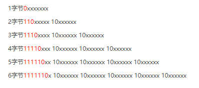

#Lua
### 完整代码
```lua
function splitToChactacter(input)
  input = tostring(input)
  local arr = {}
  local i = 1
  while i <= #input do
      local curByte = string.byte(input, i)
      local byteCount = 1
      if curByte>0 and curByte<=127 then
          byteCount = 1
      elseif curByte>=192 and curByte<223 then
          byteCount = 2
      elseif curByte>=224 and curByte<=239 then
          byteCount = 3
      elseif curByte>=240 and curByte<=247 then
          byteCount = 4
      end
      local char = string.sub(input, i, i+byteCount-1)
      i = i + byteCount
      table.insert(arr, char)
  end
  return arr
end
```

### 原理
#### UTF-8的编码规则
> 📌**对于单字节的符号**，字节的第一位设为0，后面7位为这个符号的 Unicode 码。因此对于英语字母，UTF-8 编码和 ASCII 码是相同的
> 📌**对于n字节的符号（n > 1）**，第一个字节的前n位都设为1，第n + 1位设为0，后面字节的前两位一律设为10。剩下的没有提及的二进制位，全部为这个符号的 Unicode 码。



#### 利用规则
> 知道编码规则后，可先通过`string.byte(input, i)` 获取第一个字节，判断这是一个多大字节的字符，（中文有可能是3或者4），然后就可以通过`string.byte(input, i+字节数)` 获取该字符，后面以此类推

### 拓展
#### 分割后再组合
```lua
-- 一般业务需求在分割后都需要重新组合，比如横向文字变竖向文字，可在中间加 \n
table.concat(splitToChactacter(str), "\n")
```
