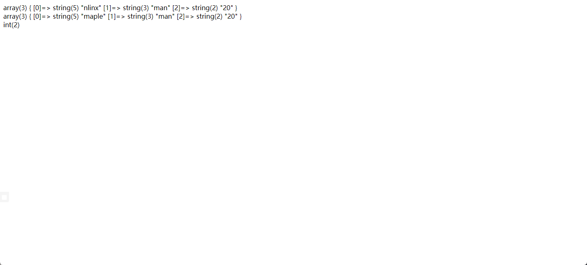

# 与MySQL交互

### 目录

| 方法                                 | 描述                                      |
| ---------------------------------- | --------------------------------------- |
| **基本设置**                           |                                         |
| **mysqli\_connect()**              | 连接MySQL服务器                              |
| **mysqli\_connect\_errno**         | 返回最后一次连接调用的错误代码                         |
| **mysqli\_connect\_error**         | 返回上次连接尝试的错误消息                           |
| **mysql\_set\_charset**            | 设置默认字符编码（不推荐）                           |
| **mysqli\_set\_charset**           | 设置默认字符编码（推荐）                            |
| **mysqli\_select\_db**             | 选择用于数据库查询的默认数据库                         |
| **mysqli\_close**                  | 关闭与mysql服务器的连接                          |
| **执行SQL语句**                        |                                         |
| **mysqli\_query**                  | 对数据库执行一次查询                              |
| **mysqli\_real\_query**            | 执行一个mysql查询，结果只是否成功                     |
| **mysqli\_use\_result**            | 获取一个结果集检索                               |
| **mysqli\_store\_result**          | 获取上一次查询返回的结果集                           |
| **mysqli\_fetch\_row**             | 从结果集中取得一行作为索引数组                         |
| **mysqli\_fetch\_assoc**           | 从结果集中取得一行作为关联数组                         |
| **mysqli\_fetch\_array**           | 从结果集中获取一行作为关联数组或索引数组                    |
| **mysqli\_fetch\_all**             | 从结果集中取得所有行作为关联数组或索引数组                   |
| **mysqli\_fetch\_field**           | 返回结果集中的下一个字段信息                          |
| **mysqli\_fetch\_fields**          | 返回表示结果集中所有字段的对象数组                       |
| **mysqli\_num\_rows**              | 返回结果集中行的数量                              |
| **mysqli\_free\_result**           | 释放结果集内存                                 |
| **mysqli\_affected\_rows**         | 获取前一个MySQL操作中受影响的数量                     |
| **mysqli\_insert\_id**             | 返回上次查询中的id值                             |
| **mysqli\_real\_escape\_string**   | 对于 SQL 语句中的特殊字符进行转义                     |
| **mysqli\_multi\_query**           | 对数据库执行一个或多个查询                           |
| **mysqli\_more\_results**          | 检查批量查询中是否还有查询结果                         |
| **mysqli\_next\_result**           | 为读取 \*\*`multi_query`\*\*执行之后的下一个结果集做准备 |
| **mysqli\_num\_fields**            | 获取结果集中的字段数                              |
| **mysqli\_fetch\_field\_direct**   | 获取指定字段的元数据                              |
| **mysqli\_field\_seek**            | 将结果指针设置为指定的位置                           |
| **mysqli\_num\_fields**            | 获取结果中的字段数                               |
| **mysqli\_field\_tell**            | 获取结果指针的当前字段偏移量                          |
| **mysqli\_field\_count**           | 返回最近查询的列数                               |
| **预处理语句**                          |                                         |
| **mysqli\_prepare**                | 准备执行一个 SQL 语句                           |
| **mysqli\_stmt\_bind\_param**      | 将变量绑定到准备好的语句作为参数                        |
| **mysqli\_stmt\_execute**          | 执行准备好的语句                                |
| **mysqli\_stmt\_bind\_result**     | 将结果集中的列绑定到变量                            |
| **mysqli\_stmt\_fetch**            | 获取结果到绑定变量中                              |
| **mysqli\_stmt\_store\_result**    | 将结果集存储在内部缓冲区中                           |
| **mysqli\_stmt\_result\_metadata** | 返回结果集的元数据                               |
| **mysqli\_stmt\_free\_result**     | 释放与语句关联的结果内存                            |
| **mysqli\_stmt\_num\_rows**        | 返回语句中缓冲的行数                              |

### 连接MySQL服务器

-   **mysqli\_connect()**
    ```php
    mysqli_connect(
        string $hostname = ini_get("mysqli.default_host"),
        string $username = ini_get("mysqli.default_user"),
        string $password = ini_get("mysqli.default_pw"),
        string $database = "",
        int $port = ini_get("mysqli.default_port"),
        string $socket = ini_get("mysqli.default_socket")
    ): mysqli|false
    ```
    | 参数       | 描述（默认值从php.ini中获取）                |
    | -------- | --------------------------------- |
    | hostname | 可选。规定主机名或 IP 地址。                  |
    | username | 可选。规定 MySQL 用户名。                  |
    | password | 可选。规定 MySQL 密码。                   |
    | database | 可选。规定默认使用的数据库。                    |
    | port     | 可选。规定尝试连接到 MySQL 服务器的端口号。（默认3306） |
    | socket   | 可选。规定 socket 或要使用的已命名 pipe。       |

### 错误提示

-   **mysqli\_connect\_errno**
    > 返回最后一次连接调用的错误代码；0表示没有错误
    ```php
    mysqli_connect_errno(): int
    ```
-   **mysqli\_connect\_error**
    > 返回上次连接尝试的错误消息；null表示没有错误
    ```php
    mysqli_connect_error(): string

    ```

### 设置默认字符编码

-   **mysql\_set\_charset**
    > PHP 5.5.0 起已废弃，并在自 PHP 7.0.0 开始被移除
    ```php
    mysql_set_charset(string $charset, resource $link_identifier = NULL): bool
    ```
-   **mysqli\_set\_charset**
    > 推荐使用这种形式
    ```php
    mysqli_set_charset(mysqli $link, string $charset): bool
    ```

### 选择特定的数据库

-   **mysqli\_select\_db**
    > 选择用于数据库查询的默认数据库
    ```php
    mysqli_select_db(mysqli $link, string $dbname): bool
    ```

### 关闭与mysql服务器的连接

-   **mysqli\_close**
    ```php
    mysqli_close(mysqli $link): bool
    ```

### 执行SQL语句

-   **mysqli\_query**
    > 对数据库执行一次查询
    ```php
    mysqli_query(mysqli $link, string $query, int $resultmode = MYSQLI_STORE_RESULT): mixed
    ```
    🌟 对于insert、update、delete等不返回数据的语句，执行成功后返回true

    🌟 对于有返回数据的语句执行成功时返回结果集，通过操作结果集对象的函数来获取数据
    | 参数         | 描述                                                                                                      |
    | ---------- | ------------------------------------------------------------------------------------------------------- |
    | query      | 必需，规定查询字符串。                                                                                             |
    | resultmode | 可选。一个常量。可以是下列值中的任意一个：&#xA;\*   MYSQLI\_USE\_RESULT（如果需要检索大量数据，请使用这个）&#xA;\*   MYSQLI\_STORE\_RESULT（默认） |
    ```php
    $sql='select * from students';
    $result=mysqli_query($link,$sql);
    ```
    区别：

    \*\*`MYSQLI_USE_RESULT`\*\*结果集在还在数据库中，只是获取一个索引，操作函数从数据库一次一次获取数据，所以获取行还是有可能发生错误

    \*\*`MYSQLI_STORE_RESULT`\*\*一次性获取结果集到内存中，因此后面获取行也不会出错
-   **mysqli\_real\_query**
    > 执行一个mysql查询，结果返回true或false，适用于只需要确认是否执行成功的情况
    ```php
    mysqli_real_query(mysqli $link, string $query): bool

    ```
    🌟 可以用**mysqli\_use\_result**或**mysqli\_store\_result**检索或存储
-   **mysqli\_use\_result**
    > 获取一个结果集检索
    ```php
    mysqli_use_result(mysqli $link): mysqli_result|false
    ```
-   **mysqli\_store\_result**
    > 获取上一次查询返回的结果集
    ```php
    mysqli_store_result(mysqli $link, int $option = ?): mysqli_result|false
    ```
-   **mysqli\_fetch\_row**
    > 从结果集中取得一行作为索引数组，重复使用获取下一行
    ```php
    mysqli_fetch_row(mysqli_result $result): array|null|false
    ```
    ```php
    while ($data=mysqli_fetch_row($result)){
        echo var_dump($data)."</br>";
    }
    ```
    输出结果：

    array(3) { \[0]=> string(5) "nlinx" \[1]=> string(3) "man" \[2]=> string(2) "20" } &#x20;
    array(3) { \[0]=> string(5) "maple" \[1]=> string(3) "man" \[2]=> string(2) "20" }
-   **mysqli\_fetch\_assoc**
    > 从结果集中取得一行作为关联数组，重复使用获取下一行（返回结果大小写敏感）
    ```php
    mysqli_fetch_assoc(mysqli_result $result): array|null|false
    ```
    ```php
    while ($data=mysqli_fetch_assoc($result)){
        echo var_dump($data)."</br>";
    }
    ```
    输出结果：

    array(3) { \["name"]=> string(5) "nlinx" \["sex"]=> string(3) "man" \["age"]=> string(2) "20" } &#x20;
    array(3) { \["name"]=> string(5) "maple" \["sex"]=> string(3) "man" \["age"]=> string(2) "20" }
-   **mysqli\_fetch\_array**
    > 从结果集中获取一行作为关联数组或索引数组
    ```php
    mysqli_fetch_array(mysqli_result $result, int $mode = MYSQLI_BOTH): array|null|false
    ```
    | 参数   | 描述                                                                                             |
    | ---- | ---------------------------------------------------------------------------------------------- |
    | mode | 可选。规定应该产生哪种类型的数组。可以是以下值中的一个：&#xA;\*   MYSQLI\_ASSOC&#xA;\*   MYSQLI\_NUM&#xA;\*   MYSQLI\_BOTH |
    ```php
    echo var_dump(mysqli_fetch_array($result,MYSQLI_ASSOC))."</br>";
    echo var_dump(mysqli_fetch_array($result,MYSQLI_BOTH))."</br>";

    ```
    输出结果：

    array(3) { \["name"]=> string(5) "nlinx" \["sex"]=> string(3) "man" \["age"]=> string(2) "20" } &#x20;
    array(6) { \[0]=> string(5) "maple" \["name"]=> string(5) "maple" \[1]=> string(3) "man" \["sex"]=> string(3) "man" \[2]=> string(2) "20" \["age"]=> string(2) "20" }
-   **mysqli\_fetch\_all**
    > 从结果集中取得所有行作为关联数组或索引数组
    ```php
    mysqli_fetch_all(mysqli_result $result, int $mode = MYSQLI_NUM): array

    ```
    | 参数   | 描述                                                                                             |
    | ---- | ---------------------------------------------------------------------------------------------- |
    | mode | 可选。规定应该产生哪种类型的数组。可以是以下值中的一个：&#xA;\*   MYSQLI\_ASSOC&#xA;\*   MYSQLI\_NUM&#xA;\*   MYSQLI\_BOTH |
    ```php
    echo var_dump(mysqli_fetch_all($result,MYSQLI_ASSOC))."</br>";

    ```
    输出结果：

    array(2) { \[0]=> array(3) { \["name"]=> string(5) "nlinx" \["sex"]=> string(3) "man" \["age"]=> string(2) "20" } \[1]=> array(3) { \["name"]=> string(5) "maple" \["sex"]=> string(3) "man" \["age"]=> string(2) "20" } }
-   **mysqli\_fetch\_field**
    > 返回结果集中的下一个字段信息
    ```php
    mysqli_fetch_field(mysqli_result $result): object|false
    ```
    | 返回值属性       | 描述               |
    | ----------- | ---------------- |
    | name        | 列名               |
    | orgname     | 原始的列名（如果指定了别名）   |
    | table       | 表名               |
    | orgtable    | 原始的表名（如果指定了别名）   |
    | def         | 保留作为默认值，当前总是为 "" |
    | db          | 数据库名             |
    | catalog     | 目录名称，总是为 "def"   |
    | max\_length | 字段的最大宽度          |
    | length      | 在表定义中规定的字段宽度     |
    | charsetnr   | 字段的字符集号          |
    | flags       | 字段的位标志           |
    | type        | 用于字段的数据类型        |
    | decimals    | 整数字段，小数点后的位数     |
    ```php
    $var=mysqli_fetch_field($result);
    var_dump($var);
    echo "</br>name=>".$var->name."</br>length=>".$var->length;
    ```
    输出结果：

    object(stdClass)#3 (13) { \["name"]=> string(4) "name" \["orgname"]=> string(4) "name" \["table"]=> string(8) "students" \["orgtable"]=> string(8) "students" \["def"]=> string(0) "" \["db"]=> string(4) "test" \["catalog"]=> string(3) "def" \["max\_length"]=> int(5) \["length"]=> int(30) \["charsetnr"]=> int(33) \["flags"]=> int(4097) \["type"]=> int(253) \["decimals"]=> int(0) } &#x20;
    name=>name &#x20;
    length=>30
-   **mysqli\_fetch\_fields**
    > 返回表示结果集中所有字段的对象数组
    ```php
    mysqli_fetch_fields(mysqli_result $result): array
    ```
    | 返回值属性       | 描述                                  |
    | ----------- | ----------------------------------- |
    | name        | 列名                                  |
    | orgname     | 原始的列名（如果指定了别名）                      |
    | table       | 表名                                  |
    | orgtable    | 原始的表名（如果指定了别名）                      |
    | max\_length | 字段的最大宽度                             |
    | length      | 在表定义中规定的字段宽度，以字节为单位，一个字符占多少字节以字符集决定 |
    | charsetnr   | 字段的字符集号                             |
    | flags       | 字段的位标志                              |
    | type        | 用于字段的数据类型                           |
    | decimals    | 整数字段，小数点后的位数                        |
    ```php
    $var=mysqli_fetch_fields($result);
    var_dump($var);
    echo "</br>name1=>".$var[0]->name."</br>name2=>".$var[1]->name;
    ```
    输出结果：

    array(3) { \[0]=> object(stdClass)#3 (13) { \["name"]=> string(4) "name" \["orgname"]=> string(4) "name" \["table"]=> string(8) "students" \["orgtable"]=> string(8) "students" \["def"]=> string(0) "" \["db"]=> string(4) "test" \["catalog"]=> string(3) "def" \["max\_length"]=> int(5) \["length"]=> int(30) \["charsetnr"]=> int(33) \["flags"]=> int(4097) \["type"]=> int(253) \["decimals"]=> int(0) } \[1]=> object(stdClass)#4 (13) { \["name"]=> string(3) "sex" \["orgname"]=> string(3) "sex" \["table"]=> string(8) "students" \["orgtable"]=> string(8) "students" \["def"]=> string(0) "" \["db"]=> string(4) "test" \["catalog"]=> string(3) "def" \["max\_length"]=> int(3) \["length"]=> int(30) \["charsetnr"]=> int(33) \["flags"]=> int(4097) \["type"]=> int(253) \["decimals"]=> int(0) } \[2]=> object(stdClass)#5 (13) { \["name"]=> string(3) "age" \["orgname"]=> string(3) "age" \["table"]=> string(8) "students" \["orgtable"]=> string(8) "students" \["def"]=> string(0) "" \["db"]=> string(4) "test" \["catalog"]=> string(3) "def" \["max\_length"]=> int(2) \["length"]=> int(2) \["charsetnr"]=> int(63) \["flags"]=> int(36865) \["type"]=> int(3) \["decimals"]=> int(0) } } &#x20;
    name1=>name &#x20;
    name2=>sex
-   **mysqli\_num\_rows**
    > 返回结果集中行的数量
    ```php
    mysqli_num_rows(mysqli_result $result): int|string
    ```
    🌟 在使用\*\*`MYSQLI_USE_RESULT`\*\* 模式时，要在获取完结果集（要获取到最后的null）才能使用，不然会报错
    ```php
    $result=mysqli_query($link,$sql);
    var_dump(mysqli_num_rows($result));
    ```
    输出结果：int(2)
-   **mysqli\_free\_result**
    > 释放结果集内存
    ```php
    mysqli_free_result(mysqli_result $result): void
    ```
-   **mysqli\_affected\_rows**
    > 获取前一个MySQL操作中受影响的数量
    ```php
    mysqli_affected_rows(mysqli $mysql): int|string
    ```
-   **mysqli\_insert\_id**
    > 返回上次查询中的id值（通过 AUTO\_INCREMENT 生成）
    ```php
    mysqli_insert_id(mysqli $mysql): int|string
    ```
-   **mysqli\_real\_escape\_string**
    > 根据当前连接的字符集，对于 SQL 语句中的特殊字符进行转义
    ```php
    mysqli_real_escape_string(mysqli $link, string $escapestr): string
    ```
-   **mysqli\_multi\_query**
    > 对数据库执行一个或多个查询，用分号 **`;`** 隔开
    ```php
    mysqli_multi_query(mysqli $mysql, string $query): bool
    ```
    使用\*\*`mysqli_store_result`\*\* 获取结果集，使用\*\*​`mysqli_more_results`\*\* 判断是否还有结果集，使用\*\*​`mysqli_next_result`\*\* 切换到下一跳结果集，再使用\*\*​`mysqli_store_result`\*\* 获取结果集，一般配合\*\*​`do while`\*\*来使用
    ```php
    mysqli_multi_query($link, $query);
    do {
        if ($result = mysqli_store_result($link)) {
            while ($row = mysqli_fetch_row($result)) {
                printf("%s\n", $row[0]);
            }
        }
        if (mysqli_more_results($link)) {
            printf("-----------------\n");
        }
    } while (mysqli_next_result($link));
    ```
-   **mysqli\_more\_results**
    > 检查批量查询中是否还有查询结果
    ```php
    mysqli_more_results(mysqli $link): bool
    ```
-   **mysqli\_next\_result**
    > 为读取 \*\*`multi_query `\*\*执行之后的下一个结果集做准备
    ```php
    mysqli_next_result(mysqli $link): bool
    ```
-   **mysqli\_num\_fields**
    > 获取结果集中的字段数
    ```php
    int $mysqli_result->field_count ;
    ```
    ```php
    mysqli_num_fields ( mysqli_result $result ): int
    ```
-   **mysqli\_fetch\_field\_direct**
    > 获取指定字段的元数据
    ```php
    public mysqli_result::fetch_field_direct(int $index): object|false
    ```
    ```php
    mysqli_fetch_field_direct(mysqli_result $result, int $index): object|false
    ```
    | index       | 字段编号，范围0\~fields-1 |
    | ----------- | ------------------ |
    | 返回值属性       | 描述                 |
    | ----------- | ----------------   |
    | name        | 列名                 |
    | orgname     | 原始的列名（如果指定了别名）     |
    | table       | 表名                 |
    | orgtable    | 原始的表名（如果指定了别名）     |
    | def         | 保留作为默认值，当前总是为 ""   |
    | max\_length | 字段的最大宽度            |
    | length      | 在表定义中规定的字段宽度       |
    | charsetnr   | 字段的字符集号            |
    | flags       | 字段的位标志             |
    | type        | 用于字段的数据类型          |
    | decimals    | 整数字段，小数点后的位数       |
-   **mysqli\_field\_seek**
    > 将结果指针设置为指定的位置
    ```php
    public mysqli_result::field_seek(int $index): bool

    ```
    ```php
    mysqli_field_seek(mysqli_result $result, int $index): bool
    ```
    | index | 偏移位置，范围0\~fields-1，0为开头 |
    | ----- | ----------------------- |
-   **mysqli\_num\_fields**
    > 获取结果中的字段数
    ```php
    int $mysqli_result->field_count ;
    ```
    ```php
    mysqli_num_fields ( mysqli_result $result ): int
    ```
-   **mysqli\_field\_tell**
    > 获取结果指针的当前字段偏移量
    ```php
    int $mysqli_result->current_field ;
    ```
    ```php
    mysqli_field_tell ( mysqli_result $result ): int
    ```
-   **mysqli\_field\_count**
    > 返回最近查询的列数
    ```php
    int $mysqli->field_count ;
    ```
    ```php
    mysqli_field_count ( mysqli $mysql ): int
    ```
    ```php
    $sql='select 1,2 from students';
    mysqli_query($link,$sql,MYSQLI_USE_RESULT);
    echo mysqli_field_count($link);
    ```
    输出结果：2

### 预处理语句

-   **mysqli\_prepare**
    > 准备执行一个 SQL 语句，这里仅仅支持单一的 SQL 语句，不支持多 SQL 语句。
    ```php
    mysqli::prepare(string $query): mysqli_stmt
    ```
    ```php
    mysqli_prepare(mysqli $link, string $query): mysqli_stmt
    ```
    🌟 \*\*`query`\*\*不需要在语句末尾增加分号 **`;`**&#x20;
-   **mysqli\_stmt\_bind\_param**
    > 将变量绑定到准备好的语句作为参数
    ```php
    public mysqli_stmt::bind_param(string $types, mixed &$var, mixed &...$vars): bool
    ```
    ```php
    mysqli_stmt_bind_param(
        mysqli_stmt $stmt,
        string $types,
        mixed &$var,
        mixed &...$vars
    ): bool
    ```
    | types | 描述             |
    | ----- | -------------- |
    | i     | int类型          |
    | d     | double或float类型 |
    | s     | 字符串类型          |
    | b     | 二进制数据类型        |
    ```php
    $stmt = mysqli_prepare($link, "INSERT INTO CountryLanguage VALUES (?, ?, ?, ?)");
    mysqli_stmt_bind_param($stmt, 'sssd', $code, $language, $official, $percent);
    $code = 'DEU';
    $language = 'Bavarian';
    $official = "F";
    $percent = 11.2;
    ```
-   **mysqli\_stmt\_execute**
    > 执行准备好的语句
    ```php
    public mysqli_stmt::execute (): bool
    ```
    ```php
    mysqli_stmt_execute ( mysqli_stmt $stmt): bool
    ```
-   **mysqli\_stmt\_bind\_result**
    > 将结果集中的列绑定到变量
    ```php
    public mysqli_stmt::bind_result(mixed &$var, mixed &...$vars): bool
    ```
    ```php
    mysqli_stmt_bind_result(mysqli_stmt $stmt, mixed &$var, mixed &...$vars): bool
    ```
-   **mysqli\_stmt\_fetch**
    > 获取结果到绑定变量中，相当于只获取索引，数据不会获取到缓冲区中
    ```php
    public mysqli_stmt::fetch(): ?bool
    ```
    ```php
    mysqli_stmt_fetch(mysqli_stmt $stmt): ?bool
    ```
-   **mysqli\_stmt\_store\_result**
    > 将结果集存储在内部缓冲区中
    ```php
    public mysqli_stmt::store_result (): bool

    ```
    ```php
    mysqli_stmt_store_result ( mysqli_stmt $stmt): bool
    ```
-   **mysqli\_stmt\_result\_metadata**
    > 返回结果集的元数据
    ```php
    public mysqli_stmt::result_metadata(): mysqli_result|false

    ```
    ```php
    mysqli_stmt_result_metadata(mysqli_stmt $stmt): mysqli_result|false
    ```
    适用于以下方法返回结果：
    | **mysqli\_num\_fields**          | **mysqli\_fetch\_field** |
    | -------------------------------- | ------------------------ |
    | **mysqli\_fetch\_fields**        | **mysqli\_field\_count** |
    | **mysqli\_field\_tell**          | **mysqli\_free\_result** |
    | **mysqli\_fetch\_field\_direct** | **mysqli\_field\_seek**  |
-   **mysqli\_stmt\_free\_result**
    > 释放与语句关联的结果内存，该内存由**mysqli\_stmt\_store\_result**分配&#x20;
    ```php
    public mysqli_stmt::free_result(): void

    ```
    ```php
    mysqli_stmt_free_result(mysqli_stmt $statement): void

    ```
-   **mysqli\_stmt\_num\_rows**
    > 返回语句中缓存的行数
    ```php
    int $mysqli_stmt->num_rows ;
    ```
    ```php
    public mysqli_stmt::num_rows(): int|string
    ```
    ```php
    mysqli_stmt_num_rows(mysqli_stmt $statement): int|string

    ```

### 案例

#### 简单使用

```php
<?php
header('Content-type:text/html;charset=utf-8');
//连接数据库
$link=@mysqli_connect('localhost','root','root','test',3306);
//连接出错提示错误信息
if (mysqli_connect_errno()) {
    exit(mysqli_connect_error());
}
//设置默认字符集
mysqli_set_charset($link,'utf-8');
//选择数据库
mysqli_select_db($link,'test');
//设置sql语句
$sql='select * from students';
//查询sql语句
$result=mysqli_query($link,$sql,MYSQLI_USE_RESULT);
//获取返回数据
while ($data=mysqli_fetch_row($result)){
    echo var_dump($data)."</br>";
}
//返回结果行数
var_dump(mysqli_num_rows($result));
//释放内存
mysqli_free_result($result);
//关闭数据库连接
mysqli_close($link);
?>
```



## 更多方法

<https://www.php.net/manual/zh/class.mysqli-stmt.php>
