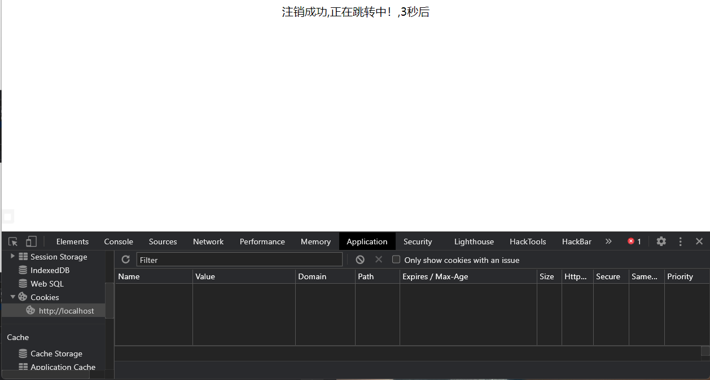

# 会话控制

### cookie

-   **setcookie()**
    > 向客户端发送一个 HTTP cookie
    ```php
    setcookie(
        string $name,
        string $value = "",
        int $expires = 0,
        string $path = "",
        string $domain = "",
        bool $secure = false,
        bool $httponly = false
    ): bool
    ```
    | 参数     | 描述                                                                                                                                                                             |
    | ------ | ------------------------------------------------------------------------------------------------------------------------------------------------------------------------------ |
    | name   | 必需。规定 cookie 的名称。可以是一个数组                                                                                                                                                       |
    | value  | 必需。规定 cookie 的值。                                                                                                                                                               |
    | expire | 可选。规定 cookie 的过期时间。&#xA;time()+3600\*24\*30 将设置 cookie 的过期时间为 30 天。如果这个参数没有设置，那么 cookie 将在 session 结束后（即浏览器关闭时）自动失效。（如果一开始设置一个过期的时间，相当于删除cookie）                               |
    | path   | 可选。规定 cookie 的服务器路径。&#xA;&#xA;如果路径设置为 "/"，那么 cookie 将在整个域名内有效.如果路径设置为 "/test/"，那么 cookie 将在 test 目录下及其所有子目录下有效。默认的路径值是 cookie 所处的当前目录。                                         |
    | domain | 可选。规定 cookie 的域名。&#xA;为了让 cookie 在 example.com 的所有子域名中有效，您需要把 cookie 的域名设置为 ".example.com"。当您把 cookie 的域名设置为 [www.example.com](http://www.example.com) 时，cookie 仅在 www 子域名中有效。 |
    | secure | 可选。规定是否需要在安全的 HTTPS 连接来传输 cookie。如果 cookie 需要在安全的 HTTPS 连接下传输，则设置为 TRUE。默认是 FALSE。                                                                                             |
-   **\$\_COOKIE**
    > 获取cookie
    ```php
    <?php 
    header('Content-type:text/html;charset=utf-8');
    //添加cookie
    setcookie('member[name]','NlinX',time()+3600);
    setcookie('member[sex]','man',time()+3600);
    //查看
    var_dump($_COOKIE);
    var_dump($_COOKIE['member']['name']);
    ?>
    ```
    
    ```php
    <?php 
    //删除cookie
    var_dump(setcookie("member['sex']",'',time()-1000));
    ?>
    ```
    

### **session**

-   **session\_start()**
    > 创建新会话或者重用现有会话
    ```php
    session_start(array $options = array()): bool

    ```
    ```php
    <?php
    header('Content-type:text/html;charset=utf-8');
    session_start();
    $_SESSION['name']='Nlinx';
    $_SESSION['sex']='man';
    var_dump($_SESSION);
    echo('</br>');
    var_dump(session_name());
    echo('</br>');
    var_dump($_COOKIE);
    ?>
    ```
    
-   **释放会话**
    ```php
    <?php
    session_unset();//释放会话所有变量
    session_destroy();//销毁一个会话中的全部数据，重置会话id
    setcookie(session_name(),'',time()-3600,'/');//销毁保存在客户端的会话id
    ?>

    ```

### 案例

#### 登录页面（cookie）

-   **index.php**
    > 主页
    ```php
    <?php
    header('Content-type:text/html;charset=utf-8');
    echo ' <title>主页</title>';
    if(isset($_COOKIE['username'])&&$_COOKIE['username']==='NlinX'){
        echo "{$_COOKIE['username']},欢迎回来！</br>";
        echo "<a href='logout.php'>注销</a>";
    }else{
        echo "<a href='login.php'>请登录</a>";
    }
    ?>

    ```
-   **login.php**
    > 登录页面
    ```php
    <?php
    header('Content-type:text/html;charset=utf-8');
    if (isset($_COOKIE['username'])&& $_COOKIE['username']==='NlinX') {
         exit('您已登录');
    } 
    if (isset($_POST['submit'])){
        if($_POST['username']==='NlinX' && $_POST['password']==='123456'){
            if(setcookie('username',$_POST['username'],time()+3600)){
                header('Location:skip.php?url=index.php&info=登录成功，正在跳转！');
            }else{
                echo 'cookie设置失败！';
            }
        }else{
            header('Location:skip.php?url=index.php&info=对不起，用户名或密码不正确，登录失败！');
        }
    }
    ?>

    <!DOCTYPE html>
    <html lang="zh-CN">
    <head>
        <meta charset="utf-8">
        <title>登录页面</title>
    </head>
    <body>
        <form method="post" action="login.php">
            姓名：<input type="text" name="username" />
            密码：<input type="password" name="password" />
            <input type="submit" name="submit" value="登录">
        </form>
    </body>
    ```
-   logout.php
    > 注销登录
    ```php
    <?php
    header('Content-type:text/html;charset=utf-8');
    if (isset($_COOKIE['username']) && $_COOKIE['username']==='NlinX') {
        if (setcookie('username',$_POST['username'],time()-1000)) {
            header('Location:skip.php?url=index.php&info=注销成功，正在跳转中！');       
        }else{
            header('Location:skip.php?url=index.php&info=注销成功，正在跳转中！');
        } 
    }
    ?>


    ```
-   skip.php
    > 中转页面
    ```php
    <!DOCTYPE html>
    <html lang="zh-CN">
    <head>
    <meta charset="utf-8" />
    <meta http-equiv="refresh" content="3;URL=<?php echo $_GET['url'] ?>" />
    <title>正在跳转中...</title>
    </head>
    <body>
        <div style="text-align:center;font-size:20px;"><?php echo $_GET['info'] ?>，3秒后自动跳转！</div>
    </body>
    </htm
    ```


#### 登录页面（session）

-   **index.php**
    > 主页
    ```php
    <?php
    session_start();
    header('Content-type:text/html;charset=utf-8');
    if (isset($_SESSION['username'])&&$_SESSION['username']==='NlinX') {
        echo "{$_SESSION['username']},欢迎回来";
        echo "<a href='logout.php'>注销</a>";
    }else{
        echo "<a href='login.php'>请登录</a>";
    }
    ?>
    ```
-   **login.php**
    > 登录页面
    ```php
    <?php
    session_start();
    header('Content-type:text/html;charset=utf-8');
    if (isset($_SESSION['username']) && $_SESSION['username']==='NlinX') {
        exit('不要重复登录！');
    }
    if (isset($_POST['submit'])) {
        if (isset($_POST['username']) && isset($_POST['password'])&& $_POST['username']==='NlinX' && $_POST['password']==='123456') {
            $_SESSION['username']=$_POST['username'];
            header('Location:skip.php?url=index.php&info=登录成功，正在跳转中！');

        }else{
            header('Location:skip.php?url=index.php&info=对不起，用户名或者密码错误，登录失败！');
        }
    }

    ?>
    <!DOCTYPE html>
    <html lang="zh-CN">
    <head>
        <meta charset="utf-8">
        <title>请登录</title>
    </head>
    <body>
        <form method="post" action="login.php">
            姓名：<input type="text" name="username">
            密码：<input type="password" name="password">
            <input type="submit" name="submit" value="登录">
        </form>
    </body>
    </html>
    ```
-   **logout.php**
    > 注销登录
    ```php
    <?php 
    session_start();
    header('Content-type:text/html;charset=utf-8');
    if (isset($_SESSION['username'])&& $_SESSION['username']==='NlinX') {
        session_unset();
        session_destroy();
        setcookie(session_name(),'',time()-1000,'/');
        header('Location:skip.php?url=index.php&info=注销成功,正在跳转中！');
    }else{
        header('Location:skip.php?url=index.php&info=注销失败，请稍后重试！');
    }
    ?>
    ```
-   **skip.php**
    > 中转页面
    ```php
    <?php
    if(!isset($_GET['url'])||!isset($_GET['info'])){
        exit();
    }
    ?>
    <!DOCTYPE html>
    <html lang="zh-CN">
    <head>
        <meta charset="utf-8" />
        <meta http-equiv="refresh" content="3;URL=<?php echo $_GET['url']?>"/>
        <title>正在跳转中...</title>
    </head>
    <body>
        <div style="text-align: center;font-size: 20px;"><?php echo $_GET['info']?>,3秒后</div>
    </body>
    </html>
    ```



