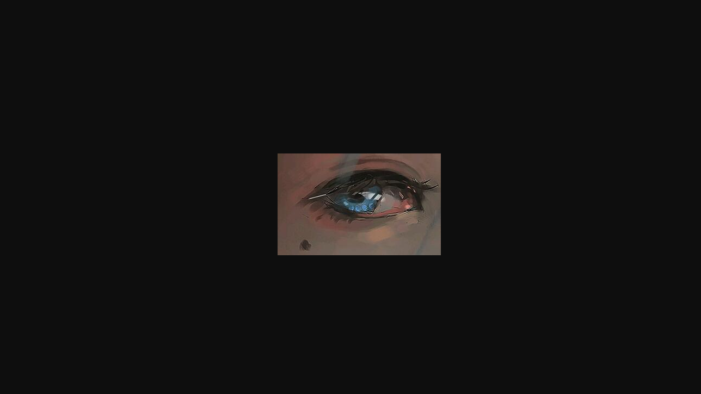

# 图形处理

> 利用GD库绘制图形，如果要绘制图形，要修改header成image形式

### 创建图象

-   imagecreatetruecolor(int \$width, int \$height): resource
    > 新建一个真彩色图像,，有些PHP版本会使得背景一直是黑色，可以使用imagecreatet()函数
-   imagecreatefromjpeg(string \$filename): resource

    imagecreatefrompng()

    imagecreatefromgif()

    imagecreatefromwbmp()
    > 由文件或URL创建一个新图象
-   imagesx(resource \$image): int

    imagesy()

    输出画布宽度/高度
-   getimagesize(string \$filename, array &\$imageinfo = ?): array
    > 获取图象属性

### 绘制图象

-   imagecolorallocate()
    > 给图象分配颜色，后面再应用颜色，（第一次调用是填充背景）
    > 格式：
    ```php
    imagecolorallocate(
        resource $image,
        int $red,
        int $green,
        int $blue
    ): int
    ```
    ```php
    <?php
    header("Content-type: image/png");
    $im = imagecreate(100, 50);
    $background_color = imagecolorallocate($im, 255, 255, 255);
    imagepng($im);
    imagedestroy($im);
    ?>
    ```
    
-   imagefill()
    > 区域填充
    > 格式：
    ```php
    imagefill(
        resource $image,
        int $x,
        int $y,
        int $color
    ): bool
    ```
    ```php
    <?php
    header("Content-type: image/png");
    $im = imagecreate(100, 50);
    $background_color = imagecolorallocate($im, 255, 255, 255);
    $red = imagecolorallocate($im, 255, 0, 0);
    imagefill($im, 0, 0, $red);
    imagepng($im);
    imagedestroy($im);
    ?>
    ```
    
-   imagesetpixel()
    > 画一个单一像素
    > 格式：
    ```php
    imagesetpixel(
        resource $image,
        int $x,
        int $y,
        int $color
    ): bool
    ```
    ```php
    <?php
    header("Content-type: image/png");
    $im = imagecreate(100, 50);
    $background_color = imagecolorallocate($im, 255, 255, 255);
    $red = imagecolorallocate($im, 255, 0, 0);
    imagesetpixel($im, 50, 25, $red);
    imagepng($im);
    imagedestroy($im);
    ?>
    ```
    
-   imageline()
    > 画一条线段
    > 格式：
    ```php
    imageline(
        resource $image,
        int $x1,
        int $y1,
        int $x2,
        int $y2,
        int $color
    ): bool
    ```
    从（x1,y1）画到（x2,y2）
    ```php
    <?php
    header("Content-type: image/png");
    $im = imagecreate(100, 50);
    $background_color = imagecolorallocate($im, 255, 255, 255);
    $red = imagecolorallocate($im, 255, 0, 0);
    for($i=26;$i<35;$i++){
    imageline($im,0,$i,100,$i,$red);
    }
    imagepng($im);
    imagedestroy($im);
    ?>
    ```
    
-   imagerectangle()
    > 画一个矩形
    > 格式：
    ```php
    imagerectangle(
        resource $image,
        int $x1,
        int $y1,
        int $x2,
        int $y2,
        int $col
    ): bool
    ```
    ```php
    <?php
    header("Content-type: image/png");
    $im = imagecreate(100, 50);
    $background_color = imagecolorallocate($im, 255, 255, 255);
    $red = imagecolorallocate($im, 255, 0, 0);
    imagerectangle($im,10,15,90,25,$red);
    imagepng($im);
    imagedestroy($im);
    ?>
    ```
    
-   imagestring()
    > 水平地画一行字符串
    > 格式：
    ```php
    imagestring(
        resource $image,
        int $font,   
        int $x,
        int $y,
        string $s,
        int $col
    ): bool
    ```
    | font | 字体大小1,2,3,4,5，使用内置字体 |
    | ---- | -------------------- |
    | x/y  | 开始坐标，也是字符串的左上角       |
    | s    | 绘画的字符串               |
    ```php
    <?php
    header("Content-type: image/png");
    $im = imagecreate(100, 50);
    $background_color = imagecolorallocate($im, 255, 255, 255);
    $red = imagecolorallocate($im, 255, 0, 0);
    imagestring($im,5,15,15,'NlinX',$red);
    imagepng($im);
    imagedestroy($im);
    ?>
    ```
    
-   imagecolordeallocate()
    > 取消颜色分配
    > 格式：
    ```php
    imagecolordeallocate(resource $image, int $color): bool
    ```
    ```php
    <?php
    header("Content-type: image/png");
    $im = imagecreate(100, 50);
    $background_color = imagecolorallocate($im, 255, 255, 255);
    $red = imagecolorallocate($im, 255, 0, 0);
    imagestring($im,5,15,15,'NlinX',$red);
    imagecolordeallocate($im,$background_color);
    imagepng($im);
    imagedestroy($im);
    ?>
    ```
    
-   imagettftext()
    > 用 TrueType 字体向图像写入文本
    ```php
    imagettftext(
        resource $image,
        float $size,
        float $angle,
        int $x,
        int $y,
        int $color,
        string $fontfile,
        string $text
    ): array
    ```
    | size     | 字体尺寸，单位：磅            |
    | -------- | -------------------- |
    | angle    | 角度（逆时针），以左下角为中心      |
    | x/y      | 大概为字符的左下角，基线位置，不是最底端 |
    | fontfile | TrueType 字体的路径       |
    | text     | UTF-8 编码的文本字符串       |
    ```php
    <?php
    header("Content-type: image/png");
    $im = imagecreate(100, 50);
    $background_color = imagecolorallocate($im, 255, 255, 255);
    $red = imagecolorallocate($im, 255, 0, 0);
    imagettftext($im,15,15,15,30,$red,'qifu.ttf','NlinX');
    imagepng($im);
    imagedestroy($im);
    ?>
    ```
    
-   imagettfbbox()
    > 计算 TrueType 文字所占区域
    > 格式：
    ```php
    imagettfbbox(
        float $size,
        float $angle,
        string $fontfile,
        string $text
    ): array
    ```
    | size                          | 像素大小     |
    | ----------------------------- | -------- |
    | angle                         | 角度       |
    | fontfile                      | 字体路径     |
    | text                          | 字符串      |
    | 函数返回一个含有 8 个单元的数组表示了文本外框的四个角： |          |
    | 0                             | 左下角 X 位置 |
    | -                             | -------- |
    | 1                             | 左下角 Y 位置 |
    | 2                             | 右下角 X 位置 |
    | 3                             | 右下角 Y 位置 |
    | 4                             | 右上角 X 位置 |
    | 5                             | 右上角 Y 位置 |
    | 6                             | 左上角 X 位置 |
    | 7                             | 左上角 Y 位置 |
    ```php
    <?php
    print_r(imagettfbbox(15,15,'qifu.ttf','NlinX'));
    echo('</br>');
    print_r(imagettfbbox(15,30,'qifu.ttf','NlinX'));
    ?>

    ```
    输出结果：

    Array ( \[0] => -1 \[1] => -1 \[2] => 39 \[3] => -11 \[4] => 35 \[5] => -27 \[6] => -6 \[7] => -16 ) &#x20;
    Array ( \[0] => -1 \[1] => -1 \[2] => 37 \[3] => -22 \[4] => 29 \[5] => -37 \[6] => -10 \[7] => -15 )
-   imagecopy()
    > 拷贝图像的一部分
    > 格式：
    ```php
    imagecopy(
        resource $dst_im,
        resource $src_im,
        int $dst_x,
        int $dst_y,
        int $src_x,
        int $src_y,
        int $src_w,
        int $src_h
    ): bool
    ```
    | dst\_im | 要拷贝到的图像 |
    | ------- | ------- |
    | src\_im | 待拷贝的图像  |
    ```php
    <?php
    header("Content-type: image/png");
    $im = imagecreate(100, 50);
    $background_color = imagecolorallocate($im, 255, 255, 255);
    $red = imagecolorallocate($im, 255, 0, 0);
    imagettftext($im,15,15,15,30,$red,'qifu.ttf','NlinX');
    $im2 = imagecreate(140, 90);
    imagecolorallocate($im2,169,188,245);
    imagecopy($im2,$im,20,20,0,0,100,50);
    imagepng($im2);
    imagedestroy($im);
    ?>
    ```
    
-   imagecopymerge()
    > 拷贝并合并图像的一部分，（合并相当于设置透明度）
    > 格式：
    ```php
    imagecopymerge(
        resource $dst_im,
        resource $src_im,
        int $dst_x,
        int $dst_y,
        int $src_x,
        int $src_y,
        int $src_w,
        int $src_h,
        int $pct
    ): bool
    ```
    | pct | 合并程度，0相当于完全透明，100相当于完全覆盖 |
    | --- | ------------------------ |
    ```php
    <?php
    header("Content-type: image/png");
    $im = imagecreate(100, 50);
    $background_color = imagecolorallocate($im, 255, 255, 255);
    $red = imagecolorallocate($im, 255, 0, 0);
    imagettftext($im,15,15,15,30,$red,'qifu.ttf','NlinX');
    $im2 = imagecreate(140, 90);
    imagecolorallocate($im2,169,188,245);
    imagecopymerge($im2,$im,20,20,0,0,100,50,30);
    imagepng($im2);
    imagedestroy($im);
    ?>
    ```
    

    ⭐  \*\*`imagecopymerge`****和****`imagecopy`****区别：****`imagecopy`****不能设置透明度，但是可以保留png图片的透明信息，****`imagecopymerge`\*\***可以设置透明度但是背景的透明会被填充，无填充时为黑色**
-   imagecopyresampled()
    > 重采样拷贝部分图像并调整大小
    > 格式：
    ```php
    imagecopyresampled(
        resource $dst_image,
        resource $src_image,
        int $dst_x,
        int $dst_y,
        int $src_x,
        int $src_y,
        int $dst_w,
        int $dst_h,
        int $src_w,
        int $src_h
    ): bool
    ```
    ```php
    //图示：

                      $src_image                                   $dst_image
    +------------+-----------------------------+   +------------+--------------------+
    |            |                             |   |            |                    |
    |            |                             |   |         $dst_y                  |
    |            |                             |   |            |                    |
    |         $src_y                           |   +-- $dst_x --+----$dst_width----+ |
    |            |                             |   |            |                  | |
    |            |                             |   |            |    Resampled     | |
    |            |                             |   |            |                  | |
    +-- $src_x --+------ $src_width ------+    |   |       $dst_height             | |
    |            |                        |    |   |            |                  | |
    |            |                        |    |   |            |                  | |
    |            |                        |    |   |            |                  | |
    |            |                        |    |   |            +------------------+ |
    |            |        Sample          |    |   |                                 |
    |            |                        |    |   |                                 |
    |            |                        |    |   |                                 |
    |       $src_height                   |    |   |                                 |
    |            |                        |    |   +---------------------------------+
    |            |                        |    |
    |            |                        |    |
    |            +------------------------+    |
    |                                          |
    |                                          |
    +------------------------------------------+
    ```
    如果 dst\_image 和 src\_image 相同的话，相当于对同一个图像进行修改
    ```php
    <?php
    header("Content-type: image/png");
    $im = imagecreate(100, 50);
    $background_color = imagecolorallocate($im, 255, 255, 255);
    $red = imagecolorallocate($im, 255, 0, 0);
    imagettftext($im,15,15,15,30,$red,'qifu.ttf','NlinX');
    $im2 = imagecreate(200, 100);
    imagecolorallocate($im2, 255, 255, 255);
    imagecopyresampled($im2,$im,0,0,0,0,200,100,100,50);
    imagepng($im2);
    imagedestroy($im);
    ?>
    ```

### 生成图象

-   header()
-   bool imagegif ( resource image \[, string filename] ) &#x20;

    bool imagejpeg ( resource image \[, string filename \[, int quality]] ) &#x20;

    bool imagepng ( resource image \[, string filename] ) &#x20;

    bool imagewbmp ( resource image \[, string filename \[, int foreground]] )
    | image      | 欲输出的图像资源，如 imagecreate() 或 imagecreatefrom 系列函数的返回值               |
    | ---------- | ----------------------------------------------------------------- |
    | filename   | 可选，指定输出图像的文件名。如果省略，则原始图像流将被直接输出。                                  |
    | quality    | 可选，指定图像质量，范围从 0（最差质量，文件最小）到 100（最佳质量，文件最大），默认75 ，imagejpeg() 独有参数 |
    | foreground | 可选，指定前景色，默认前景色是黑色，imagewbmp() 独有参数                                |

### 释放资源

-   imagedestroy()

### 案例

#### 随机验证码

```php
<?php
header("Content-type: image/png");
$width=120;
$height=40;
$element=array
('a','b','c','d','e','f','g','h','i','j','k','m','n','o','p','q','r','s','t','u','v','w','x','y','z');
$string='';
//获取5个随机验证码
for ($i=0;$i<5;$i++){
  $string.=$element[rand(0,count($element)-1)];
}
//创建画布
$img = imagecreate($width, $height);
//绘制随机背景
$background_color = imagecolorallocate($img,rand(200,255),rand(200,255),rand(200,255));
//分配字体颜色
$colorString=imagecolorallocate($img,rand(10,100),rand(10,100),rand(10,100));
//分配像素点颜色
$colorPix=imagecolorallocate($img,rand(100,200),rand(100,200),rand(100,200));
//分配线条颜色
$colorLine=imagecolorallocate($img,rand(100,200),rand(100,200),rand(100,200));
//绘制随机验证码
imagettftext($img,30,rand(-5,5),rand(10,20),rand(30,35),$colorString,'qifu.ttf',$string);
//绘制随机像素点
for($i=0;$i<100;$i++){
  imagesetpixel($img,rand(1,$width-2),rand(1,$height-2),$colorPix);
}
//绘制随机线条
for($i=0;$i<4;$i++){
  imageline($img,rand(0,$width/4),rand(0,$height),rand(($width/4)*3,$width),rand(0,$height),$colorLine);
}
imagepng($img);
imagedestroy($img);
?>
```

输出结果：


***SketchyComic***  字体：


#### 添加水印

```php
<?php
header("Content-type: image/jpeg");
//原图
$img=imagecreatefromjpeg('gui.jpg');
//水印
$waterMark=imagecreatefrompng('mark.png');
//文字水印颜色
$colorMark=imagecolorallocate($img, 255, 255, 255);
//获取原图宽高
$width=imagesx($img);
$height=imagesy($img);
//获取图片水印宽高
$waterMarkWidth=imagesx($waterMark);
$waterMarkHeight=imagesy($waterMark);
//获取文字水印占宽
$position=imagettfbbox(20, 0, 'qifu.ttf', 'NlinX');
$stringWidth=$position[2]-$position[0];
//绘制文字水印
imagettftext($img, 20, 0, $width-$stringWidth-($width/30), $height-1-($height/30), $colorMark, 'qifu.ttf', 'NlinX');
//添加图片水印
imagecopy($img, $waterMark,($width-$waterMarkWidth)/2 , $height-$waterMarkHeight-10, 0, 0, $waterMarkWidth, $waterMarkHeight);
imagejpeg($img);
imagedestroy($img);
?>
```


#### 固定宽度等比例缩放

```php
<?php
header("Content-type: image/jpeg");
//原图
$img=imagecreatefromjpeg('file/gui.jpg');
$width=300;

$imgWidth=imagesx($img);
$imgHeight=imagesy($img);

$height=($imgHeight/$imgWidth)*$width;
$img1=imagecreatetruecolor($width, $height);
//缩放
imagecopyresampled($img1, $img, 0, 0, 0, 0, $width, $height, $imgWidth, $imgHeight);
//裁剪
//imagecopyresampled($img1, $img, 0, 0, 880,265, 300, 300, 300, 300);
imagejpeg($img1);
imagedestroy($img);
imagedestroy($img1);
?>
```

缩放：


裁剪：


