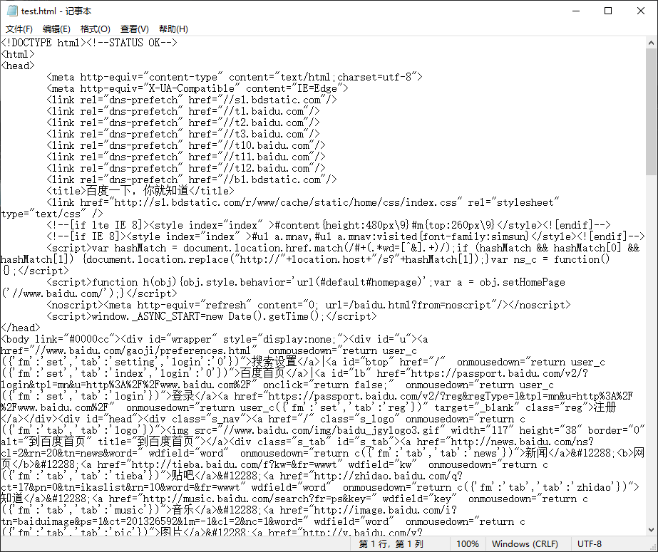
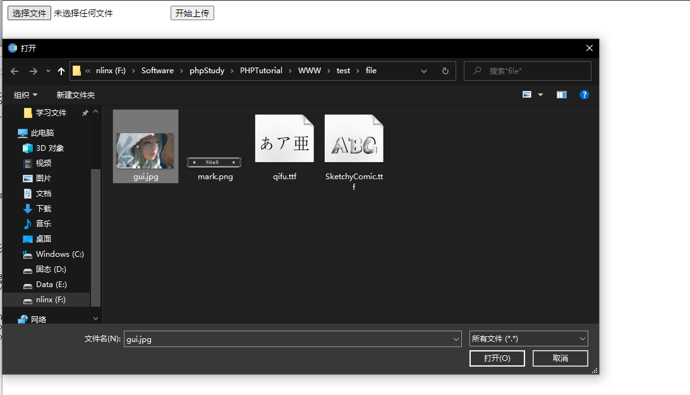

# 文件操作

### 目录

| 函数                        | 功能                |
| ------------------------- | ----------------- |
| **判断文件/路径**               |                   |
| **is\_file()**            | 确认文件是否存在          |
| **is\_dir()**             | 判断路径是否存在          |
| **clearstatcache()**      | 清除文件状态缓存          |
| **文件属性**                  |                   |
| **file\_exists()**        | 判断文件或路径是否存在       |
| **filesize()**            | 获取文件大小            |
| **is\_readable()**        | 判断文件是否可读          |
| **is\_writable()**        | 判断文件是否可写          |
| **filectime()**           | 获取文件inode（文件创建时间） |
| **filemtime()**           | 获取文件修改（内容）时间      |
| **fileatime()**           | 获取文件上次访问时间        |
| **stat()**                | 获取文件的大部分信息        |
| **目录操作**                  |                   |
| **basename()**            | 返回路径文件名部分         |
| **dirname()**             | 返回路径中目录部分         |
| **pathinfo()**            | 获取文件路径的信息         |
| **opendir()**             | 打开一个目录句柄（目录流）     |
| **readdir()**             | 函数返回目录中下一个文件的文件名  |
| **rewinddir()**           | 重置句柄资源到开头         |
| **closedir()**            | 关闭目录句柄资源          |
| **mkdir()**               | 新建目录              |
| **rmdir()**               | 删除空的目录            |
| **scandir()**             | 返回目录中的文件和目录的数组    |
| **文件操作**                  |                   |
| **fopen()**               | 打开文件或url          |
| **fread()**               | 读取文件（按字节）         |
| **fgets()**               | 读取文件一行数据          |
| **feof()**                | 测试文件指针是否到了文件结束的位置 |
| **fwrite()**              | 写入文件              |
| **rewind()**              | 将文件指针的位置倒回文件的开头   |
| **flock()**               | 锁定文件              |
| **ftruncate()**           | 将文件截断到给定的长度       |
| **fclose()**              | 关闭一个已打开的文件指针      |
| **file()**                | 把整个文件读入一个数组中      |
| **copy()**                | 拷贝文件              |
| **unlink()**              | 删除文件              |
| **file\_get\_contents()** | 将整个文件读入一个字符串      |
| **file\_put\_contents()** | 将一个字符串写入文件        |
| **rename()**              | 重命名一个文件或目录        |
| **readfile()**            | 读取文件并写入到输出缓冲      |

### 判断文件/目录

-   **is\_file()**
    > 确认文件是否存在
    > 格式：
    ```php
    is_file(string $filename): bool
    ```
-   **is\_dir()**
    > 判断路径是否存在，可以是相对路径
    > 格式：
    ```php
    is_dir(string $filename): bool
    ```
-   **clearstatcache()**
    > 清除文件状态缓存，当文件第一次被调用后被删除或修改，缓存可能会影响结果
    > 受影响的函数：
    > \| stat()         | lstat()        | file\_exists()   |
    > \| -------------- | -------------- | ---------------- |
    > \| is\_writable() | is\_readable() | is\_executable() |
    > \| is\_file()     | is\_dir()      | is\_link()       |
    > \| filectime()    | fileatime()    | filemtime()      |
    > \| fileinode()    | filegroup()    | fileowner()      |
    > \| filesize()     | filetype()     | fileperms()      |

### 文件属性

-   **file\_exists()**
    > 判断文件或路径是否存在
    > 相当于`is_file()`+`is_dir()`
    -   区别：运行效率别`is_file()` 慢很多很多，但是如果文件不存在的情况下，比`is_file()`快那么一丢丢，几乎是一样的，因为文件是否存在不影响`file_exists()`，但却影响`is_file()`

        ⭐ **所以总结还是推荐用**\*\*`is_file()`\*\*
-   **filesize()**
    > 获取文件大小
    ```php
    filesize(string $filename): int
    ```
-   **is\_readable()**
    > 判断文件是否可读
    ```php
    is_readable(string $filename): bool
    ```
-   **is\_writable()**
    > 判断文件是否可写
    ```php
    is_writable(string $filename): bool
    ```
-   **filectime()**
    > 获取文件inode（索引结点）修改时间，以Unix时间戳方式返回，一般来说如果不修改的话相当于是创建时间
    ```php
    filectime(string $filename): int
    ```
-   **filemtime()**
    > 获取文件修改（内容）时间
    ```php
    filemtime(string $filename): int

    ```
-   **fileatime()**
    > 获取文件上次访问时间
    ```php
    fileatime(string $filename): int
    ```
-   **stat()**
    > 获取文件的大部分信息
    ```php
    stat(string $filename): array
    ```
    | 数字下标 | 关联键名    | 说明                                                            |
    | ---- | ------- | ------------------------------------------------------------- |
    | 0    | dev     | device number - 设备名                                           |
    | 1    | ino     | inode number - inode 号码                                       |
    | 2    | mode    | inode protection mode - inode 保护模式                            |
    | 3    | nlink   | number of links - 被连接数目                                       |
    | 4    | uid     | userid of owner - 所有者的用户 id                                   |
    | 5    | gid     | groupid of owner- 所有者的组 id                                    |
    | 6    | rdev    | device type, if inode device \* - 设备类型，如果是 inode 设备的话         |
    | 7    | size    | size in bytes - 文件大小的字节数                                      |
    | 8    | atime   | time of last access (unix timestamp) - 上次访问时间（Unix 时间戳）       |
    | 9    | mtime   | time of last modification (unix timestamp) - 上次修改时间（Unix 时间戳） |
    | 10   | ctime   | time of last change (unix timestamp) - 上次改变时间（Unix 时间戳）       |
    | 11   | blksize | blocksize of filesystem IO \* - 文件系统 IO 的块大小                  |
    | 12   | blocks  | number of blocks allocated - 所占据块的数目                          |

### 目录操作

-   **basename()**
    > 返回路径文件名部分
    > 格式：
    ```php
    basename(string $path, string $suffix = ?): string
    ```
    | suffix         | 可选。规定文件扩展名。如果文件有 suffix，则不会输出这个扩展名。 |
    | -------------- | ----------------------------------- |
    | ⭐ 只是单纯对字符串进行操作 |                                     |
    ```php
    <?php
    echo "1) ".basename("/etc/sudoers.d", ".d");
    echo "2) ".basename("/etc/sudoers.d");
    echo "3) ".basename("/etc/passwd");
    echo "4) ".basename("/etc/");
    echo "5) ".basename(".");
    echo "6) ".basename("/");
    ?> 
    ```
    输出结果：1) sudoers2) sudoers.d3) passwd4) etc5) .6)
-   **dirname()**
    > 返回路径中目录部分
    > 格式：
    ```php
    dirname(string $path, int $levels = 1): string
    ```
    | levels | 要向上的父目录数量，默认为1（PHP 7.0 后才添加） |
    | ------ | ---------------------------- |
    ```php
    <?php
    echo dirname("/etc/passwd") . PHP_EOL;
    echo dirname("/etc/") . PHP_EOL;
    echo dirname(".") . PHP_EOL;
    echo dirname("C:\\") . PHP_EOL;
    echo dirname("/usr/local/lib", 2);
    ?>
    ```
    输出结果：

    /etc
    / (or \ on Windows)
    .
    C:\\
    /usr
-   **pathinfo()**
    > 获取文件路径的信息
    > 格式：
    ```php
    pathinfo(string $path, int $flags = PATHINFO_ALL): array|string
    ```
    返回的数组：
    -   \[dirname]: 目录路径
    -   \[basename]: 文件名
    -   \[extension]: 文件后缀名
    -   \[filename]: 不包含后缀的文件名
        \| options | 可选。规定要返回的数组元素。默认是 all。
        可能的值：
        \*   PATHINFO\_DIRNAME - 只返回 dirname
        \*   PATHINFO\_BASENAME - 只返回 basename
        \*   PATHINFO\_EXTENSION - 只返回 extension
        \*   PATHINFO\_FILENAME - 只返回 filename |
        \| ------- | ------------------------------------------------------------------------------------------------------------------------------------------------------------------------------------------------------------ |
-   **opendir()**
    > 打开一个目录句柄，一个目录流，可配合`readdir()` 读取
    > 格式：
    ```php
    opendir(string $path, resource $context = ?): resource
    ```
-   **readdir()**
    > 函数返回目录中下一个文件的文件名
    > 格式：
    ```php
    readdir(resource $dir_handle = ?): string
    ```
    | dir\_handle | 可选。指定之前由 opendir() 打开的目录句柄资源。&#xA;如果该参数未指定，则使用最后一个由 opendir() 打开的链接。 |
    | ----------- | -------------------------------------------------------------------- |
    ```php
    <?php
    $dir='F:\Software\phpStudy\PHPTutorial\WWW';
    if(is_dir($dir)){
        if($dh=opendir($dir)){
            while (($file=readdir($dh))!==false) {
                echo "filename:".$file."</br>";
            }
            closedir($dh);//释放资源
        }
    }
    ?>

    ```
    输出结果：

    filename:. &#x20;
    filename:.. &#x20;
    filename:.idea &#x20;
    filename:index.php &#x20;
    filename:l.php &#x20;
    filename:phpinfo.php &#x20;
    filename:phpMyAdmin &#x20;
    filename:test
-   **rewinddir()**
    > 重置句柄资源到开头
    > 格式：
    ```php
    rewinddir(resource $dir_handle): void
    ```
    | dir\_handle | 可选。指定之前由 `opendir()` 打开的目录句柄资源。如果该参数未指定，则使用最后一个由 `opendir()` 打开的链接。 |
    | ----------- | ------------------------------------------------------------------- |
-   **closedir()**
    > 关闭目录句柄资源
    > 格式：
    ```php
    closedir(resource $dir_handle = ?): void
    ```
    | dir\_handle | 可选。指定之前由 `opendir()` 打开的目录句柄资源。如果该参数未指定，则关闭最后一个由 `opendir()` 打开的链接。 |
    | ----------- | ------------------------------------------------------------------- |
-   **mkdir()**
    > 新建目录
    > 格式：
    ```php
    mkdir(
        string $pathname,
        int $mode = 0777,
        bool $recursive = false,
        resource $context = ?
    ): bool
    ```
    ⭐ windows下忽略mode
    | mode      | 可选。规定权限。默认是 0777（允许全局访问）。&#xA;&#xA;mode 参数由四个数字组成：&#xA;\*   第一个数字通常是 0&#xA;\*   第二个数字规定所有者的权限&#xA;\*   第三个数字规定所有者所属的用户组的权限&#xA;\*   第四个数字规定其他所有人的权限&#xA;&#xA;可能的值（如需设置多个权限，请对下面的数字进行总计）：&#xA;\*   1 = 执行权限&#xA;\*   2 = 写权限&#xA;\*   4 = 读权限 |
    | --------- | -------------------------------------------------------------------------------------------------------------------------------------------------------------------------------------------------------------------------------------------- |
    | recursive | 可选。规定是否设置递归模式。（PHP 5 中新增的）                                                                                                                                                                                                                   |
    | context   | 可选。规定文件句柄的环境。context 是一套可以修改流的行为的选项。（PHP 5 中新增的）                                                                                                                                                                                             |
-   **rmdir()**
    > 删除**空**的目录
    ```php
    rmdir(string $dirname, resource $context = ?): bool
    ```
-   **scandir()**
    > 返回目录中的文件和目录的数组
    ```php
    scandir(string $directory, int $sorting_order = ?, resource $context = ?): array
    ```
    | sorting\_order | 可选。规定排列顺序。默认是 0，表示按字母升序排列。如果设置为 SCANDIR\_SORT\_DESCENDING 或者 1，则表示按字母降序排列。如果设置为 SCANDIR\_SORT\_NONE，则返回未排列的结果。 |
    | -------------- | -------------------------------------------------------------------------------------------------------------- |
    ```php
    <?php
    $dir='F:\Software\phpStudy\PHPTutorial\WWW';
    print_r(scandir($dir,1));
    ?>

    ```
    返回结果：Array ( \[0] => test \[1] => phpinfo.php \[2] => phpMyAdmin \[3] => l.php \[4] => index.php \[5] => .idea \[6] => .. \[7] => . )

### 文件操作

-   **fopen()**
    > 打开文件或url
    ```php
    fopen(
        string $filename,
        string $mode,     //多个参数可写在一起
        bool $use_include_path = false,
        resource $context = ?
    ): resource
    ```
    | `mode` | 说明                                                                                                                                                          |
    | ------ | ----------------------------------------------------------------------------------------------------------------------------------------------------------- |
    | `'r'`  | 只读方式打开，将文件指针指向文件头。                                                                                                                                          |
    | `'r+'` | 读写方式打开，将文件指针指向文件头。                                                                                                                                          |
    | `'w'`  | 写入方式打开，将文件指针指向文件头并将文件大小截为零。如果文件不存在则尝试创建之。                                                                                                                   |
    | `'w+'` | 读写方式打开，将文件指针指向文件头并将文件大小截为零。如果文件不存在则尝试创建之。                                                                                                                   |
    | `'a'`  | 写入方式打开，将文件指针指向文件末尾。如果文件不存在则尝试创建之。                                                                                                                           |
    | `'a+'` | 读写方式打开，将文件指针指向文件末尾。如果文件不存在则尝试创建之。                                                                                                                           |
    | `'x'`  | 创建并以写入方式打开，将文件指针指向文件头。如果文件已存在，则 `fopen()` 调用失败并返回 **`false`**，并生成一条 **`E_WARNING`** 级别的错误信息。如果文件不存在则尝试创建之。这和给底层的 `open(2)` 系统调用指定 `O_EXCL\|O_CREAT` 标记是等价的。 |
    | `'x+'` | 创建并以读写方式打开，其他的行为和 `'x'` 一样。                                                                                                                                 |
    | `'c'`  | 创建并以写入方式打开，将文件指针指向文件头。如果文件已存在，则指针指向文件头                                                                                                                      |
    | `'c+'` | 创建并以读写方式打开，其他的行为和 `'c'` 一样。                                                                                                                                 |
    | `'b'`  | 以二进制模式打开                                                                                                                                                    |
    | `'t'`  | windows下可以透明地将 \n 转换为 \r\n                                                                                                                                  |
-   **fread()**
    > 读取文件，读取到*length*个字节或者文件末尾（EOF）就停止
    ```php
    fread(resource $handle, int $length): string
    ```
    | length | **必需**。规定要读取的最大字节数。 |
    | ------ | ------------------- |
    ```php
    <?php
    header('Content-type:text/html;charset=utf-8');  //为了输出中文 所以用uft-8
    $file=fopen('test.txt','r');
    var_dump(fread($file,10));   //utf-8编码 一个中文占3个字节
    ?>

    ```
    输出结果：

    string(10) "### 目录"
-   **fgets()**
    > 读取文件的一行数据，读取到EOF、length-1或换行符后停止
    ```php
    fgets(resource $handle, int $length = ?): string
    ```
    | length | 可选。读取length-1个字节。默认是 1024 字节。 |
    | ------ | ----------------------------- |
-   **feof()**
    > 测试文件指针是否到了文件结束（EOF）的位置
    ```php
    feof(resource $handle): bool
    ```
    ⭐ 如果文件指针到了 EOF 或者出错时则返回 **`true`**，否则返回一个错误（包括 socket 超时），其它情况则返回 **`false`**。
-   **fwrite()**
    > 写入文件
    ```php
    fwrite(resource $handle, string $string, int $length = ?): int
    ```
    | length | 可选。当写入了length个字节或者写完string后，写入就停止 |
    | ------ | --------------------------------- |
-   **rewind()**
    > 将文件指针的位置倒回文件的开头
    ```php
    rewind(resource $stream): bool
    ```
-   **flock()**
    > 锁定文件
    ```php
    flock(resource $handle, int $operation, int &$wouldblock = ?): bool
    ```
    | operation | 要取得共享锁定（读取的程序），将 *lock* 设为 LOCK\_SH（PHP 4.0.1 以前的版本设置为 1）。&#xA;要取得独占锁定（写入的程序），将 *lock* 设为 LOCK\_EX（PHP 4.0.1 以前的版本中设置为 2）。&#xA;要释放锁定（无论共享或独占），将 *lock* 设为 LOCK\_UN（PHP 4.0.1 以前的版本中设置为 3）。&#xA;如果不希望 flock() 在锁定时堵塞，则给 *lock* 加上 LOCK\_NB（PHP 4.0.1 以前的版本中设置为 4）。（格式为 `LOCK_EX+LOCK_NB`） |
    | --------- | ---------------------------------------------------------------------------------------------------------------------------------------------------------------------------------------------------------------------------------------------------------------------------------------- |
-   **ftruncate()**
    > 将文件截断到给定的长度
    ```php
    ftruncate(resource $handle, int $size): bool

    ```
-   **fclose()**
    > &#x20;关闭一个已打开的文件指针
    ```php
    fclose(resource $handle): bool
    ```
-   **file()**
    > 把整个文件读入一个数组中,一行一行存入，每个元素都包含行末的换行符
    ```php
    file(string $filename, int $flags = 0, resource $context = ?): array
    ```
    | flags | \*\*`FILE_USE_INCLUDE_PATH`**在 [include\_path](https://www.php.net/manual/zh/ini.core.php#ini.include-path "include_path") 中查找文件。&#xA;**`FILE_IGNORE_NEW_LINES`**省略数组中每个元素末尾的换行符&#xA;**`FILE_SKIP_EMPTY_LINES`\*\*跳过空行 |
    | ----- | ---------------------------------------------------------------------------------------------------------------------------------------------------------------------------------------------------------------------- |
-   **copy()**
    > 拷贝文件，如果目标文件已存在，将会被覆盖。
    ```php
    copy(string $source, string $dest, resource $context = ?): bool
    ```
-   **unlink()**
    > 删除文件
    ```php
    unlink(string $filename, resource $context = ?): bool
    ```
    | PHP 7.3.0 | 现在 Windows 也可以用 `unlink()` 删除文件句柄还在使用中的文件了，在此之前是无法删除的。 然而，还是无法重新创建文件，需要等到所有句柄都关闭才可以。 |
    | --------- | ------------------------------------------------------------------------------------ |
-   **file\_get\_contents()**
    > 将整个文件读入一个字符串
    ```php
    file_get_contents(
        string $filename,
        bool $use_include_path = false,
        resource $context = ?,
        int $offset = 0,
        int $length = ?
    ): string|false
    ```
    | path          | 必需。规定要读取的文件。如果有特殊字符（比如空格，可以用urlencode() 进行 URL 编码）       |
    | ------------- | -------------------------------------------------------- |
    | include\_path | 可选。如果您还想在 include\_path（在 php.ini 中）中搜索文件的话，请设置该参数为 '1'。 |
    | context       | 可选。规定文件句柄的环境。context 是一套可以修改流的行为的选项。若使用 NULL，则忽略。        |
    | start         | 可选。规定在文件中开始读取的位置。该参数是 PHP 5.1 中新增的。                      |
    | max\_length   | 可选。规定读取的字节数。该参数是 PHP 5.1 中新增的。                           |
-   **file\_put\_contents()**
    > 将一个字符串写入文件
    ```php
    file_put_contents(
        string $filename,
        mixed $data,
        int $flags = 0,
        resource $context = ?
    ): int
    ```
    | flags                   |                                                    |
    | ----------------------- | -------------------------------------------------- |
    | ILE\_USE\_INCLUDE\_PATH | 在 include 目录里搜索 `filename`。 更多信息可参见 include\_path。 |
    | FILE\_APPEND            | 如果文件 `filename` 已经存在，追加数据而不是覆盖。                    |
    | LOCK\_EX                | 在写入时获得一个独占锁。                                       |
    ```php
    <?php 
    header('Content-type:text/html;charset=utf-8');
    file_put_contents('test.txt',file_get_contents('http://www.baidu.com'));
    ?>
    ```
    
-   **rename()**
    > 重命名一个文件或目录
    ```php
    rename(string $oldname, string $newname, resource $context = ?): bool
    ```
    ⭐  如果重命名文件时 `newname` 已经存在，将会覆盖掉它。 如果重命名文件夹时 `newname` 已经存在，本函数将导致一个警告
-   **readfile()**
    > 读取文件并写入到输出缓冲
    ```php
    readfile(string $filename, bool $use_include_path = false, resource $context = ?): int
    ```

### 文件上传

-   **form表单上传**

    metho="POST"   //get有字节限制

    enctype="multipart/form-data"    //以二进制编码传输

    &#x20;\<input>标签type="file"
    ```html
    <form action="" method="post" enctype="multipart/form-data">
      <input type="file" name="myfile" />
      <input type="submit" name="submit" value="开始上传" />
    </form>
    ```
    
-   **在**\*\*`php.ini`\*\***设置中**
    | 配置项                   | 说明                                           |
    | --------------------- | -------------------------------------------- |
    | file\_uploads         | 确定服务器上的PHP脚本是否可以接受HTTP文件上传&#xD;              |
    | memory\_limit         | 设置脚本可以分配的最大内存量，防止失控的脚本独占服务器内存                |
    | upload\_max\_filesize | 限制PHP处理上传文件的最大值，此值必须小于post\_max\_size值&#xD;  |
    | post\_max\_size       | 限制通过POST方法可以接受的信息最大量                         |
    | upload\_tmp\_dir      | 上传文件存放的临时路径，可以是一个绝对路径。这个目录对于拥有此服务器进程用户必须是可写的 |
-   \*\*`$_FILES`\*\***多维数组**
    | 元素                               | 说明                                                                                                                                                                         |
    | -------------------------------- | -------------------------------------------------------------------------------------------------------------------------------------------------------------------------- |
    | \$\_FILES\['file']\['name']      | 文件的原名称，包含扩展名                                                                                                                                                               |
    | \$\_FILES\['file']\['size']      | 文件的大小，单位为字节                                                                                                                                                                |
    | \$\_FILES\['file']\['tmp\_name'] | 文件上传之后，在服务器端存储的临时文件名,包含路径                                                                                                                                                  |
    | \$\_FILES\['file']\['error']     | 文件上传时产生的错误&#xA;0：表示没有发生任何错误，文件上传成功&#xA;1：表示上传文件的大小超出了在PHP配置文件中upload\_max\_filesize选项限制的值&#xA;2：表示上传文件大小超出了HTML表单中MAX\_FILE\_SIZE选项所指定的值&#xA;3：表示文件只被部分上传&#xA;4：表示没有上传任何文件 |
    | \$\_FILES\['file']\['type']      | 获取客户端上传文件的MIME类型                                                                                                                                                           |
-   **is\_uploaded\_file()**
    > 判断文件是否通过HTTP POST上传的
    ```php
    is_uploaded_file(string $filename): bool
    ```
-   **move\_uploaded\_file()**
    > 将上传的文件移动到新位置，会检查文件是否是通过HTTP POST上传的
    ```php
    move_uploaded_file(string $filename, string $destination): bool
    ```

### 案例&#x20;

#### 文件上传并保存

```php
<?php
header('Content-type:text/html;charset=uft-8');
date_default_timezone_set('Asia/Shanghai');
if(isset($_POST['submit'])){
    if (is_uploaded_file($_FILES['myfile']['tmp_name'])) {
        //获取文件路径信息
        $arr=pathinfo($_FILES['myfile']['name']);
        //按日期生成新的名字
        $newName=date('YmdGis').rand(1000,9999);
        //把上传的文件从临时文件移动到upload/{新名字}.{源文件后缀}
        if (move_uploaded_file($_FILES['myfile']['tmp_name'], "upload/{$newName}.{$arr['extension']}")) {
            echo "上传成功！";
        }else{
            echo "上传失败！";
        }
    }else{
        echo "不正常上传！";
    }
}
?>
<!DOCTYPE html>
<html lang="zh-CN">
<head>
<meta charset="utf-8" />
<title>上传页面</title>
</head>
<body>
<form action="" method="post" enctype="multipart/form-data">
  <input type="file" name="myfile" />
  <input type="submit" name="submit" value="开始上传" />
</form>
</body>
</html>
```




#### 文件下载

```php
<?php
 
$filename = $_GET['filename'];
// 修改这一行设置你的文件下载目录
$download_path = "ficheros/";
// 不能下载上一层目录的文件
if(eregi("\.\.", $filename)) die("抱歉，你不能下载该文件！");
$file = str_replace("..", "", $filename);
// 包含 .ht 的文件不能下载
if(eregi("\.ht.+", $filename)) die("抱歉，你不能下载该文件！");
// 创建文件下载路径
$file = "$download_path$file";
// 判断文件是否存在
if(!file_exists($file)) die("抱歉，文件不存在！");
//  文件类型，作为头部发送给浏览器
$type = filetype($file);
// 获取时间和日期
$today = date("F j, Y, g:i a");
$time = time();
// 发送文件头部
header("Content-type: $type");
header("Content-Disposition: attachment;filename=$filename");
header("Content-Transfer-Encoding: binary");
header('Pragma: no-cache');
header('Expires: 0');
// 发送文件内容
set_time_limit(0);
readfile($file);
?>
```
