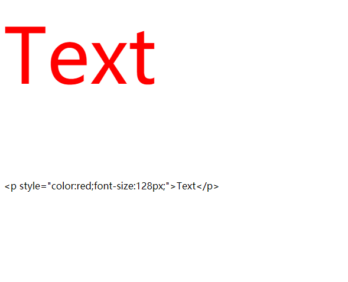
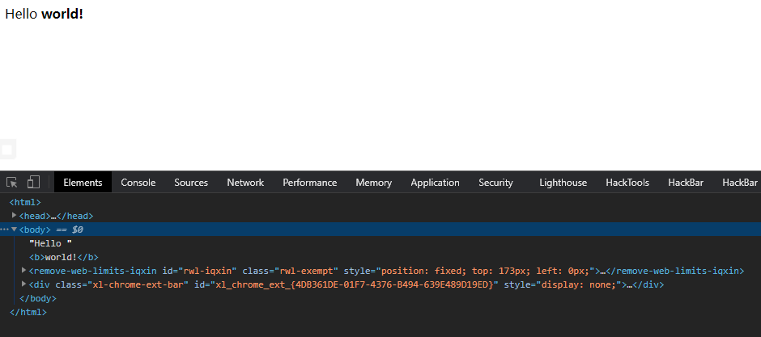

# 简单语法

### unset()  释放变量

```php
unset()

// 销毁单个变量
unset ($foo);
// 销毁单个数组元素
unset ($bar['quux']);
// 销毁一个以上的变量
unset($foo1, $foo2, $foo3);
```

-   如果在函数中 unset() 一个通过引用传递的变量，则只是局部变量被销毁，而在调用环境中的变量将保持调用 unset() 之前一样的值。（类似于只传递了形参）
    ```php
    <?php
      function foo(&$bar) {
          unset($bar);
          $bar = "blah";
      }
      $bar = 'something';
      foo($bar);
      echo "$bar\n";
    ?>

    ```
    > 输出结果为：something
-   &#x20;如果在函数中 unset() 一个全局变量，则只是局部变量被销毁，而在调用环境中的变量将保持调用 unset() 之前一样的值。 （但是如果函数内global 的情况下，不是unset()，而是改为赋值，则环境中的变量会被赋值）

    实例：
    ```php
    <?php
      function destroy_foo() {
        global $foo;
        unset($foo);
      }
      $foo = 'bar';
      destroy_foo();
      echo $foo;
    ?>

    ```
    > 输出结果为：bar
-   如果想在函数中 unset() 一个全局变量，可使用 \$GLOBALS 数组来实现：
    ```php
    <?php
      function foo() {
        unset($GLOBALS['bar']);
      }
      $bar = "something";
      foo();
    ?>
    ```

### var\_dump()  输出变量类型

```php
<?php 
  $var1=1;
  $var2=one;
  $var3=false;
  $var4=1.0;
  var_dump($var1) ;
  echo '</br>';
  var_dump($var2) ;
  echo '</br>';
  var_dump($var3) ;
  echo '</br>';
  var_dump($var4) ;
?>

```

> 输出结果：
> int(1) &#x20;
> string(3) "one" &#x20;
> bool(false) &#x20;
> float(1)

### 测试变量类型

-   `is_bool()`、`is_array()` 等
    ```php
      
    <?php
      $a=3;
      if (is_bool($a)){
        echo "bool";
      }
      if (is_int($a)){
        echo "int";
      }
    ?>

    ```
    输出结果：int

### 流程控制语句

-   break

    跳出循环，后面接数字表示跳出几层循环，默认一层
-   continue

    跳出本次循环，执行下一次循环，并不是结束整个循环语句
-   exit()、die()

    结束当前整个程序

### count() 统计数组元素数目

语法：count(array,mode);

|       |                                                                               |
| ----- | ----------------------------------------------------------------------------- |
| array | 必需。规定数组。                                                                      |
| mode  | 可选。规定模式。可能的值：&#xA;0 - 默认。不对多维数组中的所有元素进行计数&#xA;1 - 递归地计数数组中元素的数目（计算多维数组中的所有元素） |

```php
<?php 
$a=array(
    array(1,2,3),
    array(4,5,6)
);
echo count($a[1],1).','.count($a,1).','.count($a);
?>
```

输出结果：3,8,2

### trim() 移除两边空白或特定字符

-   如果不填写字符，则删除以下，如果要删除多个字符可连写，只有当匹配不到字符才停下来

    "\0" - NULL

    "\t" - 制表符

    "\n" - 换行

    "\x0B" - 垂直制表符

    "\r" - 回车

    " " - 空格
    ```php
    <?php
      $str='abccazzzbaczzzabab';
      var_dump(trim($str,'bac'));
    ?>  
    ```
    输出结果：string(9) "zzzbaczzz"
-   &#x20;ltrim() - 移除字符串左侧的空白字符或其他预定义字符。
-   &#x20;rtrim() - 移除字符串右侧的空白字符或其他预定义字符。

### 大小写转换

-   strtolower()   转换成小写
-   strtoupper()   转换成大写

```php
<?php
  $str='TeSt';
  var_dump($str);
  var_dump(strtolower($str));
  var_dump(strtoupper($str));  
?>  
```

输出结果：string(4) "TeSt" string(4) "test" string(4) "TEST"

### 字符串查找

-   **substr\_count()**
    > 计算子串在字符串中出现的次数
    > 格式：substr\_count(*string,substring,start,length*)
    > \| start  | 开始位置，从0开始     |
    > \| ------ | ------------- |
    > \| length | 规定搜索的长度（不能溢出） |
    ```php
    <?php
      $str='testteste';
      var_dump(substr_count($str,'te'));
      var_dump(substr_count($str,'te',2,6));
    ?>  
    ```
    输出结果：int(3) int(1)

    ⭐ 不计算重叠部分

    ⭐ 区分大小写
-   **strpos()**
    > 在字符串中第一次出现的位置（从0开始），找不到则输出false
    > 格式：strpos(*string,find,start*)
    ```php
    <?php
      $str='testteste';
      var_dump(strpos($str,'te'));
      var_dump(strpos($str,'te',2));
      var_dump(strpos($str,'a'));
    ?>  
    ```
    输出结果：int(0) int(4) bool(false)

    ⭐ 区分大小写

    ⭐  [二进制安全](https://www.wolai.com/6KSnFX7xLdSs456qvAtbap#sDqx2SNS6BQ7xxeSLnFLf6 "二进制安全")&#x20;
    -   strrpos() - 查找字符串在另一字符串中最后一次出现的位置（区分大小写）
    -   stripos() - 查找字符串在另一字符串中第一次出现的位置（不区分大小写）
    -   strripos() -查找字符串在另一字符串中最后一次出现的位置（不区分大小写）
-   **strstr()**
    > 查找子字符串在字符串中是否存在，如果是，返回该字符串及后面部分
    > 格式：strstr(*string,search,before\_search*)
    > \| search         | 规定要搜索的字符串，如果该参数是数字，则搜索匹配该数字对应的 ASCII 值的字符。 |
    > \| -------------- | ------------------------------------------ |
    > \| before\_search | 默认值为 false ，如果设置为 true，则只返回search字符串之前部分   |
    ```php
    <?php
      $str='testteste';
      var_dump(strstr($str,'s'));
      var_dump(strstr($str,'s',1));
    ?>  
    ```
    输出结果：string(7) "stteste" string(2) "te"

    ⭐ 区分大小写，不区分大小写用stristr() &#x20;

    ⭐  [二进制安全](https://www.wolai.com/6KSnFX7xLdSs456qvAtbap#sDqx2SNS6BQ7xxeSLnFLf6 "二进制安全")&#x20;

### str\_replace() 字符串替换

格式：str\_replace(*find,replace,string,count*)

| find    | 规定要查找的值，也可以是数组，如果是数组则对每一个元素都进行查找           |
| ------- | ------------------------------------------ |
| replace | 规定替换 find中的值的值，也可以是数组，如果替换的元素比查找的少则用空字符串代替 |
| string  | 规定被搜索的字符串，也可以是数组，如果是数组则对数组每个元素都进行替换并返回数组   |
| count   | 一个变量，对替换数进行计数。                             |

```php
<?php
$str=array(
    'abc123abc',
    '123abcabc',
    'abcab123c'
  );

  $str1=str_replace(array('1','2','3'),array('一','二'),$str,$count);
  var_dump($str1);
  echo $count;
?>
```

输出结果：array(3) { \[0]=> string(12) "abc一二abc" \[1]=> string(12) "一二abcabc" \[2]=> string(12) "abcab一二c" } 9

这个例子中，1变成了一，2变成了二，3变成了空

⭐ 区分大小写，不区分大小写用str\_ireplace()

⭐ [二进制安全](https://www.wolai.com/6KSnFX7xLdSs456qvAtbap#sDqx2SNS6BQ7xxeSLnFLf6 "二进制安全")&#x20;

### htmlspecialchars()  把预定义字符转换为 HTML 实体

-   格式：htmlspecialchars(*string*,*flags*,*character-set*,*double\_encode*)
    | *flags*          | 规定如何处理引号、无效的编码以及使用哪种文档类型。&#xA;可用的引号类型：&#xA;\*   ENT\_COMPAT - 默认。仅编码双引号。&#xA;\*   ENT\_QUOTES - 编码双引号和单引号。&#xA;\*   ENT\_NOQUOTES - 不编码任何引号。&#xA;&#xA;无效的编码：&#xA;\*   ENT\_IGNORE - 忽略无效的编码，而不是让函数返回一个空的字符串。应尽量避免，因为这可能对安全性有影响。&#xA;\*   ENT\_SUBSTITUTE - 把无效的编码替代成一个指定的带有 Unicode 替代字符 U+FFFD（UTF-8）或者 \&#FFFD; 的字符，而不是返回一个空的字符串。&#xA;\*   ENT\_DISALLOWED - 把指定文档类型中的无效代码点替代成 Unicode 替代字符 U+FFFD（UTF-8）或者 \&#FFFD;。&#xA;&#xA;规定使用的文档类型的附加 flags：&#xA;\*   ENT\_HTML401 - 默认。作为 HTML 4.01 处理代码。&#xA;\*   ENT\_HTML5 - 作为 HTML 5 处理代码。&#xA;\*   ENT\_XML1 - 作为 XML 1 处理代码。&#xA;\*   ENT\_XHTML - 作为 XHTML 处理代码。 |
    | ---------------- | ----------------------------------------------------------------------------------------------------------------------------------------------------------------------------------------------------------------------------------------------------------------------------------------------------------------------------------------------------------------------------------------------------------------------------------------------------------------------------------------------------------------------------------------------------------------------------------------------------------------- |
    | *character-set*  | 规定要使用的字符集的字符串。&#xA;允许的值：&#xA;\*   UTF-8 - 默认。ASCII 兼容多字节的 8 位 Unicode&#xA;\*   ISO-8859-1 - 西欧&#xA;\*   ISO-8859-15 - 西欧（加入欧元符号 + ISO-8859-1 中丢失的法语和芬兰语字母）&#xA;\*   cp866 - DOS 专用 Cyrillic 字符集&#xA;\*   cp1251 - Windows 专用 Cyrillic 字符集&#xA;\*   cp1252 - Windows 专用西欧字符集&#xA;\*   KOI8-R - 俄语&#xA;\*   BIG5 - 繁体中文，主要在台湾使用&#xA;\*   GB2312 - 简体中文，国家标准字符集&#xA;\*   BIG5-HKSCS - 带香港扩展的 Big5&#xA;\*   Shift\_JIS - 日语&#xA;\*   EUC-JP - 日语&#xA;\*   MacRoman - Mac 操作系统使用的字符集&#xA;&#xA;注释：在 PHP 5.4 之前的版本，无法被识别的字符集将被忽略并由 ISO-8859-1 替代。自 PHP 5.4 起，无法被识别的字符集将被忽略并由 UTF-8 替代。                                   |
    | *double\_encode* | 布尔值，规定了是否编码已存在的 HTML 实体。&#xA;&#xA;\*   TRUE - 默认。将对每个实体进行转换。&#xA;\*   FALSE - 不会对已存在的 HTML 实体进行编码。                                                                                                                                                                                                                                                                                                                                                                                                                                                                                                                |
-   字符转换表
    | 字符  | 替换后                                                                                                                            |
    | --- | ------------------------------------------------------------------------------------------------------------------------------ |
    | `&` | `&amp;`                                                                                                                        |
    | `"` | `&quot;`，除非设置了 **`ENT_NOQUOTES`**                                                                                              |
    | `'` | 设置了 **`ENT_QUOTES`** 后， `&#039;` (如果是 **`ENT_HTML401`**) ，或者 `&apos;` (如果是 **`ENT_XML1`**、 **`ENT_XHTML`** 或 **`ENT_HTML5`**)。 |
    | `<` | `&lt;`                                                                                                                         |
    | `>` | `&gt;`                                                                                                                         |

```php
<?php 
$str=<<<FLAC
<p style="color:red;font-size:128px;">Text</p>
FLAC;
echo $str;
echo htmlspecialchars($str);
?>

```

输出结果：



⭐ 如果需要HTML实体转换成字符需要用`htmlspecialchars_decode()`

### strip\_tags()  移除字符串中的HTML标签

格式：strip\_tags(*string*,*allow*)

| *allow* | 可选。规定允许的标签。这些标签不会被删除。 |
| ------- | --------------------- |

```php
<?php
echo strip_tags("Hello <b><i>world!</i></b>","<b>");
?>
```

输出结果：



### substr()  字符串截取

格式：substr(*string*,*start*,*length*)

| *start*  | 规定在字符串的何处开始。&#xA;\*   正数 - 在字符串的指定位置开始&#xA;\*   负数 - 在从字符串结尾开始的指定位置开始（最后一位为-1开始数）&#xA;\*   0 - 在字符串中的第一个字符处开始 |
| -------- | ------------------------------------------------------------------------------------------------------------- |
| *length* | 规定被返回字符串的长度。默认是直到字符串的结尾。&#xA;\*   正数 - 从 *start* 参数所在的位置返回的长度&#xA;\*   负数 - 截断字符串后面的长度                        |

```php
<?php
echo substr("Hello world",0,10)."<br>";
echo substr("Hello world",1,8)."<br>";
echo substr("Hello world",0,5)."<br>";
echo substr("Hello world",6,6)."<br>";
echo substr("Hello world",0,-1)."<br>";
echo substr("Hello world",-10,-2)."<br>";
echo substr("Hello world",0,-6)."<br>";
?>
```

输出结果：

Hello worl &#x20;
ello wor &#x20;
Hello &#x20;
world &#x20;
Hello worl &#x20;
ello wor &#x20;
Hello

### 分割字符串

-   explode()
    > 按规定字符进行分割
    > 格式：explode(*separator*,*string*,*limit*)
    > \| *separator* | 必需。规定在哪里分割字符串。                                                                                                                                                                            |
    > \| ----------- | ----------------------------------------------------------------------------------------------------------------------------------------------------------------------------------------- |
    > \| *string*    | 必需。要分割的字符串。                                                                                                                                                                               |
    > \| *limit*     | 可选。规定所返回的数组元素的数目。
    > 可能的值：
    > \*   大于 0 - 返回包含最多 *limit* 个元素的数组（但不会抛弃limit个之外的元素，剩余字符串组成一个数组）
    > \*   小于 0 - 返回包含除了最后*limit* 个元素以外的所有元素的数组
    > \*   0 - 返回包含一个元素的数组（等于没分割，但是从字符串变成了数组） |
    ```php
    <?php
    $str = 'one,two,three,four';
    print_r(explode(',',$str,0));
    print_r(explode(',',$str,2));
    print_r(explode(',',$str,-1));
    ?>
    ```
    输出结果：Array ( \[0] => one,two,three,four ) Array ( \[0] => one \[1] => two,three,four ) Array ( \[0] => one \[1] => two \[2] => three )

    ⭐ separator参数不能为空

    ⭐ [二进制安全](https://www.wolai.com/6KSnFX7xLdSs456qvAtbap#sDqx2SNS6BQ7xxeSLnFLf6 "二进制安全")&#x20;
-   str\_split()
    > 按规定长度进行分割
    > 格式：str\_split(*string*,*length*)
    ```php
    <?php
    print_r(str_split("NlinX_Maple",3));
    ?>
    ```
    输出结果：Array ( \[0] => Nli \[1] => nX\_ \[2] => Map \[3] => le )

### function\_exists() 判断函数是否被定义

> 判断函数是否被定义，包括系统函数和自定义函数

```php
function_exists(string $function_name): bool
```

### implode

> 一维数组的值连接为一个字符串

```php
implode(string $glue, array $pieces): string

```

```php
implode(array $pieces): string
```

🌟 **`glue`** 默认为空字符串

```php
$array = array('lastname', 'email', 'phone');
$comma_separated = implode(",", $array);
echo $comma_separated;
```

输出结果：lastname, email, phone

### **empty**

> 检查一个变量是否为空

```php
empty(mixed $var): bool
```

### 获取字符串长度

-   **strlen**
    ```php
    strlen(string $string): int
    ```
-   **mb\_strlen**
    > `mb_strlen`并不是PHP核心函数，使用前需要确保在php.ini中加载了php\_mbstring.dll，即`extension=php_mbstring.dll`
    ```php
    mb_strlen(string $str, string $encoding = mb_internal_encoding()): mixed
    ```
-   区别
    > **`strlen`**无法正确获取中文字符长度，GB2312编码，中文长度为2倍，UTF-8编码的中文，就是3倍，而**`mb_strlen`** 解决这一问题

&#x20;

### is\_numeric

> 判断是否为数字或数字字符串

```php
is_numeric(mixed $value): bool
```

### ini\_get

> 从`php.ini`文件中获取一个配置选项的值，成功是返回配置选项值的字符串，`null` 的值则返回空字符串。如果配置选项不存在，将会返回 **`false`**。

```php
ini_get(string $varname): string
```
